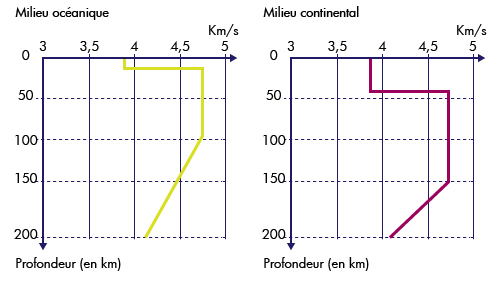
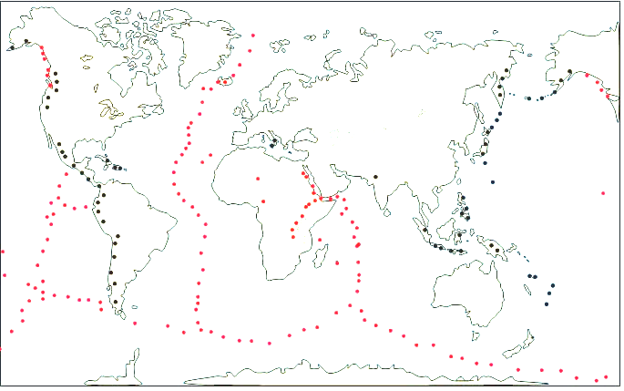
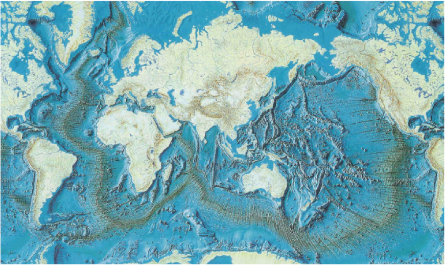
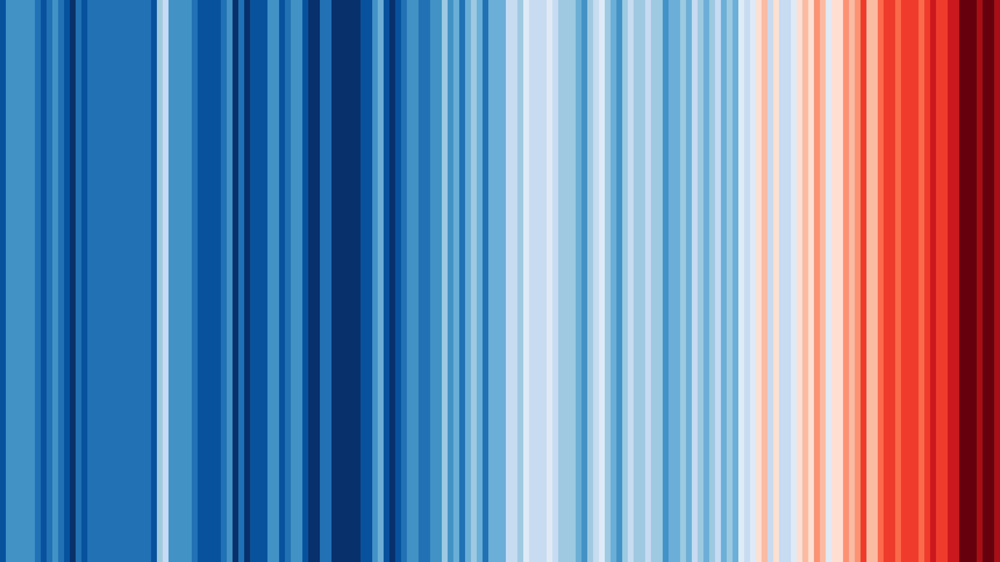
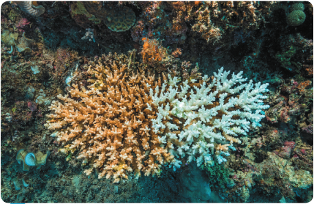

# Thème 1 : La planète Terre, l’environnement et l’action humaine.

## Chapitre 1 : L’histoire de la planète Terre.
# Chapitre 2 : La tectonique des plaques

### Comment sont répartis les séismes et les volcans à la surface de la Terre ?

#### Répartition des séismes et des volcans


!!! Consignes
    Consigne 1 : À l’aide du logiciel Tectoglob3D, localiser les alignements
    de foyers sismiques et de volcans sur la carte du document 1.

    Consigne 2 : Comparer la répartition des volcans et des séismes du
    document 1 et les contours des plaques lithosphériques que vous pouvez
    afficher dans le logiciel.

    Consigne 3 : En utilisant les informations du document 2, compléter le
    document 3 en indiquant l’épaisseur des différentes couches
    superficielles.

!!! Compétences travaillées : 
    Tirer des informations

Document 1 : Carte du monde

Document 2 : Vitesse de
propagation des ondes sismiques en fonction de la profondeur terrestre.

Les séismes sont dus à des ondes
qui se déplacent rapidement dans toute la Terre. Une variation brusque
de vitesse de ces ondes indique qu’elles traversent un autre milieu, aux
propriétés physiques différentes et donc une autre couche.

L’étude des ondes sismiques a permis de mieux connaître l’intérieur de
la Terre.

Les variations de vitesses des ondes sismiques en profondeur révèlent
l’existence de deux niveaux rocheux :

-   La lithosphère : un niveau de roches rigide qui peut casser par
    endroit causant les séismes et formant les plaques lithosphériques,
    à la surface de la Terre. La lithosphère est composée de deux
    couches : la croûte océanique ou continentale et le manteau
    lithosphérique ;
-   l’asthénosphère : un niveau de roches ductile, c’est-à-dire qu’elle
    se déforme sans casser, sur laquelle reposent les plaques
    lithosphériques.

*****Document ******3****** : ******Un schéma des couches superficielles
de la Terre.*****


Document 4 : Fiche Technique de Tectoglob 3D

Afficher des données sur le globe ou sur des coupes

Le menu « Données affichées » permet :

— D’afficher des stations GPS sur le globe virtuel (et le graphique
associé à chaque station, double-cliquer sur une station en mode
« Informations sur un point »)

— D’afficher des foyers sismiques ou des volcans, sur le globe et sur la
coupe

— D’afficher des calques de données sur le globe (flux géothermique,
limites des plaques tectoniques, etc.) et parfois d’en tirer des profils
(via le menu « Action »)

— D’afficher des cartes géologiques (ex. la carte géologique de France
au 1M, carte géologique mondiale, âge du plancher océanique, etc.)


La planète Terre est composée de différentes couches, la majorité est
solide, il n’y a pas de magma sous nos pieds.


Bilan :

La surface rocheuse de la Terre est nommée lithosphère. Cette
lithosphère est rigide et découpée en plaques appelées plaques
lithosphériques (ou plaques tectoniques). La majorité des volcans et de
séismes se situent aux limites des plaques lithosphériques. **L**a
lithosphère se situe sur l’asthénosphère, milieu contenant des roches
moins rigides que celles de la lithosphère. Les roches de la lithosphère
et de l’asthénosphère sont solides.


1.  ### Quels types de mouvements se produisent à la surface de la Terre ?

#### 

1.  #### Les mouvements à la surface de la Terre

**Consigne 1 : En utilisant les documents 1 et 3, représentez par des
flèches les mouvements des plaques tectoniques les unes par rapport aux
autres, au niveau A, B et C, sur le document 3.**

Consigne 2 : À partir de tous les documents, compléter le tableau du
document 5.

Compétence travaillée : Extraire et mettre en relation des informations

Document 1 : carte de répartition
des séismes

Légende :

> — points gris : séismes en zone d’écartement.

> — points noirs : séismes en zone de rapprochement.



Document 2 : carte de répartition des volcans

Légende :

> — points gris : volcanisme effusif.

> — points noirs : volcanisme explosif.


Document 3 : carte des limites de plaques tectoniques

Légende :

** : Zone d’écartement de deux plaques**

: Zone de rapprochements de deux plaques

Document 4 : Carte des reliefs.

<div markdown="1">

Les fosses océaniques : Ce sont des zones profondes (de − 4 500 m à
−11 000 m) et étroites (100 à 200 km de large), bordant soit un
continent, soit un ensemble d’arc d’îles. Leur longueur totale est de
37 000 km.


Les chaînes de montagne : Ce sont des reliefs continentaux plus ou moins
escarpés, dont l’altitude dépasse souvent 4 000 m.


Les dorsales océaniques : Ce sont des reliefs des fonds océaniques qui
peuvent atteindre plus de 2 000 m de profondeur avec une longueur totale
de plus de 65 000 km.

</div>

Document 5 : Tableau à compléter

<table>
<tbody>
<tr class="odd">
<td>Lieu</td>
<td>A</td>
<td>B</td>
<td>C</td>
</tr>
<tr class="even">
<td>Mouvement lithosphérique (divergence ou convergence)</td>
<td></td>
<td></td>
<td></td>
</tr>
<tr class="odd">
<td>Type volcanisme (au moins deux volcans)</td>
<td></td>
<td></td>
<td></td>
</tr>
<tr class="even">
<td><p>Présence de séisme</p>
<p>(oui ou non)</p></td>
<td></td>
<td></td>
<td></td>
</tr>
<tr class="odd">
<td>Type de relief</td>
<td></td>
<td></td>
<td></td>
</tr>
</tbody>
</table>

***Correction ****Activité : Les mouvements à la surface de la Terre***


Document 5 : Tableau à compléter

<table>
<tbody>
<tr class="odd">
<td>Lieu</td>
<td>A</td>
<td>B</td>
<td>C</td>
</tr>
<tr class="even">
<td>Mouvement lithosphérique (divergence ou convergence)</td>
<td><p>divergence</p></td>
<td>convergence</td>
<td>convergence</td>
</tr>
<tr class="odd">
<td>Type volcanisme</td>
<td>Effusif</td>
<td>Explosif</td>
<td>aucun</td>
</tr>
<tr class="even">
<td><p>Présence de séisme</p>
<p>(oui ou non)</p></td>
<td><p>Oui</p></td>
<td>Oui</td>
<td>oui</td>
</tr>
<tr class="odd">
<td>Type de relief</td>
<td>Dorsale</td>
<td>Fosses océaniques</td>
<td>Chaîne de montagne</td>
</tr>
</tbody>
</table>

Bilan :

Ces plaques sont en mouvements les unes par rapport aux autres :

— Elles s’écartent dans les zones en divergence

— Elles se rapprochent dans les zones en convergence

— Elles peuvent aussi coulisser l’une par rapport à l’autre
(décrochement)

1.  ### Comment les scientifiques ont mis en évidence la tectonique des plaques ?

```{=html}
<!-- -->
```
1.  #### Histoire de la construction d’une théorie scientifique.

Une théorie est un ensemble de lois scientifiques, de principes et de
règles visant à décrire et à expliquer un ensemble de faits. Une théorie
se construit autour de faits, des observations, des résultats
expérimentaux. Une théorie scientifique a un statut provisoire et
correspond à la vérité scientifique du moment.

***Document ****1**** : La théorie de la tectonique de plaques.***

Entre 1967 et 1968, la théorie de la tectonique des plaques révolutionne
l’explication des reliefs terrestres. Selon cette théorie (Xavier Le
Pichon, en France), la surface de la Terre est composée de plaques
épaisses d’une centaine de kilomètres qui se déplacent horizontalement
sur une enveloppe de roche du manteau
ductile. Les plaques recouvrent toutes la
surface de la Terre, les parties avec des continents sont les plaques
continentales et celles avec des océans sont les plaques océaniques.
Toutes ces plaques se déplacent.

Document 2 : Les modèles fixistes

Avant le XXe siècle, la majorité des scientifiques pensent qu’il existe
uniquement des mouvements verticaux à la surface de la Terre. Les
continents ne se déplaçaient pas.

Pour expliquer la formation
des reliefs terrestres, les
géologues comparent la Terre à une pomme. Selon leur théorie, au cours
des temps géologiques la Terre, comme la pomme, a eu sa surface qui
s’est ridée et des reliefs sont apparus.

Document 3 : La théorie de la dérive des continents par Wegener.

Le météorologue allemand
****Alfred Wegener**** a émis l’idée que les continents terrestres
bougeaient****. ****Wegener propose que les continents reposent sur une
couche plus dense. Et une force permettrait aux continents de se
déplacer sur la couche plus dense, comme un glaçon sur l’eau. Il propose
que les continents étaient autrefois tous réunis en un seul super
continent, la Pangée, il y a environ ****225 millions
d****’****années****. Puis la Pangée s’est disloquée pour former les
continents actuels. Il publie sa théorie en 1915. Sa théorie sera
rejetée par une grande partie de la communauté scientifique, car aucun
mécanisme connu ne permet d’expliquer ce qui a permis aux continents de
se déplacer.

*Document 4 : Des fossiles utilisés par Wegener*

Wegener a émis son hypothèse parce qu’il avait constaté que les côtes de
l’Afrique de l’Ouest et celles de l’Est de l’Amérique du Sud
ressemblaient à des pièces de casse-tête qui se seraient détachées et
éloignées l’une de l’autre. De plus, en examinant, les fossiles de
roches et d’animaux et les roches de ces deux continents, il a remarqué
de nombreuses similitudes qu’il n’arrive pas à expliquer si les deux
continents ont toujours été aussi éloignés.

***D****ocumen****t****
****5**** : ****Dorsales et ****expansion des fonds océaniques***

Suite à l’amélioration du sonar
pendant la seconde guerre mondiale, les navires océanographiques
réalisent une cartographie précise des fonds océaniques. En 1952, Mary
Tharp et Bruce C. Heezen, ont réalisé une carte des fonds marins. Sur
ces cartes apparaît une chaîne de montagne sous-marines : la dorsale ou
ride médio-atlantique.

Grâce à l’étude des dorsales, Harry Hess, en 1962, a pu voir que les
océans sont en expansion, c’est-à-dire qu’ils s’agrandissent grâce au
plancher océanique qui lui même s’agrandit : il y avait une fabrication
de lithosphère. On constate qu’on a le même âge du plancher océanique de
chaque côté de la dorsale et il est de plus en plus vieux lorsqu’on
s’éloigne de la dorsale : c’est la preuve que de la lithosphère se
fabrique de chaque côté de la dorsale et que ça s’écarte au fur et à
mesure.

Document 6 : La chaleur interne de la Terre

On a découvert que l’intérieur de la Terre est fait de roches qui
libèrent de l’énergie, sous forme d’énergie thermique (=chaleur), qui
chauffe les roches à l’intérieur de la Terre. Cette chaleur se dissipe à
la surface. En 1956, on a pu mettre en évidence que cette énergie
thermique est responsable de la mise e mouvement des plaques.

***Document ****7**** : Répartition des séismes***

En 1954, Beno Gutenberg et Charles Francis Richter, deux sismologues
réalisent la carte mondiale de la répartition des séismes et montrent
que leur répartition n’est pas aléatoire. Ce qui va montrer avec la
répartition des volcans qu’on a une lithosphère découpée en plaques
lithosphériques.

Document 8 : Disparition de la lithosphère

De la lithosphère se fabrique au niveau des dorsales. Cependant, le
volume de la Terre est constant. Cela veut dire que la lithosphère, qui
est fabriquée à un endroit, va disparaître à un autre endroit de la
Terre. En 1967, deux scientifiques déduisent que la lithosphère, au
niveau des fosses, s’enfonce profondément dans l’asthénosphère où elle
va être « recyclée » au cours du temps.

Document 9 : La mesure de la mobilité horizontale de la surface de
terrestre par satellite.

Dans les années 1980, un système de géodésie spatiale (la science qui
mesure et représente la surface terrestre) a été mis en place. Il
utilise un réseau permanent d’une soixante de balises réparties sur tout
le globe. Ces balises émettent de signaux vers des satellites, ce qui
permet de les géolocaliser avec une précision de l’ordre du centimètre.
Ce système a permis de déterminer le déplacement des plaques
lithosphériques à la surface de la Terre. On a, par exemple, établi à
partir des enregistrements effectués par des balises situées en Islande,
de part et d’autre de la dorsale atlantique un éloignement des plaques
de 2 cm par an.


Vitesse en cm/an

Consigne 1 : Faire une frise en indiquant les différentes observations
et arguments scientifiques qui ont mené la théorie de la tectonique des
plaques. (date + événement) (2,5 points)

Consigne 2 : À partir des documents, explique quels ont été les
arguments de Wegener pour proposer la théorie de la dérive des
continents. (1 point)

Consigne 3 : Explique pourquoi au début du XXe siècle, la théorie de
Wegener a été rejetée par la majorité de la communauté scientifique (0,5
point)

Consigne 4 : Explique en quelques mots, en quoi la théorie de la
tectonique des plaques actuelle est différente de celle de la dérive des
continents de Wegener. (1 point)


Bilan : La théorie de la tectonique des plaques a été émise à la fin des
années 1960 grâce à de meilleures connaissances de la surface de la
Terre. Cette théorie est issue de la **théorie** de la dérive des
continents élaborée par Wegener au début du 20^e^ siècle.

Cette théorie explique que les plaques lithosphériques sont en
mouvements les unes par rapport aux autres (pas seulement les
continents) et que les volcans et les séismes sont dus aux déplacements
de ces plaques lithosphériques.

Définition : Une théorie est un ensemble de lois scientifiques, de
principes et de règles visant à décrire et à expliquer un ensemble de
faits. Une théorie se construit autour de faits, des observations, des
résultats expérimentaux. Une théorie scientifique a un statut provisoire
et correspond à la vérité scientifique du moment.

1.  ### Quelles sont les conséquences des mouvements de divergence ?

#### 

1.  #### Les conséquences de la divergence

Consigne 1 : Décrire comment sont réparties les roches des fonds
océaniques en fonction de leur **âge.**

**Consigne 2 : À l’aide documents, expliquer cette répartition.**

Compétence travaillée : Trouver et exploiter des informations

Document 1 : âge des fonds océaniques (océan Atlantique)

***Document 2 : ****Le
v****olcanisme ****des dorsales***

Une grande part de l’activité volcanique terrestre provient des
dorsales. C’est un volcanisme effusif. Les
volcans des dorsales émettent une lave fluide à une température comprise
entre 1 000 °C et 1 200 °C. En se refroidissant, la lave forme des
grosses boules de roche (du basalte) qui s’empilent les unes sur les
autres. Ces roches sont appelées des pillow-lavas (lave en coussins). Ce
magma, en refroidissant, est à l’origine de la partie superficielle de
la lithosphère océanique.

Document 3 : Schéma fonctionnement d’une dorsale océanique


Les mouvements de divergence entraînent une remontée de magma à l’axe de
la dorsale.


Bilan :

Les mouvements de divergence entre deux plaques lithosphériques ayant
lieu au niveau des dorsales océaniques permettent la formation de
lithosphère océanique. Cette limite est caractérisée par un volcanisme
effusif.

Au sein d’une plaque continentale, ces mouvements sont à l’origine de
rifts continentaux, qui pourront former une dorsale plus tard.

<https://www.youtube.com/watch?v=8gqCe8Y09Ig>

### 

### 

1.  ### Quelles sont les conséquences des mouvements de convergences ?

#### 

1.  #### Les conséquences de la convergence, la subduction.

Consigne 1 : Décrire comment varie la profondeur des séismes de A vers B
sur le document 1

Consigne 2 : en utilisant les informations du document 3, expliquer
pourquoi il est étonnant d’avoir des foyers sismiques à cette profondeur
/ Représenter sur le graphique du document 1, la lithosphère en vous
aidant des informations du document 2

Consigne 3 : en utilisant les informations des documents 1, 2 et 3,
expliquer ce qui se passe au niveau de cette zone.

Compétence travaillée : Trouver et exploiter des informations

<div markdown="1">

Document 1 : Mouvement de convergence entre la plaque Nazca et la plaque
sud-américaine.


***Document ****2**** : ****Graphique de la répartition des séismes en
fonction de leur profondeur.***


</div>

Document 3 : Séismes et lithosphère.

Les séismes se produisent dans la lithosphère qui est la couche la plus
cassante.l’asthénosphère est plus ductile, les roches ne peuvent pas
casser et donc les séismes ne peuvent pas y avoir d’origine.

La lithosphère est une couche qui fait environ 150 km d’épaisseur pour
la lithosphère continentale et 100 km d’épaisseur pour la lithosphère
océanique

1.  #### Les conséquences de la convergence, la collision.

**Consigne 1 : À l’aide des informations des documents 1 et 2, compléter
le tableau du document 3.**

**Consigne 2 : Faire la manipulation du document 2**

**Consigne 3 : en utilisant les informations des documents, expliquer ce
qui se passe au niveau de cette zone.**

**Consigne 4 : Quel indice devrait être trouvé dans la chaîne de
l’Himalaya si le modèle est correct.**

Compétences travaillées : Manipuler, expérimenter et Trouver et
exploiter des informations

Document 1 : Schéma des plaques asiatique et indienne, il y a 75 Ma

Document 2 : Modélisation d’une collision

Protocole :

1.   style="width:8.456cm;height:4.701cm" />Insérer la feuille avec
    > l’Inde dans la fente de la feuille avec l’Asie et aligner cette
    > feuille sur la flèche.

2.  Avancer la feuille jusqu’à la date de 75Ma.

3.  Déposer les feuilles dans la cuvette en plastique.

4.  Déposer du sable sur le continent Indien et le continent asiatique
    > (laisser une marge de 1 mm).

5.  Tasser légèrement avec une boite de pétri

6.  Saupoudrer de farine entre l’Inde et l’Asie

7.  Tirer progressivement la feuille de l’inde jusqu’à 45 Ma

8.  Continuer de Tirer jusqu’à 0 Ma

Document 3 : Comparaison du modèle et de la réalité

|         |                     |
|---------|---------------------|
| Réalité | Modèle              |
|         | Feuille avec l’Asie |
|         | Feuille avec l’Inde |
|         | Farine              |
|         | Sable               |

[https://www.pedagogie.ac-nantes.fr/html/peda/svt/collision_subd/Le_ph%C3 %A9nom%C3 %A8ne_de_collision\_-\_SVT_NANTES.html](https://www.pedagogie.ac-nantes.fr/html/peda/svt/collision_subd/Le_phénomène_de_collision_-_SVT_NANTES.html)


Bilan :

La convergence de deux plaques
lithosphériques dont l’une est océanique, entraîne le plongement
(subduction) de la plaque océanique sous l’autre plaque, au niveau d’une
fosse océanique Cette limite est caractérisée par un volcanisme
explosif.

La collision de deux plaques lithosphériques
continentales entraînent la formation d’une chaîne de montagne.

Définition :

Un modèle en sciences est une représentation
simplifiée de la réalité d’un phénomène pour expliquer ce phénomène ou
faire une expérience pour tester une hypothèse concernant le phénomène.

Le modèle réduit la complexité du réel, afin
de le comprendre ou le faire comprendre. Il est différent de la réalité.
Construit autour d’hypothèses, il doit être testé par confrontation au
réel.

1.  ### Comment expliquer les mouvements des plaques lithosphériques ?

```{=html}
<!-- -->
```
1.  #### Le moteur du mouvement des plaques lithosphériques

Consigne 1 : Compléter le tableau du document 2, avec les mots
suivants : Source de chaleur, Rien, Roches de la lithosphère et Roches
de l’asthénosphère, pour comparer le modèle et la réalité. (0,5 point)

Consigne 2 : Réaliser le protocole et décrire ce qui se passe dans le
modèle pendant les phases d’observations. (1 point)

Consigne 3 : Expliquer comment la température peut être responsable des
mouvements de matière. (1 point)

Consigne 4 : Expliquer comment la radioactivité est à l’origine des
mouvements des plaques. (1 point)

Consigne 5 : Indiquer sur le document 6, par des flèches les mouvements
verticaux au niveau de la dorsale atlantique et de la zone de
subduction. (0,5 point)

Consigne 6 : Proposer deux critiques qui peuvent **être faites sur le
modèle par rapport à la réalité. (1 point)**

Compétence travaillée : trouver et utiliser des informations (3,4,5),
Interpréter et exploiter des résultats (1,2,6) et Mettre en œuvre un
protocole.

Document 1 : Protocole d’un modèle montrant les mouvements à l’intérieur
de la Terre :

Attention pour faire cette manipulation, les cheveux longs doivent être
attachés, les manches retroussées et la table dégagée.

1.  Verser 20 ml d’huile colorée dans un bécher.
2.  Verser 55 ml d’huile non colorée, attention les deux huiles ne
    doivent pas se mélanger, il faut donc verser très délicatement
    l’huile en la faisant couler le long de la surface du bécher
3.  Poser le bécher sur le support et ajouter 2 petits papiers à la
    surface.
4.  Observer pendant 30 secondes
5.  Allumer la bougie en dessous.
6.  Observer pendant quelques minutes

Document 2 : Présentation du modèle.

<table>
<tbody>
<tr class="odd">
<td>Élément du modèle</td>
<td>Élément dans la réalité</td>
</tr>
<tr class="even">
<td>Bécher</td>
<td></td>
</tr>
<tr class="odd">
<td>Huile colorée</td>
<td></td>
</tr>
<tr class="even">
<td>Huile non colorée</td>
<td></td>
</tr>
<tr class="odd">
<td>Bougie</td>
<td></td>
</tr>
</tbody>
</table>

Document 3 : La densité.

La densité d’un objet permet de savoir s’il coule ou s’il flotte dans
par rapport dans un fluide. Un échantillon dont la densité est
supérieure à celle du fluide coule. Un échantillon dont la densité est
inférieure à celle du fluide flotte. La densité peut varier en fonction
de différents paramètres.

Document 4 : La radioactivité est une source de chaleur.

Des roches contenant des éléments radioactifs sont présentes dans la
Terre. Ces éléments radioactifs se transforment au cours du temps. Ces
transformations libèrent de l’énergie, sous la forme de chaleur.

Document 5 : Les mouvements internes.

Des mouvements se produisent à l’intérieur de la Terre. Ces mouvements
sont très lents et se font sur des milliers d’années. Ils sont à
l’origine des mouvements des plaques tectoniques (tectoniques des
plaques).

***Document ****6**** : Schéma des mouvements internes.***

Le flux thermique est la quantité d’énergie libérée sous forme de
chaleur à la surface de la Terre.

> ***Document ****6**** : Carte du flux géothermique mondiale.***

> Cette carte montre la quantité d’énergie libérée sous forme de chaleur
> au niveau de la surface de la Terre.

Document 6 : Carte des limites
des plaques tectoniques.

Légende :

> **1 et 2 :** Limite de plaque divergente (dorsale) ;

> **3 :** Limite de plaque de subduction ;

> [****https://www.youtube.com/watch?v=HmBHKeemZVY&ab_channel=etheriel66****](https://www.youtube.com/watch?v=HmBHKeemZVY&ab_channel=etheriel66)

***Correction de l’activité ****8**** : le moteur du mouvement des
plaques lithosphériques***

Consigne 1 : Compléter le tableau du document 2, avec les mots
suivants : Source de chaleur, Rien, Roches de la lithosphère et Roches
de l’asthénosphère, pour comparer le modèle et la réalité. (0,5 point)

|                   |                           |
|-------------------|---------------------------|
| Élément du modèle | Élément dans la réalité   |
| Bécher            | rien                      |
| Huile colorée     | Roches de l’asthénosphère |
| Huile non colorée | Roches de la lithosphère  |
| Bougie            | Source de chaleur         |

Consigne 2 : Réaliser le protocole et décrire ce qui se passe dans le
modèle pendant les phases d’observations. (1 point)

Avant d’allumer la bougie, rien ne se passe, les huiles ne bougent pas
et les papiers non plus.

Après avoir allumé la bougie, l’huile colorée commence par monter dans
l’huile non colorée, puis ensuite, cette huile colorée commence a
redescendre. Les papiers à la surface de l’huile commence à se déplacer.

Consigne 3 : Expliquer comment la température peut être responsable des
mouvements de matière. (1 point)

La source de chaleur réchauffe l’huile colorée. La densité de l’huile
colorée va donc diminuer ce qui va entraîner, une remontée de l’huile
vers la surface. L’huile colorée à la surface va se refroidir, la
densité va donc diminuer, et l’huile colorée va redescendre dans le
bécher.

Les mouvements sont donc dus au changement de température qui entraîne
des changements de densité.

Consigne 4 : Expliquer comment la radioactivité est à l’origine des
mouvements des plaques. (1 point)

La radioactivité libère de l’énergie qui réchauffe les roches à
l’intérieur de la Terre. Les changements de température des roches vont
faire changer leur densité. Lorsque les roches vont chauffer, leur
densité va diminuer, elles vont donc remonter. Ces mouvements verticaux
vont entraîner un déplacement horizontal des plaques à la surface.

Consigne 5 : Indiquer sur le document 6, par des flèches les mouvements
verticaux au niveau de la dorsale atlantique et de la zone de
subduction. (0,5 point)


**Consigne 6 : Proposer deux critiques qui peuvent être faites sur le
modèle par rapport à la réalité. (1 point)**

1.  Dans le modèle on utilise de l’huile pour modéliser les roches de
    l’intérieur de la Terre, mais les roches sont solides alors que
    l’huile est liquide.

2.  Dans le modèle la source de chaleur est uniquement en bas, alors que
    dans la réalité la radioactivité est partout.

3.  Dans le modèle, les mouvements se déroulent en quelques minutes
    alors que dans la réalité, ils se déroulent sur des milliers
    d’années.

Bilan :

Il existe des différences de températures entre les roches présente à
l’intérieur de la Terre.

La radioactivité à l’intérieur du globe libère de la chaleur.

Les roches à la surface refroidissent.

Ces différences de chaleur provoquent des mouvements de roches :

-   Les roches solides et chaudes montent
-   Les roches solides et froides descendent

Ces mouvements, principalement les mouvements descendant au niveau des
zones de subduction, provoquent des mouvements des plaques
lithosphériques.

## Chapitre 3 : Les changements climatiques


1.  ### Comment l’**être humain est-il responsable du changement climatique** actuel ?

France de 1899 à 2021

Monde de 1850 à
2021

1.  #### Le changement climatique d’origine anthropique

Consigne 1 : **Expliquer les différences de températures de surfaces
dans le tableau du document 2.**

1.  1.  1.  1.  Consigne 2 : Expliquer l’impact de l’être humain sur
                l’évolution de la concentration en dioxyde de carbone
                dans le document 1

Consigne 3 :** À l’aide d’un schéma fonctionnel, montrer les impacts des
activités humaines sur la température de la Terre.**

Document 1 : Evolution de la température moyenne de surface depuis 1860.


Document 2 : Températures de surface de la Lune et de la Terre.

|                   |                                |                                |
|-------------------|--------------------------------|--------------------------------|
|                   | Quantité de dioxyde de carbone | Température moyenne de surface |
| Lune              | 0 ppm                          | — 73 °C                        |
| Terre au cambrien | 5600 ppm                       | 22 °C                          |
| Terre carbonifère | 280 ppm                        | 12 °C                          |
| Terre actuel      | 400 ppm                        | 12,7 °C                        |

Document 3 : L’effet de serre

Plus un objet absorbe de
rayonnements plus il va chauffer.

Plus un objet est chaud plus il émet de rayonnements infrarouges.

Document 4 : Les gaz à effet de serre

Les gaz à effet de serre sont des gaz qui sont capables d’absorber les
infrarouges.

Sur terre, les principaux gaz à effet de serre sont le dioxyde de
carbone (CO~2~) (qui est le gaz qui a le plus d’impact), le méthane
(CH₄) et la vapeur d’eau (H₂O).

***Document ****5**** : Graphique de la teneur
atmosphériqu******e en dioxyde de carbone ****au
cours du temps****.***


*Document 6 : Origine du dioxyde de carbone.*

Le dioxyde de carbone (CO2) provient principalement de la combustion
d’énergie fossile (charbon, essences, fiouls, gaz…) ou du bois.

Sur le graphique, on voit les activités à l’origine des émissions de
dioxyde de carbone en France en 2011.


*Document 7 : Consommation d’énergies fossiles dans le monde de 1800 à
2019.*

Gas = gaz naturel

oil = pétrole

coal = Charbon

Bilan :

Depuis la deuxième moitié du 19e siècle, on observe une augmentation
rapide de la température moyenne à la surface de la Terre.

Au cours du temps, les activités humaines ont enrichi l’atmosphère en
gaz à effet de serre (ex : dioxyde de carbone CO~2~). Ceci a entraîné
une amplification de l’effet de serre, et donc une augmentation de plus
rapide de la température moyenne à la surface de la Terre.

L’effet de serre est un phénomène d’échauffement de la surface de la
Terre, dû au fait que certains gaz de l’atmosphère, les gaz à effet de
serre absorbent une partie du rayonnement infrarouge émis par la Terre
et ce qui réchauffe la planète.

D’après les prévisions des climatologues, le réchauffement climatique
devrait se poursuivre et la température devrait augmenter de 0,5 °C à
3 °C.


#### 

1.  ### Quelles sont les conséquences du réchauffement climatique sur la répartition des **êtres vivants** ?

```{=html}
<!-- -->
```
1.  #### Le réchauffement climatique et répartition des ***êtres vivants***

Consigne : Explique quels peuvent **être les conséquences du
réchauffement climatiques sur les espèces marines et sur certains arbres
en France.**

Document 1 : Les récifs coralliens

Les coraux sont des animaux marins. Ils sécrètent autour d’eux un
squelette calcaire qui forment les récifs coralliens. Ces animaux vivent
en symbiose avec des algues unicellulaires, qui leur apportent des
sucres. Ces coraux forment les récifs coralliens.

Les récifs coralliens abritent plus de 25 % des espèces marines
mondiales (entre 1 et 3 millions d’espèces). Ces espèces marines
trouvent dans les coraux de la nourriture et un abri. Cette biodiversité
génère des milliers d’emplois dans le tourisme, la pêche, etc.

Document 2 : Le blanchiment des coraux.

L’augmentation de la quantité de
CO~2~ et l’augmentation de la température de l’eau provoque
l’acidification des océans. Cette acidification peut entraîner
l’expulsion des algues symbiotiques du corail, le corail se décolore,
c’est le blanchiment. Ce phénomène peut entraîner la mort du corail.

Document 3 : La chenille processionnaire du pin.

La processionnaire du pin est la
chenille d’un papillon nocturne. Elle dévore les parties vertes et
freine ainsi le développement de l’arbre. Elle provoque de nombreuses
allergies chez les êtres humains à cause de ses poils urticants.

Cette espèce d’origine méditerranéenne se développe de manière optimale
entre 20 °C et 25 °C. Durant l’hiver, la moindre augmentation de
température augmente ses chances de survie.

Document 4 : Progression de
l’habitat de la chenille processionnaire du pin de 1979 à 2014 en
France.

Bilan :

**Un écosystème est un système formé par un environnement et toutes les
espèces qui y vivent, s’y nourrissent et s’y reproduisent.**

La biodiversité (=diversité des **êtres vivants)** au sein des
écosystèmes se modifie actuellement sous l’effet des activités humaines,
comme le réchauffement climatique.

1.  ### Quelles sont les conséquences de l’exploitation des énergies fossiles ?

#### 

1.  #### Les conséquences de l’exploitation des énergies fossiles.

Consigne : à partir de l’exploitation des différents documents,
présenter, sous forme d’un audio de 2 minutes maximum, les conséquences
de l’exploitation des énergies fossiles.

***Docume****nt 1 : Les énergies
fossiles.***

Les énergies fossiles sont les énergies produites à partir de la
combustion de matière issue de la transformation de matière organique.
Le charbon, de pétrole ou de gaz sont des ressources énergétiques qui se
forment à partir de la transformation d’organismes morts (planctons ou
végétaux). Ces ressources mettent des millions d’années à se former,
elles sont actuellement exploitées plus rapidement qu’elles ne se
forment, elles ne sont donc pas renouvelables. Certaines estimations
prévoient un épuisement du pétrole en 2065.

Document 2 : Utilisations des ressources énergétiques fossiles.

Pour utiliser l’énergie contenue dans ces ressources, il est nécessaire
de les brûler ce qui entraîne la libération de CO~2~ dans l’atmosphère.

<table>
<tbody>
<tr class="odd">
<td>Émission de CO<sub>2</sub> des différentes filières de production
d’électricité</td>
<td></td>
<td></td>
<td></td>
<td></td>
<td></td>
<td></td>
</tr>
<tr class="even">
<td>Source d’énergie</td>
<td>Hydraulique</td>
<td>Nucléaire</td>
<td>Éolien</td>
<td>Gaz Naturel</td>
<td>Fuel (Pétrole)</td>
<td>Charbon</td>
</tr>
<tr class="odd">
<td><p>Émission de CO<sub>2</sub></p>
<p>(en g par kWh)</p></td>
<td>4</td>
<td>6</td>
<td>3 à 22</td>
<td>883</td>
<td>891</td>
<td>978</td>
</tr>
</tbody>
</table>

Document 3 : Élévation du niveau des mers.

À cause du réchauffement
climatique, les glaciers continentaux fondent et surtout l’eau liquide
se dilate (elle prend plus de place), celle entraîne une élévation du
niveau de la mer. Entre 1900 et aujourd’hui, le niveau des océans a
augmenté de 17 cm.

La courbe basse est basé sur le scénario de réchauffement climatique le
plus optimiste et celle haute est basée sur le scénario de réchauffement
climatique le plus pessimiste.

***Document ****4**** : ****L****e nombre de****
catastro****p****he****s**** naturelle****s***

Seuls les événements
géophysiques n’ont pas de lien avec le réchauffement climatique, les
autres peuvent y être liés.

***D****ocument ****5 : Les**** réfugiés climatique****s***

Entre 147 et 216 millions de
personnes vivent actuellement dans des zones sous le niveau de la mer
actuelle (des digues empêchent l’eau de rentrer dans les terres, mais on
ne peut pas toutes les agrandir) ou dans des zones déjà régulièrement
inondées. En comparaison, on a compté 27 millions de réfugiés politiques
en 2016.

Qualité de l’oral 0.5point

<table>
<tbody>
<tr class="odd">
<td>Très satisfaisant</td>
<td>Satisfaisant</td>
<td>Fragile</td>
<td>Insuffisant</td>
</tr>
<tr class="even">
<td><p>L’élève est pleinement engagé dans sa parole.</p>
<p>La voix est assez forte et claire et la parole n’est ni trop lente ni
trop rapide.</p></td>
<td><p>L’élève parvient à susciter l’intérêt.</p>
<p>La prise de parole est affirmée, cependant quelques variations dans
l’utilisation de la voix.</p></td>
<td><p>L’élève a des difficultés à capter l’attention, la prise de
parole est monocorde.</p>
<p>La voix n’est plus très audible au fil de l’oral.</p></td>
<td><p>L’élève n’arrive pas à capter l’attention.</p>
<p>La voix n’est pas audible sur l’ensemble de l’oral.</p></td>
</tr>
</tbody>
</table>

Qualité de la prise de parole en continu 1 point

<table>
<tbody>
<tr class="odd">
<td>Très satisfaisant</td>
<td>Satisfaisant</td>
<td>Fragile</td>
<td>Insuffisant</td>
</tr>
<tr class="even">
<td><p>Utilisation d’un vocabulaire riche et précis.</p>
<p>Discours fluide, efficace, tirant pleinement profit du temps.</p>
<p>Le temps est respecté.</p></td>
<td><p>Le lexique est adapté.</p>
<p>Discours articulé et pertinent, énoncés bien construits.</p>
<p>Le temps est respecté.</p></td>
<td><p>Discours assez clair mais vocabulaire limité, approximatif et
énoncés schématiques.</p>
<p>Et/ou, le temps n’est pas totalement respecté.</p></td>
<td><p>Le vocabulaire est insuffisant.</p>
<p>Énoncés courts, ponctués de pauses et de faux démarrages ou énoncés
longs à la syntaxe mal maîtrisée.</p>
<p>Et/ou le temps n’est pas maîtrisé.</p></td>
</tr>
</tbody>
</table>

Qualité de la pertinence des informations utiles extraites 2

|                                                                                              |                                                                                                  |                                                                                                           |                                                                     |
|----------------------------------------------------------------------------------------------|--------------------------------------------------------------------------------------------------|-----------------------------------------------------------------------------------------------------------|---------------------------------------------------------------------|
| Très satisfaisant                                                                            | Satisfaisant                                                                                     | Fragile                                                                                                   | Insuffisant                                                         |
| Toutes les informations sont extraites et permettent de répondre complètement à la consigne. | La majorité des informations sont extraites et permettent de répondre globalement à la consigne. | Quelques informations sont extraites cependant, ne permettent pas de répondre complètement à la consigne. | Réponse très incomplète avec des informations erronées et confuses. |

Qualité et construction du résumé 1,5 points

|                                                                                                  |                                                                                        |                                                         |                                                           |
|--------------------------------------------------------------------------------------------------|----------------------------------------------------------------------------------------|---------------------------------------------------------|-----------------------------------------------------------|
| Très satisfaisant                                                                                | Satisfaisant                                                                           | Fragile                                                 | Insuffisant                                               |
| Maîtrise des enjeux du sujet, capacité à conduire un résumé complet, bien construit et raisonné. | Résumé construit qui s’appuie sur des informations précises et pertinentes du dossier. | Réponse lacunaire et discours insuffisamment structuré. | Pas ou peu de compréhension du sujet et discours décousu. |

Définition énergie fossile : Énergie dont la source a été formée par
l’accumulation d’anciens êtres vivants. Elles ne sont pas renouvelables
à l’échelle humaine. (exemple : charbon, gaz, pétrole)

La présence de restes organiques dans les combustibles fossiles montre
qu’ils sont issus d’une biomasse végétale. Des restes d’organismes
chlorophylliens échappe à la décomposition et se transforme en
combustible fossile.

Cette transformation se fait sur des centaines de millions d’années donc
elles ne se forment pas sur une échelle de temps humaine. Les réserves
actuelles ne sont pas infinies et celles qui sont accessibles pourraient
s’épuiser.

L’exploitation de ces énergies a un impact important sur
l’environnement, le dioxyde de carbone libéré va augmenter l’effet de
serre et donc le réchauffement climatique.

Le changement climatique va provoquer une élévation du niveau des mers
et une augmentation de la fréquence des phénomènes météorologiques
exceptionnels.

On assistera aussi à une modification de la répartition mondiale des
précipitations qui aura pour des conséquences importantes sur la
disponibilité en eau : sécheresses et inondations plus fréquentes.

