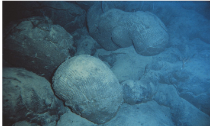
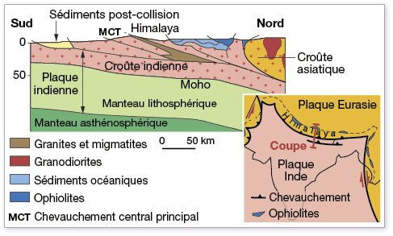
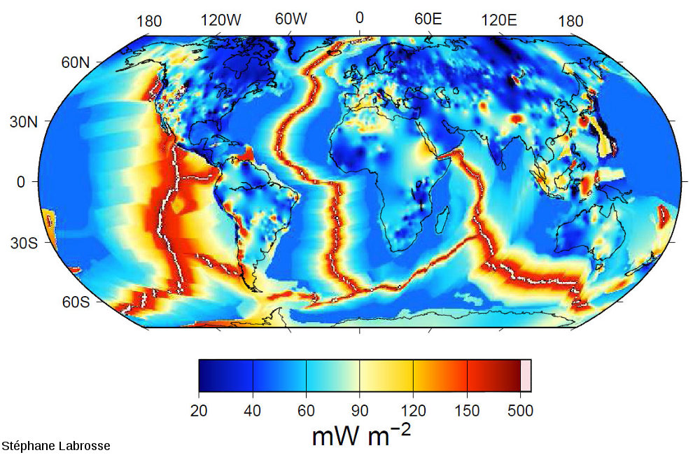

# Thème 1 : La planète Terre, l’environnement et l’action humaine.

# Chapitre 2 : La tectonique des plaques

1.  ### Quelles sont les conséquences des mouvements de divergence ?

#### 

1.  #### Les conséquences de la divergence

Consigne 1 : Décrire comment sont réparties les roches des fonds
océaniques en fonction de leur **âge.**

**Consigne 2 : À l’aide documents, expliquer cette répartition.**

Compétence travaillée : Trouver et exploiter des informations

Document 1 : âge des fonds océaniques (océan Atlantique)


***Document 2 : ****Le
volcanisme des dorsales***

Une grande part de l’activité volcanique terrestre provient des
dorsales. C’est un volcanisme effusif. Les
volcans des dorsales émettent une lave fluide à une température comprise
entre 1 000 °C et 1 200 °C. En se refroidissant, la lave forme des
grosses boules de roche (du basalte) qui s’empilent les unes sur les
autres. Ces roches sont appelées des pillow-lavas (lave en coussins). Ce
magma, en refroidissant, est à l’origine de la partie superficielle de
la lithosphère océanique.

Document 3 : Schéma fonctionnement d’une dorsale océanique


Les mouvements de divergence entraînent une remontée de magma à l’axe de
la dorsale.


Bilan :

Les mouvements de divergence entre deux plaques lithosphériques ayant
lieu au niveau des dorsales océaniques permettent la formation de
lithosphère océanique. Cette limite est caractérisée par un volcanisme
effusif.

Au sein d’une plaque continentale, ces mouvements sont à l’origine de
rifts continentaux, qui pourront former une dorsale plus tard.

<https://www.youtube.com/watch?v=8gqCe8Y09Ig>

### 

### 

1.  ### Quelles sont les conséquences des mouvements de convergences ?

#### 

1.  #### Les conséquences de la convergence, la subduction.

Consigne 1 : Décrire comment varie la profondeur des séismes de A vers B
sur le document 1

Consigne 2 : en utilisant les informations du document 3, expliquer
pourquoi il est étonnant d’avoir des foyers sismiques à cette profondeur
/ Représenter sur le graphique du document 1, la lithosphère en vous
aidant des informations du document 2

Consigne 3 : en utilisant les informations des documents 1, 2 et 3,
expliquer ce qui se passe au niveau de cette zone.

Compétence travaillée : Trouver et exploiter des informations

<div markdown="1">

Document 1 : Mouvement de convergence entre la plaque Nazca et la plaque
sud-américaine.


***Document ****2**** : ****Graphique de la répartition des séismes en
fonction de leur profondeur.***


</div>

Document 3 : Séismes et lithosphère.

Les séismes se produisent dans la lithosphère qui est la couche la plus
cassante.l’asthénosphère est plus ductile, les roches ne peuvent pas
casser et donc les séismes ne peuvent pas y avoir d’origine.

La lithosphère est une couche qui fait environ 150 km d’épaisseur pour
la lithosphère continentale et 100 km d’épaisseur pour la lithosphère
océanique

1.  #### Les conséquences de la convergence, la collision.

**Consigne 1 : À l’aide des informations des documents 1 et 2, compléter
le tableau du document 3.**

**Consigne 2 : Faire la manipulation du document 2**

**Consigne 3 : en utilisant les informations des documents, expliquer ce
qui se passe au niveau de cette zone.**

**Consigne 4 : Quel indice devrait être trouvé dans la chaîne de
l’Himalaya si le modèle est correct.**

Compétences travaillées : Manipuler, expérimenter et Trouver et
exploiter des informations

Document 1 : Schéma des plaques asiatique et indienne, il y a 75 Ma

Document 2 : Modélisation d’une collision

Protocole :

1.   style="width:8.456cm;height:4.701cm" />Insérer la feuille avec
    > l’Inde dans la fente de la feuille avec l’Asie et aligner cette
    > feuille sur la flèche.

2.  Avancer la feuille jusqu’à la date de 75Ma.

3.  Déposer les feuilles dans la cuvette en plastique.

4.  Déposer du sable sur le continent Indien et le continent asiatique
    > (laisser une marge de 1 mm).

5.  Tasser légèrement avec une boite de pétri

6.  Saupoudrer de farine entre l’Inde et l’Asie

7.  Tirer progressivement la feuille de l’inde jusqu’à 45 Ma

8.  Continuer de Tirer jusqu’à 0 Ma

Document 3 : Comparaison du modèle et de la réalité

|         |                     |
|---------|---------------------|
| Réalité | Modèle              |
|         | Feuille avec l’Asie |
|         | Feuille avec l’Inde |
|         | Farine              |
|         | Sable               |

[https://www.pedagogie.ac-nantes.fr/html/peda/svt/collision_subd/Le_ph%C3 %A9nom%C3 %A8ne_de_collision\_-\_SVT_NANTES.html](https://www.pedagogie.ac-nantes.fr/html/peda/svt/collision_subd/Le_phénomène_de_collision_-_SVT_NANTES.html)



Bilan :

La convergence de deux plaques
lithosphériques dont l’une est océanique, entraîne le plongement
(subduction) de la plaque océanique sous l’autre plaque, au niveau d’une
fosse océanique Cette limite est caractérisée par un volcanisme
explosif.

La collision de deux plaques lithosphériques
continentales entraînent la formation d’une chaîne de montagne.

Définition :

Un modèle en sciences est une représentation
simplifiée de la réalité d’un phénomène pour expliquer ce phénomène ou
faire une expérience pour tester une hypothèse concernant le phénomène.

Le modèle réduit la complexité du réel, afin
de le comprendre ou le faire comprendre. Il est différent de la réalité.
Construit autour d’hypothèses, il doit être testé par confrontation au
réel.

1.  ### Comment expliquer les mouvements des plaques lithosphériques ?

```{=html}
<!-- -->
```
1.  #### Le moteur du mouvement des plaques lithosphériques

Consigne 1 : Compléter le tableau du document 2, avec les mots
suivants : Source de chaleur, Rien, Roches de la lithosphère et Roches
de l’asthénosphère, pour comparer le modèle et la réalité. (0,5 point)

Consigne 2 : Réaliser le protocole et décrire ce qui se passe dans le
modèle pendant les phases d’observations. (1 point)

Consigne 3 : Expliquer comment la température peut être responsable des
mouvements de matière. (1 point)

Consigne 4 : Expliquer comment la radioactivité est à l’origine des
mouvements des plaques. (1 point)

Consigne 5 : Indiquer sur le document 6, par des flèches les mouvements
verticaux au niveau de la dorsale atlantique et de la zone de
subduction. (0,5 point)

Consigne 6 : Proposer deux critiques qui peuvent **être faites sur le
modèle par rapport à la réalité. (1 point)**

Compétence travaillée : trouver et utiliser des informations (3,4,5),
Interpréter et exploiter des résultats (1,2,6) et Mettre en œuvre un
protocole.

Document 1 : Protocole d’un modèle montrant les mouvements à l’intérieur
de la Terre :

Attention pour faire cette manipulation, les cheveux longs doivent être
attachés, les manches retroussées et la table dégagée.

1.  Verser 20 ml d’huile colorée dans un bécher.
2.  Verser 55 ml d’huile non colorée, attention les deux huiles ne
    doivent pas se mélanger, il faut donc verser très délicatement
    l’huile en la faisant couler le long de la surface du bécher
3.  Poser le bécher sur le support et ajouter 2 petits papiers à la
    surface.
4.  Observer pendant 30 secondes
5.  Allumer la bougie en dessous.
6.  Observer pendant quelques minutes

Document 2 : Présentation du modèle.

<table>
<tbody>
<tr class="odd">
<td>Élément du modèle</td>
<td>Élément dans la réalité</td>
</tr>
<tr class="even">
<td>Bécher</td>
<td></td>
</tr>
<tr class="odd">
<td>Huile colorée</td>
<td></td>
</tr>
<tr class="even">
<td>Huile non colorée</td>
<td></td>
</tr>
<tr class="odd">
<td>Bougie</td>
<td></td>
</tr>
</tbody>
</table>

Document 3 : La densité.

La densité d’un objet permet de savoir s’il coule ou s’il flotte dans
par rapport dans un fluide. Un échantillon dont la densité est
supérieure à celle du fluide coule. Un échantillon dont la densité est
inférieure à celle du fluide flotte. La densité peut varier en fonction
de différents paramètres.

Document 4 : La radioactivité est une source de chaleur.

Des roches contenant des éléments radioactifs sont présentes dans la
Terre. Ces éléments radioactifs se transforment au cours du temps. Ces
transformations libèrent de l’énergie, sous la forme de chaleur.

Document 5 : Les mouvements internes.

Des mouvements se produisent à l’intérieur de la Terre. Ces mouvements
sont très lents et se font sur des milliers d’années. Ils sont à
l’origine des mouvements des plaques tectoniques (tectoniques des
plaques).

***Document ****6**** : Schéma des mouvements internes.***

Le flux thermique est la quantité d’énergie libérée sous forme de
chaleur à la surface de la Terre.

> ***Document ****6**** : Carte du flux géothermique mondiale.***

> Cette carte montre la quantité d’énergie libérée sous forme de chaleur
> au niveau de la surface de la Terre.

Document 6 : Carte des limites
des plaques tectoniques.

Légende :

> **1 et 2 :** Limite de plaque divergente (dorsale) ;

> **3 :** Limite de plaque de subduction ;

> [****https://www.youtube.com/watch?v=HmBHKeemZVY&ab_channel=etheriel66****](https://www.youtube.com/watch?v=HmBHKeemZVY&ab_channel=etheriel66)

***Correction de l’activité ****8**** : le moteur du mouvement des
plaques lithosphériques***

Consigne 1 : Compléter le tableau du document 2, avec les mots
suivants : Source de chaleur, Rien, Roches de la lithosphère et Roches
de l’asthénosphère, pour comparer le modèle et la réalité. (0,5 point)

|                   |                           |
|-------------------|---------------------------|
| Élément du modèle | Élément dans la réalité   |
| Bécher            | rien                      |
| Huile colorée     | Roches de l’asthénosphère |
| Huile non colorée | Roches de la lithosphère  |
| Bougie            | Source de chaleur         |

Consigne 2 : Réaliser le protocole et décrire ce qui se passe dans le
modèle pendant les phases d’observations. (1 point)

Avant d’allumer la bougie, rien ne se passe, les huiles ne bougent pas
et les papiers non plus.

Après avoir allumé la bougie, l’huile colorée commence par monter dans
l’huile non colorée, puis ensuite, cette huile colorée commence a
redescendre. Les papiers à la surface de l’huile commence à se déplacer.

Consigne 3 : Expliquer comment la température peut être responsable des
mouvements de matière. (1 point)

La source de chaleur réchauffe l’huile colorée. La densité de l’huile
colorée va donc diminuer ce qui va entraîner, une remontée de l’huile
vers la surface. L’huile colorée à la surface va se refroidir, la
densité va donc diminuer, et l’huile colorée va redescendre dans le
bécher.

Les mouvements sont donc dus au changement de température qui entraîne
des changements de densité.

Consigne 4 : Expliquer comment la radioactivité est à l’origine des
mouvements des plaques. (1 point)

La radioactivité libère de l’énergie qui réchauffe les roches à
l’intérieur de la Terre. Les changements de température des roches vont
faire changer leur densité. Lorsque les roches vont chauffer, leur
densité va diminuer, elles vont donc remonter. Ces mouvements verticaux
vont entraîner un déplacement horizontal des plaques à la surface.

Consigne 5 : Indiquer sur le document 6, par des flèches les mouvements
verticaux au niveau de la dorsale atlantique et de la zone de
subduction. (0,5 point)


**Consigne 6 : Proposer deux critiques qui peuvent être faites sur le
modèle par rapport à la réalité. (1 point)**

1.  Dans le modèle on utilise de l’huile pour modéliser les roches de
    l’intérieur de la Terre, mais les roches sont solides alors que
    l’huile est liquide.

2.  Dans le modèle la source de chaleur est uniquement en bas, alors que
    dans la réalité la radioactivité est partout.

3.  Dans le modèle, les mouvements se déroulent en quelques minutes
    alors que dans la réalité, ils se déroulent sur des milliers
    d’années.

Bilan :

Il existe des différences de températures entre les roches présente à
l’intérieur de la Terre.

La radioactivité à l’intérieur du globe libère de la chaleur.

Les roches à la surface refroidissent.

Ces différences de chaleur provoquent des mouvements de roches :

-   Les roches solides et chaudes montent
-   Les roches solides et froides descendent

Ces mouvements, principalement les mouvements descendant au niveau des
zones de subduction, provoquent des mouvements des plaques
lithosphériques.
