# Thème 2 : Le corps humain et la santé

## Chapitre 1 : Les défenses immunitaires du corps humain

Le téléphone portable, plus sale
que la cuvette des w.c.

Le combiné contiendrait cinq cents fois plus de bactéries qu’un siège de
toilette. Et vous, lavez-vous votre téléphone portable ?

Par Laura Thouny, L’express, publié le 16/07/2010

1.  ### Quels sont les acteurs de la défense de l’organisme ?

Les acteurs du système immunitaire doivent pouvoir voyager dans tout le
corps ils doivent donc être dans le sang.

#### 

1.  #### Les acteurs du système immunitaire

Consigne 1 : À partir des documents, proposer une hypothèse répondant au
problème. Rédiger une réponse argumentée à partir des informations
disponibles dans les documents.

Consigne 2 : Faire un dessin d’un frottis sanguin observé au microscope.
Choisir une zone montrant les différentes cellules sanguines.

Consigne 3 : Indiquer la différence observable gr**âce à la coloration**
entre les leucocytes et les hématies


> ***Document 1 : ****Photo d’un frottis sanguin (MO x400)***

> Le colorant colore le noyau.

> 1 = **hématie** (globule rouge)

> 2-3 = **phagocyte**

> 4 = **lymphocyte**

Document 2 : Analyse sanguine.

On a fait des prises de sang à des personnes saines et des personnes
malades pour doser leurs cellules sanguines.

<table>
<tbody>
<tr class="odd">
<td>Cellules sanguines</td>
<td>Sujet en bonne santé</td>
<td>Sujet atteint d’une angine bactérienne</td>
</tr>
<tr class="even">
<td><strong>Hématies
(millions/mm</strong><sup><strong>3</strong></sup><strong>)</strong></td>
<td>4,7</td>
<td>4,7</td>
</tr>
<tr class="odd">
<td><p>Leucocytes</p>
<p><strong>(milliers/mm</strong><sup><strong>3</strong></sup><strong>)</strong></p>
<p>Dont Phagocytes</p>
<p>Lymphocytes</p></td>
<td><p>4 à 13</p>
<p>2 à 8</p>
<p>2 à 5</p></td>
<td><p>18</p>
<p>10</p>
<p>8</p></td>
</tr>
</tbody>
</table>

|                                |                               |      |
|--------------------------------|-------------------------------|------|
| Critères                       | Points                        |      |
| Microscope                     | Utilisation                   | /1.5 |
| Choix de la zone d’observation | /1                            |      |
| Rangement                      | /1                            |      |
| Dessin                         | Propreté du dessin / crayon   | /0.5 |
| Dessin de taille correcte      | /0.5                          |      |
| Titre                          | /1.5                          |      |
| Légendes                       | /1.5                          |      |
| Traits de légende              | /0.5                          |      |
| Cours                          | Nom des cellules immunitaires | /1   |
| Justification                  | /1                            |      |
| Total                          | /10                           |      |

Bilan :

Les leucocytes, ou globules blancs, sont des cellules sanguines
intervenant dans la réponse de l’organisme face aux infections, la
réponse immunitaire. Ils font partie du système immunitaire.

Il existe deux types de leucocytes :

-   Lymphocyte
-   Phagocyte

Le système immunitaire est l’ensemble des acteurs intervenant pour
lutter contre les éléments étrangers.

La contamination est l’entrée de micro-organisme dans le corps.

1.  ### Comment notre corps réagit-il face à une infection ?

Une fois entrés dans l’organisme,
les micro-organismes vont donc se multiplier, c’est l’infection.

Les bactéries vont se multiplier. Elles vont ensuite envahir notre corps
et/ou produire des toxines qui exerceront un effet pathogène.

Les virus ont besoin de nos cellules pour se multiplier. Ils vont entrer
à l’intérieur de la cellule, se multiplier et la cellule sera détruite à
la sortie des nouveaux virus. Plus les virus se multiplient et plus il y
aura de cellules détruites.

1.  #### La réaction inflammatoire

Consigne 1 : Expliquer à quoi sont dûs le
gonflement et la rougeur de la réaction inflammatoire au niveau d’une
blessure.

Consigne 2 : Expliquer comment notre corps
lutte contre les micro-organismes au début de l’infection.

Consigne 3 : Calculer et comparer les
tailles d’un phagocyte et d’une bactérie.

Document 1 : La réaction inflammatoire

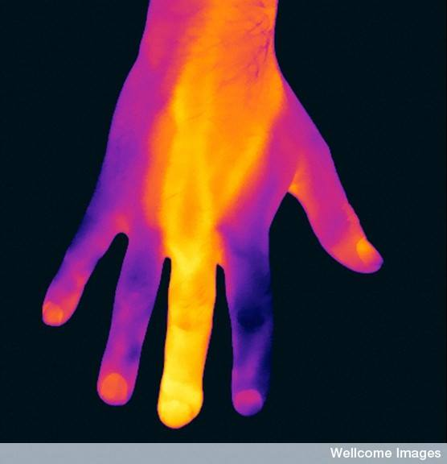Quelques heures après une
blessure, une réaction inflammatoire apparaît, accompagnée ou non de la
formation de pus au niveau de la zone infectée.

Cette réaction s’accompagne d’un gonflement, d’une rougeur et d’une
augmentation de la température de la zone. Il peut aussi y avoir une
douleur. La couleur de la peau dépend de la quantité de sang qui passent
dans les vaisseaux sanguins.

Document 2 : Schématisation de la réaction
inflammatoire.

Document 3 : Vaisseau sanguin
d’un tissu infecté.

Lors
de l’infection, des molécules sont libérées, cela va entraîner une
dilation des vaisseaux sanguins (un gonflement) et attirés des
leucocytes (= globules blancs). Les leucocytes présents dans le sang
vont traverser la paroi des vaisseaux sanguins, accompagnés d’un peu de
plasma sanguin (=partie liquide du sang). Tous ces phénomènes vont
entraîner une rougeur, un gonflement et de la chaleur au niveau de la
zone infectée.

Document 4 : Photo d’un phagocyte et de
bactéries

Document 5 : La phagocytose

La phagocytose est une méthode de défense
assurée par certains leucocytes appelés phagocytes.

Si
les phagocytes parviennent à digérer les bactéries, la plaie guérit.
Mais il arrive que les bactéries détruisent les phagocytes. Les cadavres
des phagocytes et les débris des bactéries s’accumulent dans le plasma
au niveau de la plaie, cela forme le pus. L’accumulation de pus va faire
gonfler la plaie et la douleur sera plus importante.

Correction Activité 28 :

Consigne 1 : Expliquer à quoi sont due le
gonflement et la rougeur de la réaction inflammatoire au niveau d’une
blessure.

Lors de l’infection des molécules vont faire
gonfler les vaisseaux sanguins au niveau de la blessure, il y aura donc
plus de sang, cela va entraîner une rougeur. Le gonflement du vaisseau
sanguin et la sortie de plasma vont faire gonfler la zone infectée.

Consigne 2 : Expliquer comment notre corps
lutte contre l’infection.

Dans notre sang, des leucocytes, les
phagocytes, sont présents. Ces phagocytes vont sortir du sang au niveau
de la blessure et absorber puis détruire les bactéries qui causent
l’infection.

Consigne 3 : Calculer et comparer les
tailles d’un phagocyte et d’une bactérie.

Le calcul de la taille correspond à :

 échelle \* taille de l’objet sur la photo /
taille de l’échelle sur la photo

La bactérie mesure 10\*0,2/0,5 = 4 µm

Le phagocyte mesure 10\*3,5/0,5 = 70 µm

La bactérie est donc presque dix fois plus
petite que le phagocyte.

Bilan :

Après une contamination, certains leucocytes (=globules blancs),
cellules sanguines du système immunitaire vont détecter les éléments
extérieurs (virus ou bactéries) et une réaction inflammatoire va se
produire très rapidement (gonflement, rougeur, chaleur et douleur).

Les phagocytes qui sont leucocytes vont sortir des vaisseaux sanguins.

Ces phagocytes vont absorber et digérer les éléments étrangers pour les
détruire. C’est la phagocytose.

C’est une réaction rapide et non spécifique
(réaction contre n’importe quel élément étranger).

### **Comment notre corps réagit si l’infection continue ?**


#### Réaction de notre corps à une infection prolongée.

Consigne 1 : expliquer par un schéma fonctionnel, comment le système
immunitaire est **réagit** lors **de la détection d’un
micro-organisme**. (Documents 1, 2 et 3)

Consigne 2 : Expliquer comment les lymphocytes T tueurs
**permettent**-ils lutter contre les infections. (Document 4)

**Consigne 3 : Quelle particularité des lymphocytes T tueurs est mise en
évidence dans les documents 5 et 6 ?**

Document 1 : Contact entre une cellule sentinelle et un lymphocyte dans
un ganglion lymphatique.

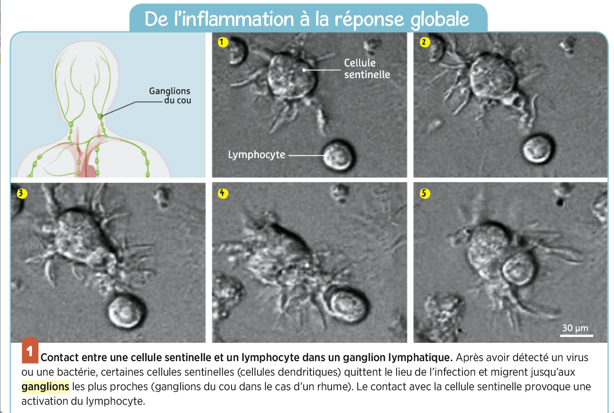Après avoir détecté un virus ou
une bactérie grâce à leurs antigènes (éléments propres à chaque type de
micro-organismes, présents à la surface des micro-organismes reconnus
par le système immunitaire), certaines cellules sentinelles (cellules
dendritiques) quittent le lieu de l’infection et migrent jusqu’aux
ganglions les plus proches (ganglions du cou dans le cas d’un rhume). Le
contact avec la cellule sentinelle provoque une activation du
lymphocyte.

Document 2 : Les trois types de lymphocytes.

-   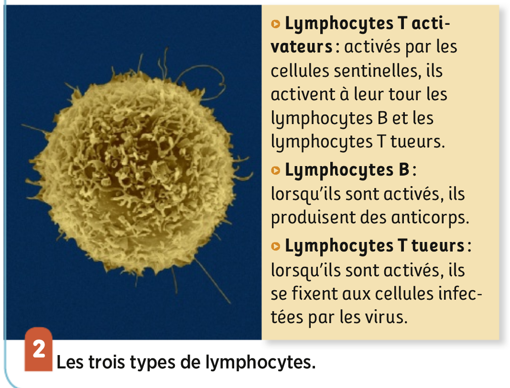Lymphocytes T activateurs :
    activés par les cellules sentinelles, ils activent à leur tour les
    lymphocytes B et les lymphocytes T tueurs.

-   Lymphocytes B : lorsqu’ils sont activés, ils produisent des
    anticorps.

-   Lymphocytes T : lorsqu’ils sont activés, ils se fixent aux cellules
    infectées par les virus.

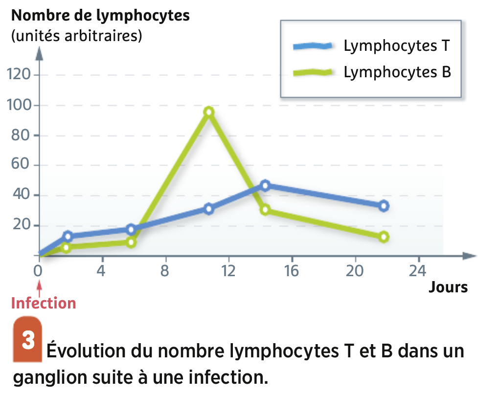***Document ****3 : Evolution du
nombre de lymphocytes T et B dans un ganglion suite à une infection.***

***Docu****ment 4 : Action d’un lymphocyte T tueur sur une cellule
infectée.***

Lors d’une infection par un virus, les lymphocytes tueurs reconnaissent
les cellules infectées par le virus en cause et seulement lui.

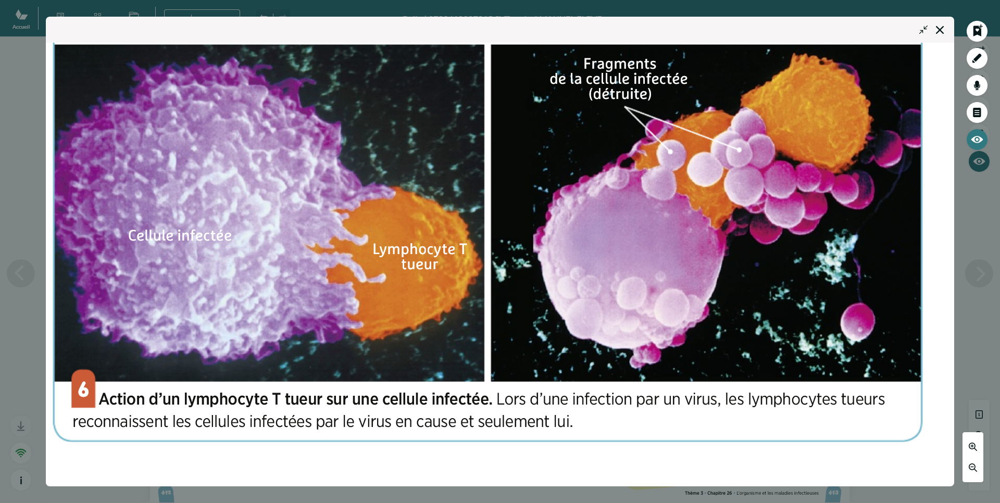Document 5 : Reconnaissance de
virus par les lymphocytes T.

Les cellules infectées par un virus possèdent à leur surface des
antigènes du virus.

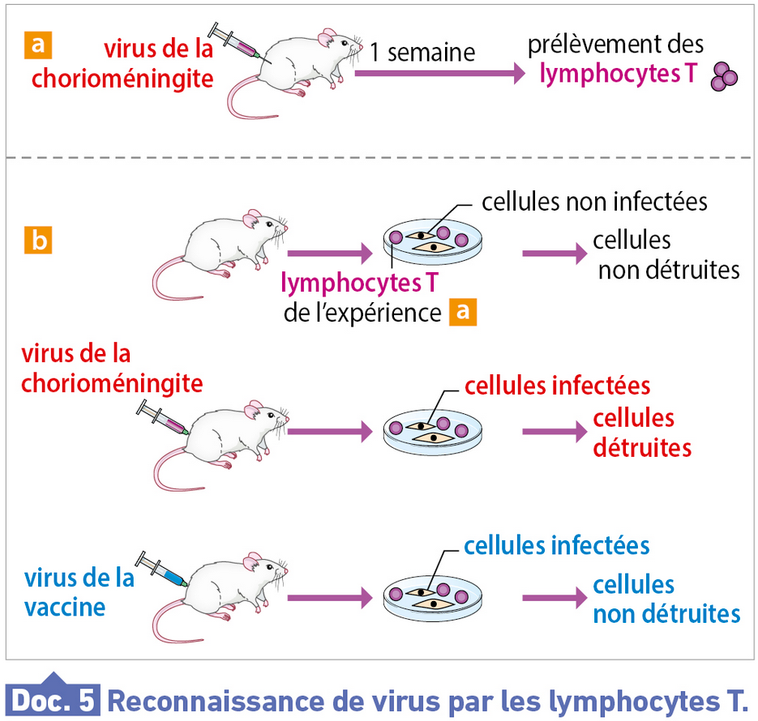Document 6 : Antigène de
micro-organisme et récepteur de lymphocyte.

Tout micro-organisme possède à sa
surface des éléments qui lui sont propres (les antigènes). Les
lymphocytes possèdent naturellement à leur surface des récepteurs qui
s’adaptent à la structure de tout type d’antigènes, ce qui leur permet
de reconnaître ou non l’antigène (mécanisme clé – serrure). À chaque
antigène correspond un récepteur d’un lymphocyte (un lymphocyte ne
reconnaît qu’un seul type d’ antigène) : c’est une réaction spécifique.

Correction de l’activité 29 : Réaction de
notre corps à une infection prolongée.

Consigne 1 : expliquer par un schéma fonctionnel, comment le système
immunitaire est **réagit** lors **de la détection d’un
micro-organisme**. (Documents 1, 2 et 3)

Consigne 2 : Expliquer comment les lymphocytes T **permettent**-ils
lutter contre les infections. (Document 4)

Les lymphocytes T tueurs vont se fixer à une cellule qui a été infectée
par un virus et la détruire

Consigne 3 : Quelle particularité des lymphocytes T est mise en évidence
dans les documents 5 et 6 ?

Dans le document 5, on voit que les lymphocytes T tueurs de l’expérience
a sont des lymphocytes qui ont détruit des cellules infectées par le
virus de la chorioméningite.

On voit que ces lymphocytes sont capables de détruire d’autres cellules
infectées par le même virus (expériences b), mais elles ne détruisent
pas les cellules infectées par d’autres virus (expérience c).

Dans le document 6, on apprend que les lymphocytes ont des récepteurs
qui reconnaissent les antigènes.

On peut conclure qu’un lymphocyte T ne détruit que les cellules qui ont
les antigènes d’un virus particulier, il peut pas détruire les cellules
ayant d’autres antigènes. Les lymphocytes sont spécifiques.

Bilan :

Les micro-organismes portent à leur surface des molécules, les
antigènes, qui provoquent l’activation du système immunitaire.

Après détection d’un micro-organisme **étranger**, les lymphocytes vont
être activés et se multiplier.

**Les** lymphocytes T tueurs reconnaissent et détruisent spécifiquement
les cellules infectées par les virus portant l’antigène reconnu.

Ce sont des réactions immunitaires lentes et spécifiques.


Exercice : L’étude d’un frottis sanguin.

Jules, qui se sent très fatigué, se rend chez son médecin pour connaître
l’origine de cette fatigue. Le médecin lui prescrit une analyse de sang.
Les photographies des deux frottis sont représentatives de l’ensemble
des cellules présentes dans les sangs étudiés.

Consigne : À partir des photographies de frottis sanguins, déterminez si
Jules est victime d’une infection. Justifiez votre réponse.

Document 1 : Photo d’un frottis
sanguin légendés (MO x400)

Le colorant colore le noyau.

1 = **hématie** (globule rouge)

2-3 = **phagocyte**

4 = **lymphocyte**

Document 2 : Comparaison du sang de Jules avec celui d’une personne non
malade

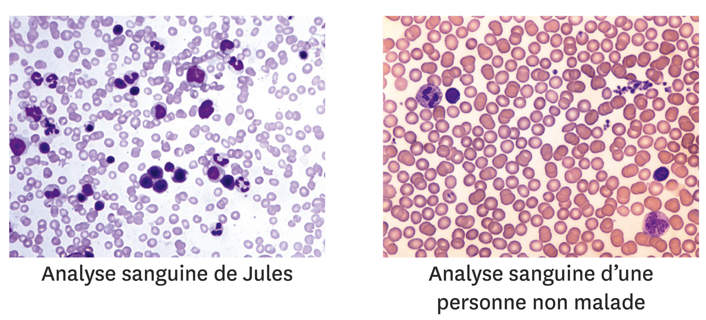

***Document 3 : ****Tableau présentant les résultats d’une analyse
sanguine de deux sujets***

|                            |                           |       |     |
|----------------------------|---------------------------|-------|-----|
| Cellules sanguines         | Sujet en bonne santé      | Jules |     |
| Hématies (millions/mm3)    | 4,7                       | 4,7   |     |
| Leucocytes (milliers/mm3)  | 9,5                       | 18    |     |
| dont                       | Phagocytes (milliers/mm3) | 6     | 10  |
| Lymphocytes (milliers/mm3) | 3,5                       | 8     |     |

### Comment les lymphocytes B et les anticorps permettent de lutter contre l’infection ?


#### L’action des anticorps

En février 2014, une épidémie de fièvre hémorragie due au virus Ebola
s’est déclenchée dans les forêts de Guinée. Elle s’est propagée en
Sierra Leone et au Liberia. Cette fièvre peut atteindre 90 % de
mortalité dans les populations qui la contractent. Cependant, une étude
menée en 2010 a montré que 15,3 % de la population gabonaise possèdent
des anticorps dirigés contre le virus sans jamais avoir eu de fièvre
hémorragique. Un médecin d’origine gabonaise envisage de se porter
volontaire pour une mission humanitaire en Sierra Leone.

***Problème à résoudre :***** On cherche à déterminer si ce médecin
possède des anticorps susceptibles de le protéger face au virus.**

Consigne 1 : Suivre le protocole du test d’Ouchterlony permettant de
savoir si ce médecin possède des anticorps susceptibles de le protéger
face au virus. (Document 6)

Consigne 2 : Compléter le tableau à l’aide des documents fournis pour
comprendre le rôle des anticorps dans la défense de l’organisme contre
les agents pathogènes.

Consigne 3 : Expliquer pourquoi les antigènes sont disposés au centre.

Consigne 4 : Schématiser la boite obtenue avec les résultats et répondre
au problème posé.

Consigne 5 : Expliquer la réaction ou son absence pour l’individu
séropositif au virus de la grippe

***Document ****1**** : ****Tableau à compléter regroupant les
informations issues des documents sur les anticorps :***

<table>
<tbody>
<tr class="odd">
<td><p>Définition du terme anticorps</p></td>
<td></td>
</tr>
<tr class="even">
<td><p>Où trouve-t-on les anticorps dans notre corps</p></td>
<td></td>
</tr>
<tr class="odd">
<td><p>Production (quand et comment sont produits les
anticorps ?)</p></td>
<td></td>
</tr>
<tr class="even">
<td><p>Rôle (mode d’action pour éliminer l’agent pathogène)</p></td>
<td></td>
</tr>
</tbody>
</table>

Document 2 : Informations sur les anticorps.

**Les anticorps ont la capacité
de se lier à un ou deux antigènes** et de les neutraliser. Un antigène
correspond à un élément étranger à l’organisme qui entraîne une réponse
immunitaire en étant reconnu par des anticorps.

Les anticorps sont des protéines solubles qui se fixent
**spécifiquement** à un antigène entraînant la formation d’un **complexe
antigène-anticorps** insoluble neutralisant l’agent infectieux.

Lorsqu’un individu présente un type d’anticorps dans son sang on dit
qu’il est séropositif pour cet anticorps.

***Document ****3***** : Expérience historique de localisation des
anticorps.**

***D****ocument ****4**** : ****Le
mode d’action des anticorps***

***Document ****4**** : Antigène
de micro-organisme et récepteur de lymphocyte.***

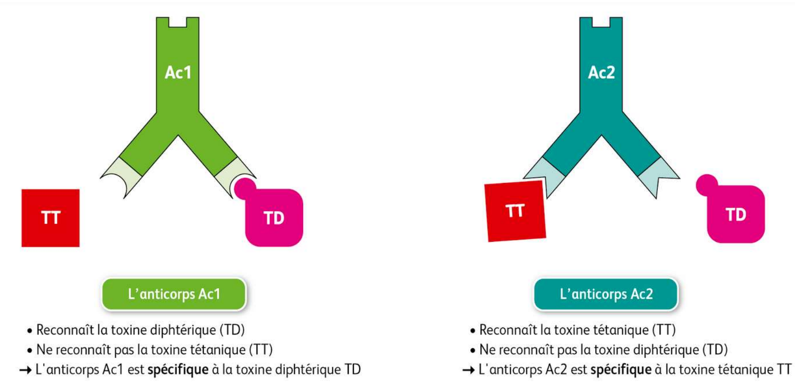Chaque anticorps est spécifique
d’un antigène donné : il ne reconnaît et ne peut éliminer que cet
antigène. Les anticorps sont produits par les lymphocytes B (cellules
présentes dans le sang). Un lymphocyte ne produit des anticorps qu’après
un contact avec un antigène.

Document 6 : Protocole pour réaliser un test d’Ouchternoly

Principe du test d’immunodiffusion
sur gel :

Les solutions déposées dans des puits creusés dans le gel diffusent de
façon homogène dans toutes les directions autour des puits. Deux
auréoles de diffusion peuvent donc entrer en contact lorsqu’elles ont
suffisamment progressé. Cette zone de contact reste invisible s’il n’y a
pas de réaction entre les deux solutions. En revanche, elle se traduit
par un arc de précipitation visible à l’œil nu lorsque les deux
solutions réagissent, c’est-à-dire si elles forment un complexe non
soluble dans le gel.

-   ***Matériel*** :

— petite boite de Pétri gélosée (6 cm de diamètre)

— emporte-pièce

— cure-dent ou aiguille lancéolée

— série de compte-gouttes propres

— feutre

— 5 tubes contenant les solutions

-   (Ag) solution d’antigènes\* du virus ;
-   \(P\) sérum\* d’un individu séropositif à l’antigène d’Ebola ;
-   \(N\) sérum\* d’un individu séronégatif à l’antigène d’Ebola ;
-   \(S\) sérum\* du médecin à tester ;
-   \(G\) sérum\* d’un individu séropositif à l’antigène de la grippe ;
    (utile pour la consigne 5 uniquement)

— feuille de papier noir

\* les produits utilisés (soude notamment) sont des produits de
substitution permettant de modéliser les réactions entre sérum et
anticorps, afin d’éviter les risques liés à la manipulation de produits
biologiques dangereux. Cependant, un risque chimique subsiste puisque la
soude provoque des brûlures et lésions oculaires.

-   Réalisation :

> 1/ Préparation de la boîte :

-   À l’aide de l’emporte-pièce et du gabarit de perçage, **creuser**,
    dans la gélose de la boîte de Pétri**, **un puits central, puis 4
    autres puits, uniformément répartis et disposés à égale distance du
    puits central.
-   Utiliser** **le cure-dent (ou l’aiguille lancéolée) pour
    **éliminer** les disques de gélose si nécessaire.

**2/ Repérage** :

-   **Marquer **sous la boîte de Pétri la disposition des produits à
    déposer dans les puits.
-   **Marquer** les compte-gouttes qui seront utilisés pour chaque
    produit

**3/ Remplissage** des puits :

-   **Prélever** un produit dans un tube avec le compte-goutte propre
    correspondant
-   **Disposer** le produit dans le puits approprié pour le remplir sans
    débordement ni bulles, et sans endommager le gel d’agar.
-   **Renouveler** l’opération pour chaque produit.

4/ **Lecture** des résultats :

-   **Laisser diffuser **les produits pendant 15 minutes.
-   **Observer** les résultats fournis sur fond noir.

La réaction antigène-anticorps s’obtient de façon optimale lorsque la
rencontre a lieu à l’intérieur de la gélose, entre les puits.

Activité 16 :L’action des anticorps

Noms : Prénom :

Grille d’évaluation

<table>
<tbody>
<tr class="odd">
<td>Compétences évaluées au cours du TP</td>
<td>TRÈS BONNE MAÎTRISE</td>
<td>MAITRISE SATISFAISANTE</td>
<td>MAITRISE FRAGILE</td>
<td>MAITRISE INSUFFISANTE</td>
</tr>
<tr class="even">
<td>Exploiter des données sous différentes formes</td>
<td>Tableau correctement rempli sans aide</td>
<td>3 cases correctement remplies sans aide ou tableau correctement
rempli avec l’aide</td>
<td>2 cases correctement remplies sans aide ou 3 cases correctement
remplies l’aide</td>
<td>1 case bien remplie avec ou sans aide ou 2 cases correctement
remplies avec l’aide</td>
</tr>
<tr class="odd">
<td>2</td>
<td>1,5</td>
<td>1</td>
<td>0,5</td>
<td></td>
</tr>
<tr class="even">
<td>Mettre en œuvre un protocole expérimental et organiser son
travail</td>
<td><p>Résultats exploitables et consignes suivies.</p>
<p>Matériel rangé.</p>
<p>Travail en autonomie.</p></td>
<td><p><em>Résultats exploitables</em>.</p>
<p>Aide pour suivre les consignes et/ou ranger le matériel.</p></td>
<td><p>Résultats non exploitables malgré le suivi des consignes.</p>
<p>Matériel rangé.</p></td>
<td><p>Résultats non exploitables.</p>
<p>Consignes non suivies.</p></td>
</tr>
<tr class="odd">
<td>0,5</td>
<td>0,25</td>
<td>0,25</td>
<td>0</td>
<td></td>
</tr>
<tr class="even">
<td>Communiquer ses résultats</td>
<td>Schéma légendé avec un titre</td>
<td>Schéma avec légendes ou titre</td>
<td>Schéma sans titre ni légende</td>
<td>Absence de schéma cohérent</td>
</tr>
<tr class="odd">
<td>1</td>
<td>0,75</td>
<td>0,5</td>
<td>0</td>
<td></td>
</tr>
<tr class="even">
<td><p>Interpréter des résultats et tirer des conclusions</p>
<p>consigne 4</p></td>
<td><p>Réponse au problème</p>
<p>Observations avant conclusion</p></td>
<td><p>Réponse au problème</p>
<p>Observations pas avant conclusion</p></td>
<td>Réponse au problème partielle</td>
<td>Réponse au problème fausse ou absente</td>
</tr>
<tr class="odd">
<td>0,75</td>
<td>0,5</td>
<td>0,25</td>
<td>0</td>
<td></td>
</tr>
<tr class="even">
<td><p>Interpréter des résultats et tirer des conclusions</p>
<p>consigne 5</p></td>
<td><p>Réponse au problème</p>
<p>Observations avant conclusion</p></td>
<td><p>Réponse au problème</p>
<p>Observations pas avant conclusion</p></td>
<td>Réponse au problème partielle</td>
<td>Réponse au problème fausse ou absente</td>
</tr>
<tr class="odd">
<td>0,75</td>
<td>0,5</td>
<td>0,25</td>
<td>0</td>
<td></td>
</tr>
</tbody>
</table>

<table>
<tbody>
<tr class="odd">
<td>Compétences évaluées au cours du TP</td>
<td>TRÈS BONNE MAÎTRISE</td>
<td>MAITRISE SATISFAISANTE</td>
<td>MAITRISE FRAGILE</td>
<td>MAITRISE INSUFFISANTE</td>
</tr>
<tr class="even">
<td>Exploiter des données sous différentes formes</td>
<td>Tableau correctement rempli sans aide</td>
<td>3 cases correctement remplies sans aide ou tableau correctement
rempli avec l’aide</td>
<td>2 cases correctement remplies sans aide ou 3 cases correctement
remplies l’aide</td>
<td>1 case bien remplie avec ou sans aide ou 2 cases correctement
remplies avec l’aide</td>
</tr>
<tr class="odd">
<td>2</td>
<td>1,5</td>
<td>1</td>
<td>0,5</td>
<td></td>
</tr>
<tr class="even">
<td>Mettre en œuvre un protocole expérimental et organiser son
travail</td>
<td><p>Résultats exploitables et consignes suivies.</p>
<p>Matériel rangé.</p>
<p>Travail en autonomie.</p></td>
<td><p><em>Résultats exploitables</em>.</p>
<p>Aide pour suivre les consignes et/ou ranger le matériel.</p></td>
<td><p>Résultats non exploitables malgré le suivi des consignes.</p>
<p>Matériel rangé.</p></td>
<td><p>Résultats non exploitables.</p>
<p>Consignes non suivies.</p></td>
</tr>
<tr class="odd">
<td>0,75</td>
<td>0,5</td>
<td>0,25</td>
<td>0</td>
<td></td>
</tr>
<tr class="even">
<td>Communiquer ses résultats</td>
<td>Schéma légendé avec un titre</td>
<td>Schéma avec légendes ou titre</td>
<td>Schéma sans titre ni légende</td>
<td>Absence de schéma cohérent</td>
</tr>
<tr class="odd">
<td>1,5</td>
<td>1</td>
<td>0,5</td>
<td>0</td>
<td></td>
</tr>
<tr class="even">
<td>Interpréter des résultats et tirer des conclusions</td>
<td><p>Réponse au problème</p>
<p>Observations avant conclusion</p></td>
<td><p>Réponse au problème</p>
<p>Observations pas avant conclusion</p></td>
<td>Réponse au problème partielle</td>
<td>Réponse au problème fausse ou absente</td>
</tr>
<tr class="odd">
<td>0,75</td>
<td>0,5</td>
<td>0,25</td>
<td>0</td>
<td></td>
</tr>
</tbody>
</table>

**Consigne 2 : Compléter le tableau à l’aide des documents fournis pour
comprendre le rôle des anticorps dans la défense de l’organisme contre
les agents pathogènes.**

***Document ****1**** : ****Tableau à compléter regroupant les
informations issues des documents sur les anticorps :***

<table>
<tbody>
<tr class="odd">
<td><p>Définition du terme anticorps</p></td>
<td></td>
</tr>
<tr class="even">
<td><p>Où trouve-t-on les anticorps dans notre corps</p></td>
<td></td>
</tr>
<tr class="odd">
<td><p>Production (quand et comment sont produits les
anticorps ?)</p></td>
<td></td>
</tr>
<tr class="even">
<td><p>Rôle (mode d’action pour éliminer l’agent pathogène)</p></td>
<td></td>
</tr>
</tbody>
</table>

Consigne 3 : Expliquer pourquoi les antigènes sont disposés au centre.

Consigne 4 : Schématiser la boite obtenue avec les résultats et répondre
au problème posé.

Consigne 5 : Expliquer la réaction ou son absence pour l’individu
séropositif au virus de la grippe

**Consigne 2 : Compléter le tableau à l’aide des documents fournis pour
comprendre le rôle des anticorps dans la défense de l’organisme contre
les agents pathogènes.**

Document 1 : Tableau à compléter regroupant les informations issues des
documents sur les anticorps :

|                                                             |                                                                                                                                                   |
|-------------------------------------------------------------|---------------------------------------------------------------------------------------------------------------------------------------------------|
| Définition du terme anticorps                               | Protéine soluble pouvant se fixer à un antigène                                                                                                   |
| Où trouve-t-on les anticorps dans notre corps               | Dans le sérum                                                                                                                                     |
| Production (quand et comment sont produits les anticorps ?) | Les anticorps sont produits par les lymphocytes B qui ont été en contact avec un antigène.                                                        |
| Rôle (mode d’action pour éliminer l’agent pathogène)        | Les anticorps vont se fixer aux antigènes et former une agglutination de bactéries ou de virus qui vont ensuite être phagocytées plus facilement. |

Consigne 3 : Expliquer pourquoi les antigènes sont disposés au centre.

Les antigènes sont disposés au centre pour se diffuser uniformément dans
toutes les directions vers les puits contenant les solutions à tester.

Consigne 4 : Schématiser la boite obtenue avec les résultats et répondre
au problème posé.

Représentation du résultat du test d’Ouchterlony

Légendes :

• (Ag) solution d’antigènes\* du virus ;

• (P) sérum\* d’un individu séropositif à l’antigène d’Ebola ;

• (N) sérum\* d’un individu séronégatif à l’antigène d’Ebola ;

• (S) sérum\* du médecin à tester ;

• (G) sérum\* d’un individu séropositif à l’antigène de la grippe ;
(utile pour la consigne 5 uniquement)

On observe un arc de précipitation entre les antigènes et les solutions
P et S. La solution P contient le sérum d’un individu séropositif à
Ebola, c’est-à-dire un sérum contenant des anticorps contre le virus
Ebola. Dans le cas de la solution N contenant le sérum d’individu
séronégatif à Ebola qui n’a pas ces anticorps, il n’y a pas de réaction,
ce qui est normal. La solution S, contenant le sérum du médecin, a donc
réagi avec les antigènes du virus Ebola, comme pour la solution P, le
médecin est donc séropositif au virus Ebola, il a des anticorps contre
ce virus.

Consigne 5 : Expliquer la réaction ou son absence pour l’individu
séropositif au virus de la grippe.

On voit dans le cas de l’individu séropositif à la grippe, qu’il n’y a
pas de réaction. On sait que les anticorps sont spécifiques c’est-à-dire
qu’ils ne peuvent se fixer qu’à un seul type d’antigène. Donc les
anticorps qu’il possède sont des anticorps qui reconnaissent les
antigènes du virus de la grippe, mais pas ceux du virus Ebola, ce qui
explique l’absence de réaction.

[](https://www.youtube.com/watch?v=E9CRJqxgSvA)

[](https://www.youtube.com/watch?v=E9CRJqxgSvA)

!!! note-prof 
    Matériel à préparer
        - GEl 1,5g d'a  gar-agar pour 100ml
        - solution de soude 0,5mol/L : 0,4g pour 10ml
        - solution de sulfate de zinc à 0,5mol/l : 0,8g pour 10ml
    Tubes:
        - P et S : soude
        - G et N : eau
        - Ag: zinc

Bilan :

lors d’une infection, les lymphocytes B qui ont **été activés** après la
reconnaissance d’un antigène, vont se multiplier.

**Ces** lymphocytes B produisent des anticorps. **Ces anticorps**
reconnaissent de manière spécifique l’antigène (fragment de
micro-organisme entraînant une réponse immunitaire) qui a initié leur
formation.

La fixation d’un anticorps sur un antigène forme un complexe
anticorps-antigène qui sera détruit par phagocytose.

Ce sont des réactions immunitaires lentes et spécifiques.

Un individu est dit séropositif pour un micro-organisme donné s’il
possède dans son sang (sérum) das anticorps spécifiques contre ce
micro-organisme.

Définition :

Antigène : molécule (libre ou sur une cellule \[micro-organisme\])
reconnue par le système immunitaire.

Anticorps : molécules produites par des lymphocytes B qui se lient à un
antigène spécifique.


[](https://www.youtube.com/watch?v=E9CRJqxgSvA)


### Comment expliquer l’intérêt de la vaccination ?


#### La vaccination

Consigne 1 : Expliquer le principe de la vaccination. (Document 1 à 3)

Consigne 2 : Expliquer l’intérêt de la vaccination pour un individu et
pour une population. (Document 2 à 6)

Consigne 3 : Comparer les risques dus à la rougeole et au vaccin contre
la rougeole.

***Document 1 : La composition d’un vaccin.***

Un vaccin contient des antigènes de l’agent infectieux contre lequel on
souhaite se protéger. On peut soit injectés des microbes atténués
(inoffensifs), de microbes tués ou des fragments du microbe. Des
adjuvants sont aussi présents ce qui permet une meilleure activation du
système immunitaire et une meilleure efficacité des vaccins.

Document 2 : Comparaison de la production d’anticorps lors de la
première et de la seconde rencontre avec un même agent infectieux.

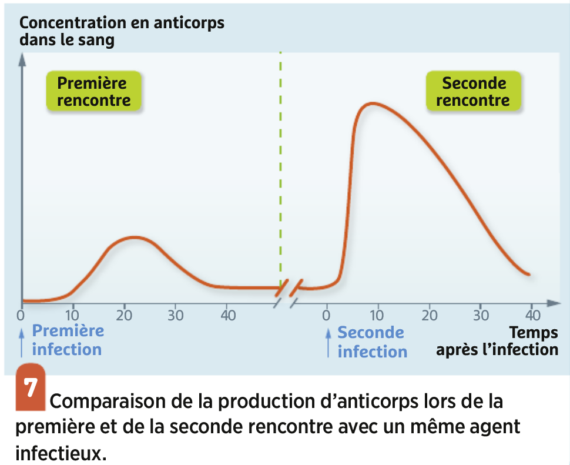***Document 3 : ****La****
mémoire ****immunitaire.***

Lors du premier contact entre un antigène et l’organisme, certains
lymphocytes se multiplient lorsque notre système immunitaire : ce sont
les lymphocytes mémoire qui peuvent être présents plusieurs années.
Lorsque l’antigène se trouve à nouveau dans le sang, les lymphocytes
mémoire sont activés et se différencient en lymphocytes T ou B actifs.
C’est ce qu’on appelle la mémoire immunitaire.

Document 4 Une campagne d’information sur la vaccination.

Infographie extraite d’un document de l’Agence régionale de santé
Languedoc-Roussillon, intitulé « Se faire vacciner est une démarche
altruiste »

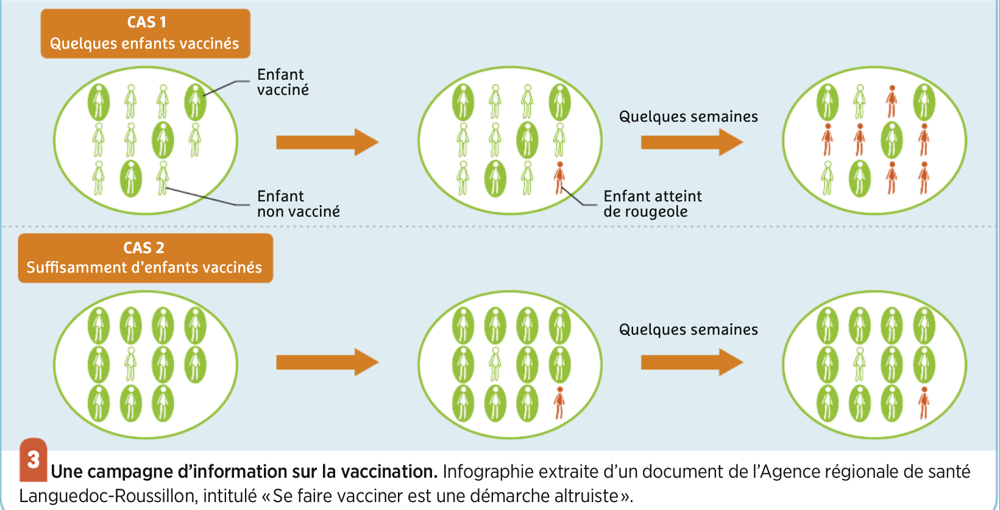Après vaccination, une partie de
la population est immunisée directement par l’effet du vaccin. Ces
individus protègent indirectement l’ensemble du groupe en stoppant la
transmission au plus grand nombre, c’est l’effet de groupe

***Document 5 : ****D****es contre-indications à la vaccination.***

Certaines personnes ne peuvent pas se faire vacciner pour des raisons de
santé. En effet, dans certains l’administration d’un vaccin pourrait
mettre en danger la personne, c’est le cas des personnes ayant certaines
allergies aux composés des vaccins, des personnes souffrant de maladies
causant un affaiblissement du système immunitaire ou bien des femmes
enceintes.

Document 6 : Evolution du nombre de cas de rougeole de 1950 à 2001.

Données recueillies aux
États-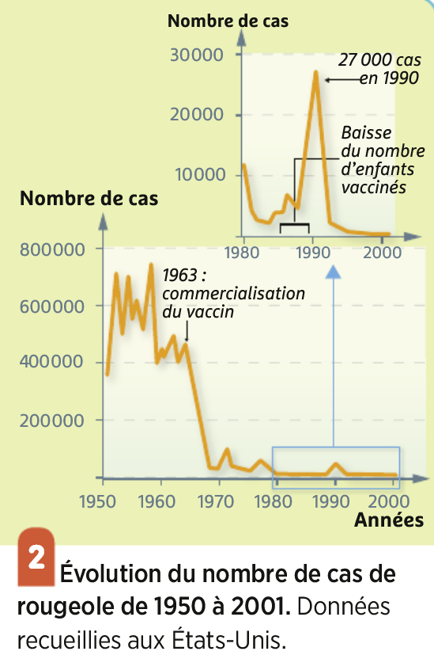Unis.

Dans le monde, les décès dus à la rougeole ont chuté de 75 % entre 2000
et 2013 grâce à la vaccination, soit 15,6 millions de décès évités dans
cette période.

La couverture vaccinale en France en 2008 était de 89 %, pour une
éradication de la maladie en France, le Haut Conseil de la santé
publique recommande une couverture de 95 %.

***Document ****7**** : Risques dus à la rougeole et ****au**** vaccin
****contre la rougeole****.***

La rougeole est une maladie souvent bénigne, mais dont les complications
tuent 200 000 enfants par an dans le monde. Entre 2008 et 2014, il y a
eu 23 000 cas de rougeole en France. On dénombre 1500 complications
pulmonaires, 34 complications neurologiques et 10 morts.

Le vaccin peut avoir des effets indésirables à court terme, les plus
courants sont de la fièvre et une réaction inflammatoire au niveau de
l’injection qui sont des réactions normales de notre système
immunitaire.

Dans le cas du vaccin contre la rougeole, des complications pulmonaires
peuvent avoir lieu dans 1 cas sur 500, des complications neurologiques
dans 1 cas sur 5000.

Aucune étude à ce jour n’a montré d’effets indésirables à long terme
d’un vaccin.

Consigne 1 :

le vaccin sert à protéger contre certaines maladies.

Le vaccin contient des fragments de microbes ou des microbes tués, il
contient donc des antigènes.

Les antigènes vont avoir un premier contact avec l’organisme ce qui va
activer et multiplier certains lymphocytes : lymphocytes mémoires.

Lorsque le corps rencontrera les microbes avec les mêmes antigènes, les
lymphocytes mémoires se différencieront en lymphocytes T ou B actifs,
mais la mémoire immunitaire permettra une réponse plus rapide et plus
forte.

Consigne 2 :

La vaccination permet de se protéger et de protéger la population en
stoppant la propagation en évitant que plus de personne soit atteint de
la maladie. Ce la permet de protéger les personnes qui ne peuvent pas se
vacciner.

***Consigne 3 :***

la rougeole peut créer des complications neurologiques et pulmonaires
graves plus fréquentes que le vaccin qui peut avoir des effets
indésirables mais seulement à court terme.

Par exemple les complications pulmonaires seront réduites à 1 cas sur
5000 avec le vaccin alors qu’avec la rougeole 1500 cas sur 23000 (300
sur 5000)

Bilan :

La vaccination consiste à injecter un vaccin, c’est-à-dire une forme
atténuée ou bien des parties d’un micro-organisme pathogène pour activer
la mémoire immunitaire.

La 1re rencontre avec un antigène contenu ici dans un vaccin déclenche
la formation de lymphocyte mémoire qui constituent la mémoire
immunitaire. Ils permettent une réponse plus forte et plus rapide lors
du 2e contact avec l’antigène, le protégeant ainsi de la maladie =
Prévention.

[](https://www.youtube.com/watch?v=E9CRJqxgSvA)

À l’échelle de la population, la
vaccination permet d’éviter la propagation des pathogènes.

1.  ### Quelles sont les conséquences du VIH ?

```{=html}
<!-- -->
```
1.  #### Le VIH et le SIDA

Paul a eu une relation non protégée lors d’une soirée. Il s’inquiète sur
les risques de contamination et pendant 1 mois il se sent bien. Alors il
pense ne rien avoir, Paul est rassuré !

Consigne : Expliquez-lui ce qu’est le SIDA s’il a raison d’être
rassuré ? Que lui conseillerez-vous ?* Critères de réussite :*

-   Expliquer les différents modes de transmission
-   Expliquer quels sont les dégâts faits par le micro-organisme et
    pourquoi lors de la dernière phase le corps n’a plus de défense
    immunitaire
-   **E**xpliquer la mort des patients malades.
-   Expliquer, à Paul, ce qu’il devra faire dans le futur.

Document 1 : évolution de la
concentration de VIH (Virus de l’ImmunoDéficience Humaine), de
Lymphocytes T et d’anticorps anti-VIH.

3 Phases apparaissent :

— La primo-infection de la contamination à 9 semaines.

— La phase asymptomatique de 9 semaines à 8 ans environ.

— Le SIDA (=Syndrome de l’ImmunoDéficience Acquise) déclaré de 8 ans à
la mort du patient.

Les lymphocytes T4 sont des lymphocytes T activateurs.

Document 2 : Voies de contamination.

Le virus du sida peut être présent dans certains liquides du corps :

-   le sang,
-   le sperme et le liquide qui survient avant l’éjaculation (liquide
    pré séminal),
-   les sécrétions vaginales (cyprine),
-   le lait
    maternel.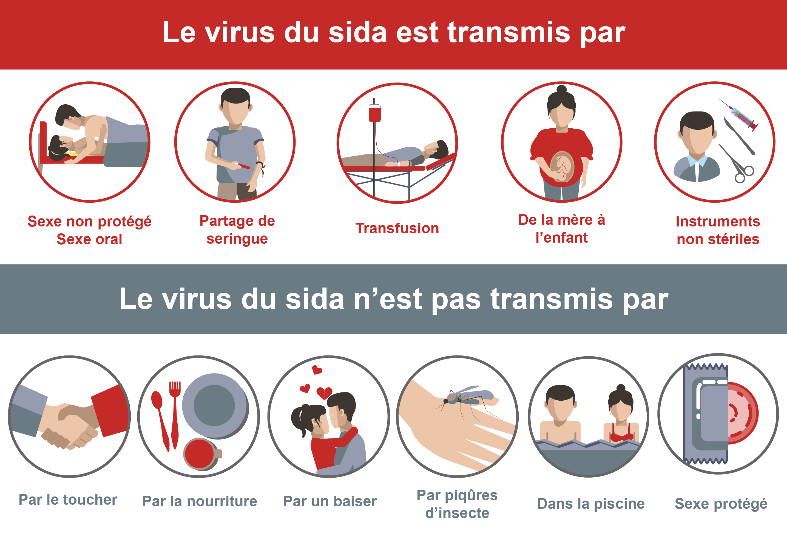

Document 3 : Les différentes phases de la maladie.

Suite à une contamination, trois phases se succèdent.

La primo-infection est la période pendant laquelle le virus infecte les
lymphocytes T activateurs pour se multiplier. Les symptômes sont limités
à ceux d’une maladie bénigne, ce qui les rend impossibles à identifier.

Pendant la deuxième période, la phase asymptomatique, de durée variable,
on détecte facilement la séropositivité au VIH, car les anticorps
anti-VIH sont fabriqués par l’organisme. En revanche, on n’observe en
général aucun symptôme chez le malade. C’est pendant cette période
qu’une personne peut se faire dépister. Le dépistage consiste à détecter
la présence ou l’absence d’anticorps anti-VIH.

La troisième période est celle du SIDA, c’est-à-dire celle de
l’immunodéficience. Le corps n’a plus de défense immunitaire. Il y a
donc un développement de nombreuses maladies opportunistes qui profitent
de l’immunodéficience et qui vont provoquer la mort du malade.

Une personne peut transmettre le virus dès le début de l’infection.

Document 4 : Traitement anti-sida.

Actuellement, il n’y a pas de vaccin protégeant du VIH et aucun
traitement ne permet d’éliminer le virus de l’organisme. Depuis la fin
des années 1990, des traitements adaptés (trithérapie), permettent de
bloquer la multiplication du VIH et de prolonger considérablement
l’espérance de vie des personnes infectées. Ces traitements ont des
effets secondaires importants (fatigue, maux de tête, troubles
digestifs…)

Document 5 : Prévention pour le VIH.

Les seuls moyens de détruire le virus sont l’eau de javel, les
détergents et une chaleur de plus de 60 °C.

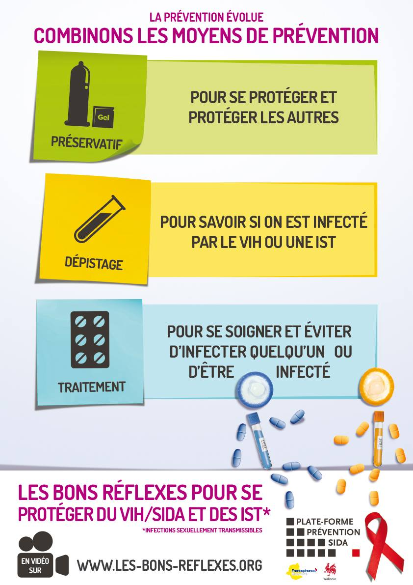

Bilan :

Le SIDA est causé par un virus, le VIH.

Il se transmet par voie sanguine ou sexuelle.

Le seul moyen de protection lors des rapports sexuels est le
préservatif.

Le VIH infecte les lymphocytes T. Il les détruit donc.

Après quelques années, le VIH a détruit une partie du système
immunitaire, la personne sera immunodéficiente. C’est-à-dire que son
corps ne peut pas lutter contre les microbes. Il sera donc malade
régulièrement, on parle de maladies opportunistes. Ces maladies
entraîneront le décès de la personne.

Pour savoir si l’on est atteint par le virus seul un test pour détecter
ces anticorps anti-VIH est possible trois mois après la possible
contamination

Correction :

Paul ne doit pas être rassuré, car les premières phases suivant la
contamination ne déclenchent pas de symptômes.

Paul devra se protéger en portant un préservatif lors de ses futures
relations sexuelles avec son ou sa partenaire.

Paul devra se faire dépister dans deux mois le temps que son corps
produise des anticorps anti-VIH s’il a été contaminé.

## Chapitre 2 : La puberté et la reproduction chez l’être humain

1.  ### Quelles sont les différences anatomiques qui se mettent en place au cours du développement d’un individu ?

```{=html}
<!-- -->
```
1.  ####  Les différences anatomiques entre un homme et une femme.

Consigne : Construire un tableau en indiquant pour l’homme et la femme :
la période de puberté, les 2 caractères sexuels primaires, 2 caractères
sexuels secondaires et le moment d’apparition des caractères sexuels
primaires.

Compétence travaillée : Construire un tableau

Document 1 : Photographie des appareils reproducteurs externes de
l’homme et de la femme à différents moments du développement
embryonnaire.

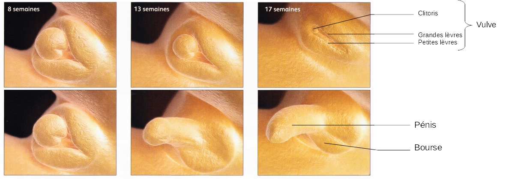

Document 2 : Des transformations liées à la puberté


L’âge de la puberté est différent en fonction des individus. Dans la
majorité des cas, elle commence :

-   entre 9 et 13 ans chez les filles
-   entre 10,5 et 14 ans chez les garçons

Document 3 : l’appareil reproducteur de la femme

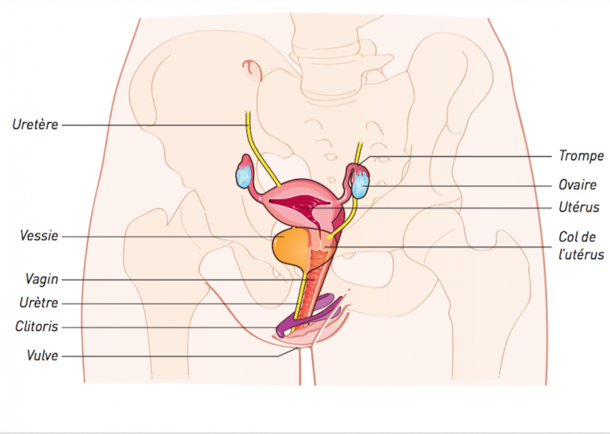

Document 4 : l’appareil reproducteur de l’homme (seules les légendes en
gras font partie de l’appareil reproducteur)


Document 5 : Les caractères sexuels

On appelle caractère sexuel primaire, l’ensemble des différences
anatomiques qui différencie un homme d’une femme pendant la grossesse et
à la naissance.

On appelle caractère sexuel secondaire, l’ensemble des différences
anatomiques qui différencie un homme d’une femme à partir de la puberté.

Tous ces caractères sont variables d’un individu à l’autre même du même
sexe.

Correction

<table>
<tbody>
<tr class="odd">
<td></td>
<td>Femme</td>
<td>Homme</td>
</tr>
<tr class="even">
<td>Période de puberté</td>
<td>10,5 – 16,5 ans</td>
<td>12 – 18 ans</td>
</tr>
<tr class="odd">
<td>Caractères sexuels primaires</td>
<td>Appareil reproducteur externe :<br />
Vulve (petite lèvres, grandes lèvres, clitoris et vagin)<br />
Appareil reproducteur interne :<br />
Ovaires<br />
Trompe<br />
Utérus<br />
vagin</td>
<td>Appareil reproducteur externe :<br />
Pénis<br />
Bourse<br />
Appareil reproducteur interne<br />
Testicule<br />
Épididyme<br />
Canal déférent<br />
Vésicule séminale<br />
Prostate<br />
Urètre</td>
</tr>
<tr class="even">
<td>Caractères sexuels secondaires</td>
<td>Seins<br />
Développement des hanches<br />
Poils pubiens et poils sous les bras<br />
règles</td>
<td>Développement musculature<br />
Voix grave<br />
Développement taille testicules<br />
Développement taille pénis<br />
Poils pubiens, sous les bras et sur le visage…<br />
éjaculations</td>
</tr>
<tr class="odd">
<td>Moment d’apparition des caractères sexuels primaires</td>
<td>Après 13 semaines du développement embryonnaire</td>
<td>Après 13 semaines du développement embryonnaire</td>
</tr>
</tbody>
</table>

Bilan :

Lors du développement embryonnaire, les appareils reproducteurs internes
et externes deviennent différents chez l’homme et chez la femme, ce sont
les caractères sexuels primaires.

À la puberté, d’autres différences apparaissent entre l’homme et la
femme, ce sont les caractères sexuels secondaires (par exemple :
développement des seins, développement du pénis…)

L’appareil reproducteur interne de la femme est constitué des ovaires,
des trompes, de l’utérus et du vagin. Et son appareil reproducteur
externe, appelé vulve, est constitué de l’orifice du vagin, des petites
lèvres, des grandes lèvres et du clitoris.

L’appareil reproducteur interne de l’homme est constitué des testicules,
du canal déférent et de l’urètre. Et son appareil reproducteur externe
est constitué des bourses et du pénis.

1.  ### Comment expliquer les changements liés à la puberté ?

1.  #### L’origine de la puberté.

Consigne 1 : **Ajouter** une courbe représentant l’évolution de la
quantité de testostérone en fonction de l’âge sur le graphique.

Consigne 2 : **D**écrire les deux courbes du graphique.

Consigne 3 : Répondre au problème en utilisant les documents

Compétences travaillées : Construire un graphique et décrire un
graphique

Document 1 :
\_\_\_\_\_\_\_\_\_\_\_\_\_\_\_\_\_\_\_\_\_\_\_\_\_\_\_\_\_\_\_\_\_\_\_\_\_\_\_\_\_\_\_\_\_\_\_\_\_\_\_


Document 2 : Tableau de la quantité d’hormones sexuelles en fonction de
l’âge

|                 |                                          |                                        |
|-----------------|------------------------------------------|----------------------------------------|
|                 | Quantité d’hormones chez l’homme         | Quantité d’hormones chez la femme      |
| Âge (en années) | Testostérone (en unités arbitraires, ua) | Œstrogènes (en unités arbitraires, ua) |
| 6               | 0,2                                      | 0,3                                    |
| 9               | 0,2                                      | 0,4                                    |
| 12              | 0,5                                      | 2,3                                    |
| 14              | 1                                        | 3,3                                    |
| 16              | 3                                        | 4,5                                    |
| 18              | 4                                        | 4,8                                    |
| 19              | 4,5                                      | 5                                      |

Document 3 : Deux hormones sexuelles, la testostérone et l’œstrogène

La testostérone est une hormone sexuelle fabriquée par l’homme

L’œstrogène est une hormone sexuelle fabriquée par la femme, c’est une
hormone ovarienne

Définition d’hormone : substance chimique fabriquée par un organe et
libéré dans le sang provoquant des modifications de certains organes
(organes cibles de l’hormone).

Document 4 : La puberté.

La puberté commence vers 10 ans chez la femme et vers 14 ans chez
l’homme.

Chez certaines personnes la puberté ne se déclenche pas, des traitements
existent. Par exemple, les femmes atteintes du syndrome de Turner, sont
de petites tailles, stériles, leurs seins ne sont pas développés et
elles n’ont pas leurs règles. Pour les traiter, on leur injecte des
hormones ovariennes

Document 5 : Décrire une courbe d’un graphique.

1.  Commencer par résumer les informations concernant le graphique (le
    titre).

2.  Pour décrire le graphique, il faut commencer par définir les
    différents tronçons qui permettent de visualiser les changements
    d’évolution de la courbe.

3.  Décrire la courbe en utilisant les verbes suivants : augmenter,
    diminuer, stagner (ou rester stable). On ne parle pas du graphique
    ou de la courbe, mais de la variable qui est représentée.

    Pour décrire le graphique, utiliser la structure de phrase suivante,
    sans oublier les unités :

    De (valeur A sur l’axe horizontal) et (valeur B sur l’axe
    horizontal), (la variable) \[verbe\] de (valeur A sur l’axe
    vertical) à (valeur B sur l’axe vertical)

Correction :


Document 1 : Graphique de la quantité d’hormones sexuelles en fonction
de l’âge

Ce graphique représente la quantité d’hormones sexuelles en fonction de
l’âge.

Pour la quantité d’œstrogènes :

De 6 à 19 ans, la quantité d’œstrogènes augmente de 0,3 à 5 ua.

Pour la quantité de testostérone :

De 6 à 9 ans, la quantité de testostérone reste stable à 0,2 ua.

Puis de 9 à 19 ans, la quantité de testostérone augmente de 0,2 à
4,5 ua.


Bilan :

À la puberté, les taux d’hormones sexuelles (testostérone chez l’homme
et œstrogène chez la femme) augmentent, ce qui est responsable des
changements observés à la puberté.

Définition hormone : substance chimique fabriquée par un organe et
libérée dans le sang provoquant des modifications de certains organes
(organes cibles de l’hormone). Les hormones sont un moyen de
communication dans notre corps.

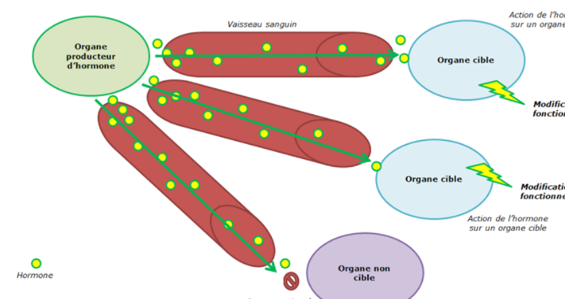

1.  ### Comment sont produites les cellules reproductrices ?

```{=html}
<!-- -->
```
1.  #### Les cellules reproductrices

Consigne 1 : À partir de l’observation de la lame et du document 1,
explique où sont produits les spermatozoïdes.

Consigne 2 : À l’aide des informations du document 3, légende la photo
du document 2.

Consigne 3 : Faire un tableau comparant les spermatozoïdes et les ovules
du point de vue de la taille, du nombre, de la durée de vie et de la
mobilité.

Compétence travaillée : faire un dessin d’observation et construire un
tableau

Document 1 : Photo légendée d’une coupe de testicules.

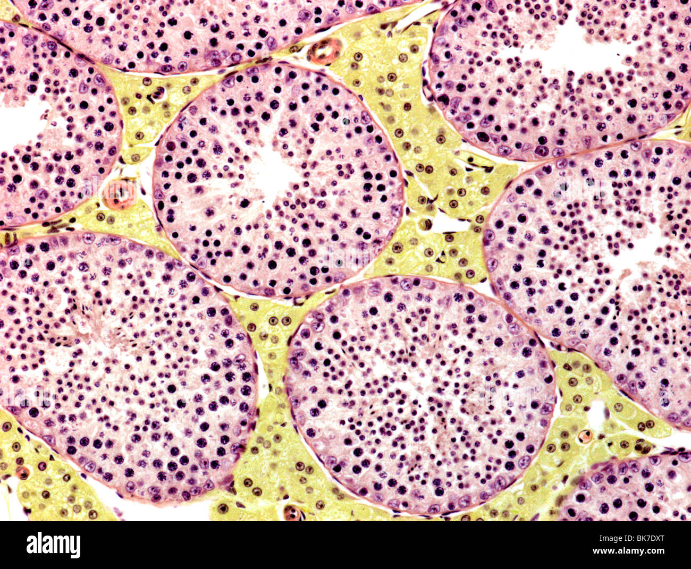

Document 2 : Photo de spermatozoïdes de taureau MO x600.


Document 3 : Les spermatozoïdes.

Les spermatozoïdes sont les cellules reproductrices de l’homme.

Il est composé de deux parties :

1.  La tête : qui mesure 5 µm
2.  Le flagelle qui mesure 60 µm

Lors d’une éjaculation, entre 200 et 300 millions de spermatozoïdes sont
libérés. Ils ont une durée de 3 à 5 jours.

Ces spermatozoïdes peuvent atteindre la vitesse de 60 µm par seconde.

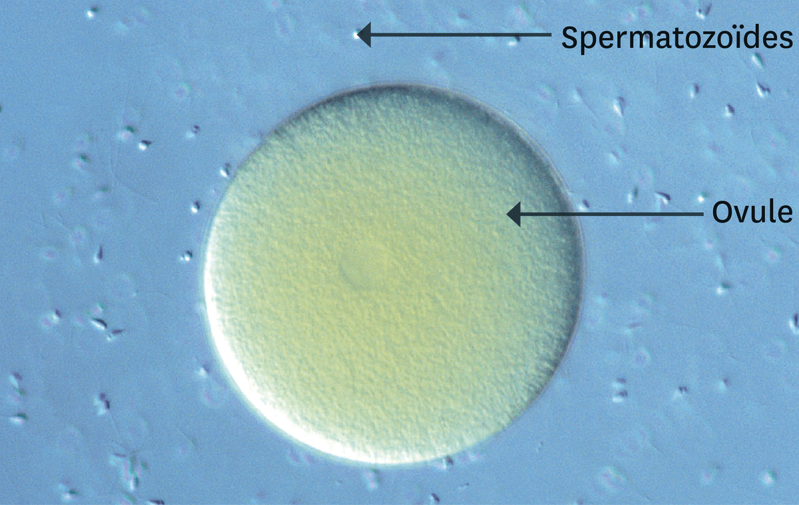Document 4 : Les ovules.

Les ovules sont les cellules reproductrices de la femme.

C’est une cellule ronde d’un diamètre de 120 µm.

Lors de l’ovulation, un seul ovule est libéré.

L’ovule ne peut pas se déplacer tout seul.

Ils ont une durée de 1 à 2 jours.

Aide :

Avoir retrouvé les différentes zones présente dans le document 1sur la
lame

Avoir identifié les spermatozoïdes.

Correction :

|          |                                |                   |
|----------|--------------------------------|-------------------|
|          | Spermatozoïde                  | ovule             |
| taille   | 65 µm, plus petit              | 120 µm, plus gros |
| Nombre   | Plusieurs millions             | Un seul           |
| Mobilité | Se déplace à 60 µm par seconde | immobile          |

Bilan :

Les gamètes** (=**cellules reproductrices) sont produites par les
gonades.

Chez les hommes, les spermatozoïdes sont produits par les testicules, en
continu, à partir de la puberté. Le sperme contient du liquide séminal
et des spermatozoïdes.

Chez les femmes, les ovules sont émis de façon cyclique (1 par mois
environ), à partir de la puberté jusqu’à la ménopause.

1.  ### Comment est contrôlé le fonctionnement de l’appareil reproducteur ?

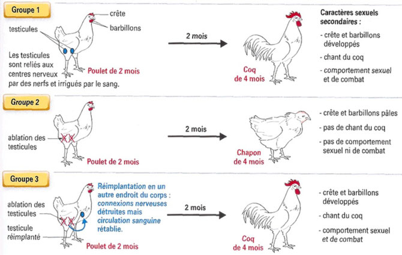** **

1.  #### Le contr***ôle du*** fonctionnement de l’appareil reproducteur 

Consigne 1 : Déterminer les différents organes et hormones impliqués
dans le fonctionnement de l’appareil reproducteur en indiquant leur
effet.

Consigne 2 : Construire un schéma fonctionnel qui montre le contrôle du
fonctionnement de l’appareil reproducteur.

Document 1 Quelques troubles du fonctionnement de l’appareil
reproducteur

À l’hôpital, des patients sont suivis pour des troubles du
fonctionnement de l’appareil reproducteur.

-   Cas n°1 : homme qui a eu une puberté tardive et qui a des caractères
    sexuels secondaires peu développés (faibles pilosité, testicules de
    petite taille). Sa maladie est due à un dysfonctionnement d’une zone
    du cerveau reliée à l’hypophyse.
-   Cas n°2 : homme souffrant de maux de tête et de troubles de
    l’érection. L’analyse de son sperme montre qu’il en produit peu et
    que ses spermatozoïdes sont peu fécondants. Une IRM de son cerveau
    révèle une tumeur bénigne à l’hypophyse.
-   Cas n°3 : femme atteinte d’une tumeur à l’hypophyse. Sa maladie a
    notamment provoqué l’arrêt de des ovulations et de ses règles, alors
    qu’elle n’est pas en période de ménopause.

Document 2 : L’hypophyse, une
petite glande du cerveau qui sécrète des hormones.

L’hypophyse est une petite glande située à la base du cerveau. Elle peut
être visualisée grâce à une imagerie par résonance magnétique (IRM) du
cerveau.

L’**hypophyse** est un **organe producteur d’hormones** (les **hormones
hypophysaires**).

L’hypophyse libère les hormones qu’elle fabrique dans la **circulation
sanguine**.

Document 3 : Rôle de l’hypophyse dans le déclenchement de la puberté.

<table>
<tbody>
<tr class="odd">
<td>Expériences</td>
<td>Contenu du sang</td>
<td>Résultats</td>
</tr>
<tr class="even">
<td><p>Souris mâles</p>
<p>(témoins)</p></td>
<td>Dioxygène, glucides, hormones cérébrales</td>
<td>Puberté normale et production de testostérone</td>
</tr>
<tr class="odd">
<td><p>Souris mâles ayant subi une
hypophysectomie</p>
<p>Hypophysectomie : ablation de l’hypophyse</p></td>
<td>Dioxygène, glucides</td>
<td><p>Diminution de la taille des testicules et du nombre de
spermatozoïdes produits</p>
<p>arrêt de la production de testostérone</p></td>
</tr>
<tr class="even">
<td>Souris mâles ayant subi une
hypophysectomie<sup> </sup>avec injection d’hormones produites par
l’hypophyse (LH et FSH)</td>
<td>Dioxygène, glucides, hormones cérébrales</td>
<td><p>Augmentation de la taille des testicules et du nombre de
spermatozoïdes produits</p>
<p>Reprise de la production de testostérone</p></td>
</tr>
</tbody>
</table>

Document 4 : Origine des caractères sexuels secondaires chez le coq.

Contrairement au coq le chapon adulte n’a pas de crête.

|                                                                                                                                                                        |                       |
|------------------------------------------------------------------------------------------------------------------------------------------------------------------------|-----------------------|
| Expériences                                                                                                                                                            | Résultats             |
| Des testicules de coq sont greffés à un chapon (coq castré à la naissance) sous la peau en relation avec la circulation sanguine  | La crête se développe |
| Une hormone sexuelle masculine extraite de testicule de coq est injecté dans le sang d’un chapon .                               |                       |

Document 5 : Activité hypophysaire sur le fonctionnement des ovaires et
de l’utérus

<table>
<tbody>
<tr class="odd">
<td>Souris témoins</td>
<td>Souris femelles ayant subi une hypophysectomie (ablation de
l’hypophyse)</td>
<td>Souris femelles ayant subi une hypophysectomie<sup> </sup>avec
injection d’hormones produites par l’hypophyse (LH et FSH)</td>
<td>Ovariectomie et hypophysectomie<sup> </sup>avec injection d’hormones
produites par l’hypophyse (LH et FSH)</td>
</tr>
<tr class="even">
<td></td>
<td></td>
<td></td>
<td></td>
</tr>
<tr class="odd">
<td>Activité ovarienne normale<br />
et fonctionnement cyclique<br />
normal de l’utérus<br />
</td>
<td>Pas d’activité ovarienne (ni<br />
ovulation, ni sécrétion<br />
hormonale) et pas d’activité<br />
cyclique de l’utérus</td>
<td>Reprise d’activité des ovaires<br />
(ovulation et sécrétion<br />
hormonale) et de l’activité<br />
cyclique de l’utérus</td>
<td>Pas d’activité ovarienne et<br />
pas d’activité cyclique de<br />
l’utérus</td>
</tr>
</tbody>
</table>

Correction

Dans le document 1, on voit que des patients avec des troubles au niveau
de l’hypophyse ont des problèmes dans le fonctionnement de leur appareil
reproducteur, donc l’hypophyse doit contrôler l’appareil reproducteur

Dans le document 2 : on voit que l’hypophyse une glande du cerveau

Document 1 : expérience n° 1

Dans cette expérience, le fonctionnement correct de l’appareil
reproducteur peut être visualisé par l’apparition de caractères
sexuelles secondaires lors de la puberté.

<table>
<tbody>
<tr class="odd">
<td>Lots</td>
<td>Lot n° 1</td>
<td>Lot n° 2</td>
<td>Lot n° 3</td>
</tr>
<tr class="even">
<td>Protocole</td>
<td><p>Souris mâles</p>
<p>(témoins)</p></td>
<td><p>Souris mâles castrées</p>
<p>Castration : ablation des testicules ou des ovaires avant la puberté
</p></td>
<td>Souris mâles castrées avec injection de testostérone, hormone
produite par les testicules.</td>
</tr>
<tr class="odd">
<td></td>
<td></td>
<td>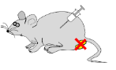</td>
<td></td>
</tr>
<tr class="even">
<td>Résultats</td>
<td></td>
<td></td>
<td></td>
</tr>
</tbody>
</table>

<table>
<tbody>
<tr class="odd">
<td>Hypothèse :</td>
<td>Les testicules permettent l’apparition des caractères sexuels
secondaires.</td>
</tr>
<tr class="even">
<td><strong>Protocole </strong><em>(comparer le test et le témoin, quel
paramètre change)</em> :</td>
<td><p><strong>Test 1 :</strong> souris (lot 1)</p>
<p><strong>Test 2 :</strong> Souris castrées (lot 2)</p>
<p>Les souris du test 1 ont donc des testicules et pas celles du test
2.</p></td>
</tr>
<tr class="odd">
<td>Résultats attendus</td>
<td>Les souris castrées (lot 2) ne devraient pas avoir de caractères
sexuels secondaires alors que les souris témoins (lot 1) devraient en
avoir</td>
</tr>
<tr class="even">
<td>Comparaison des résultats :</td>
<td>Les souris castrées (lot 2) n’ont pas de caractères sexuels
secondaires alors que les souris témoins (lot 1) en ont.</td>
</tr>
<tr class="odd">
<td>Interprétation :</td>
<td>L’hypothèse est validée, les testicules permettent l’apparition des
caractères sexuels secondaires.</td>
</tr>
</tbody>
</table>

<table>
<tbody>
<tr class="odd">
<td>Hypothèse :</td>
<td>La testostérone produite par les testicules permet l’apparition des
caractères sexuels secondaires.</td>
</tr>
<tr class="even">
<td><strong>Protocole </strong><em>(comparer les 2 tests quel paramètre
change)</em> :</td>
<td><p><strong>Test 1 </strong>: Souris castrées (lot 2)</p>
<p><strong>Test 2 </strong>: Souris castrées avec injection de
testostérone (lot 3)</p>
<p>Les souris du test 2 reçoivent des injections de testostérones alors
que celles du test 1 n’en ont pas.</p></td>
</tr>
<tr class="odd">
<td>Résultats attendus</td>
<td>Les souris castrées avec une injection de testostérone (lot 3)
devraient avoir une apparition des caractères sexuels secondaires comme
les souris témoins (lot 1).</td>
</tr>
<tr class="even">
<td>Comparaison des résultats :</td>
<td>Les souris castrées avec une injection de testostérone (lot 3) ont
eu l’apparition des caractères sexuels secondaires comme les souris
témoins (lot 1).</td>
</tr>
<tr class="odd">
<td>Interprétation :</td>
<td>L’hypothèse est validée, la testostérone produite par les testicules
permet l’apparition des caractères sexuels secondaires.</td>
</tr>
</tbody>
</table>

Document 2 : expérience n° 2

<table>
<tbody>
<tr class="odd">
<td>Lots</td>
<td>Lot n° 1</td>
<td>Lot n° 2</td>
<td>Lot n° 3</td>
</tr>
<tr class="even">
<td>Protocole</td>
<td><p>Souris mâles</p>
<p>(témoins)</p></td>
<td><p>Souris mâles ayant subi une hypophysectomie</p>
<p>Hypophysectomie : ablation de l’hypophyse</p></td>
<td>Souris mâles ayant subi une hypophysectomie<sup> </sup>avec
injection d’hormones produites par l’hypophyse (LH et FSH)</td>
</tr>
<tr class="odd">
<td>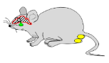</td>
<td></td>
<td></td>
<td></td>
</tr>
</tbody>
</table>

<table>
<tbody>
<tr class="odd">
<td>Hypothèse :</td>
<td>L’hypophyse contrôle le bon fonctionnement des testicules.</td>
</tr>
<tr class="even">
<td><strong>Protocole </strong><em>(comparer les 2 tests quel paramètre
change)</em> :</td>
<td><p><strong>Test 1 :</strong></p>
<p><strong>Test 2 :</strong></p></td>
</tr>
<tr class="odd">
<td>Résultats attendus</td>
<td></td>
</tr>
<tr class="even">
<td>Comparaison des résultats : </td>
<td></td>
</tr>
<tr class="odd">
<td>Interprétation :</td>
<td></td>
</tr>
</tbody>
</table>

<table>
<tbody>
<tr class="odd">
<td>Hypothèse :</td>
<td>La LH et la FSH produites par l’hypophyse contrôlent le bon
fonctionnement des testicules.</td>
</tr>
<tr class="even">
<td><strong>Protocole </strong><em>(comparer les 2 tests quel paramètre
change)</em> :</td>
<td><p><strong>Test 1 :</strong></p>
<p><strong>Test 2 :</strong></p></td>
</tr>
<tr class="odd">
<td>Résultats attendus</td>
<td></td>
</tr>
<tr class="even">
<td>Comparaison des résultats : </td>
<td></td>
</tr>
<tr class="odd">
<td>Interprétation :</td>
<td></td>
</tr>
</tbody>
</table>

Document 2 :

<table>
<tbody>
<tr class="odd">
<td>Lots</td>
<td>Lot n° 1</td>
<td>Lot n° 2</td>
<td>Lot n° 3</td>
</tr>
<tr class="even">
<td>Protocole</td>
<td>Souris mâles</td>
<td><p>Souris mâles ayant subi une hypophysectomie</p>
<p>Hypophysectomie : ablation de l’hypophyse</p></td>
<td>Souris mâles ayant subi une hypophysectomie<sup> </sup>avec
injection d’hormones produites par l’hypophyse (LH et FSH) </td>
</tr>
<tr class="odd">
<td></td>
<td></td>
<td></td>
<td></td>
</tr>
<tr class="even">
<td>Résultats</td>
<td></td>
<td></td>
<td></td>
</tr>
</tbody>
</table>

Document 3 : expérience n° 3

Dans cette expérience, le fonctionnement correct de l’appareil
reproducteur peut être visualisé par l’apparition de caractères
sexuelles secondaires lors de la puberté.

<table>
<tbody>
<tr class="odd">
<td>Lots</td>
<td>Lot n° 1</td>
<td>Lot n° 2</td>
</tr>
<tr class="even">
<td>Protocole</td>
<td><p>Souris mâles</p></td>
<td><p>Souris mâles ayant subi une ablation du pénis</p></td>
</tr>
<tr class="odd">
<td></td>
<td></td>
<td></td>
</tr>
<tr class="even">
<td>Résultats</td>
<td></td>
<td></td>
</tr>
</tbody>
</table>

<table>
<tbody>
<tr class="odd">
<td>Hypothèse :</td>
<td>Le pénis permet l’apparition des caractères sexuels
secondaires.</td>
</tr>
<tr class="even">
<td><strong>Protocole </strong><em>(comparer le test et le témoin, quel
paramètre change)</em> :</td>
<td><p><strong>Test 1 :</strong></p>
<p><strong>Test 2 :</strong></p></td>
</tr>
<tr class="odd">
<td>Résultats attendus</td>
<td></td>
</tr>
<tr class="even">
<td>Comparaison des résultats :</td>
<td></td>
</tr>
<tr class="odd">
<td>Interprétation :</td>
<td></td>
</tr>
</tbody>
</table>

Correction

<table>
<tbody>
<tr class="odd">
<td>Hypothèse :</td>
<td>L’hypophyse contrôle le fonctionnement des testicules.</td>
</tr>
<tr class="even">
<td>Protocole :</td>
<td>Témoin : souris (lot 1)<br />
Test : Souris sans hypophyse (lot 2)</td>
</tr>
<tr class="odd">
<td>Résultats attendus : </td>
<td>Les souris témoin, avec une hypophyse, devraient avoir un
fonctionnement normal des testicules, alors que les souris test, sans
hypophyse, ne devraient pas avoir un fonctionnement normal des
testicules.</td>
</tr>
<tr class="even">
<td>Comparaison des résultats : </td>
<td>Les souris sans hypophyse (lot 2) ne produisent pas de
spermatozoïdes et de testostérone alors que les souris témoins (lot 1)
en produisent.</td>
</tr>
<tr class="odd">
<td>Interprétation :</td>
<td>L’hypothèse est validée, l’hypophyse contrôle le fonctionnement des
testicules.</td>
</tr>
</tbody>
</table>

<table>
<tbody>
<tr class="odd">
<td>Hypothèse :</td>
<td>La LH et la FSH produites par l’hypophyse contrôlent le
fonctionnement des testicules.</td>
</tr>
<tr class="even">
<td>Protocole :</td>
<td>Témoin : souris (lot 1)<br />
Test : Souris sans hypophyse avec injection de LH et FSH (lot 3)</td>
</tr>
<tr class="odd">
<td>Résultats attendus : </td>
<td>Les souris témoin, avec une hypophyse, devraient avoir un
fonctionnement normal des testicules, comme les souris test, sans
hypophyse et avec une injection de LH et FSH.</td>
</tr>
<tr class="even">
<td>Comparaison des résultats : </td>
<td>Les souris sans hypophyse avec une injection de LH et de FSH (lot 3)
produisent des spermatozoïdes et de la testostérone comme les souris
témoins (lot 1).</td>
</tr>
<tr class="odd">
<td>Interprétation :</td>
<td>L’hypothèse est validée, la LH et la FSH contrôlent le
fonctionnement des testicules.</td>
</tr>
</tbody>
</table>

Bilan :

Chez les **êtres humains**, l’hypophyse (dans le cerveau) contrôle les
testicules ou les ovaires grâce à des hormones hypophysaires (LH et
FSH). En réponse, les gonades (ovaires ou testicules) produisent des
hormones sexuelles (testostérone par les testicules et œstrogènes et
progestérones par les ovaires). Ce sont hormones sexuelles qui
permettent l’apparition et le maintien des caractères sexuels
secondaires et la production de cellules reproductrices.


1.  #### 

    #### Le contrôle hormonal du fonctionnement de l’appareil reproducteur de la femme

Consigne 1 : Analyser l’expérience du document 1 pour vérifier
l’hypothèse que l’utérus permet l’apparition des caractères sexuels
secondaires

**Consigne 2 : Analyser les expériences du document 1 pour vérifier
l’hypothèse que les ovaires permettent l’apparition des caractères
sexuels secondaires.**

Consigne 3 : En utilisant les documents 1, 2, 3, répondre au problème
par un schéma fonctionnel.

Compétences travaillées : analyser une expérience et construire un
schéma fonctionnel

***Document 1 : expérience****s sur le fonctionnement de l’appareil
reproducteur***

Dans cette expérience, le fonctionnement correct de l’appareil
reproducteur peut être visualisé par l’apparition de caractères
sexuelles secondaires lors de la puberté.

<table>
<tbody>
<tr class="odd">
<td>Lots</td>
<td>Lot n° 1</td>
<td>Lot n° 2</td>
<td>Lot n° 3</td>
</tr>
<tr class="even">
<td>Protocole</td>
<td><p>Souris femelles</p>
<p>(témoins)</p></td>
<td><p>Souris femelles sans utérus</p></td>
<td><p>Souris femelles castrées</p>
<p>Castration : ablation des testicules ou des ovaires avant la puberté
</p></td>
</tr>
<tr class="odd">
<td></td>
<td></td>
<td></td>
<td></td>
</tr>
<tr class="even">
<td>Résultats</td>
<td></td>
<td></td>
<td></td>
</tr>
</tbody>
</table>

Document 2 : Des hormones ovariennes.

Les ovaires sécrètent des hormones sexuelles qui sont les œstrogènes et
la progestérone.

Ces deux hormones permettent l’ovulation, c’est-à-dire la libération
d’un ovule et l’apparition des caractères sexuels secondaires.

Document 3 : Le contrôle des ovaires.

Des expériences ont permis de conclure que l’hypophyse contrôle le
fonctionnement des ovaires.

L’hypophyse libère des hormones, LH et FSH qui agissent sur les ovaires
et contrôlent leur fonctionnement.

Correction

<table>
<tbody>
<tr class="odd">
<td>Hypothèse :</td>
<td>Les ovaires permettent l’apparition des caractères sexuels
secondaires.</td>
</tr>
<tr class="even">
<td>Protocole (comparer le test et le témoin, quel paramètre
change) :</td>
<td>Témoin : souris (lot 1)<br />
Test : Souris castrées (lot 2)</td>
</tr>
<tr class="odd">
<td>Résultats attendus<br />
<br />
</td>
<td>Les souris castrées (lot 2) ne devraient pas avoir de caractères
sexuels secondaires alors que les souris témoins (lot 1) devraient en
avoir</td>
</tr>
<tr class="even">
<td>Comparaison des résultats : </td>
<td>Les souris castrées (lot 2) n’ont pas de caractères sexuels
secondaires alors que les souris témoins (lot 1) en ont.</td>
</tr>
<tr class="odd">
<td>Interprétation :</td>
<td>L’hypothèse est validée, les ovaires permettent l’apparition des
caractères sexuels secondaires.</td>
</tr>
</tbody>
</table>

<table>
<tbody>
<tr class="odd">
<td>Hypothèse :</td>
<td>Les œstrogènes et la progestérone produites par les ovaires permet
l’apparition des caractères sexuels secondaires.</td>
</tr>
<tr class="even">
<td>Protocole (comparer le test et le témoin, quel paramètre
change) :</td>
<td>Témoin : souris (lot 1)<br />
Test : Souris castrées avec injection d’œstrogènes et de progestérone
(lot 3)</td>
</tr>
<tr class="odd">
<td>Résultats attendus<br />
<br />
</td>
<td>Les souris castrées avec une injection d’œstrogènes et de
progestérone (lot 3) devraient avoir une apparition des caractères
sexuels secondaires comme les souris témoins (lot 1).</td>
</tr>
<tr class="even">
<td>Comparaison des résultats :</td>
<td>Les souris castrées avec une injection d’œstrogènes et de
progestérone (lot 3) ont eu l’apparition des caractères sexuels
secondaires comme les souris témoins (lot 1).</td>
</tr>
<tr class="odd">
<td>Interprétation :</td>
<td>L’hypothèse est validée, les œstrogènes et la progestérone produites
par les ovaires permet l’apparition des caractères sexuels
secondaires.</td>
</tr>
</tbody>
</table>

<table>
<tbody>
<tr class="odd">
<td>Hypothèse :</td>
<td>L’hypophyse contrôle le fonctionnement des ovaires.</td>
</tr>
<tr class="even">
<td>Protocole :</td>
<td>Témoin : souris (lot 1)<br />
Test : Souris sans hypophyse (lot 2)</td>
</tr>
<tr class="odd">
<td>Résultats attendus :</td>
<td>Les souris témoin, avec une hypophyse, devraient avoir un
fonctionnement normal des ovaires, alors que les souris test, sans
hypophyse, ne devraient pas avoir un fonctionnement normal des
ovaires.</td>
</tr>
<tr class="even">
<td>Comparaison des résultats : </td>
<td>Les souris sans hypophyse (lot 2) n’ont pas d’activité normale des
ovaires et ne produisent pas d’œstrogènes et de progestérone alors que
les souris témoins (lot 1) ont une activité normale et en
produisent.</td>
</tr>
<tr class="odd">
<td>Interprétation :</td>
<td>L’hypothèse est validée, l’hypophyse contrôle le fonctionnement des
ovaires.</td>
</tr>
</tbody>
</table>

<table>
<tbody>
<tr class="odd">
<td>Hypothèse :</td>
<td>La LH et la FSH produites par l’hypophyse contrôlent le
fonctionnement des ovaires.</td>
</tr>
<tr class="even">
<td>Protocole :</td>
<td>Témoin : souris (lot 1)<br />
Test : Souris sans hypophyse avec injection de LH et FSH (lot 3)</td>
</tr>
<tr class="odd">
<td>Résultats attendus :</td>
<td>Les souris témoin, avec une hypophyse, devraient avoir un
fonctionnement normal des ovaires, comme les souris test, sans hypophyse
et avec une injection de LH et FSH.</td>
</tr>
<tr class="even">
<td>Comparaison des résultats :</td>
<td>Les souris sans hypophyse avec une injection de LH et de FSH (lot 3)
produisent de la progestérone et des œstrogènes et ont une activité
normale des ovaires comme les souris témoins (lot 1).</td>
</tr>
<tr class="odd">
<td>Interprétation :</td>
<td>L’hypothèse est validée, la LH et la FSH contrôlent le
fonctionnement des ovaires.</td>
</tr>
</tbody>
</table>

#### Le contrôle de l'apparition des caractères sexuels secondaires de la femme

Document 2 : expérience n° 2

<table>
<tbody>
<tr class="odd">
<td>Lots</td>
<td>Lot n° 1</td>
<td>Lot n° 2</td>
<td>Lot n° 3</td>
</tr>
<tr class="even">
<td>Protocole</td>
<td><p>Souris femelles</p>
<p>(témoins)</p></td>
<td><p>Souris femelles castrées</p>
<p>Castration : ablation des testicules ou des ovaires avant la puberté
</p></td>
<td>Souris femelles castrées avec injection d’œstrogènes et de
progestérone produite par les ovaires.</td>
</tr>
<tr class="odd">
<td></td>
<td></td>
<td>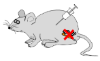</td>
<td></td>
</tr>
<tr class="even">
<td>Résultats</td>
<td></td>
<td></td>
<td></td>
</tr>
</tbody>
</table>

Document 2 : expérience n° 2

<table>
<tbody>
<tr class="odd">
<td>Lots</td>
<td>Lot n° 1</td>
<td>Lot n° 2</td>
<td>Lot n° 3</td>
</tr>
<tr class="even">
<td>Protocole</td>
<td><p>Souris femelles</p>
<p>(témoins)</p></td>
<td><p>Souris femelles ayant subi une hypophysectomie<em> </em></p>
<p>Hypophysectomie : ablation de l’hypophyse</p></td>
<td>Souris femelles ayant subi une hypophysectomie<sup> </sup>avec
injection d’hormones produites par l’hypophyse (LH et FSH)</td>
</tr>
<tr class="odd">
<td>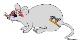</td>
<td></td>
<td></td>
<td></td>
</tr>
<tr class="even">
<td>Résultats</td>
<td></td>
<td></td>
<td></td>
</tr>
</tbody>
</table>

Ces expériences nous permettent de conclure que l’hypophyse contrôle le
fonctionnement des ovaires grâce à la production de LH et FSH.

1.  ### 

<div markdown="1">

1.  #### **Le cycle de l’utérus**

**Consigne 1 : Réaliser les 4 expériences **du doc 1** et compléter le
tableau du document 2. **(1 point)****

****Consigne 2 : **À partir des expériences **1 et 2**, déduisez le rôle
des ovaires dans le cycle de l’utérus. **Justifier votre réponse à
partir des résultats d’expériences. (1,5 points)****

****Consigne 3 : **À partir des expériences 3 et 4, précisez la nature
de la communication entre les ovaires et l’utérus. **Justifier votre
réponse à partir des résultats d’expériences. (1,5 points)****

****Consigne 4 : **En utilisant le document 4 et vos résultats
précédents, proposer une hypothèse permettent d’expliquer les variations
d’épaisseur de la paroi de l’utérus au cours du cycle. (1 point)**

Document 1 : Protocole expérimental.

Lancez le logiciel « Cycles.exe ».

****Expérience 1 :****

Cliquez sur l’icône « Organes en place » (en haut à droite)  
Cliquez sur le bouton « Résultats » (en bas)

-   ****Visionnez le résultat au niveau de la couche superficielle de la
    paroi de l’utérus et notez vos observations dans le tableau
    (expérience 1)****

****Expérience 2 :****

Cliquez sur l’icône « Ablations » (en haut à droite)  
Retirez chaque ovaire et déposez-les dans la cuvette se trouvant à
droite. Pour cela, au niveau de l’ovaire, cliquez sur le bouton gauche
de la souris et tout en maintenant appuyé le bouton, déplacez l’ovaire
dans la cuvette.  
Cliquez sur le bouton « Résultats » (en bas)

-   ****Visionnez le résultat au niveau de la couche superficielle de la
    paroi de l’utérus et notez vos observations dans le tableau
    (expérience 2)****

****Expérience 3 :****

Cliquez sur l’icône « Ablations/greffes » (en haut à droite)  
Retirez chaque ovaire et déposez les dans la cuvette verte du haut
. (Au niveau de
l’ovaire, cliquez sur le bouton gauche de la souris et tout en
maintenant appuyé le bouton, déplacez l’ovaire dans la cuvette).  
Prenez les deux ovaires de la cuvette du bas et tout en maintenant
appuyé le bouton gauche de la souris, déplacez-les au niveau de
l’abdomen (au-dessus de l’utérus) pour pouvoir les greffer.  
Cliquez sur le bouton « Résultats » (en bas)

-   ****Visionnez le résultat au niveau de la couche superficielle de la
    paroi de l’utérus et notez vos observations dans le tableau
    (expérience 3)****

****Expérience 4 :****

Cliquez sur l’icône « Ablations/Injections » (en haut à droite)  
Retirez chaque ovaire et déposez les dans la cuvette verte du haut
. (Au niveau de
l’ovaire, cliquez sur le bouton gauche de la souris et tout en
maintenant appuyé le bouton, déplacez l’ovaire dans la cuvette).  
Prenez la seringue jaune et tout en maintenant appuyé le bouton gauche
de la souris, déplacez-la au niveau d’une cuisse pour injecter les
extraits ovariens.  
Cliquez sur le bouton « Résultats » (en bas)

-   ****Visionnez le résultat au niveau de la couche superficielle de la
    paroi de l’utérus et notez vos observations dans le tableau
    (expérience 4) ****

Document 2 : Tableau des résultats des expériences

<table>
<tbody>
<tr class="odd">
<td></td>
<td>Description de l’expérience</td>
<td>Résultats observés au niveau de la couche superficielle de la paroi
de l’utérus.</td>
</tr>
<tr class="even">
<td>Expérience 1<br />
(expérience témoin)</td>
<td>Guenon pubère témoin.</td>
<td></td>
</tr>
<tr class="odd">
<td>Expérience 2</td>
<td>Guenon ayant subi une ablation des ovaires</td>
<td></td>
</tr>
<tr class="even">
<td>Expérience 3</td>
<td>Guenon ayant subi une ablation des ovaires.<br />
Puis greffe d’ovaires reliés à l’organisme par des vaisseaux sanguins.
Les communications nerveuses ne sont pas rétablies.</td>
<td></td>
</tr>
<tr class="odd">
<td>Expérience 4</td>
<td>Guenon ayant subi une ablation des ovaires. Puis injection
d’extraits ovariens dans le sang (ces extraits ovariens contiennent deux
hormones sexuelles : œstrogènes et progestérone.)</td>
<td></td>
</tr>
</tbody>
</table>

***Document 3 : ****La communication entre les organes.***

Nos organes communiquent entre-eux. Il existe deux types de
communication.

***Communication nerveuse :*** La communication nerveuse se manifeste
par des signaux électriques constituant des messages. Ces messages sont
rapidement conduits dans un seul sens par des chaînes de neurones, les
nerfs.

***Communication hormonale :*** Une hormone est une substance produite
par des cellules. Elle est libérée en faible quantité dans le sang qui
la véhicule. Elle se fixe sur des récepteurs de certains organes dits
organes-cibles, dont elle modifie l’activité.

Document 4 : Le cycle utérin.

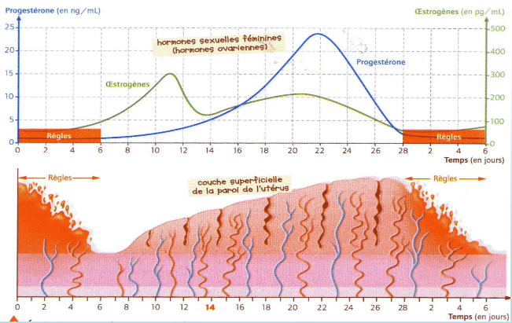Le début du cycle féminin est
défini par le premier jour des règles et dure en moyenne 28 jours.

Les règles sont constituées de lambeaux de muqueuse utérine (=partie
supérieure de la paroi de l’utérus qui se détache) et de sang. Les
règles se manifestent par écoulement de sang de 5 à 25 ml sur une durée
de 3 à 6 jours.

Au cours du cycle, un ovule sera libéré, c’est l’ovulation.

Correction :

Document 2 : Tableau des résultats des expériences

<table>
<tbody>
<tr class="odd">
<td></td>
<td>Description de l’expérience</td>
<td>Résultats observés au niveau de la couche superficielle de la paroi
de l’utérus.</td>
</tr>
<tr class="even">
<td>Expérience 1<br />
(expérience témoin)</td>
<td>Guenon pubère témoin.</td>
<td>La paroi s’épaissit puis elle s’amincit enfin des morceaux se
détachent.</td>
</tr>
<tr class="odd">
<td>Expérience 2</td>
<td>Guenon ayant subi une ablation des ovaires</td>
<td>La paroi ne change pas et reste fine</td>
</tr>
<tr class="even">
<td>Expérience 3</td>
<td>Guenon ayant subi une ablation des ovaires.<br />
Puis greffe d’ovaires sous la peau, reliés à l’organisme par des
vaisseaux sanguins. Les communications nerveuses ne sont pas
rétablies.</td>
<td>La paroi s’épaissit puis elle s’amincit enfin des morceaux se
détachent.</td>
</tr>
<tr class="odd">
<td>Expérience 4</td>
<td><p>Guenon ayant subi une ablation des ovaires.<br />
Puis injection d’extraits ovariens dans le sang (ces extraits
ovariens</p>
<p>contiennent deux hormones sexuelles : œstrogènes et
progestérone.)</p></td>
<td>La paroi s’épaissit, mais elle ne s’amincit pas.</td>
</tr>
</tbody>
</table>

Consigne 2 :

On observe que lorsque les ovaires sont présents la paroi de l’utérus
change d’épaisseur alors que lorsqu’ils sont absents, la paroi de
l’utérus ne change pas d’épaisseur.

On peut donc conclure que les ovaires contrôlent l’évolution de
l’épaisseur de la paroi de l’utérus.

Consigne 3 :

On voit que lorsque les ovaires sont enlevés et greffés ailleurs, la
paroi de l’utérus change d’épaisseur. On sait que lors d’une greffe les
nerfs ne sont pas reliés. Donc la communication ne peut être nerveuse.
On sait que les vaisseaux sanguins sont rétablis donc la communication
peut-être hormonale. De plus on voit que lorsque l’on injecte des
hormones ovariennes l’épaisseur de la paroi utérine augmente.

Consigne 4 : Lorsque la quantité d’hormones sexuelles augmente, plus
précisément de progestérone, l’épaisseur de la muqueuse utérine
augmente. Lorsque la quantité d’hormones sexuelles diminue, l’épaisseur
de la muqueuse utérine diminue.

</div>

Bilan :

Les règles se caractérisent par un écoulement de sang provenant de
l’utérus.

De la puberté à la ménopause, lors de chaque cycle, la muqueuse utérine
s’épaissit puis est éliminée.

Les règles sont dues à l’élimination de cette muqueuse.

L’épaisseur de l’utérus est contrôlée par la quantité d’hormones
produites par les ovaires. Lorsque la quantité d’hormones diminue, la
muqueuse utérine est éliminée et les règles apparaissent.


1.  ### Quelles conditions doivent être réunies pour qu’un bébé naisse ?

1.  #### La grossesse

Consigne 1 : À partir des documents 1 et 2, indiquer les jours du cycle
où un rapport sexuel entraîne une plus grande probabilité de grossesse,
en justifiant votre réponse.

Consigne 2 : Relever des arguments expliquant que tout rapport non
protégé peut être à l’origine d’une fécondation.

Consigne 3 : Résumer, en quelques lignes, comment se forme une
cellule-œuf et son devenir dans les neuf mois qui suivent en indiquant
où se passent les différents événements.

Document 1 : Le cycle féminin théorique.

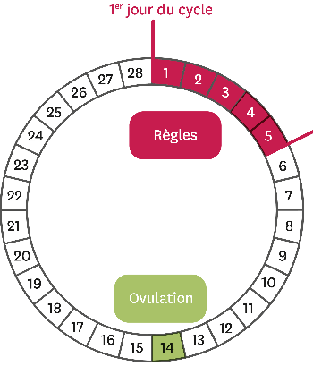Ce cycle dure en moyenne 28 jours.
D’une femme à une autre et d’un cycle à un autre, le jour de l’ovulation
n’est pas forcément identique. Il peut varier pour de nombreuses
raisons.

***Document ****2**** : La durée de vie moyenne des cellules
reproductrices da ns l’appareil génital féminin.***

|                         |       |               |
|-------------------------|-------|---------------|
|                         | Ovule | Spermatozoïde |
| Durée de vie (en jours) | 1     | 3 à 4         |

Document 3 : De la fécondation
à l’implantation de l’embryon chez l’être humain.

Document 4 : De la fécondation à
l’embryon

La fécondation est l’entrée d’un spermatozoïde dans l’ovule, cet
événement forme une cellule-œuf. Cette cellule va ensuite se diviser à
de nombreuses reprises ce qui forme l’embryon. Pendant les divisions,
l’embryon se déplace dans la trompe vers l’utérus.


Document 5 : La nidation

Au bout de 6 jours, l’embryon est dans l’utérus, il va se fixer sur la
muqueuse utérine qui est développée à ce moment. Les règles
s’interrompent pendant 9 mois.

Document 6 : Le développement de l’embryon puis du fœtus.

<table>
<tbody>
<tr class="odd">
<td><p>1<sup>er</sup> mois de grossesse</p>
<p>Embryon</p></td>
<td><p>A 2 semaines : ébauche de la tête, du cœur, du cerveau et de la
colonne vertébrale</p>
<p>A 4 semaines ; premiers battements cardiaques, ébauche des poumons,
de l’intestin, des bras et des jambes</p></td>
<td>0,5 cm</td>
</tr>
<tr class="even">
<td><p>2<sup>e</sup> mois</p>
<p>Embryon</p></td>
<td><p>A 8 semaines : croissance du cerveau, ébauche des yeux, formation
du visage et du sexe</p></td>
<td>3 cm – 5 g</td>
</tr>
<tr class="odd">
<td><p>3<sup>e</sup> mois</p>
<p>Fœtus</p></td>
<td><p>A 12 semaines :</p>
<p>tous les organes sont en place, mais ne fonctionne pas encore, on
parle maintenant de fœtus et non plus d’embryon</p></td>
<td>7 cm – 30 g</td>
</tr>
<tr class="even">
<td><p>4<sup>e</sup> mois</p>
<p>Fœtus</p></td>
<td><p>Croissance du squelette</p>
<p>on peut identifier le sexe à l’échographie</p></td>
<td>18 cm – 200 g</td>
</tr>
<tr class="odd">
<td><p>5<sup>e</sup> mois</p>
<p>Fœtus</p></td>
<td>Développement des sens (ouïe et goût)</td>
<td>28 cm – 400 g</td>
</tr>
<tr class="even">
<td><p>6<sup>e</sup> mois</p>
<p>Fœtus</p></td>
<td>Développement musculaire, durcissement des os, ouverture des
yeux</td>
<td>34 cm – 700 g</td>
</tr>
<tr class="odd">
<td><p>7<sup>e</sup> mois</p>
<p>Fœtus</p></td>
<td>Développement du système immunitaire, maturation du système
respiratoire</td>
<td>39 cm – 1 400 g</td>
</tr>
<tr class="even">
<td><p>8<sup>e</sup> mois</p>
<p>Fœtus</p></td>
<td>Le fœtus continue sa croissance et se retourne.</td>
<td>44 cm – 2 100 g</td>
</tr>
<tr class="odd">
<td><p>9<sup>e</sup> mois</p>
<p>Fœtus</p></td>
<td><p>Les organes et les systèmes vitaux sont fonctionnels.</p>
<p>Des contractions de l’utérus permettront au bébé de sortir.</p></td>
<td>50 cm – 3 200 g</td>
</tr>
</tbody>
</table>

À chaque cycle, un ovule est
libéré dans une des trompes, c’est l’*ovulation*. Cet ovule survit de 24
à 48 h.

Lors d’un rapport sexuel, des
millions de spermatozoïdes sont déposés dans le vagin de la femme. Ces
spermatozoïdes survivront 72 h environ.

Cependant, seule une centaine de spermatozoïdes arrivent à traverser le
col de l’utérus (situé entre le vagin et la cavité de l’utérus). Ils
remontent dans l’utérus et se dirigent vers les deux trompes.

Lorsque le rapport sexuel a lieu quelques jours avant ou après
l’ovulation, un spermatozoïde peut s’unir avec l’ovule : c’est la
*fécondation*.


**Une fois par cycle de 28 jours, un ovule est libéré par les ovaires,
c’est l’*****ovulation*****.**

Lors d’un rapport sexuel, des millions de spermatozoïdes peuvent être
libérés dans le vagin.

**Lorsque le rapport sexuel a lieu quelques jours avant ou après
l’ovulation, un spermatozoïde peut s’unir avec l’ovule : c’est la
*****fécondation*****.**

Seul un spermatozoïde pourra
pénétrer dans l’ovule (= ovocyte) : c’est la fécondation. Les deux
noyaux des gamètes (= cellules reproductrices : spermatozoïde et ovule)
fusionnent pour former une nouvelle cellule : la cellule-œuf (photo 1).

La cellule-œuf se divise ensuite en 2 cellules (photo 2), puis 4
cellules (photo 3) et ainsi de suite, pour former un embryon (photos 4,
5 et 6).


L’embryon se déplace vers l’utérus (migration) et se fixe dans
l’endomètre (= muqueuse utérine), c’est l’implantation (= nidation).

Une fois par cycle de 28 jours, un ovule est libéré par les ovaires,
c’est l’*ovulation*.

Lors d’un rapport sexuel, des millions de spermatozoïdes peuvent être
libérés dans le vagin.

Lorsque le rapport sexuel a lieu quelques jours avant ou après
l’ovulation, un spermatozoïde peut s’unir avec l’ovule : c’est la
*fécondation*.

**Cette union permet la formation de la *****cellule-œuf*****. Cette
cellule-œuf se divise de nombreuses fois pour former un
*****embryon***** de plusieurs cellules.**

**Pour que la grossesse se déroule correctement, l’embryon doit se fixer
dans la muqueuse de l’utérus, c’est l’*****implantation
(=nidation)*****.**

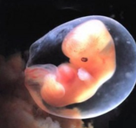Embryon à 7 semaines. Le cœur bat
dès le 21e jour et les bras et les jambes se développent.

Fœtus de 4 mois. L’embryon à
3 mois devient un fœtus. Tous les organes du futur individu sont
présents.

Bilan :

**Lorsque le rapport sexuel a lieu quelques jours avant ou après
l’ovulation, un spermatozoïde peut s’unir avec l’ovule : c’est la
*****fécondation*****.**

Cette union permet la formation de la *cellule-œuf*. Cette cellule-œuf
se divise de nombreuses fois pour former un *embryon*.

**L’embryon doit se fixer sur la muqueuse de l’utérus, c’est
l’*****implantation (=nidation)*****.**

L’embryon continue alors de se développer. Après 3 mois, tous les
organes du futur individu se forment, l’embryon devient alors un
*fœtus*. Après 9 mois de grossesse, le bébé est prêt à naître.

1.  ### Comment le fœtus se nourrit-il ?

```{=html}
<!-- -->
```
1.  ####  La nutrition du fœtus 

Consigne : À partir des informations extraites des différents documents,
construisez un schéma fonctionnel qui montre la nutrition d’un fœtus.

Compétence travaillée : Construire un schéma fonctionnel

Document 1 : Définition de la nutrition.

Pour survivre ou grandir, les
êtres vivants doivent produire de l’énergie et leur propre matière
organique.

Pour cela, les animaux prélèvent dans leur environnement de la matière
minérale (eau, sels minéraux et dioxygène) et de la matière organique
(les nutriments).

La production d’énergie et de matière organique est l’origine de déchets
(dioxyde de carbone et urée) qui sont éliminés dans l’environnement.

Document 2 : L’environnement du fœtus

Le fœtus se développe dans une poche : la cavité amniotique, contenant
un liquide protecteur : le liquide amniotique.

Le placenta est un organe fixé à la paroi de l’utérus. Cet organe assure
une connexion par des vaisseaux sanguins (présents dans le cordon
ombilical) entre la mère et le fœtus.


Document 3 : La composition du sang circulant dans le placenta

Le sang de la mère circulant vers le fœtus est riche en dioxygène,
nutriments, eau et sels minéraux, il peut contenir également des
microbes et des substances toxiques (par exemple : nicotine).

Le sang sortant du fœtus et allant vers la mère contient les différents
déchets (par exemple : dioxyde de carbone et de l’urée).

Bilan :

Le placenta est un organe fixé à la paroi de l’utérus. Grâce au
placenta, le fœtus assure sa nutrition :

– il récupère du dioxygène et des nutriments provenant du sang de la
mère ;

– et libère du dioxyde de carbone et certains déchets dans le sang de la
mère.

Pour que la grossesse se déroule bien, il est indispensable que les
échanges sanguins entre la mère et le fœtus, au niveau du placenta, se
fassent correctement.

Certaines substances ou virus peuvent passer dans ces échanges et causer
un développement anormal du fœtus.

Le fœtus est contenu dans une poche remplie de liquide amniotique. Pour
le bon développement du fœtus, la quantité de ce liquide doit être
suffisante.

Le cordon ombilical relie le fœtus au *placenta*.

1.  ### Comment permettre aux couples de maîtriser leur reproduction ?

1.  #### Une méthode de contraception, la pilule

Consigne : À partir des différents documents, expliquer l’effet
contraceptif de la pilule.

Compétence travaillée : Mettre en relation des informations pour
répondre à un problème

Document 1 : Effet contraceptif

On parle d’effet contraceptif, lorsqu’une technique est utilisée par un
couple pour avoir une sexualité sans reproduction de manière temporaire.

Document 2 : le pic de LH

Lors du cycle, la quantité de LH produite par l’hypophyse varie. Autour
du milieu du cycle, la quantité de LH augmente brutalement, c’est le pic
de LH. Ce pic de LH stimule fortement les ovaires, ce qui provoque
l’ovulation.

***Document 3**** :**** Graphiques des taux d’hormones hypophysaires et
sexuelles.***

Lors d’un cycle sans prise de pilules contraceptives et d’un cycle avec
prise de pilules contraceptives


Correction :

Le pic de LH permet l’ovulation.

La prise de pilule empêche le pic de LH et donc l’ovulation.

Sans ovulation, il peut y avoir rapport sexuel sans fécondation et donc
sans grossesse.

La pilule a donc un effet contraceptif.

Bilan :

La contraception désigne des méthodes utilisées pour éviter, de façon
réversible, une grossesse et donc permettre une sexualité sans
reproduction.

Il existe différentes méthodes de contraception. Elle peut être chimique
(pilules…) ou mécanique (préservatifs…).

La contraception peut :

-   Éviter l’ovulation. (Pilules)
-   Éviter la rencontre des cellules reproductrices (pilules,
    préservatif)
-   Éviter la nidation (pilules, stérilet…)


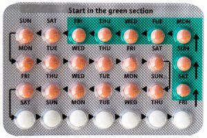
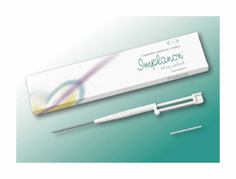
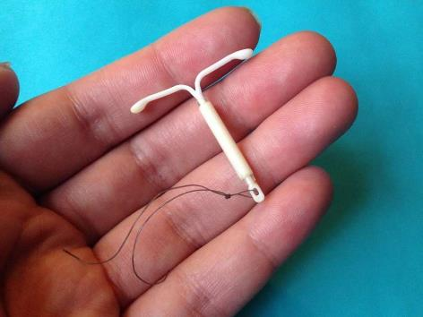


1.  ### Comment expliquer les problèmes d’infertilité des couples et comment la médecine peut-elle les aider à concevoir un enfant ? 

Document 1 (rappel du cours) : du
rapport sexuel à la fécondation pour un couple fertile

À chaque cycle, un ovule est libéré dans une des trompes, c’est
l’*ovulation*. Cet ovule survit de 24 à 48 h.

Lors d’un rapport sexuel, des millions de spermatozoïdes sont déposés
dans le vagin de la femme. Ces spermatozoïdes survivront 72 h environ.

Cependant, seule une centaine de spermatozoïdes arrivent à traverser le
col de l’utérus (situé entre le vagin et la cavité de l’utérus). Ils
remontent dans l’utérus et se dirigent vers les deux trompes.

Lorsque le rapport sexuel a lieu quelques jours avant ou après
l’ovulation, un spermatozoïde peut s’unir avec l’ovule : c’est la
*fécondation*.

1.  ####  L’aide médicalisée à la procréation (AMP)

Consignes : À partir des informations extraites des différents
documents, construisez un tableau dans lequel vous indiquerez pour les
différents couples A, B et C :

– la raison de l’infertilité du couple 

– la technique d’aide médicale à la procréation qui pourrait aider le
couple à avoir un bébé. Choisir la plus adaptée. Justifier votre réponse
dans une colonne ou ligne supplémentaire.

TECHNIQUES DE RECHERCHE DES CAUSES DE L’INFERTILITÉ D’UN COUPLE

<table>
<tbody>
<tr class="odd">
<td><p>Document 1 : la définition et l’analyse d’un
spermocytogramme</p></td>
</tr>
</tbody>
</table>

<table>
<tbody>
<tr class="odd">
<td><p>Document 2 : la définition et l’analyse d’une hystérographie</p>
<p><em><strong>Hystérographie :</strong></em> examen médical permettant
de mettre en évidence des anomalies éventuelles de l’utérus et des
trompes en injectant un liquide opaque dans le vagin lors d’une
radiographie.</p>
<p>Lorsque le liquide opaque circule bien dans le vagin, l’utérus et les
trompes, on considère que le résultat de l’hystérographie est normal. En
revanche, si le liquide ne circule pas dans l’une des deux trompes, on
en déduit que la trompe est bouchée (on parle d’obstruction des
trompes).</p>
<p><em><strong>Obstruction des trompes :</strong></em> altération des
trompes suite à une infection microbienne empêchant la rencontre des
cellules reproductrices.</p></td>
</tr>
</tbody>
</table>

Document 3 : le dosage d’hormone

L’ovulation est déclenchée par un pic de l’hormone LH. Si ce pic n’est
pas présent, il n’y a pas d’ovulation. On peut suivre la quantité
d’hormone LH quotidienne et vérifier les quantités de cette hormone.

RECHERCHE DE LA CAUSE DE L’INFERTILITÉ* *POUR LE COUPLE A

<table>
<tbody>
<tr class="odd">
<td><p>Document 4 : le spermocytogramme réalisé pour le couple A</p>
<p></p></td>
</tr>
</tbody>
</table>

<table>
<tbody>
<tr class="odd">
<td><p>Document 5 : l’hystérographie réalisée pour le couple A</p>
<p></p></td>
</tr>
</tbody>
</table>

Document 6 : Dosage quotidien de LH de madame A.


RECHERCHE DE LA CAUSE DE L’INFERTILITÉ POUR LE COUPLE B

<table>
<tbody>
<tr class="odd">
<td><p>Document 7 : le spermocytogramme réalisé pour le couple B</p>
<p>Le spermocytogramme réalisé pour le couple B a révélé 18 % de formes
typiques et 82 % de formes atypiques.</p></td>
</tr>
</tbody>
</table>

<table>
<tbody>
<tr class="odd">
<td><p>Document 8 : l’hystérographie réalisée pour le couple B</p>
<p></p></td>
</tr>
</tbody>
</table>

Document 9 : Dosage quotidien de LH de madame B.


RECHERCHE DE LA CAUSE DE L’INFERTILITÉ POUR LE COUPLE C

<table>
<tbody>
<tr class="odd">
<td><p>Document 10 : le spermocytogramme réalisé pour le couple C</p>
<p>Le spermocytogramme réalisé pour le couple C a révélé 25 % de formes
typiques et 75 % de formes atypiques.</p></td>
</tr>
</tbody>
</table>

<table>
<tbody>
<tr class="odd">
<td><p>Document 11 : l’hystérographie réalisée pour le couple C</p>
<p></p></td>
</tr>
</tbody>
</table>

Document 12 : Dosage quotidien de LH de madame C.


DIFFÉRENTES TECHNIQUES D’AIDE MÉDICALISÉE À LA PROCRÉATION

Document 13 : la stimulation hormonale (SH) – Coût 500 €

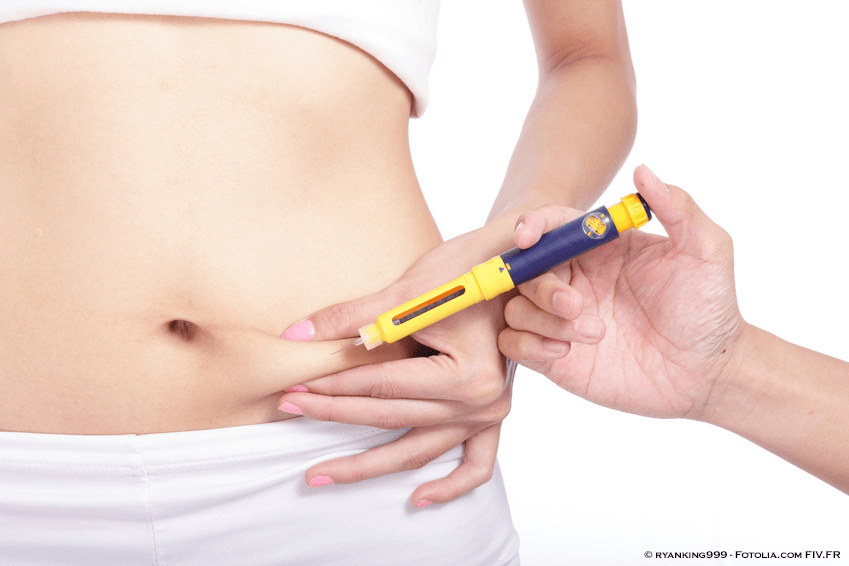

Liste des étapes de la stimulation ovarienne :

1.  **Hyperstimulation ovarienne :** une injection d’hormone permettant
    > de stimuler les ovaires afin de déclencher une ovulation.

Document 14 : l’insémination artificielle (IA) – Coût 1 000 €

Liste des étapes de l’insémination artificielle :

1.   style="width:10.649cm;height:7.027cm" />**Hyperstimulation
    > ovarienne :** une injection d’hormone permet de stimuler les
    > ovaires afin de déclencher une ovulation.

2.  **Recueil et préparation du sperme :** le sperme du conjoint est
    > récupéré.

    > **Dépôt des spermatozoïdes : **les spermatozoïdes sont déposés
    > dans l’utérus.

Document 15 : la fécondation in vitro (FIV) – Coût 4 100 €

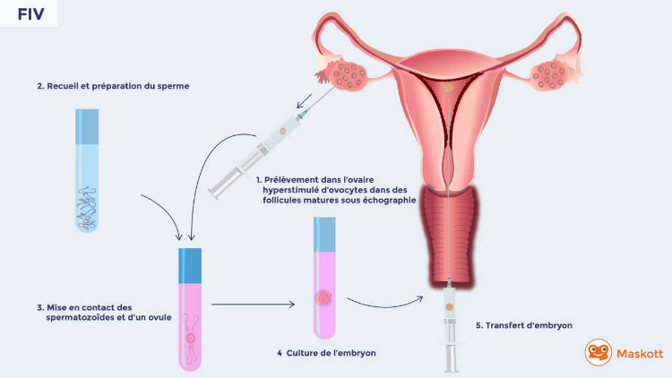Liste des étapes de la
fécondation in vitro :

-   **Prélèvement d’ovules dans l’ovaire hyperstimulé**.

-   Recueil et préparation du sperme.

-   Mise en contact des spermatozoïdes et d’un ovule.

-   Culture de l’embryon.

-   Transfert de l’embryon dans l’utérus.

<table>
<tbody>
<tr class="odd">
<td><p>Document 16 : la fécondation in vitro avec micro-injection de
spermatozoïde (FIV ICSI)) – Coût 4300€ </p>
<p></p>
<p>Liste des étapes de la fécondation in vitro :</p>
<p>Fécondation in vitro avec micro-injection de spermatozoïde</p>
<p></p></td>
</tr>
</tbody>
</table>

Correction

|         |                                                                              |                       |                                                                                   |
|---------|------------------------------------------------------------------------------|-----------------------|-----------------------------------------------------------------------------------|
| Couples | Raisons infertilité                                                          | PMA                   | Justification                                                                     |
| A       | Quantité de spermatozoïdes normaux trop faibles donc ils ne se déplacent pas | FIV ICSI              | Cela permet d’injecter le spermatozoïde dans l’ovule sans qu’il ait à se déplacer |
| B       | Trompe bouchée, le liquide ne va pas jusqu’à la trompe                       | FIV                   | Cela permettra la rencontre des spermatozoïdes et de l’ovule hors du corps        |
| C       | Faible de quantité d’hormone LH donc pas d’ovulation                         | Stimulation hormonale | Pour avoir assez de LH pour avoir une ovulation                                   |

Bilan :

Lorsqu’un couple a des difficultés pour faire un enfant, on parle
d’infertilité.

Les problèmes d’infertilité peuvent être d’origine masculine (quantité
ou forme anormale de spermatozoïdes…) ou d’origine féminine (problème
d’ovulation, obstruction des trompes…).

L’aide médicalisée à la procréation (AMP) ou procréation médicalement
assistée (PMA) permet d’aider les couples infertiles par différentes
techniques :

-   Stimulation hormonale
-   Insémination artificielle
-   Fécondation in vitro…

1.  ### Comment se protéger des IST ?


1.  #### Se protéger des IST

Consigne : À partir des documents, construire un tableau présentant pour
chaque maladie, le type du microbe, le **sexe** des individus touchés,
les symptômes, les moyens de protections.

Compétence travaillée : Construire un tableau

Document 1 : Les IST

Les IST (Infections Sexuellement Transmissibles) sont des maladies
provoquées par des micro-organismes pathogènes.

Les IST se transmettent lors de rapports sexuels et peuvent toucher les
hommes ou les femmes.

Lorsqu’une personne est atteinte par une de ces maladies, elle peut la
transmettre à son partenaire sexuel. Le micro-organisme sera alors
présent dans le corps des deux individus.

Le préservatif est le seul moyen permettant de se protéger des IST.

Le dépistage est un test médical permettant de savoir si un individu est
atteint d’une IST.

Le dépistage et l’usage de préservatif sont les pratiques permettant
d’éviter la propagation des IST.

Document 2 : Des micro-organismes responsables d’IST

|                                                                                                                                                                        |                                                                                                                                                                                               |                                                                                                                                                                     |
|------------------------------------------------------------------------------------------------------------------------------------------------------------------------|-----------------------------------------------------------------------------------------------------------------------------------------------------------------------------------------------|---------------------------------------------------------------------------------------------------------------------------------------------------------------------|
| 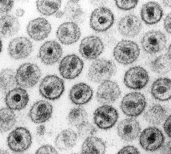**Photographie au microscope de plusieurs VIH (virus de l’immunodéficience humaine).** Le VIH est le virus responsable du SIDA.  | **Photographie au microscope d’un Papillomavirus.** Le Papillomavirus est un virus responsable de 99 % des cancers du col de l’utérus chez les femmes.  | **Photographie au microscope de Chlamydia trachomatis.** Chlamydia trachomatis est la bactérie responsable de la chlamydiose  |

Document 3 : SIDA (6500 nouvelles personnes séropositives au virus par
an)

Le SIDA (syndrome de l’immunodéficience acquise) est un ensemble de
symptômes lié à une destruction des cellules du système immunitaire
(système naturel de défense de l’organisme). Les individus malades du
SIDA peuvent être des hommes ou des femmes. Le SIDA conduit à la mort,
car l’individu avec un système immunitaire très affaibli ne pourra se
défendre contre les maladies (même des maladies bénignes). Il n’existe
aucun traitement permettant aux individus infectés de guérir.

Document 4 : Cancer du col de l’utérus (3000 cas de cancer de l’utérus
par an)

Le cancer du col de l’utérus est le 2e cancer le plus fréquent chez les
femmes. Il touche les femmes relativement jeunes. Le cancer du col de
l’utérus est la 1re cause de mortalité par cancer chez la femme dans de
nombreux pays du tiers monde contre 4 à 6 % des cancers féminins en
Amérique du Nord et Europe. L’amélioration des traitements médicaux
anticancéreux a permis une diminution de la mortalité, notamment dans
les pays riches.

Un vaccin existe. Il peut être administré par les médecins aux jeunes
filles et permet de se protéger du cancer du col de l’utérus.

Document 5 : Chlamydiose (77 000 nouveaux cas par an en France)

Cette infection est la plus courante des IST en Europe. Elle touche
principalement les jeunes. Elle peut ne causer aucun symptôme visible
dans la majorité des cas. Mais les complications peuvent être
importantes chez les femmes.

Les symptômes chez les femmes sont :

1.  de la fièvre et des douleurs au bas-ventre.

2.  Si la maladie n’est pas traitée, des risques d’infertilité.

Chez les hommes, les symptômes sont :

1.  Des sensations de brûlure en urinant

Une prise d’antibiotiques permet de guérir si le traitement est pris
suffisamment tôt.

Correction de l’activité

<table>
<tbody>
<tr class="odd">
<td></td>
<td>Type de microbe</td>
<td>Sexe des individus</td>
<td>Symptômes</td>
<td>Moyens de protection</td>
</tr>
<tr class="even">
<td>SIDA</td>
<td>Virus</td>
<td>H et F</td>
<td>Destruction des cellules immunitaires</td>
<td>Préservatif et dépistage</td>
</tr>
<tr class="odd">
<td>Cancer du col de l’utérus</td>
<td>Virus</td>
<td>F</td>
<td>Mort</td>
<td>Préservatif et dépistage et vaccin et traitements médicaux</td>
</tr>
<tr class="even">
<td>Chlamydiose</td>
<td>Bactérie</td>
<td>H et F</td>
<td><p>Stérilité pour la femme</p>
<p>Hommes : Brûlures en urinant</p></td>
<td>Préservatif et dépistage et antibiotique</td>
</tr>
</tbody>
</table>

Bilan :

Les IST (Infections Sexuellement Transmissibles) sont des maladies
parfois graves provoquées par des micro-organismes pathogènes (virus,
bactéries…)

Les IST se transmettent lors de rapports sexuels et peuvent toucher les
hommes ou les femmes.

Le dépistage et l’usage de préservatif sont les pratiques permettant
d’éviter la propagation des IST.

La sexualité fait partie du développement normal de tout être humain.
C’est une activité intime qui engage la responsabilité des partenaires.
Les premiers désirs sexuels apparaissent à la puberté. Ils sont dirigés
vers un individu d’un autre sexe (hétérosexualité) et/ou du même sexe
(homosexualité). La sexualité ne se résume pas à la pénétration mais
englobe l’ensemble de la relation au corps de l’autre. Site
d’information : [www.onsexprime.fr](http://www.onsexprime.fr/)

L’orientation sexuelle, qui est attirance affective et sexuelle envers
une personne de même sexe, de sexe opposé ou les deux, relève de
l’intimité des personnes. Les discriminations contre les personnes, en
raison de leur orientation sexuelle (par exemple homophobie) sont punies
par la loi.


consentement cup of tea


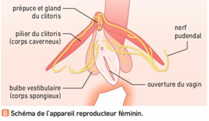

<table>
<tbody>
<tr class="odd">
<td>La puberté et la reproduction chez l’Homme</td>
<td>Les transformation du corps à la puberté</td>
<td>Puberté</td>
<td>2p, 5p</td>
<td>Lecture de documents et création d’un tableau</td>
<td>1 heure</td>
</tr>
<tr class="even">
<td>Le fonctionnement de l’appareil reproducteur masculin</td>
<td><p>organes reproducteurs, production de </p>
<p>cellules reproductrices</p></td>
<td>3e, 5p</td>
<td>Documents + microscope</td>
<td>2 heures</td>
<td></td>
</tr>
<tr class="odd">
<td>Le fonctionnement de l’appareil reproducteur féminin</td>
<td><p>organes reproducteurs, production de </p>
<p>cellules reproductrices</p></td>
<td>3e, 5p</td>
<td>Documents + microscope + logiciel reproduction</td>
<td>2 heures</td>
<td></td>
</tr>
<tr class="even">
<td><p>Les contrôles hormonaux qui contrôle le </p>
<p>fonctionnement des appareils reproducteur</p></td>
<td>Contrôles hormonaux.</td>
<td>1e, 2e, 3e, 1g</td>
<td>Document (simulant une DI) + utilisation de logiciel</td>
<td>2 heures</td>
<td></td>
</tr>
<tr class="odd">
<td>IST et contraception</td>
<td><p>Expliquer sur quoi reposent les </p>
<p>comportements responsables dans le domaine de la sexualité :,
contraception, </p>
<p>prévention des infections sexuellement </p>
<p>transmissibles, choix raisonné de la </p>
<p>procréation</p></td>
<td>1e, 2p, 4p, 5p</td>
<td>Document + mise en situation avec résolution de problème +
utilisation de logiciel Reproduction</td>
<td>2 heures</td>
<td></td>
</tr>
</tbody>
</table>

