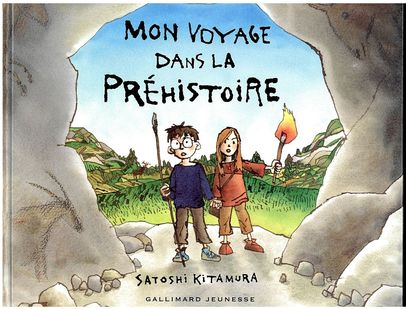
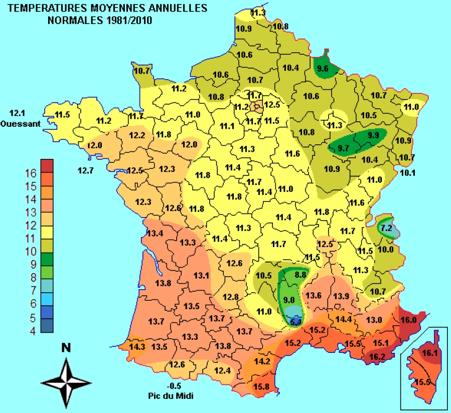
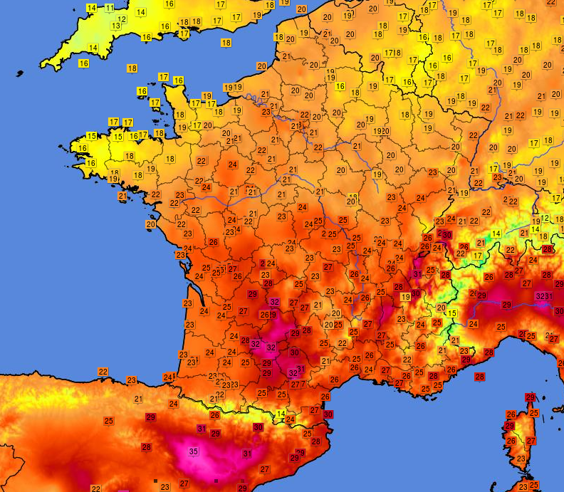
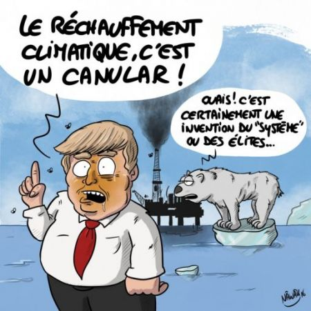

# Séquence : Événements dans l’histoire de la Terre

!!! note-prof
    si besoin d'infos

### Document d’appel :

!!! question "Problématique"
    Comment était la Terre avant que les êtres humains y soient présents ?
    

## Séance 1 : L’histoire de la Terre

!!! question problématique
     Quels sont les grands événements ayant eu lieu dans l’histoire de la Terre ?

[Activité L'histoire de la Terre](../HistoireTerre)

??? abstract "Bilan"
    La Terre s’est formée il y a 4,6 milliards d’années (Ga). Les premières traces d’êtres vivants sont datées de 3,5 Ga.

    Des évènements géologiques et biologiques ont affecté la surface de la Terre en modifiant les milieux et les conditions de vie.

    L’analyse des fossiles contenus dans les roches montre que de nombreuses espèces sont apparues et ont disparu au cours de l’histoire de la Terre.

    L’espèce humaine (Homo sapiens) est apparue très récemment il y a environ **200 000 ans**.

    Définition fossile : Reste ou trace d’êtres vivants (animaux, végétaux, bactéries**…**) conservés dans la roche.

## Séance 2 : le climat dans l'histoire de la Terre 

### Rappel
Différence météo et climat

 

 

**Document 1 : Carte du climat** **en France présentant les températures moyennes sur une période de 30 ans (1981 – 2010)**
{:style="width:400px; "}

 

**Document 2 : Carte météo présentant le relevé de températures du jeudi 24 août 2023 à 23 h**
{:style="width:400px;" }

!!! abstract "Définitions"
    En météorologie :
    On décrit les paramètres météo (températures, précipitations, vents…) qu’il fait à un instant donné.  
    On prévoit comment les paramètres météo évolueront dans les prochains
    jours.

    En climatologie: 
    On définit les climats avec la moyenne des paramètres météo mesurés sur
    des périodes de 30 ans.  
    On décrit l’évolution des climats dans le passé.  
    On prévoit l’évolution des climats dans le futur.

!!! question Problématique 
    Comment montrer que le climat a changé dans le passé ?

[Activité les changements climatiques passés](../chgtsClimatPasses)

??? abstract "Bilan"
    
    À l’échelle des temps géologiques, le climat change, selon la position de la Terre dans l’espace et son inclinaison.

    Les changements climatiques peuvent être montrés grâce aux fossiles que l’on retrouve ou aux traces laissées par nos ancêtres.

    Ces changements climatiques passés ont provoqué des variations de la répartition des êtres vivants.

## Séance 3 : Le changement climatique actuel

Le phénomène actuel est un consensus scientifique. Les scientifiques ont tous montrés que ce réchauffement existait depuis des dizaines d'années. Pourtant certains doutaient encore il y a quelques années.

!!! question Problématique 
    Quels sont les arguments pour montrer que le réchauffement existe?v

[Activité Changement climatique actuel](../chgtClimatActuel)

??? abstract "Bilan"

    À l’échelle des temps géologiques, le climat change, selon la position de la Terre dans l’espace et son inclinaison.
    Mais depuis la deuxième moitié du 19e siècle, on observe une augmentation plus rapide de la température moyenne à la surface de la Terre que celles constatées durant ces 500 000 dernières années
    De nombreux indices montrent que jamais dans l’histoire du climat, la température n’a augmenté aussi rapidement qu’actuellement. (enregistrement températures, date des vendanges, fonte des glaces...)

