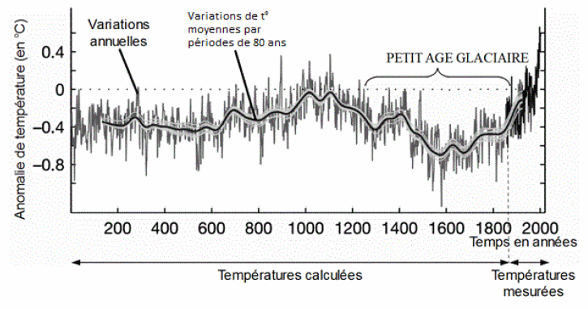

# Activité : Les changements climatiques passés

!!! note "Compétences"
    - argumenter

!!! warning "Consignes"
    Consigne 1 : A partir des documents, donner des arguments montrant que le réchauffement climatique actuel.

!!! bug "Critères de réussite"
    - avoir montré avec le document le changement climatique actuel.
    - expliquer ce l'on observe sur les photos du documents 2. 
    - expliquer le lien avec le réchauffement climatique.
    - expliquer ce l'on observe sur les photos du document 3. 
    - expliquer le lien avec le réchauffement climatique en vous aidant du document 4.

**Document 1 : estimation de l’anomalie de la température moyenne de surface (écart de température moyenne par rapport à la période 1961 – 1990) dans l’hémisphère nord**  

**Document 1 : évolution de glaciers dans le massif du Mont-Blanc et de la mer de glace (1919 à gauche et 2019 à droite).**

!

**Document 3 : évolution de la date des vendanges en France depuis 1974.**

**Document 4 : maturité du vin et date des vendanges.**

Les vignerons choisissent la date des vendanges en fonction de la maturité parfaite du raisin, c’est-à-dire essentiellement quand il atteint la quantité de sucre optimale. Plus il fait chaud et plus le raisin atteint sa maturité tout dans l'année.

!!!note-prof "Correction :"

