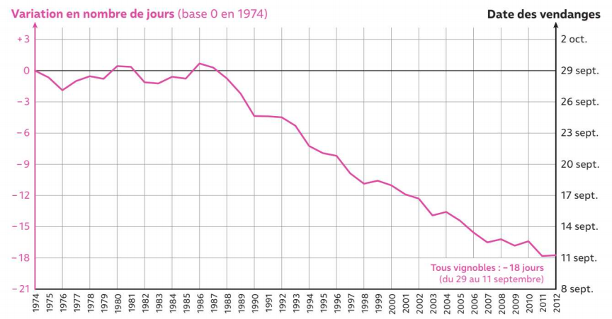

# Activité : Le changement climatique actuel

!!! note Compétences
    - argumenter

!!! warning Consignes
    À partir des documents, donner des arguments montrant le réchauffement climatique actuel.

??? bug Critères de réussite
    - avoir montré avec le document le changement climatique actuel.
    - expliquer ce que l'on observe sur les photos du document 2. 
    - expliquer le lien avec le réchauffement climatique.
    - expliquer ce que l'on observe sur les photos du document 3. 
    - expliquer le lien avec le réchauffement climatique en vous aidant du document 4.

**Document 1 Estimation de l’anomalie de la température moyenne de surface (écart de température moyenne par rapport à la période 1961 – 1990) dans l’hémisphère nord**  

{: style="height:400px;"}

**Document 2 Évolution de glaciers dans le massif de Vignemale.**

**Document 3 Évolution de la date des vendanges en France depuis 1974.**

{: style="height:300px;"}

**Document 4 Maturité du vin et date des vendanges.**

{: style="align:right; padding-right: 20px;" }

Les vignerons choisissent la date des vendanges en fonction de la maturité parfaite du raisin, c’est-à-dire essentiellement quand il atteint la quantité de sucre optimale. Plus il fait chaud et plus le raisin atteint sa maturité tôt dans l'année.

!!!note-prof "Correction :"

