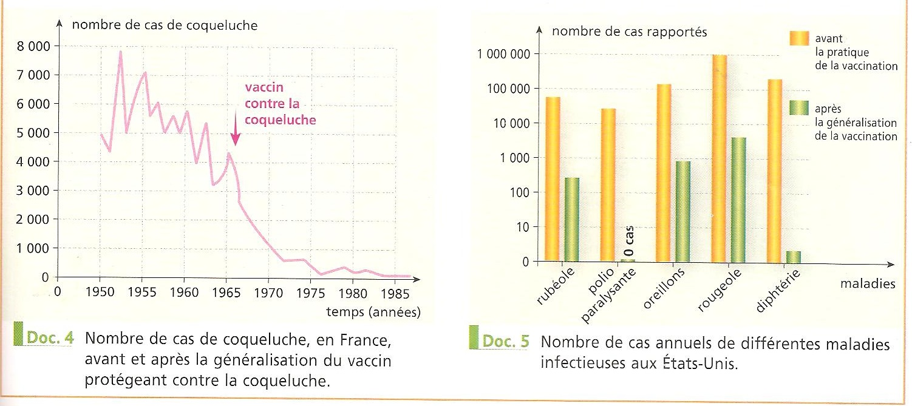

# Séquence : Les anticorps

!!! question "Problématique"
    Comment les anticorps permettent une protection avec les micro-organismes ?

## Séance 1 : Les acteurs du système immunitaire

!!! question "Problématique"
    Comment les lymphocytes B et les anticorps permettent de lutter contre l’infection ?

En février 2014, une épidémie de fièvre hémorragie due au virus Ebola s’est déclenchée dans les forêts de Guinée. Elle s’est propagée en Sierra Leone et au Liberia. Cette fièvre peut atteindre 90 % de mortalité dans les populations qui la contractent. Cependant, une étude menée en 2010 a montré que 15,3 % de la population gabonaise possèdent des anticorps dirigés contre le virus sans jamais avoir eu de fièvre hémorragique. Un médecin d’origine gabonaise envisage de se porter volontaire pour une mission humanitaire en Sierra Leone.

[Activité Action des anticorps](../anticorps)

??? abstract "Bilan"
    lors d’une infection, les lymphocytes B qui ont été activés après la reconnaissance d’un antigène, vont se multiplier. 

    Ces lymphocytes B produisent des anticorps. Ces anticorps reconnaissent de manière spécifique l’antigène (fragment de micro-organisme entraînant une réponse immunitaire) qui a initié leur formation.

    La fixation d’un anticorps sur un antigène forme un complexe anticorps-antigène qui sera détruit par phagocytose.

    Ce sont des réactions immunitaires lentes et spécifiques.

    Un individu est dit séropositif pour un micro-organisme donné s’il possède dans son sang (sérum) das anticorps spécifiques contre ce micro-organisme.

    Définition : 

    Antigène : molécule (libre ou sur une cellule micro-organisme) reconnue par le système immunitaire.

    Anticorps : molécules produites par des lymphocytes B qui se lient à un antigène spécifique.

    

## Séance 2 : La vaccination

!!! question "Problématique"
    Comment expliquer l’intérêt de la vaccination ?

[Activité La vaccination](../vaccin)

??? abstract "Bilan"

    La vaccination consiste à injecter un vaccin, c’est-à-dire une forme atténuée ou bien des parties d’un micro-organisme pathogène pour activer
    la mémoire immunitaire.

    La 1re rencontre avec un antigène contenu ici dans un vaccin déclenche la formation de lymphocyte mémoire qui constituent la mémoire
    immunitaire. Ils permettent une réponse plus forte et plus rapide lors du 2e contact avec l’antigène, le protégeant ainsi de la maladie =     Prévention.

    

    

    À l’échelle de la population, la vaccination permet d’éviter la propagation des pathogènes.

## Séance 3 : Le SIDA et le système immunitaire

{: style="width: 600px;"}
{: style="width: 600px;"}

!!! question "Problématique"
    Quelles sont les conséquences du VIH ?

Paul a eu une relation non protégée lors d’une soirée. Il s’inquiète sur les risques de contamination et pendant 1 mois il se sent bien. Alors il pense ne rien avoir, Paul est rassuré !
 

[Activité Le VIH et le SIDA](../sida)

{: style="width: 600px;"}

La Prep (pre-exposure prophylaxis) s’adresse aux personnes qui n’ont pas le VIH, et consiste à prendre un médicament afin d’éviter de se contaminer. 93%

TPE, traitement post-exposition, dit aussi « traitement d’urgence » qui doit être pris au plus tard dans les 48 heures après un risque de transmission, puis tous les jours pendant un mois.

Tasp (Treatment as Prevention) : sous traitement, la quantité de virus dans l’organisme devient extrêmement faible, on parle de « charge virale indétectable ». Lorsque la charge virale est indétectable et que la personne séropositive continue de prendre son traitement correctement, les études ont démontré que le VIH ne peut plus se transmettre aux partenaires sexuels-les, même lors de rapports sans préservatif.

??? abstract "Bilan"

    Le SIDA est causé par un virus, le VIH.

    Il se transmet par voie sanguine ou sexuelle.

    Le seul moyen de protection lors des rapports sexuels est le préservatif.

    Le VIH infecte les lymphocytes T. Il les détruit donc.

    Après quelques années, le VIH a détruit une partie du système immunitaire, la personne sera immunodéficiente. C’est-à-dire que son corps ne peut pas lutter contre les microbes. Il sera donc malade régulièrement, on parle de maladies opportunistes. Ces maladies entraîneront le décès de la personne.

    Pour savoir si l’on est atteint par le virus seul un test pour détecter ces anticorps anti-VIH est possible trois mois après la possible contamination

