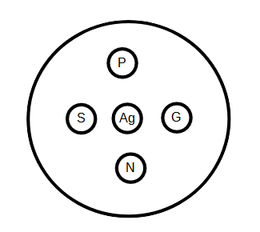

# Activité : Action des anticorps

!!! note "Compétences"

    - Trouver et extraire des informations
    - Utiliser l'outil mathématique 

!!! warning "Consignes"
    1. Suivre le protocole du test d’Ouchterlony permettant de savoir si ce médecin possède des anticorps susceptibles de le protéger face au virus. (Document 6)

    2. Compléter le tableau à l’aide des documents fournis pour comprendre le rôle des anticorps dans la défense de l’organisme contre les agents pathogènes. (2 points)

    3. Expliquer pourquoi les antigènes sont disposés au centre. (0,5 point)

    4. Schématiser la boite obtenue avec les résultats et répondre au problème posé. (1,75 points)

    5. Expliquer la réaction ou son absence pour l’individu séropositif au virus de la grippe (0,75 point)
    
??? bug "Critères de réussite"
    <table>
    <tbody>
    <tr class="odd">
    <td>Compétences évaluées au cours du TP</td>
    <td>TRÈS BONNE MAÎTRISE</td>
    <td>MAITRISE SATISFAISANTE</td>
    <td>MAITRISE FRAGILE</td>
    <td>MAITRISE INSUFFISANTE</td>
    </tr>
    <tr class="even">
    <td>Exploiter des données sous différentes formes</td>
    <td>Tableau correctement rempli sans aide</td>
    <td>3 cases correctement remplies sans aide ou tableau correctement
    rempli avec l’aide</td>
    <td>2 cases correctement remplies sans aide ou 3 cases correctement
    remplies l’aide</td>
    <td>1 case bien remplie avec ou sans aide ou 2 cases correctement
    remplies avec l’aide</td>
    </tr>
    <tr class="odd">
    <td>2</td>
    <td>1,5</td>
    <td>1</td>
    <td>0,5</td>
    <td></td>
    </tr>
    <tr class="even">
    <td>Mettre en œuvre un protocole expérimental et organiser son
    travail</td>
    <td>
Résultats exploitables et consignes suivies.

    
Matériel rangé.

    
Travail en autonomie.
</td>
    <td>
<em>Résultats exploitables</em>.

    
Aide pour suivre les consignes et/ou ranger le matériel.
</td>
    <td>
Résultats non exploitables malgré le suivi des consignes.

    
Matériel rangé.
</td>
    <td>
Résultats non exploitables.

    
Consignes non suivies.
</td>
    </tr>
    <tr class="odd">
    <td>0,5</td>
    <td>0,25</td>
    <td>0,25</td>
    <td>0</td>
    <td></td>
    </tr>
    <tr class="even">
    <td>Communiquer ses résultats</td>
    <td>Schéma légendé avec un titre</td>
    <td>Schéma avec légendes ou titre</td>
    <td>Schéma sans titre ni légende</td>
    <td>Absence de schéma cohérent</td>
    </tr>
    <tr class="odd">
    <td>1</td>
    <td>0,75</td>
    <td>0,5</td>
    <td>0</td>
    <td></td>
    </tr>
    <tr class="even">
    <td>
Interpréter des résultats et tirer des conclusions

    
consigne 4
</td>
    <td>
Réponse au problème

    
Observations avant conclusion
</td>
    <td>
Réponse au problème

    
Observations pas avant conclusion
</td>
    <td>Réponse au problème partielle</td>
    <td>Réponse au problème fausse ou absente</td>
    </tr>
    <tr class="odd">
    <td>0,75</td>
    <td>0,5</td>
    <td>0,25</td>
    <td>0</td>
    <td></td>
    </tr>
    <tr class="even">
    <td>
Interpréter des résultats et tirer des conclusions

    
consigne 5
</td>
    <td>
Réponse au problème

    
Observations avant conclusion
</td>
    <td>
Réponse au problème

    
Observations pas avant conclusion
</td>
    <td>Réponse au problème partielle</td>
    <td>Réponse au problème fausse ou absente</td>
    </tr>
    <tr class="odd">
    <td>0,75</td>
    <td>0,5</td>
    <td>0,25</td>
    <td>0</td>
    <td></td>
    </tr>
    </tbody>
    </table>

En février 2014, une épidémie de fièvre hémorragie due au virus Ebola s’est déclenchée dans les forêts de Guinée. Elle s’est propagée en Sierra Leone et au Liberia. Cette fièvre peut atteindre 90 % de mortalité dans les populations qui la contractent. Cependant, une étude menée en 2010 a montré que 15,3 % de la population gabonaise possèdent des anticorps dirigés contre le virus sans jamais avoir eu de fièvre hémorragique. Un médecin d’origine gabonaise envisage de se porter volontaire pour une mission humanitaire en Sierra Leone.

**Problème à résoudre : On cherche à déterminer si ce médecin possède des anticorps susceptibles de le protéger face au virus.**

**Document 1 Tableau à compléter regroupant les informations issues des documents sur les anticorps**

<table>
<colgroup>
<col style="width: 200px">
<col style="width: 700px">
</colgroup>
<tbody>
<tr class="odd">
<td>
Définition du terme anticorps
</td>
<td></td>
</tr>- 
<tr class="even">
<td>
Où trouve-t-on les anticorps dans notre corps
</td>
<td></td>
</tr>
<tr class="odd">
<td>
Production (quand et comment sont produits les
anticorps ?)
</td>
<td></td>
</tr>
<tr class="even">
<td>
Rôle (mode d’action pour éliminer l’agent pathogène)
</td>
<td></td>
</tr>
</tbody>
</table>

**Document 2 Informations sur les anticorps.**

Les anticorps ont la capacité de se lier à un ou deux antigènes et de les neutraliser. Un antigène correspond à un élément étranger à l’organisme qui entraîne une réponse immunitaire en étant reconnu par des anticorps.

Les anticorps sont des protéines solubles qui se fixent spécifiquement à un antigène entraînant la formation d’un complexe antigène-anticorps insoluble neutralisant l’agent infectieux.

Lorsqu’un individu présente un type d’anticorps dans son sang on dit qu’il est séropositif pour cet anticorps.

**Document 4 Le mode d’action des anticorps**

{: style="width: 600px;"}

**Document 5 Antigène de micro-organisme et récepteur de lymphocyte.**

{: style="width: 600px;"}

Chaque anticorps est spécifique d’un antigène donné : il ne reconnaît et ne peut éliminer que cet antigène. Les anticorps sont produits par les lymphocytes B (cellules présentes dans le sang). Un lymphocyte ne produit des anticorps qu’après un contact avec un antigène.

**Document 6 Protocole pour réaliser un test d’Ouchternoly**

#### Principe du test d’immunodiffusion sur gel :

Les solutions déposées dans des puits creusés dans le gel diffusent de façon homogène dans toutes les directions autour des puits. Deux auréoles de diffusion peuvent donc entrer en contact lorsqu’elles ont suffisamment progressé. Cette zone de contact reste invisible s’il n’y a pas de réaction entre les deux solutions. En revanche, elle se traduit par un arc de précipitation visible à l’œil nu lorsque les deux solutions réagissent, c’est-à-dire si elles forment un complexe non soluble dans le gel.

#### Matériel :

- petite boite de Pétri gélosée (6 cm de diamètre)
- emporte-pièce
- cure-dent ou aiguille lancéolée
- série de compte-gouttes propres
- feutre
- feuille de papier noir

- 5 tubes contenant les solutions :

    - \(Ag) solution d’antigènes du virus ;
    - \(P\) sérum d’un individu séropositif à l’antigène d’Ebola ;
    - \(N\) sérum d’un individu séronégatif à l’antigène d’Ebola ;
    - \(S\) sérum du médecin à tester ;
    - \(G\) sérum d’un individu séropositif à l’antigène de la grippe ; (utile pour la consigne 5 uniquement)

les produits utilisés (soude notamment) sont des produits de substitution permettant de modéliser les réactions entre sérum et anticorps, afin d’éviter les risques liés à la manipulation de produits biologiques dangereux. Cependant, un risque chimique subsiste puisque la soude provoque des brûlures et lésions oculaires.

{: style="width: 100%;"}

#### Réalisation :

1. Préparation de la boîte :

    - À l’aide de l’emporte-pièce et du gabarit de perçage, creuser, dans la gélose de la boîte de Pétri un puits central, puis 4 autres puits, uniformément répartis et disposés à égale distance du puits central.
    - Utiliser le cure-dent (ou l’aiguille lancéolée) pour éliminer les disques de gélose si nécessaire.

2. Repérage :

    - Marquer sous la boîte de Pétri la disposition des produits à déposer dans les puits.
    - Marquer les compte-gouttes qui seront utilisés pour chaque produit

3. Remplissage des puits :

    - Prélever un produit dans un tube avec le compte-goutte propre correspondant
    - Disposer le produit dans le puits approprié pour le remplir sans débordement ni bulles, et sans endommager le gel d’agar.
    - Renouveler l’opération pour chaque produit.

4. Lecture des résultats :

    - Laisser diffuser les produits pendant 15 minutes.
    - Observer les résultats fournis sur fond noir.

La réaction antigène-anticorps s’obtient de façon optimale lorsque la rencontre a lieu à l’intérieur de la gélose, entre les puits.

!!! note-prof "matériel"

    Matériel à préparer
        - GEl 1,5g d'a  gar-agar pour 100ml
        - solution de soude 0,5mol/L : 0,4g pour 10ml
        - solution de sulfate de zinc à 0,5mol/l : 0,8g pour 10ml
    Tubes:
        - P et S : soude
        - G et N : eau
        - Ag: zinc

??? note-prof "correction"

    **Consigne 2 : Compléter le tableau à l’aide des documents fournis pour comprendre le rôle des anticorps dans la défense de l’organisme contre les agents pathogènes.**

    Document 1 : Tableau à compléter regroupant les informations issues des documents sur les anticorps :

    |   |      |
    |-------------------------------------|------------------------------------------------------------------------------------------------------|
    | Définition du terme anticorps | Protéine soluble pouvant se fixer à un antigène |
    | Où trouve-t-on les anticorps dans notre corps               | Dans le sérum |
    | Production (quand et comment sont produits les anticorps ?) | Les anticorps sont produits par les lymphocytes B qui ont été en contact avec un antigène. |
    | Rôle (mode d’action pour éliminer l’agent pathogène) | Les anticorps vont se fixer aux antigènes et former une agglutination de bactéries ou de virus qui vont ensuite être phagocytées plus facilement. |

    Consigne 3 : Expliquer pourquoi les antigènes sont disposés au centre.

    Les antigènes sont disposés au centre pour se diffuser uniformément dans toutes les directions vers les puits contenant les solutions à tester.

    Consigne 4 : Schématiser la boite obtenue avec les résultats et répondre au problème posé.

    Représentation du résultat du test d’Ouchterlony

    Légendes :

    - (Ag) solution d’antigènes\* du virus ;
    - (P) sérum\* d’un individu séropositif à l’antigène d’Ebola ;
    - (N) sérum\* d’un individu séronégatif à l’antigène d’Ebola ;
    - (S) sérum\* du médecin à tester ;
    - (G) sérum\* d’un individu séropositif à l’antigène de la grippe ;

    (utile pour la consigne 5 uniquement)

    On observe un arc de précipitation entre les antigènes et les solutions P et S. La solution P contient le sérum d’un individu séropositif à Ebola, c’est-à-dire un sérum contenant des anticorps contre le virus Ebola. Dans le cas de la solution N contenant le sérum d’individu séronégatif à Ebola qui n’a pas ces anticorps, il n’y a pas de réaction, ce qui est normal. La solution S, contenant le sérum du médecin, a donc réagi avec les antigènes du virus Ebola, comme pour la solution P, le médecin est donc séropositif au virus Ebola, il a des anticorps contre ce virus.

    Consigne 5 : Expliquer la réaction ou son absence pour l’individu séropositif au virus de la grippe.

    On voit dans le cas de l’individu séropositif à la grippe, qu’il n’y a pas de réaction. On sait que les anticorps sont spécifiques c’est-à-dire qu’ils ne peuvent se fixer qu’à un seul type d’antigène. Donc les anticorps qu’il possède sont des anticorps qui reconnaissent les antigènes du virus de la grippe, mais pas ceux du virus Ebola, ce qui explique l’absence de réaction.

    
    **Document 3 : Expérience historique de localisation des anticorps.**
    
    

