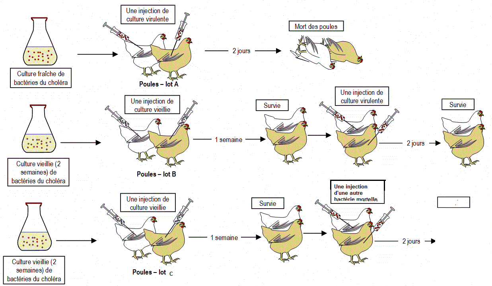

# Activité : Exercice

!!! note "Compétences"

    - Trouver et extraire des informations 

!!! warning "Consignes"
    1. En utilisant le document et les connaissances vues en classe, expliquer comment les poules du groupe B ont survécu alors qu'elles ont reçu des injections d'une jeune culture de bactéries du choléra comme celle du groupe A.
    2. Quelle méthode médicale a été découverte par Pasteur dans son expérience ? 
    3. Expliquer ce que deviendront les poules du groupe C.

**Document 1 : Pasteur**
En 1880, le scientifique français Louis Pasteur (1822-1895) réalise des expériences sur des poules en leu injectant des bactéries responsables du choléra.

**Document 2 : Extrait des "carnets d'expériences" de Pasteur (1885)**

Voici vingt poules qui n'ont jamais subi les atteintes de la maladie; je les inocule avec le microbe très virulent. Le lendemain elles sont toutes couchées, très boiteuses; en 48 heures les vingts poules ont péri. Voici d'autre part, cingt poules préalablement vaccinées au maximum (c'est à dire des poules ayant reçu trois ou quatre fois des injections de microbes très atténués); elles sont inoculées à la même heures que les précédentes, à la même place, par le même microbe, enmployé en même quantité. Le lendemain, toutes sont vives, alertes, mangent et gloussent.

**Document 3 : schéma de de l'expérience de Pasteur**

