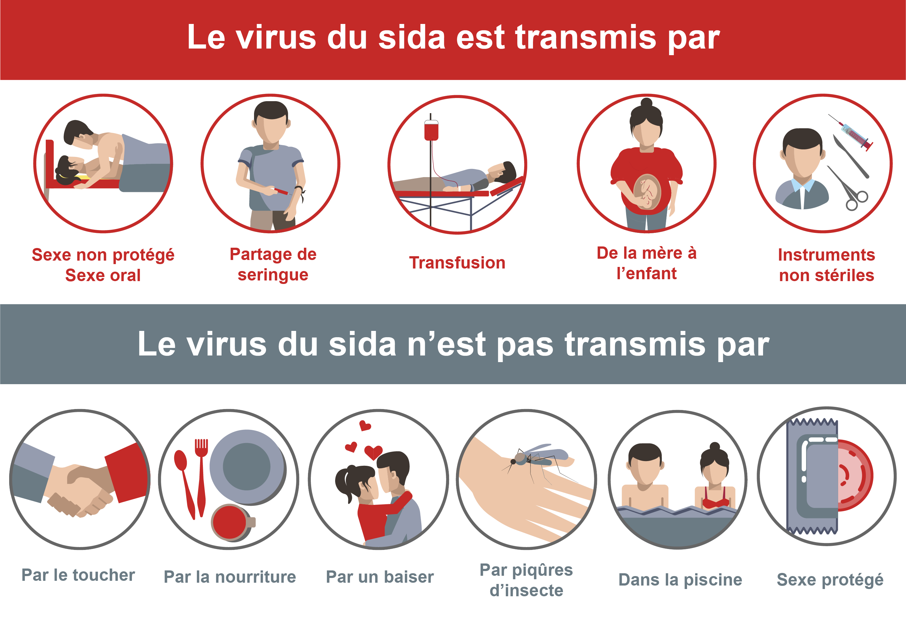
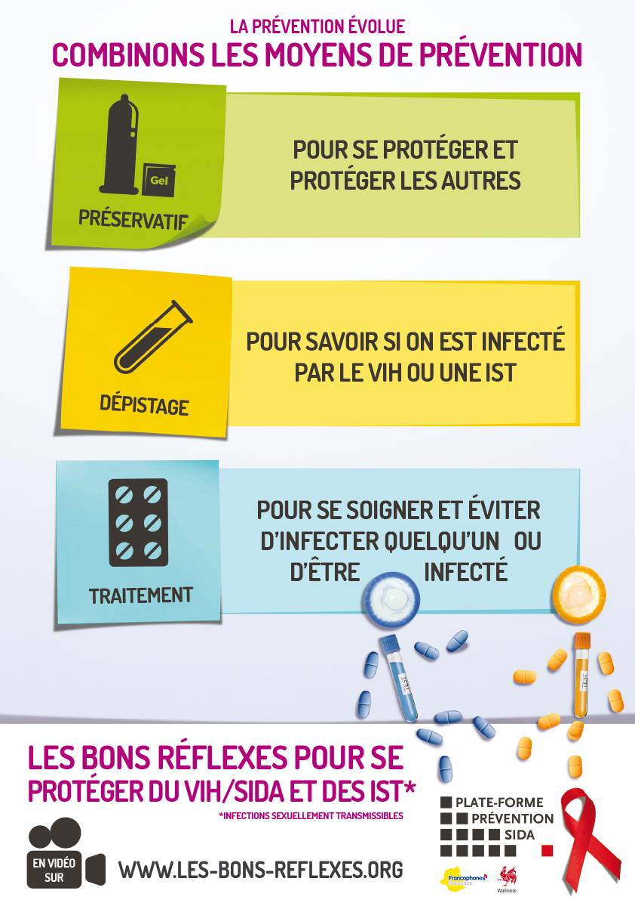

# Activité : Le VIH et le SIDA

!!! note "Compétences"

    - Trouver et extraire des informations
    - Utiliser l'outil mathématique 

!!! warning "Consignes"

    Expliquez-lui ce qu’est le SIDA s’il a raison d’être rassuré ? Que lui conseillerez-vous ?
    
??? bug "Critères de réussite"
    Expliquer les différents modes de transmission
    Expliquer quels sont les dégâts faits par le micro-organisme et pourquoi lors de la dernière phase le corps n’a plus de défense immunitaire
    Expliquer la mort des patients malades.
    Expliquer, à Paul, ce qu’il devra faire dans le futur.

Paul a eu une relation non protégée lors d’une soirée. Il s’inquiète sur les risques de contamination et pendant 1 mois il se sent bien. Alors il pense ne rien avoir, Paul est rassuré !

**Document 1 : évolution de la concentration de VIH (Virus de l’ImmunoDéficience Humaine), de Lymphocytes T et d’anticorps anti-VIH.**

3 Phases apparaissent :

- La primo-infection de la contamination à 9 semaines.

- La phase asymptomatique de 9 semaines à 8 ans environ.

- Le SIDA (=Syndrome de l’ImmunoDéficience Acquise) déclaré de 8 ans à la mort du patient.

Les lymphocytes T4 sont des lymphocytes T activateurs.

**Document 2 Voies de contamination.**

Le virus du sida peut être présent dans certains liquides du corps :

- le sang,
- le sperme et le liquide qui survient avant l’éjaculation (liquide pré séminal),
- les sécrétions vaginales (cyprine),
- le lait maternel.

{: style="width: 300px;"}

**Document 3 Les différentes phases de la maladie.**

Suite à une contamination, trois phases se succèdent.

La primo-infection est la période pendant laquelle le virus infecte les lymphocytes T activateurs pour se multiplier. Les symptômes sont limités à ceux d’une maladie bénigne, ce qui les rend impossibles à identifier.

Pendant la deuxième période, la phase asymptomatique, de durée variable, on détecte facilement la séropositivité au VIH, car les anticorps anti-VIH sont fabriqués par l’organisme. En revanche, on n’observe en général aucun symptôme chez le malade. C’est pendant cette période qu’une personne peut se faire dépister. Le dépistage consiste à détecter la présence ou l’absence d’anticorps anti-VIH.

La troisième période est celle du SIDA, c’est-à-dire celle de l’immunodéficience. Le corps n’a plus de défense immunitaire. Il y a donc un développement de nombreuses maladies opportunistes qui profitent de l’immunodéficience et qui vont provoquer la mort du malade.

Une personne peut transmettre le virus dès le début de l’infection.

**Document 4 Traitement anti-sida.**

Actuellement, il n’y a pas de vaccin protégeant du VIH et aucun traitement ne permet d’éliminer le virus de l’organisme. Depuis la fin des années 1990, des traitements adaptés (trithérapie), permettent de bloquer la multiplication du VIH et de prolonger considérablement l’espérance de vie des personnes infectées. Ces traitements ont des effets secondaires importants (fatigue, maux de tête, troubles digestifs…)

**Document 5 Prévention pour le VIH.**

Les seuls moyens de détruire le virus sont l’eau de javel, les détergents et une chaleur de plus de 60 °C.

{: style="width: 300px;"}

??? note-prof "Correction"

    Paul ne doit pas être rassuré, car les premières phases suivant la   contamination ne déclenchent pas de symptômes.

    Paul devra se protéger en portant un préservatif lors de ses futures relations sexuelles avec son ou sa partenaire.

    Paul devra se faire dépister dans deux mois le temps que son corps produise des anticorps anti-VIH s’il a été contaminé.
