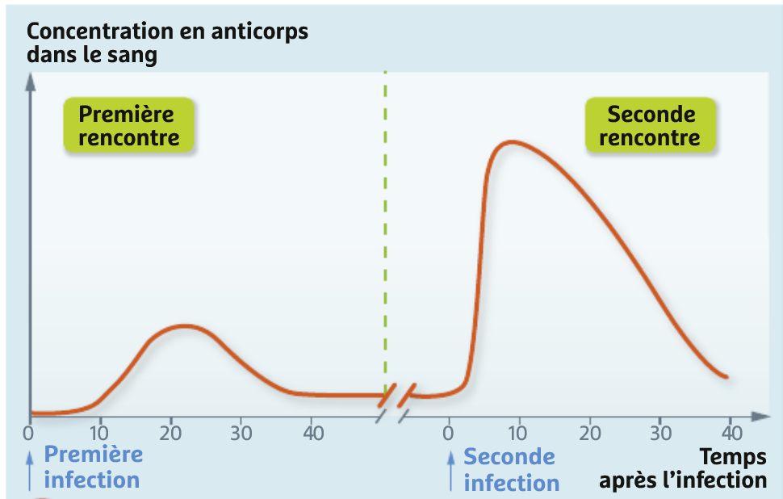

# Activité : La vaccination

!!! note "Compétences"

    - Trouver et extraire des informations
    - Argumenter

!!! warning "Consignes"

    1. Expliquer le principe de la vaccination. (Document 1 à 3)
    2. Expliquer l’intérêt de la vaccination pour un individu et pour une population. (Document 2 à 6)
    3. Comparer les risques dus à la rougeole et au vaccin contrela rougeole.
        
??? bug "Critères de réussite"
    - Consigne 1 
        - Avoir expliqué ce que contient un vaccin.
        - avoir expliqué l'impact du vaccin sur le corps
        - Avoir expliqué l'intéret d'un vaccin pour un organisme 

**Document 1 La composition d’un vaccin.**

Un vaccin contient des antigènes de l’agent infectieux contre lequel on souhaite se protéger. On peut soit injecter des microbes atténués (inoffensifs), de microbes tués ou des fragments du microbe. Des adjuvants sont aussi présents ce qui permet une meilleure activation du système immunitaire et une meilleure efficacité des vaccins.

**Document 2 : Comparaison de la production d’anticorps lors de la première et de la seconde rencontre avec un même agent infectieux.**

{: style="width: 600px;"}

**Document 3 La mémoire immunitaire.**

Lors du premier contact entre un antigène et l’organisme, certains lymphocytes se multiplient lorsque notre système immunitaire : ce sont les lymphocytes mémoires qui peuvent être présents plusieurs années.
Lorsque l’antigène se trouve à nouveau dans le sang, les lymphocytes mémoire sont activés et se différencient en lymphocytes T ou B actifs. C’est ce qu’on appelle la mémoire immunitaire. 

**Document 4  Campagne d'information sur la vaccination de l’Agence régionale de santé, intitulé « Se faire vacciner est une démarche altruiste »**

Après vaccination, une partie de la population est immunisée directement par l’effet du vaccin. Ces individus protègent indirectement l’ensemble du groupe en stoppant la transmission au plus grand nombre, c’est l’effet de groupe.

**Document 5 Des contre-indications à la vaccination.**

Certaines personnes ne peuvent pas se faire vacciner pour des raisons de santé. En effet, dans certains l’administration d’un vaccin pourrait mettre en danger la personne, c’est le cas des personnes ayant certaines allergies aux composés des vaccins, des personnes souffrant de maladies causant un affaiblissement du système immunitaire ou bien des femmes enceintes.

**Document 6 : Évolution du nombre de cas de rougeole de 1950 à 2001 aux États-Unis.**

Dans le monde, les décès dus à la rougeole ont chuté de 75 % entre 2000 et 2013 grâce à la vaccination, soit 15,6 millions de décès évités dans cette période.

La couverture vaccinale en France en 2008 était de 89 %, pour une éradication de la maladie en France, le Haut Conseil de la santé publique recommande une couverture de 95 %.

**Document 7 Risques dus à la rougeole et au vaccin contre la rougeole.**

La rougeole est une maladie souvent bénigne, mais dont les complications tuent 200 000 enfants par an dans le monde. Entre 2008 et 2014, il y a eu 23 000 cas de rougeole en France. On dénombre 1500 complications pulmonaires, 34 complications neurologiques et 10 morts. 

Le vaccin peut avoir des effets indésirables à court terme, les plus courants sont de la fièvre et une réaction inflammatoire au niveau de l’injection qui sont des réactions normales de notre système immunitaire.

Dans le cas du vaccin contre la rougeole, des complications pulmonaires peuvent avoir lieu dans 1 cas sur 500, des complications neurologiques dans 1 cas sur 5000.

Aucune étude à ce jour n’a montré d’effets indésirables à long terme d’un vaccin.

??? note-prof "correction"

    Consigne 1 :

    le vaccin sert à protéger contre certaines maladies.

    Le vaccin contient des fragments de microbes ou des microbes tués, il
    contient donc des antigènes.

    Les antigènes vont avoir un premier contact avec l’organisme ce qui va
    activer et multiplier certains lymphocytes : lymphocytes mémoires.

    Lorsque le corps rencontrera les microbes avec les mêmes antigènes, les
    lymphocytes mémoires se différencieront en lymphocytes T ou B actifs,
    mais la mémoire immunitaire permettra une réponse plus rapide et plus
    forte.

    Consigne 2 :

    La vaccination permet de se protéger et de protéger la population en
    stoppant la propagation en évitant que plus de personne soit atteint de
    la maladie. Ce la permet de protéger les personnes qui ne peuvent pas se
    vacciner.

    Consigne 3 :

    la rougeole peut créer des complications neurologiques et pulmonaires
    graves plus fréquentes que le vaccin qui peut avoir des effets
    indésirables mais seulement à court terme.

    Par exemple les complications pulmonaires seront réduites à 1 cas sur
    5000 avec le vaccin alors qu’avec la rougeole 1500 cas sur 23000 (300
    sur 5000)
