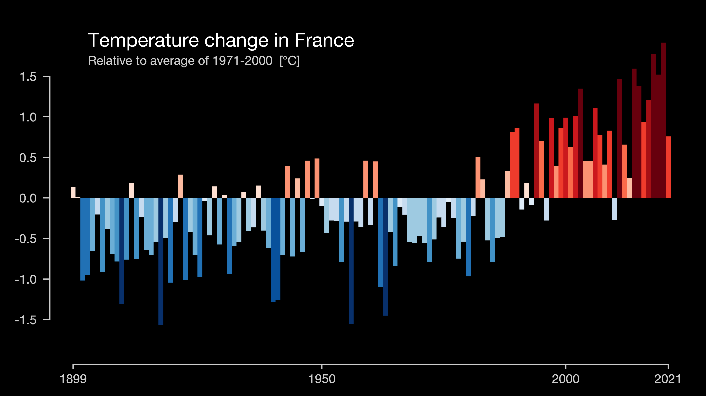
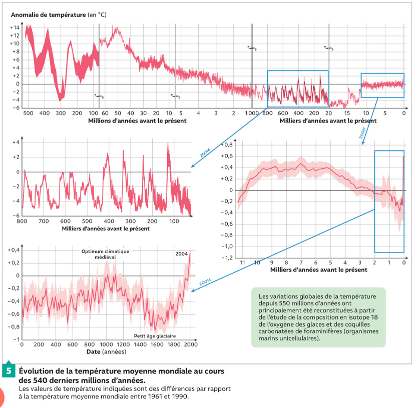

# Séquence : Le changement climatique actuel

!!! note-prof
    si besoin d'infos

    
### Document d’appel :

<table markdown>
<thead>
<tr>
<th>Monde de 1850 à 2021
</th>
<th> France de 1899 à 2021
</th>
</tr>
</thead>
<tbody markdown>
<tr markdown>
<td markdown></td>
<td markdown></td>

</tr>
<tr markdown>
<td markdown></td>
<td markdown></td>

</tr>
</tbody>
</table>

!!! question "Problématique"

    Comment l'être humain peut-il être responsable d'un changement global ?
    En quoi le changement climatique est un problème ? 

## Séance 1 : Les causes du changement climatique

!!! question "Problématique"

    Comment l’être humain est-il responsable du changement climatique actuel ?

[Activité Le changement climatique d’origine anthropique](../chgtClimHumain)

??? abstract "Bilan"

    === "De quoi parler dans le bilan ? Quels mots clés ?"

    === "Bilan à trous"
        Au cours du temps, les activités humaines ont enrichi l’atmosphère en ................ (ex : ....................). Ceci a entraîné une amplification de l’effet de serre, et donc une .............. plus rapide de la température moyenne à la surface de la Terre.

        L’effet de serre est un phénomène d’échauffement de la surface de la Terre, dû au fait que certains gaz de l’atmosphère, les gaz à effet de serre absorbent une partie du .................... émis par la Terre et ce qui ............... la planète.

        D’après les prévisions des climatologues, le réchauffement climatique devrait se poursuivre et la température devrait augmenter de 0,5 °C à 4 °C.

    === "Bilan"

        Au cours du temps, les activités humaines ont enrichi l’atmosphère en gaz à effet de serre (ex : dioxyde de carbone CO2). Ceci a entraîné une amplification de l’effet de serre, et donc une augmentation plus rapide de la température moyenne à la surface de la Terre.

        L’effet de serre est un phénomène d’échauffement de la surface de la Terre, dû au fait que certains gaz de l’atmosphère, les gaz à effet de serre absorbent une partie du rayonnement infrarouge émis par la Terre et ce qui réchauffe la planète.

        D’après les prévisions des climatologues, le réchauffement climatique devrait se poursuivre et la température devrait augmenter de 0,5 °C à 4 °C.

## Séance 2 : Les conséquences du réchauffement climatique sur les êtres vivants

!!! question "Problématique"

    Quelles sont les conséquences du réchauffement climatique sur la répartition des êtres vivants ?

[Activité Le réchauffement climatique et répartition des êtres vivants](../chgtClimRepartVivant)

??? abstract "Bilan"

    === "De quoi parler dans le bilan ? Quels mots clés ?"

    === "Bilan à trous"

        Un écosystème est un système formé par un ............ et toutes les ............ qui y vivent, s’y nourrissent et s’y reproduisent.

        La biodiversité (=diversité des êtres vivants) au sein des
        écosystèmes se modifie actuellement sous l’effet des activités humaines, comme le réchauffement climatique.

    === "Bilan"

        Un écosystème est un système formé par un environnement et toutes les espèces qui y vivent, s’y nourrissent et s’y reproduisent.

        La biodiversité (=diversité des êtres vivants) au sein des
        écosystèmes se modifie actuellement sous l’effet des activités humaines, comme le réchauffement climatique.

## Séance 3 : Les conséquences de l’exploitation des énergies fossiles.

!!! question "Problématique"

    Quelles sont les conséquences de l’exploitation des énergies fossiles ?

[Activité Les conséquences de l’exploitation des énergies fossiles](../conseqEnergiesFossiles)

??? abstract "Bilan"

    Les énergies fossiles sont des énergies dont la source a été formée par l’accumulation d’anciens êtres vivants. Elles ne sont pas renouvelables à l’échelle humaine. (exemple : charbon, gaz, pétrole)

    L’exploitation de ces énergies a un impact important sur l’environnement et les populations humaines

??? note-prof Bilan
    Une énergie fossile est une énergie dont la source a été formée par l’accumulation d’anciens êtres vivants. Ce sont le pétrole, le gaz et le charbon. Cette transformation se fait sur des centaines de millions d’années donc elles ne se forment pas sur une échelle de temps humaine. Les réserves actuelles ne sont pas infinies et celles qui sont accessibles pourraient s’épuiser.

    L’exploitation de ces énergies a un impact important sur l’environnement, le dioxyde de carbone libéré va augmenter l’effet de serre et donc le réchauffement climatique.

    Le changement climatique va provoquer une élévation du niveau des mers entre 40cm et 1m et une augmentation de la fréquence des phénomènes climatiques et météorologiques exceptionnels.

    L'élévation du niveau de l'eau va entrainer une disparition de certaines zones habitables et les catastrophes naturelles vont rendre certaines zones plus difficilement habitables. Cela va causer des mouvements des populations et de nombreux réfugiés devront changer de zones d'habitations.