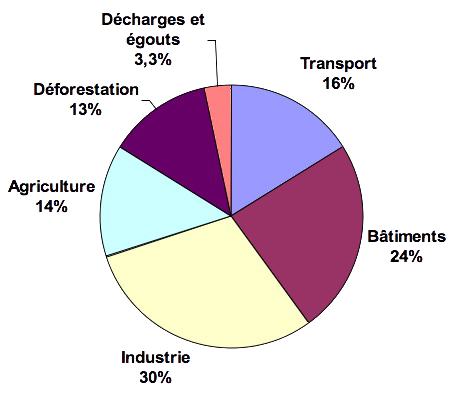
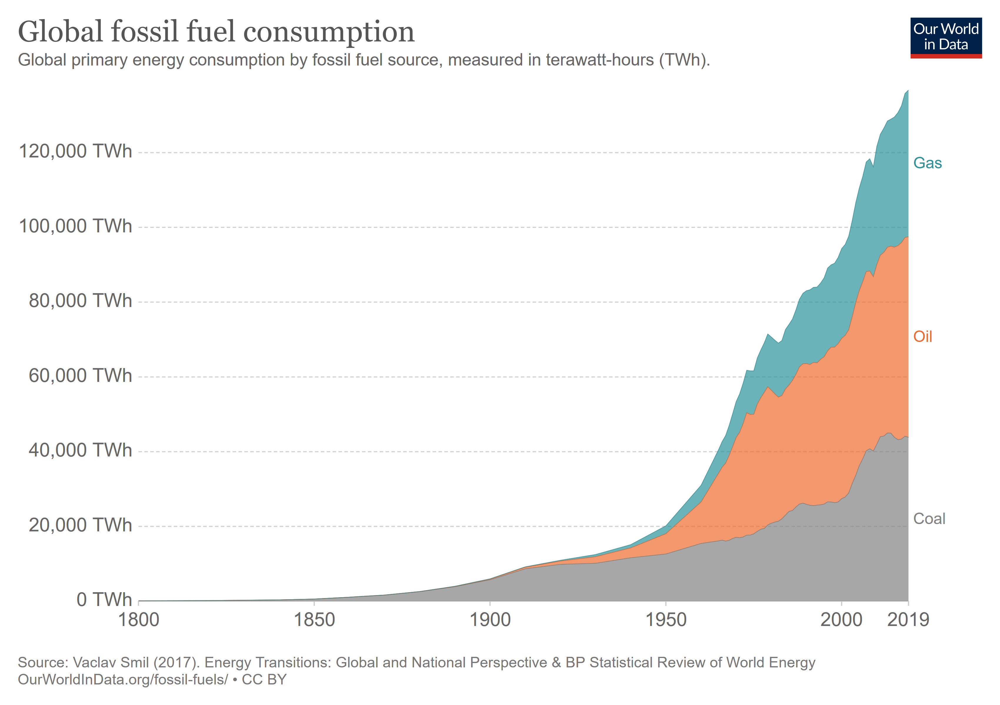

# Activité : Le changement climatique d’origine anthropique

!!! note "Compétences"

    - Trouver et utiliser des informations
    - Produire un schéma fonctionnel 

!!! warning "Consignes"
    1. Expliquer les différences de températures de surfaces dans le tableau du document 2.
    2. Expliquer l’impact de l’être humain sur l’évolution de la concentration en dioxyde de carbone dans le document 5
    3. À l’aide d’un schéma fonctionnel, montrer les impacts des activités humaines sur la température de la Terre.
   
??? bug "Critères de réussite"
    - Trouver une différence entre les différents astres en dehors de la température.
    - avoir montré que l'être humain a un impact sur la concentration de CO₂
    - Le schéma fonctionnel doit contenir les idées essentielles de chaque réponse précédente.

**Document 1 : Evolution de la température moyenne de surface depuis 1860.**

{: style="max-width:300px"}

**Document 2 : Températures de surface de la Lune et de la Terre.**

|   |Quantité de dioxyde de carbone   |Température moyenne de surface  |
|----|----|----|
|  Lune |   0 ppm |  - 73 °C |
| Terre au cambrien (de −541 à −485 Ma) | 5600 ppm  | 22 °C   |
| Terre au carbonifère (de – 359 à – 299 Ma)  | 280 ppm  | 12 °C  |
| Terre actuel (0 Ma) | 400 ppm  |  12,7 °C |

**Document 3 : L’effet de serre**

{: style="max-width:500px"}

Plus un objet absorbe de rayonnements plus, il va chauffer.
Plus un objet est chaud plus, il émet de rayonnements infrarouges.

**Document 4 : Les gaz à effet de serre**

Les gaz à effet de serre sont des gaz qui sont capables d’absorber les infrarouges.
Sur terre, les principaux gaz à effet de serre sont le dioxyde de carbone (CO₂) (qui est le gaz qui a le plus d’impact), le méthane (CH₄) et la vapeur d’eau (H₂O).

**Document 5 : Graphique de la teneur atmosphérique en dioxyde de carbone au cours du temps.**

{: style="max-width:300px"}

**Document 6 : Origine du dioxyde de carbone.**

{: style="max-width:300px"}

Le dioxyde de carbone (CO2) provient principalement de la combustion d’énergie fossile (charbon, essences, fiouls, gaz…) ou du bois.
Sur le graphique, on voit les activités à l’origine des émissions de dioxyde de carbone en France en 2011.

**Document 7 : Consommation d’énergies fossiles dans le monde de 1800 à 2019.**

{: style="max-width:500px"}

Gas = gaz naturel
oil = pétrole
coal = Charbon