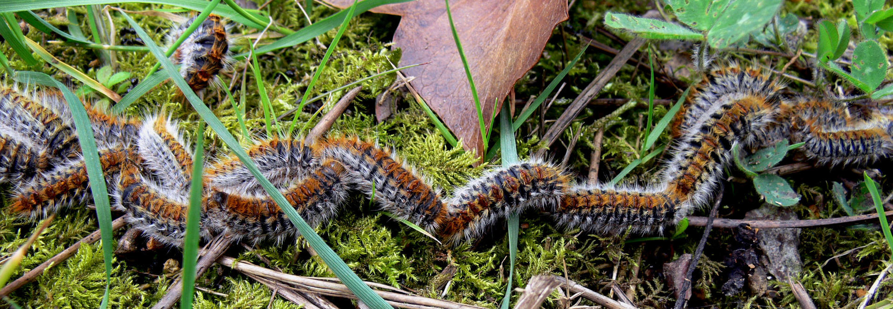

# Activité : L'impact du changement climatique sur la biodiversité

!!! note "Compétences"

    Trouver et utiliser des informations

!!! warning "Consignes"

    Explique quelles peuvent être les conséquences des activités humaines et  du changement  climatique sur les espèces marines et sur certains arbres en France.
    
??? bug "Critères de réussite"

    - expliquer l'impact des activités humaines sur les océans
    - expliquer l'impact du changement de l'eau sur les coraux
    - expliquer l'impact du changement du corail sur l'être humain
    - expliquer l'impact du changement climatique sur les chenilles
    - expliquer l'impact du changement des population de chenilles sur les arbres

**Document 1 : Les récifs coralliens**

Les coraux sont des animaux marins. Ils sécrètent autour d’eux un squelette calcaire qui forment les récifs coralliens. Ces animaux vivent en symbiose avec des algues unicellulaires, qui leur apportent des sucres. Ces coraux forment les récifs coralliens.

Les récifs coralliens abritent plus de 25 % des espèces marines mondiales (entre 1 et 3 millions d’espèces). Ces espèces marines
trouvent dans les coraux de la nourriture et un abri. Cette biodiversité génère des milliers d’emplois dans le tourisme, la pêche, etc.

**Document 2 : Le blanchiment des coraux.**

{: style="width:400px; flex-shrink: 0;  " }

L’augmentation de la quantité de CO2 et l’augmentation de la température de l’eau provoque l’acidification des océans. Cette acidification peut entraîner l’expulsion des algues symbiotiques du corail, le corail se décolore, c’est le blanchiment. Ce phénomène peut entraîner la mort du corail.

**Document 3 : La chenille processionnaire du pin.**

{: style="width:400px; flex-shrink: 0;  " }

La processionnaire du pin est la chenille d’un papillon nocturne. Elle dévore les parties vertes et freine ainsi le développement de l’arbre. Elle provoque de nombreuses allergies chez les êtres humains à cause de ses poils urticants.
Cette espèce d’origine méditerranéenne se développe de manière optimale entre 20 °C et 25 °C. Durant l’hiver, la moindre augmentation de température augmente ses chances de survie.

**Document 4 : Progression de l’habitat de la chenille processionnaire du pin de 1979 à 2014 en France.**

{: style="width:400px;  " }
