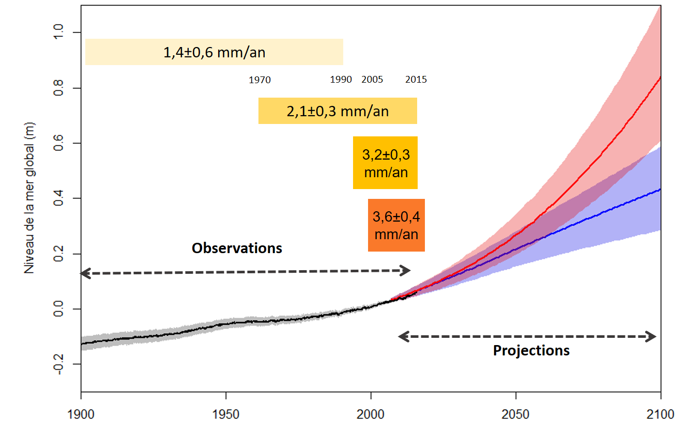
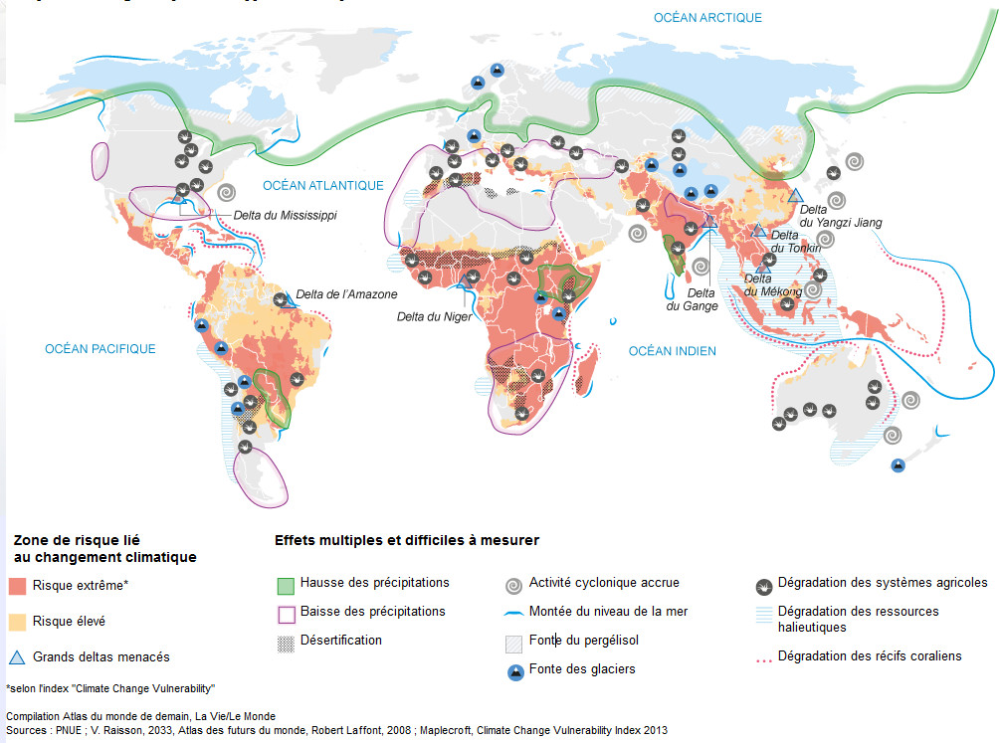

# Activité : Les conséquences de l’exploitation des énergies fossiles.

!!! note "Compétences"

    trouver et utiliser des informations

!!! warning "Consignes"

    En utilisant les différents documents, présenter, sous forme d’un audio de 2 à 3 minutes maximum, les conséquences de l’exploitation des énergies fossiles. 
    
??? bug "Critères de réussite"

    - présentation des énergies fossiles
    - indiquer les conséquences de leur exploitation sur les stocks
    - indiquer les conséquences de l'exploitation sur l'atmosphère
    - expliquer les conséquences des changements atmosphériques sur le climat
    - expliquer les conséquences des changements climatiques sur les niveaux des océans
    - indiquer les conséquences des changements climatiques sur les catastrophes naturelles géophysiques et sur les autres. 
    - indiquer les conséquences de tous ces changements sur les populations humaines

    </table>

    <table>
    <thead>
    <tr>
    <th colspan = 4>
    Qualité de l'oral 2 point
    </th>
    </tr>
    </thead>
    <tbody>
    <tr>
    <td>Très satisfaisant</td>
    <td>Satisfaisant</td>
    <td>Fragile</td>
    <td>Insuffisant</td>
    </tr>
    <tr >
    <td>
Utilisation d’un vocabulaire riche et précis.

    
Discours fluide, clair, tirant pleinement profit du temps.

    
Le temps est respecté.
</td>
    <td>
Le lexique est adapté.

    
Discours articulé et pertinent, énoncés bien construits.

    
Le temps est respecté.
</td>
    <td>
Discours assez clair mais vocabulaire limité, approximatif et énoncés schématiques.
    

    
ton monocorde et/ou voix peu audible

    
Et/ou, le temps n’est pas totalement respecté.
</td>
    <td>
Le vocabulaire est insuffisant.

    
Énoncés courts, ponctués de pauses et de faux démarrages ou énoncés longs à la syntaxe mal maîtrisée.

    
Et/ou le temps n’est pas maîtrisé.

    
Voix inaudible
</td>
    </tr>
    </tbody>
    </table>

    <table>

    <thead>
        <thead>
        <tr>
        <th colspan = 4> Qualité de la pertinence des informations utiles extraites 2 points
        </th>
    </thead>

    </tr>
    </thead>
    <tbody>
    <tr>
        <td>Très satisfaisant</td>
        <td>Satisfaisant</td>
        <td>Fragile</td>
        <td>Insuffisant</td>
    </tr>
    <tr>
        <td>Toutes les informations sont extraites et permettent de répondre complètement à la consigne.</td>
        <td>La majorité des informations sont extraites et permettent de répondre globalement à la consigne.</td>
        <td>Quelques informations sont extraites cependant, ne permettent pas de répondre complètement à la consigne.</td>
        <td>Réponse très incomplète avec des informations erronées et confuses.</td>
    </tr>
    </tbody>
    </table>

    <table>
    <thead>
        <thead>
        <tr>
        <th colspan = 4> Qualité et construction du résumé 1 point
        </th>
    </thead>
    <tbody>
    <tr>
        <td>Très satisfaisant</td>
        <td>Satisfaisant</td>
        <td>Fragile</td>
        <td>Insuffisant</td>
    </tr>
    <tr>
        <td>Maîtrise des enjeux du sujet, capacité à conduire un résumé complet, bien construit et raisonné.</td>
        <td>Résumé construit qui s’appuie sur des informations précises et pertinentes du dossier.</td>
        <td>Réponse lacunaire et discours insuffisamment structuré.</td>
        <td>Pas ou peu de compréhension du sujet et discours décousu.</td>
    </tr>
    </tbody>
    </table>

**Document 1 : Les énergies fossiles.**

{:style="width:400px; flex-shrink: 0;  " }

Les énergies fossiles sont les énergies produites à partir de la combustion de matière issue de la transformation de matière organique. 
Le charbon, de pétrole ou de gaz sont des ressources énergétiques qui se forment à partir de la transformation d’organismes morts (planctons ou végétaux). Ces ressources mettent des millions d’années à se former, elles sont actuellement exploitées plus rapidement qu’elles ne se forment.

**Document 2 : Utilisations des ressources énergétiques fossiles.**

Pour utiliser l’énergie contenue dans ces ressources, il est nécessaire de les brûler ce qui entraîne la libération de CO~2~ dans l’atmosphère.

<table>
<tbody>
<tr class="odd">
<th colspan = 7>Émission de CO2 des différentes filières de production
d’électricité</th>
</tr>
<tr class="even">
<th>Source d’énergie</th>
<td>Hydraulique</td>
<td>Nucléaire</td>
<td>Éolien</td>
<td>Gaz Naturel</td>
<td>Fuel (Pétrole)</td>
<td>Charbon</td>
</tr>
<tr class="odd">
<th>
Émission de CO2 (en g par kWh)
</th>
<td>4</td>
<td>6</td>
<td>3 à 22</td>
<td>883</td>
<td>891</td>
<td>978</td>
</tr>
</tbody>
</table>

**Document 3 : Élévation du niveau des mers.**

{:style="width:500px; flex-shrink: 0;  " }

À cause du réchauffement climatique, les glaciers continentaux fondent et surtout l’eau liquide se dilate (elle prend plus de place), cela entraîne un changement du niveau de la mer.
La courbe bleue est basée sur le scénario de réchauffement climatique le plus optimiste et la rouge est basée sur le scénario de réchauffement climatique le plus pessimiste.

**Document 4 : Le nombre de catastrophes naturelles**

Seuls les événements géophysiques n’ont pas de lien avec le réchauffement climatique, les autres peuvent y être liés.

**Document 5 : Les réfugiés climatiques**

Entre 147 et 216 millions de personnes vivent actuellement dans des zones sous le niveau de la mer actuelle (des digues empêchent l’eau de rentrer dans les terres, mais on ne peut pas toutes les agrandir) ou dans des zones déjà régulièrement inondées. En comparaison, on a compté 27 millions de réfugiés politiques en 2016.

