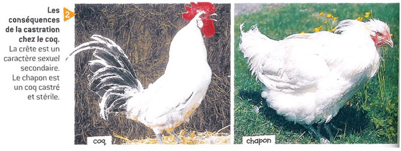
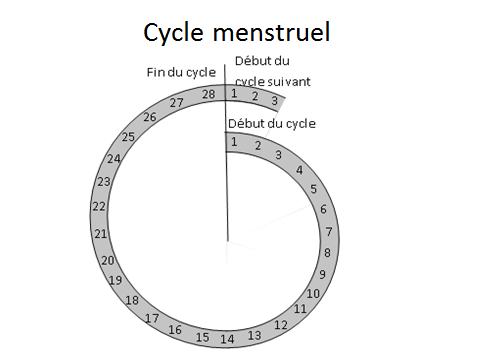

# Séquence : Contrôles des appareils reproducteurs

!!! note-prof
    si besoin d'infos

!!! question "Problématique"
    Comment sont contrôlés les appareils reproducteurs ?
    

## Séance 1 : les différences anatomiques

!!! question "Problématique"
    Quelles sont les différences anatomiques qui se mettent en place au cours du développement d’un individu ?

[Activité Les différences anatomiques entre un homme et une femme](../diffFemmeHomme)

??? abstract "Bilan"
    Lors du développement embryonnaire, les appareils reproducteurs internes et externes deviennent différents chez l’homme et chez la femme, ce sont les caractères sexuels primaires.

    À la puberté, d’autres différences apparaissent entre l’homme et la femme, ce sont les caractères sexuels secondaires (par exemple : développement des seins, développement du pénis…)

    L’appareil reproducteur interne de la femme est constitué des ovaires, des trompes, de l’utérus et du vagin. Et son appareil reproducteur externe, appelé vulve, est constitué de l’orifice du vagin, des petites lèvres, des grandes lèvres et du clitoris.

    L’appareil reproducteur interne de l’homme est constitué des testicules, du canal déférent et de l’urètre. Et son appareil reproducteur externe est constitué des bourses et du pénis.

## Séance 2 : Les cellules reproductrices

!!! question "Problématique"
    Comment sont produites les cellules reproductrices ?

[Activité Les cellules reproductrices des femmes et des hommes](../diffCellRepro)

??? abstract "Bilan"

    Les gamètes** (=**cellules reproductrices) sont produites par les gonades.

    Chez les hommes, les spermatozoïdes sont produits par les testicules, en continu, à partir de la puberté. Le sperme contient du liquide séminal et des spermatozoïdes.

    Chez les femmes, les ovules sont émis de façon cyclique (1 par mois environ), à partir de la puberté jusqu’à la ménopause.

## Séance 3 : Le début de la puberté

!!! question "Problématique"
    Comment expliquer les changements liés à la puberté ?

[Activité La puberté](../puberte)

??? abstract "Bilan"

    

    

    À la puberté, les taux d’hormones sexuelles (testostérone chez l’homme et œstrogène chez la femme) augmentent, ce qui est responsable des changements observés à la puberté.

    Définition hormone : substance chimique fabriquée par un organe et libérée dans le sang provoquant des modifications de certains organes (organes cibles de l’hormone). Les hormones sont un moyen de communication dans notre corps.

    

## Séance 4 : Le contrôle des appareils reproducteurs

!!! question "Problématique"
    Comment est contrôlé le fonctionnement de l’appareil reproducteur ?

[Activité Le contrôle du fonctionnement de l’appareil reproducteur](../controlAppRepro)

??? abstract "Bilan"

    Chez les êtres humains, l’hypophyse (dans le cerveau) contrôle les testicules ou les ovaires grâce à des hormones hypophysaires (LH et FSH). En réponse, les gonades (ovaires ou testicules) produisent des hormones sexuelles (testostérone par les testicules et œstrogènes et progestérones par les ovaires). Ce sont hormones sexuelles qui permettent l’apparition et le maintien des caractères sexuels secondaires et la production de cellules reproductrices.

    

## Séance 5 : Le cycle de la femme

!!! question "Problématique"
    Comment le cycle utérin est-il contrôlé ?

[Activité Le cycle de l’utérus](../cycleUterus)

??? abstract "Bilan"

    Les règles se caractérisent par un écoulement de sang provenant de l’utérus.

    De la puberté à la ménopause, lors de chaque cycle, la muqueuse utérine s’épaissit puis est éliminée.

    Les règles sont dues à l’élimination de cette muqueuse.

    L’épaisseur de l’utérus est contrôlée par la quantité d’hormones produites par les ovaires. Lorsque la quantité d’hormones diminue, la muqueuse utérine est éliminée et les règles apparaissent.

    

