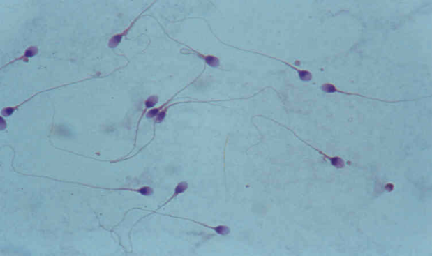

# Activité : Les cellules reproductrices des femmes et des hommes

!!! note "Compétences"

    - faire un dessin d’observation 
    - construire un tableau 

!!! warning "Consignes"

    1. À partir de l’observation de la lame et du document 1, explique où sont produits les spermatozoïdes.

    2. À l’aide des informations du document 3, légende la photo du document 2.

    3. Faire un tableau comparant les spermatozoïdes et les ovules du point de vue de la taille, du nombre, de la durée de vie et de la mobilité. 
    
??? bug "Critères de réussite"
    - Avoir retrouvé les différentes zones présente dans le document 1 sur la lame
    - Avoir identifié les spermatozoïdes.

**Document 1 Photo légendée d’une coupe de testicules.**

{: style="width: 200px;"}

**Document 2 Photo de spermatozoïdes de taureau MO x600.**

{: style="width: 200px;"}

**Document 3 Les spermatozoïdes.**

Les spermatozoïdes sont les cellules reproductrices de l’homme.

Il est composé de deux parties :

- La tête : qui mesure 5 µm
- Le flagelle qui mesure 60 µm

Lors d’une éjaculation, entre 200 et 300 millions de spermatozoïdes sont libérés. Ils ont une durée de 3 à 5 jours.

Ces spermatozoïdes peuvent atteindre la vitesse de 60 µm par seconde.

**Document 4 Les ovules.**

Les ovules sont les cellules reproductrices de la femme.

C’est une cellule ronde d’un diamètre de 120 µm.

Lors de l’ovulation, un seul ovule est libéré.

L’ovule ne peut pas se déplacer tout seul.

Ils ont une durée de 1 à 2 jours.

??? note-prof "Correction :"

    |          | Spermatozoïde                  | ovule             |
    |----------|--------------------------------|-------------------|
    | taille   | 65 µm, plus petit              | 120 µm, plus gros |
    | Nombre   | Plusieurs millions             | Un seul           |
    | Mobilité | Se déplace à 60 µm par seconde | immobile          |
