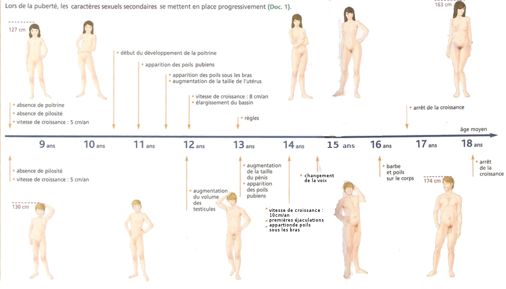

# Activité : Les différences anatomiques entre un homme et une femme

!!! note "Compétences"

    Extraire et mettre en relation des informations 
    Construire un tableau

!!! warning "Consignes"

    Construire un tableau en indiquant pour l’homme et la femme : la période de puberté, les 2 caractères sexuels primaires, 2 caractères sexuels secondaires et le moment d’apparition des caractères sexuels primaires.
    
??? bug "Critères de réussite"
    - 

**Document 1 Photographie des appareils reproducteurs externes de l’homme et de la femme à différents moments du développement embryonnaire.**

**Document 2 Des transformations liées à la puberté**

L’âge de la puberté est différent en fonction des individus. Dans la majorité des cas, elle commence :

-   entre 9 et 13 ans chez les filles
-   entre 10,5 et 14 ans chez les garçons

**Document 3 l’appareil reproducteur de la femme**

**Document 4 l’appareil reproducteur de l’homme (seules les légendes en gras font partie de l’appareil reproducteur)**

**Document 5 Les caractères sexuels**

On appelle caractère sexuel primaire, l’ensemble des différences anatomiques qui différencie un homme d’une femme pendant la grossesse et à la naissance.

On appelle caractère sexuel secondaire, l’ensemble des différences anatomiques qui différencie un homme d’une femme à partir de la puberté.

Tous ces caractères sont variables d’un individu à l’autre même du même sexe.

??? note-prof "Correction"

    <table>
    <tbody>
    <tr class="odd">
    <td></td>
    <td>Femme</td>
    <td>Homme</td>
    </tr>
    <tr class="even">
    <td>Période de puberté</td>
    <td>10,5 – 16,5 ans</td>
    <td>12 – 18 ans</td>
    </tr>
    <tr class="odd">
    <td>Caractères sexuels primaires</td>
    <td>Appareil reproducteur externe : 
    Vulve (petite lèvres, grandes lèvres, clitoris et vagin) 
    Appareil reproducteur interne : 
    Ovaires 
    Trompe 
    Utérus 
    vagin</td>
    <td>Appareil reproducteur externe : 
    Pénis 
    Bourse 
    Appareil reproducteur interne 
    Testicule 
    Épididyme 
    Canal déférent 
    Vésicule séminale 
    Prostate 
    Urètre</td>
    </tr>
    <tr class="even">
    <td>Caractères sexuels secondaires</td>
    <td>Seins 
    Développement des hanches 
    Poils pubiens et poils sous les bras 
    règles</td>
    <td>Développement musculature 
    Voix grave 
    Développement taille testicules 
    Développement taille pénis 
    Poils pubiens, sous les bras et sur le visage… 
    éjaculations</td>
    </tr>
    <tr class="odd">
    <td>Moment d’apparition des caractères sexuels primaires</td>
    <td>Après 13 semaines du développement embryonnaire</td>
    <td>Après 13 semaines du développement embryonnaire</td>
    </tr>
    </tbody>
    </table>

