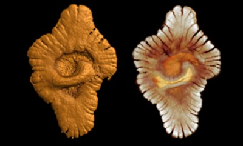

# Séance : L’histoire de la Terre

!!! question problématique
     Quels sont les grands événements ayant eu lieu dans l’histoire de la Terre ?

## Activité : L'histoire de la Terre

!!! note Consigne
    à partir des informations des différents documents, réaliser une frise chronologique montrant les évènements ayant eu lieu dans l’histoire de la vie et de la Terre. (1 cm = 120Ma)

!!! tip "Compétences travaillées"
    - Trouver et exploiter des informations
    - Représenter des données sous différentes formes

**Document 1 : La formation de la Terre**  

La Terre s’est formée il y a 4,6 Ga (milliards d’années). Elle s’est  formée en même temps que le reste du système solaire, c’est-à-dire le Soleil et les autres planètes.

**Document 2 : Les premières cellules.**  

Les premières cellules s’apparentent à des cyanobactéries, organismes unicellulaires dépourvus de noyau, vivant dans l’eau et capable de transformer le dioxyde de carbone en sucres et en dioxygène. On en trouve la trace de nos jours sous la forme de stromatolites qui sont formés par le dépôt calcaire de micro-organismes. Les plus anciens stromatolites ont été trouvés en Australie et datent de 3,5 Ga.

**Document 3 : Sortie des eaux**  
Les océans se sont formés il y a 4,4 Ga. Pendant la majorité de
l’histoire de notre planète, les êtres vivants étaient uniquement
aquatiques. Mais, il y a 360 Ma (millions d’années) les premiers
tétrapodes à sortir de l’eau sont apparus. Les premiers végétaux à
sortir de l’eau sont plus anciens et datent de 470 Ma.

**Document 4 : Premières cellules eucaryotes**  
Les cellules eucaryotes diffèrent
des cellules procaryotes par la présence d’un noyau. Des fossiles de
*Grypania spiralis* ont été datés à 2,2 milliards d’années. Ce sont les
plus anciennes traces d’êtres vivants eucaryotes connus à ce jour.

**Document 5 : Premiers organismes pluricellulaires**  
En raison de contraintes
physiques et chimiques, des cellules eucaryotes se seraient regroupées,
formant des colonies et se seraient mises à communiquer, à coopérer puis
à s’organiser en structures plus complexes.  
« En 2008, l’équipe d’Abderrazak El Albani, de l’Institut de chimie des
milieux et matériaux de l’Université de Poitiers et du CNRS, a mis au
jour près de Franceville, au Gabon, des fossiles d’organismes
pluricellulaires très anciens : 2,1milliards d’années ! »

**Document 6: Extrait de «L’Histoire de la Terre et de la
Vie… » du site «L’Hominidé.com»**

<figcaption align='right' >Crâne de Sahelanthropus tchandensis ></figcaption>

«Eh bien l’homme, il prend son temps… et les premiers hominidés ne datent que de 7 millions d’années… 
Le titre de plus ancien hominidé est actuellement détenu par
Sahelanthropus tchadensis, qui vivait dans ce qui est l’actuel Tchad.
Toumaï : son surnom est bien trouvé, car il veut dire « Espoir de vie »
dans un dialecte tchadien. Pour l’instant, une quinzaine d’espèces
d’hominidés ont été décrites. Quant à Homo sapiens, c’est-à-dire vous et
moi… ses premiers pas sur Terre ont dû avoir lieu il y a environ
200 000 ans. Depuis cette époque, des espèces d’hominidés ont disparu,
comme Néandertal, Homo floresiensis, ou l’homme de Dénisova. Nous sommes
maintenant sur Terre les seuls représentants de l’espèce humaine… » 

**Document 7 : « explosion biologique » précambrienne**  
Cette étape importante remonte à
la fin du Précambrien, à environ 580 Ma (donc avant le début du
Cambrien) et montre déjà une grande diversification du monde animal.
Une explosion biologique, c’est un moment plus ou moins bref de
l’Histoire de la Vie où beaucoup d’espèces apparaissent.

**Document 8 : Apparition et disparition des dinosaures**  
Le groupe des dinosaures est apparu il y a environ 250 Ma et ce groupe
(à l’exception des oiseaux) a disparu il y a 65Ma. Actuellement, les
deux causes envisagées à cette extinction sont un impact météoritique et
une activité volcanique très importante.

!!! abstract Bilan :

    La Terre s’est formée il y a 4,6 milliards d’années (Ga). Les premières traces d’êtres vivants sont datées de 3,5 Ga.

    Des évènements géologiques et biologiques ont affecté la surface de la Terre en modifiant les milieux et les conditions de vie.

    L’analyse des fossiles contenus dans les roches montre que de nombreuses espèces sont apparues et ont disparu au cours de l’histoire de la Terre.

    L’espèce humaine (Homo sapiens) est apparue très récemment il y a
    environ **200 000 ans**.

    Définition fossile : Reste ou trace **d’**êtres vivants (animaux,
    végétaux, bactéries**…**) conservés dans la roche.

