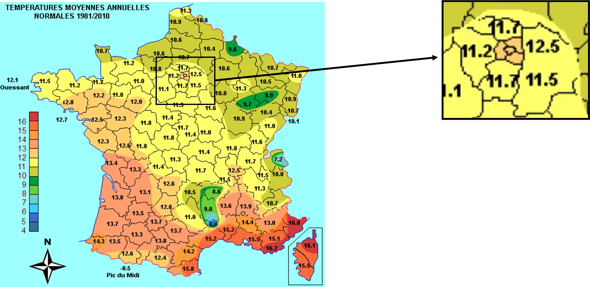
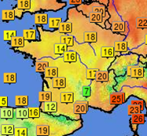
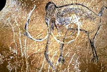
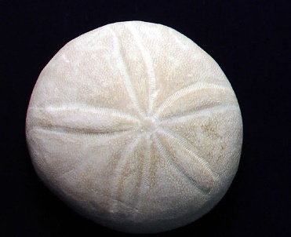

# Séance le climat dans l'histoire de la Terre 
Différence météo et climat

**Document 1 : Carte du climat** **en France présentant les températures moyennes sur une période de 30 ans (1981 – 2010)**
Moyenne des températures annuelles mesurées entre 1981 et 2010 © MeteoNews

**Document 2 : Carte météo présentant le relevé de températures du jeudi 15 septembre 2016 à 11 h**

Températures mesurées par les stations météorologiques © Infoclimat

**Définitions**

En météorologie :
On décrit les paramètres météo (températures, précipitations, vents…) qu’il fait à un instant donné.  
On prévoit comment les paramètres météo évolueront dans les prochains
jours.

En climatologie: 
On définit les climats avec la moyenne des paramètres météo mesurés sur
des périodes de 30 ans.  
On décrit l’évolution des climats dans le passé.  
On prévoit l’évolution des climats dans le futur.

!!! question Problématique 
    Comment montrer que le climat a changé dans le passé ?

## Activité les changements climatiques passés

!!! note Consignes
    Consigne 1 : À l’aide des documents, montrer que le climat à
    Vallon-Pont-d’Arc le climat a changé et expliquer comment les
    scientifiques ont pu le savoir.

    Consigne 2 : À l’aide des documents, montrer que le climat à Blaye le
    climat a changé et expliquer comment les scientifiques ont pu le savoir.

!!! tip "Compétences travaillées"
    - trouver et utiliser des informations

**Document 1 : climat actuel à Vallon-Pont-d’Arc et à Blaye**  
Aujourd’hui, le climat à Vallon-Pont-d’Arc est un climat méditerranéen
avec des hivers doux et des étés chauds.
Aujourd’hui, le climat à Blaye est un climat océanique avec des hivers doux et des étés frais.

**Document 2 : les peintures de la grotte Chauvet**  

La grotte Chauvet est située à Vallon-Pont-d’Arc dans le département de l’Ardèche (France). Les scientifiques estiment que la grotte a été occupée par des Hommes préhistoriques entre 37 000 ans et 28 000 ans.

Dans la grotte Chauvet, on peut observer plus de 400 peintures et gravures représentant un grand nombre d’animaux différents. Félins, mammouths, rhinocéros laineux, chevaux, bisons, bouquetins, ours, rennes, aurochs, mégacéros étaient des animaux typiques des régions de steppes et de toundras.

**Document 3 : caractéristiques des toundras**

Les toundras sont des formations végétales que l’on observe dans les régions au climat polaire (températures froides toute l’année, températures moyennes du mois le plus chaud jamais supérieur à 10 °C).
Les toundras sont constituées de pelouses d’herbes, de mousses et de lichens, sans
arbres. 

**Document 4 : Des fossiles à Blaye**  
On retrouve, dans les roches datant de l’éocène (50 à 33 Ma), des fossiles Cypraeoidea et des Echinolampas. Aujourd’hui, ces êtres vivants.

**Document 5 : Les Cypraeoidea et les Echinolampas actuels.**  
Actuellement, la majorité de ces êtres vivants vivent dans des climats
tropicaux, c’est-à-dire des climats plutôt chauds.

**Document 6 : L’actualisme**
Les fossiles nous permettent d’avoir des renseignements sur les conditions du milieu dans le passé. Si le fossile est proche de ce à quoi ressemble un être vivant actuel, on admet que le milieu de vie de
l’être vivant fossile doit être proche de celui de l’être vivant actuel.

<table>
<tbody>
<tr class="odd">
<td colspan=4>Extraire et mettre en relation des informations pour répondre à un problème</td>
<td></td>
<td></td>
<td></td>
</tr>
<tr class="even">
<td>Niveau I : Maîtrise insuffisante</td>
<td>Niveau F : Maîtrise fragile</td>
<td>Niveau S : Maîtrise satisfaisante</td>
<td>Niveau TB : Très bonne maîtrise</td>
</tr>
<tr class="odd">
<td></td>
<td>Le climat actuel est trouvé et les indices sur le climat passé sont
données</td>
<td>Le climat actuel est trouvé et les indices sur le climat passé sont
données. 
Le climat passé est trouvé. Une phrase compare les deux climats. 
</td>
<td>Le climat actuel est trouvé et les indices sur le climat passé sont
données. 
Le climat passé est trouvé. Une phrase compare les deux climats. 
Autonomie</td>
</tr>
</tbody>
</table>

??? warning Correction :

    A Blaye, on a trouvé des fossiles qui datent de 50Ma. Ces fossiles ont
    des ressemblances avec des êtres vivants actuels qui vivent dans des
    climats tropicaux, on peut donc dire que les animaux qui vivaient il y a
    50Ma vivaient dans des climats tropicaux. Donc, il y a 50 Ma le climat à Blaye était tropical. Actuellement le climat est océanique donc le climat a changé.

    A Vallon-Pont-D’Arc, on retrouve des dessins d’animaux typiques des régions de toundras, datant de 30000 ans. La région était donc une toundra. Les toundras sont typiques des climats polaires, le climat à Vallon-Pont-D’arc était donc polaire, il y a 30 000 ans. Actuellement, le climat est méditerranéen, le climat a donc changé.

!!! abstract Bilan :

    À l’échelle des temps géologiques, le climat change, selon la position
    de la Terre dans l’espace et son inclinaison.

    Les changements climatiques peuvent **être **montrés grâce aux fossiles
    que l’on retrouve ou aux traces laissées par nos ancêtres.

    Ces changements climatiques passés ont provoqué des variations de la
    répartition des êtres vivants.