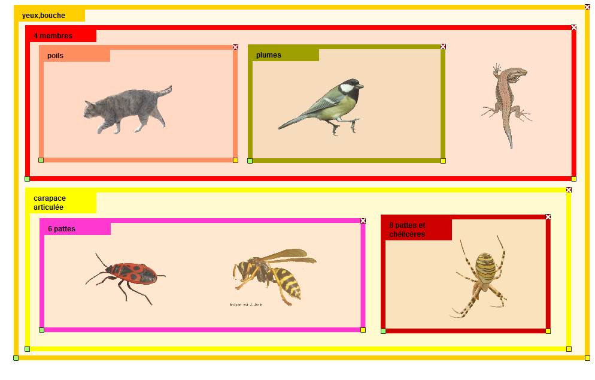
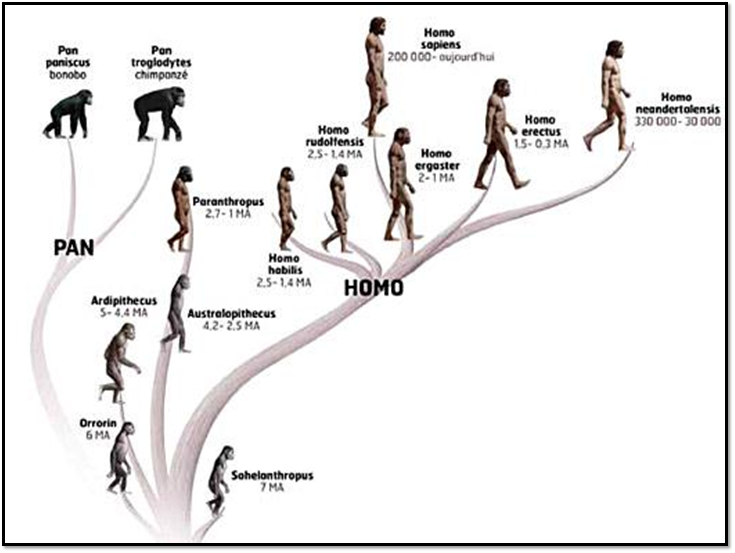
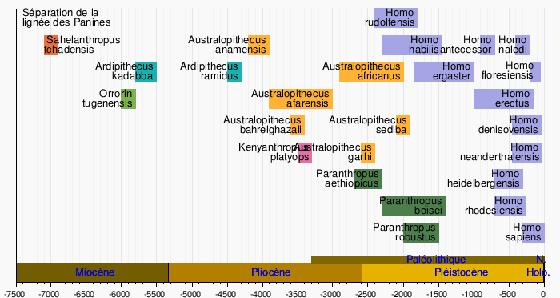
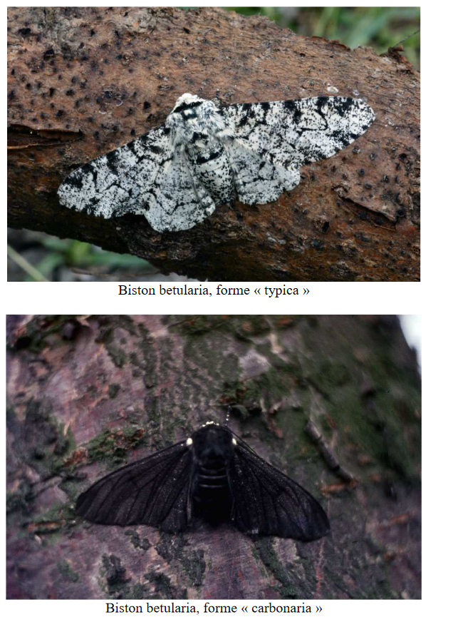

# Séquence : Evolution des êtres vivants

!!! note-prof
    si besoin d'infos

!!! question "Problématique"
    Qu'est-ce que l'évolution ?
    

## Séance 1 : Liens de parentés

!!! question "Problématique"
    Comment sont établis les liens de parentés entre les espèces actuelles et les espèces fossiles ?

[Activité Parentés entre les différents êtres vivants](../liensParente)

??? abstract "Bilan"
    La classification des êtres vivants et fondée sur des liens de parentés entre les êtres vivants. Les caractéristiques communes sont transmises de façon héréditaire par un ancêtre commun à tous ses descendants.

    Ils sont regroupés en fonction des caractères qu’ils partagent.
    Plus deux espèces partagent des caractéristiques communes donc d’ancêtres en commun, plus elles sont apparentées (proches).

    Les degrés de parenté sont représentés par un arbre de parenté.

    Tous les êtres vivants sont constitués de cellules et possèdent de l’ADN qui est une molécule universelle. Ces arguments indiquent une parenté et une origine commune à toutes les espèces.

    
    
    

## Séance 2 : La place de l'être humain dans l'évolution

!!! question "Problématique"
    Quelle est la place de l’être humain parmi les autres êtres vivants ?

[Activité La place de l'être humain](../evolHum)

??? abstract "Bilan"

    L’espèce humaine (Homo sapiens) est un vertébré (présence de vertèbres), un mammifère (présence de poils et de mamelles) et un primate (pouce opposable et ongles) classé dans le groupe des grands singes (coccyx). L’être humain résulte, comme les autres espèces, d’une série d’innovations évolutives à partir d’un ancêtre commun partagé avec les chimpanzés. Cet ancêtre commun vivait, il y a plus de 7 Ma.

    Le groupe des humains réunit l’Homo sapiens et tous les fossiles apparentés. L’évolution de ce groupe montre que les espèces fossiles ne se sont pas succédé de manière linéaire, mais que plusieurs espèces ont coexisté à certaines périodes (évolution buissonnante). Le plus vieux fossile d’Homo sapiens date de 200000 ans.

    

    

    

## Séance 3 : De nouvelles espèces

!!! question "Problématique"
    Comment les changements d’une population peuvent-ils conduire à l’apparition d’une nouvelle espèce ?

[Activité Evolution et nouvelles espèces](../speciation)

??? abstract "Bilan"
    L’apparition d’une forme nouvelle d’un caractère au cours de l’évolution peut s’expliquer par une modification au hasard du matériel génétique (génome) comme les mutations.
    
    Des espèces apparaissent quand 2 populations évoluent séparément et que la reproduction entre elles devient impossible.

### Comment expliquer l’évolution des populations ?

 

1.   Evolution des populations et sélection naturelle

Consigne 1 : A l’aide du site internet, [https://www.pedagogie.ac-nice.fr/wp-content/uploads/sites/5/productions/phalenes/](https://www.pedagogie.ac-nice.fr/wp-content/uploads/sites/5/productions/phalenes/), simuler ce qui s’est passée dans la région de Manchester de 1800 à 1950. Pour cela, il faudra :

Choisir la population initiale parmi les 3 proposées grâce aux informations des documents.

Choisir une fréquence de mutations communes à 1%

Choisir la couleur des bouleaux au début de la simulation, à l’aide des informations des documents.

Faire la simulation pendant 5 ans.

Changer la couleur des arbres

Faire la simulation pendant 10 ans

Afficher les graphiques et appeler le professeur.

Consigne 2 : A l’aide de la simulation, des documents et des graphiques obtenus, expliquer l’évolution de la population de phalènes dans la
région de Manchester.

Document 1 : Les phalènes du
bouleau.

La phalène du bouleau est un papillon de nuit. La journée, ces papillons restent immobiles sur le tronc de bouleaux. Ces papillons sont la proie des oiseaux qui les chassent principalement la journée quand ils sont posés sur les troncs.

Au début du XIXe siècle, en Grande-Bretagne, les phalènes étaient majoritairement claires. En 1848, les phalènes noires ont commencé à être de plus en plus observées dans la région de Manchester. En 1950, la majorité des phalènes de cette région étaient noires.

Document 2 : Le gène couleur chez la phalène.

Le gène qui détermine la couleur de la phalène est présent sur le chromosome 17.

Il existe sous deux allèles : l’allèle c (clair) et l’allèle F dominant (foncé).

L’ADN peut subir des mutations ce qui peut entraîner l’apparition de nouveaux allèles.

Document 3 : La région de Manchester.

En Grande-Bretagne, à partir de la moitié du XIXe siècle, la consommation de charbon a énormément augmenté à cause de l’industrialisation de la région. Cette consommation de charbon a entraîné une pollution atmosphérique.

Le bouleau est un arbre avec un tronc blanc, car il est recouvert de lichens clairs. Les troncs des bouleaux dans les régions industrialisées sont plus sombres, car les lichens clairs qui les recouvrent sont tués par la pollution atmosphérique liée au charbon.

1.   Évolution et sélection naturelle

Consigne1 : Proposer une explication aux différences entre les deux populations de souris

Consigne 2 : Justifier le terme de « sélection naturelle » pour expliquer l’évolution des populations de souris.

Document 1 : Grand hibou à cornes (Bubo virginianus).

Installé dans les régions boisées d’Amérique du Nord et d’Amérique du Sud, il se nourrit de petits mammifères comme les souris à abajoues qu’il chasse à la tombée de la nuit en distinguant la couleur de leur pelage sur le sol.

Document 2 : Souris à abajoues (Perognathus parvus) dans différents milieux de vie

Elle vit dans le sud-ouest des États-Unis. La couleur de son pelage est contrôlée par de nombreux gènes, dont le gène MRC1, qui existe en deux versions : l’allèle D (couleur du pelage sombre) (photo a et d) et l’allèle d (couleur du pelage clair) (photo b et c).
 
Document 3 : Relevés de captures de souris à abajoues dans deux milieux différents.

<table>
<tbody>
<tr class="odd">
<td></td>
<td>
Milieu A

Sol sombre
</td>
<td>
Milieu B

Sol clair
</td>
</tr>
<tr class="even">
<td>Souris au pelage sombre</td>
<td>89%</td>
<td>9%</td>
</tr>
<tr class="odd">
<td>Souris au pelage sombre</td>
<td>11%</td>
<td>91%</td>
</tr>
</tbody>
</table>

Document 4 : Définition de la sélection naturelle

Évolution de la fréquence d’un allèle dans une population sous l’effet du milieu. Dans un milieu donné, certains allèles « avantageux » favorisent la survie et donc auront plus de chance d’être transmis à la génération suivante.

Bilan : L’apparition d’une forme nouvelle d’un caractère au cours de l’évolution peut s’expliquer par une modification au hasard du matériel génétique (génome) comme les mutations.

Sous l’effet de l’environnement qui sélectionne les caractères avantageux. Si la nouvelle caractéristique apporte un avantage de survie ou de reproduction, elle va être transmise plus facilement à la descendance : c’est la sélection naturelle. (= Sélection par l’environnement des individus les mieux adaptés à leur environnement).

Au cours des générations, les populations évoluent sous l’effet des forces évolutives :

-   mutation (hasard)
-   dérive génétique (hasard)
-   sélection naturelle

### En quoi l’évolution est-elle une théorie ?

 La théorie de l’évolution, un fait scientifique.

Consigne : À partir des documents, expliquer en quoi la théorie de l’évolution est une théorie et pourquoi la question de « croire ou pas » en l’évolution biologique n’a pas de sens en cours de sciences.

Compétences travaillées : Extraire et mettre en relation des informations

Document 1 : La théorie au sens scientifique.

Le mot théorie a plusieurs sens dans la langue française. Dans le langage courant, une théorie est un ensemble d’idées sur un sujet qui relève parfois de l’opinion, sans preuve. Ces idées restent… théoriques.

En sciences, le mot théorie à une autre signification : c’est une construction méthodique qui cherche à représenter et à expliquer des phénomènes. Une théorie scientifique s’articule avec des faits, des observations, des résultats expérimentaux répétés auxquels elle donne une cohérence. C’est le cas de la théorie de l’évolution : elle n’est donc pas du tout théorique.

Document 2 : Une théorie scientifique peut évoluer

Une théorie scientifique a un statut provisoire et correspond à la vérité scientifique du moment.

« Une théorie, pour rester bonne, doit toujours se modifier avec le progrès de la science et demeurer constamment soumise à la vérification et à la critique des faits nouveaux qui apparaissent. Si l’on considérait une théorie comme parfaite et si l’on cessait de la vérifier par l’expérience scientifique, elle deviendrait une doctrine » Claude Bernard, médecin français (1813-1878).

Doctrine : ensemble de conceptions théoriques enseignées comme vraies.

Document 3 L’évolution reconnue comme un fait par les scientifiques.

« Depuis Darwin, un très grand nombre de données d’ordre divers (anatomiques, cytologiques, moléculaires, paléontologiques, etc.) ont confirmé cette théorie et l’on n’a jamais trouvé de données qui l’infirment.

C’est pourquoi E. Mayr dit que toutes ces preuves sont considérées, à ce point, comme incontestables qu’aucun biologiste ne parle plus de l’évolution comme d’une proposition théorique et que, considérant l’évolution comme un fait, aucun évolutionniste ne s’attarde plus à en chercher des preuves supplémentaires. »

Enseigner la classification et l’évolution, Monique Dupuis et Jean-Claude Hervé, 2008, éditions Hatier.

Document 4 Relations simplifiées entre savoir, opinion, croyance.

Document 5 : L’évolution

L’évolution biologique est un fait scientifique prouvé par deux types de preuves :

- des preuves expérimentales ;

- des preuves historiques, c’est-à-dire des reconstitutions à partir d’enquêtes et d’indices (le commissaire de police utilise aussi des preuves historiques quand il reconstitue, à partir d’indices et d’une enquête, le scénario d’un crime).

La théorie de l’évolution a évolué à partir des connaissances scientifiques nouvelles. Lorsque Darwin a écrit les premières bases, les notions d’ADN et de mutations n’étaient pas connues. Elles ont depuis permis de mieux expliquer l’évolution.

Bilan : L’un des fondateurs de la théorie de l’évolution est Darwin.

L’évolution biologique n’est ni une opinion ni une croyance. L’évolution repose sur un raisonnement logique qui permet d’expliquer des faits, des observations et des expériences.

Aujourd’hui, l’évolution biologique est confortée par de nombreuses preuves à la fois expérimentales et historiques.

<table>
<tbody>
<tr class="odd">
<td>Classification des êtres vivants</td>
<td>La classification des êtres vivants</td>
<td>
Caractères partagés et

classification, les grands

groupes d’êtres vivants, dont

Homo sapiens, leur parenté et leur évolution.
</td>
<td>
Formuler pb

proposer demarche exp

trouver et exploiter des infos

analyser resultats

realiser un schema graph tabl
</td>
<td>Phylogène, création d’arbres phylogénétique avec des tableaux de
caractères communs</td>
<td>4 heures</td>
</tr>
<tr class="even">
<td>Evolution, hasard et sélection naturelle</td>
<td>L’évolution du vivant au cours du temps.</td>
<td>
Mettre en évidence des faits d’évolutions des espèces et donner
des arguments en faveur de quelques mécanismes d’évolution.

Apparition et disparition

d’espèces au cours du temps (traces fossiles des premiers organismes
vivants sur Terre)
</td>
<td>
trouver et exploiter des infos

analyser résultats

realiser un schema graph tabl
</td>
<td>
(pinson de Darwin, étude de documents)

(dinosaures, observation de fossiles)
</td>
<td>4 heures</td>
</tr>
<tr class="odd">
<td>Les mécanismes de l’évolution.</td>
<td>Maintien des formes aptes à se reproduire, hasard, sélection
naturelle.</td>
<td>1e, 2e, 3e, 1 g 2p, 3p, 4p, 5p</td>
<td>phalène du bouleau serious game, jeu de hasard billes de couleurs
dés</td>
<td>4 heures</td>
<td></td>
</tr>
</tbody>
</table>

Bilan : 
L’espèce humaine (Homo sapiens) est un vertébré (présence de vertèbres), un mammifère (présence de poils et de mamelles) et un primate (pouce opposable et ongles) classé dans le groupe des grands singes (coccyx). L’être humain résulte, comme les autres espèces, d’une série d’innovations évolutives à partir d’un ancêtre commun partagé avec les chimpanzés. Cet ancêtre commun vivait, il y a plus de 7 Ma.

Le groupe des humains réunit l’Homo sapiens et tous les fossiles apparentés. L’évolution de ce groupe montre que les espèces fossiles ne se sont pas succédé de manière linéaire, mais que plusieurs espèces ont coexisté à certaines périodes (évolution buissonnante). Le plus vieux fossile d’Homo sapiens date de 200 000 ans.

## Séance 4 : Exercices

[Activité Exercices](../exercices)