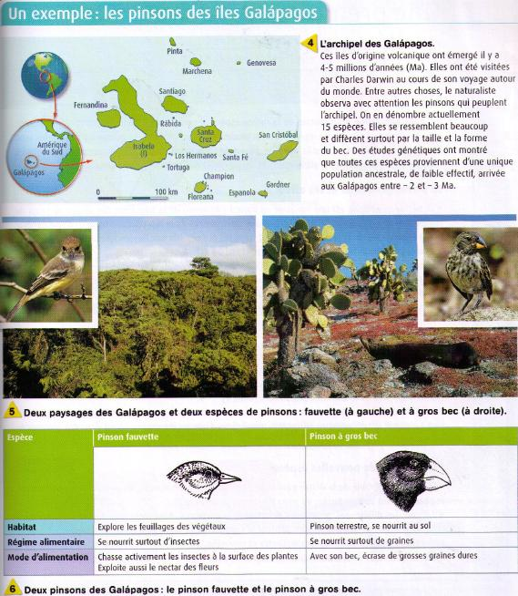

# Séquence : Evolution des êtres vivants

!!! note-prof
    si besoin d'infos

!!! question "Problématique"
    Qu'est-ce que l'évolution ?
    

## Séance 1 : De nouvelles espèces

!!! question "Problématique"
    Comment les changements d’une population peuvent-ils conduire à l’apparition d’une nouvelle espèce ?

[Activité Evolution et nouvelles espèces](../speciation)

??? abstract "Bilan"
    L’apparition d’une forme nouvelle d’un caractère au cours de l’évolution peut s’expliquer par une modification au hasard du matériel génétique (génome) comme les mutations.
    
    Des espèces apparaissent quand 2 populations évoluent séparément et que la reproduction entre elles devient impossible.

## Séance 2 : Mécanismes évolutifs

!!! question "Problématique"
    Comment expliquer l’évolution des populations ?

[Activité Mécanismes évolutifs](../mecaEvol)

??? abstract "Bilan"
    L’apparition d’une forme nouvelle d’un caractère au cours de l’évolution peut s’expliquer par une modification au hasard du matériel génétique (génome) comme les mutations.

    Sous l’effet de l’environnement qui sélectionne les caractères avantageux. Si la nouvelle caractéristique apporte un avantage de survie ou de reproduction, elle va être transmise plus facilement à la descendance : c’est la sélection naturelle. (= Sélection par l’environnement des individus les mieux adaptés à leur environnement).

    Au cours des générations, les populations évoluent sous l’effet des forces évolutives :

    -   mutation (hasard)
    -   dérive génétique (hasard)
    -   sélection naturelle

    
    
    
    
    

## Séance 35 : L'évolution, une théorie

!!! question "Problématique"
    En quoi l’évolution est-elle une théorie ?

[Activité Théorie de l'évolution](../theorieEvol)

??? abstract "Bilan"
    L’un des fondateurs de la théorie de l’évolution est Darwin.

    L’évolution biologique n’est ni une opinion ni une croyance. L’évolution repose sur un raisonnement logique qui permet d’expliquer des faits, des observations et des expériences.

    Aujourd’hui, l’évolution biologique est confortée par de nombreuses preuves à la fois expérimentales et historiques.

 

## Séance 4 : Exercices

[Activité Exercices](../exercices)