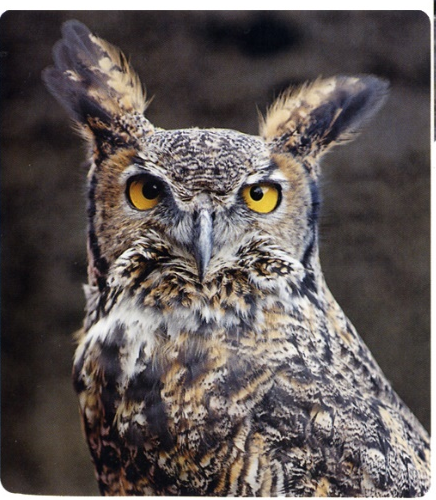
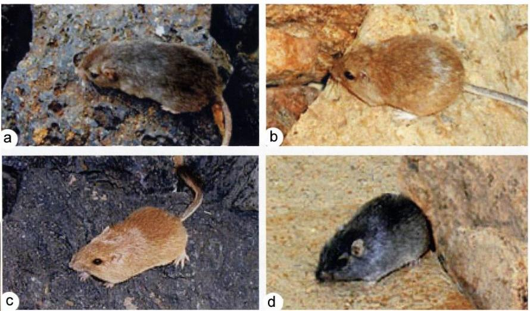

# Activité : Exercices

!!! note Compétences

    trouver et utiliser des informations 

    
??? bug Critères de réussite
    - 

## Exercice 1 Évolution et sélection naturelle

!!! warning Consignes

    1. Proposer une explication aux différences entre les deux populations de souris
    2. Justifier le terme de « sélection naturelle » pour expliquer l’évolution des populations de souris.

**Document 1 Grand hibou à cornes (Bubo virginianus).**

Installé dans les régions boisées d’Amérique du Nord et d’Amérique du Sud, il se nourrit de petits mammifères comme les souris à abajoues qu’il chasse à la tombée de la nuit en distinguant la couleur de leur pelage sur le sol.

**Document 2 Souris à abajoues (Perognathus parvus) dans différents milieux de vie**

Elle vit dans le sud-ouest des États-Unis. La couleur de son pelage est contrôlée par de nombreux gènes, dont le gène MRC1, qui existe en deux versions : l’allèle D (couleur du pelage sombre) (photo a et d) et l’allèle d (couleur du pelage clair) (photo b et c).

**Document 3 Relevés de captures de souris à abajoues dans deux milieux différents.**

<table>
<tbody>
<tr class="odd">
<td></td>
<td>
Milieu A

Sol sombre
</td>
<td>
Milieu B

Sol clair
</td>
</tr>
<tr class="even">
<td>Souris au pelage sombre</td>
<td>89%</td>
<td>9%</td>
</tr>
<tr class="odd">
<td>Souris au pelage sombre</td>
<td>11%</td>
<td>91%</td>
</tr>
</tbody>
</table>

