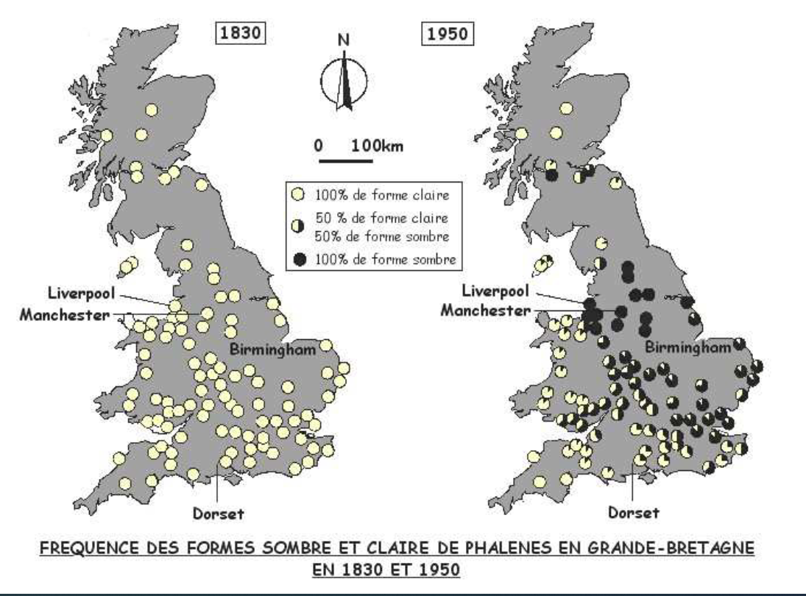

# Activité : Evolution des populations et sélection naturelle

!!! note "Compétences"

    - Interpréter 
    - Utiliser l'outil numérique

!!! warning "Consignes"

    1. . A l’aide du site internet, [https://www.pedagogie.ac-nice.fr/wp-content/uploads/sites/5/productions/phalenes/](https://www.pedagogie.ac-nice.fr/wp-content/uploads/sites/5/productions/phalenes/), réaliser le protocole  du document 1.
    2. A l’aide de la simulation, des documents et des graphiques obtenus, expliquer l’évolution de la population de phalènes dans la région de Manchester.
    
??? bug "Critères de réussite"
    - 

**Document 1 Simuler la population de phalènes dans la région de Manchester de 1800 à 1950.**

1. Choisir la population initiale parmi les 3 proposées grâce aux informations des documents.
2. Choisir une fréquence de mutations communes à 1%
3. Choisir la couleur des bouleaux au début de la simulation, à l’aide des informations des documents.
4. Faire la simulation pendant 5 ans.
5. Changer la couleur des arbres
6. Faire la simulation pendant 10 ans
7. Afficher les graphiques et appeler le professeur.

**Document 2 Les phalènes du bouleau.**

La phalène du bouleau est un papillon de nuit. La journée, ces papillons restent immobiles sur le tronc de bouleaux. Ces papillons sont la proie des oiseaux qui les chassent principalement la journée quand ils sont posés sur les troncs.

Au début du XIXe siècle, en Grande-Bretagne, les phalènes étaient majoritairement claires. En 1848, les phalènes noires ont commencé à être de plus en plus observées dans la région de Manchester. En 1950, la majorité des phalènes de cette région étaient noires.

**Document 3 Le gène couleur chez la phalène.**

Le gène qui détermine la couleur de la phalène est présent sur le chromosome 17.

Il existe sous deux allèles : l’allèle c (clair) et l’allèle F dominant (foncé).

L’ADN peut subir des mutations ce qui peut entraîner l’apparition de nouveaux allèles.

**Document 4 La région de Manchester.**

En Grande-Bretagne, à partir de la moitié du XIXe siècle, la consommation de charbon a énormément augmenté à cause de l’industrialisation de la région. Cette consommation de charbon a entraîné une pollution atmosphérique.

Le bouleau est un arbre avec un tronc blanc, car il est recouvert de lichens clairs. Les troncs des bouleaux dans les régions industrialisées sont plus sombres, car les lichens clairs qui les recouvrent sont tués par la pollution atmosphérique liée au charbon.

