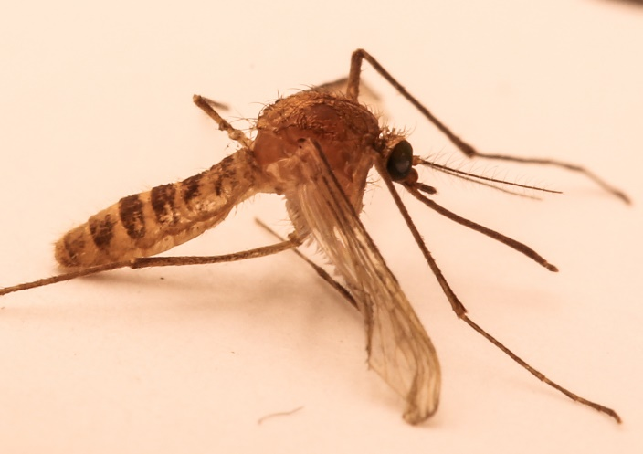

# Activité : Evolution et nouvelles espèces

!!! note "Compétences"

    Trouver et utiliser des informations 
    Construire un schema fonctionnel

!!! warning "Consignes"

    Construire un schéma fonctionnel qui montre comment à partir d’une population une nouvelle espèce peut apparaître.
    
??? bug "Critères de réussite"

    - Expliquer pourquoi on peut dire que les deux populations de moustiques appartiennent à des espèces différentes
    - Représenter les différents évènements qui ont eu lieu

**Document 1 : l’histoire des moustiques du métro londonien**

À l’origine, une seule espèce de moustique existait dans la ville de Londres : Culex pipiens pipiens.

Au cours de la réalisation des voies de métro, quelques moustiques sont entrés dans les tunnels du sous-sol. Cette petite population a progressivement évolué indépendamment de la première, du fait de la séparation géographique (sous-sol/air libre).

Les différences génétiques entre les deux espèces sont devenues telles que la reproduction entre moustiques du métro et moustiques de surface devint impossible.

C’est ainsi qu’a émergé, à partir de l’espèce d’origine, une autre espèce de moustique : Culex pipiens molestus.

**Document 2 Comparaison des deux espèces de moustiques.**

Les caractéristiques en gras sont déterminées par l’information génétique.

| | Culex pipiens molestus | Culex pipiens pipiens  |
|-------|-----------------|----------------------------|
| Localisation | Dans le métro | En surface |
| Conditions environnementales   | Températures chaudes et stables toute l’année, flaques d’eau et nourriture abondante | Hivers rigoureux, alternance des saisons |
| Cible piquée préférentiellement | Mammifères (rat, humain)    | oiseaux   |
| Cycle avec période de vie ralentie en hiver | non  | oui  |
| Reproduction dans des espaces fermés        | oui  | non  |

**Document 3 Distances génétiques de dix populations de moustiques.**

La distance génétique permet d’évaluer des différences entre des groupes d’allèles dans différentes populations de moustiques.

**Document 4 Apparition d’un nouvel allèle par mutation.**

Il arrive que l’ADN subisse des modifications naturelles de ses gènes, appelées mutations, qui se produisent par hasard et permettent l’apparition de nouveaux allèles. Si elles interviennent dans des cellules reproductrices, elles peuvent être transmises aux descendants qui porteront alors dans toutes leurs cellules le nouvel allèle.

