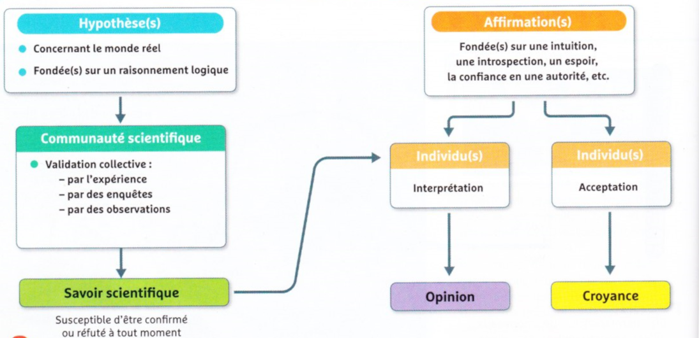

# Activité : La théorie de l’évolution, un fait scientifique.

!!! note Compétences

    Trouver et utiliser des informations 

!!! warning Consignes

    À partir des documents, expliquer en quoi la théorie de l’évolution est une théorie et pourquoi la question de « croire ou pas » en l’évolution biologique n’a pas de sens en cours de sciences.
    
??? bug Critères de réussite
    - 

**Document 1 La théorie au sens scientifique.**

Le mot théorie a plusieurs sens dans la langue française. Dans le langage courant, une théorie est un ensemble d’idées sur un sujet qui relève parfois de l’opinion, sans preuve. Ces idées restent… théoriques.

En sciences, le mot théorie à une autre signification : c’est une construction méthodique qui cherche à représenter et à expliquer des phénomènes. Une théorie scientifique s’articule avec des faits, des observations, des résultats expérimentaux répétés auxquels elle donne une cohérence. C’est le cas de la théorie de l’évolution : elle n’est donc pas du tout théorique.

**Document 2 Une théorie scientifique peut évoluer**

Une théorie scientifique a un statut provisoire et correspond à la vérité scientifique du moment.

« Une théorie, pour rester bonne, doit toujours se modifier avec le progrès de la science et demeurer constamment soumise à la vérification et à la critique des faits nouveaux qui apparaissent. Si l’on considérait une théorie comme parfaite et si l’on cessait de la vérifier par l’expérience scientifique, elle deviendrait une doctrine » Claude Bernard, médecin français (1813-1878).

Doctrine : ensemble de conceptions théoriques enseignées comme vraies.

**Document 3 L’évolution reconnue comme un fait par les scientifiques.**

« Depuis Darwin, un très grand nombre de données d’ordre divers (anatomiques, cytologiques, moléculaires, paléontologiques, etc.) ont confirmé cette théorie et l’on n’a jamais trouvé de données qui l’infirment.

C’est pourquoi E. Mayr dit que toutes ces preuves sont considérées, à ce point, comme incontestables qu’aucun biologiste ne parle plus de l’évolution comme d’une proposition théorique et que, considérant l’évolution comme un fait, aucun évolutionniste ne s’attarde plus à en chercher des preuves supplémentaires. »

Enseigner la classification et l’évolution, Monique Dupuis et Jean-Claude Hervé, 2008, éditions Hatier.

**Document 4 Relations simplifiées entre savoir, opinion, croyance.**

**Document 5 L’évolution**

L’évolution biologique est un fait scientifique prouvé par deux types de preuves :

- des preuves expérimentales ;
- des preuves historiques, c’est-à-dire des reconstitutions à partir d’enquêtes et d’indices (le commissaire de police utilise aussi des preuves historiques quand il reconstitue, à partir d’indices et d’une enquête, le scénario d’un crime).

La théorie de l’évolution a évolué à partir des connaissances scientifiques nouvelles. Lorsque Darwin a écrit les premières bases, les notions d’ADN et de mutations n’étaient pas connues. Elles ont depuis permis de mieux expliquer l’évolution.

