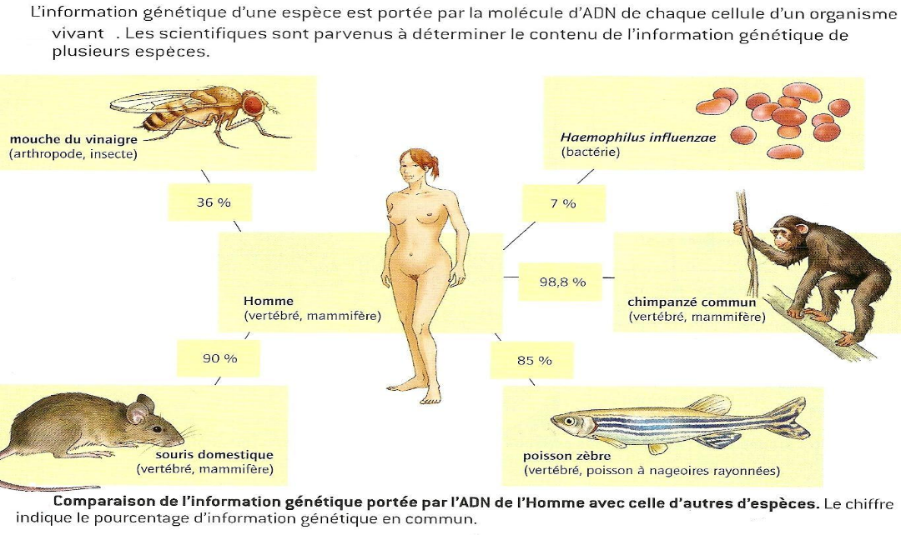

# Séquence : Evolution des êtres vivants

!!! note-prof
    si besoin d'infos

!!! question "Problématique"
    Qu'est-ce que l'évolution ?
    

## Séance 1 : Liens de parentés

!!! question "Problématique"
    Comment sont établis les liens de parentés entre les espèces actuelles et les espèces fossiles ?

[Activité Parentés entre les différents êtres vivants](../liensParente)

??? abstract "Bilan"
    La classification des êtres vivants et fondée sur des liens de parentés entre les êtres vivants. Les caractéristiques communes sont transmises de façon héréditaire par un ancêtre commun à tous ses descendants.

    Ils sont regroupés en fonction des caractères qu’ils partagent.
    Plus deux espèces partagent des caractéristiques communes donc d’ancêtres en commun, plus elles sont apparentées (proches).

    Les degrés de parenté sont représentés par un arbre de parenté.

    Tous les êtres vivants sont constitués de cellules et possèdent de l’ADN qui est une molécule universelle. Ces arguments indiquent une parenté et une origine commune à toutes les espèces.

    
    
    
    
    

## Séance 3 : Exercices

[Activité Exercices](../exercices)