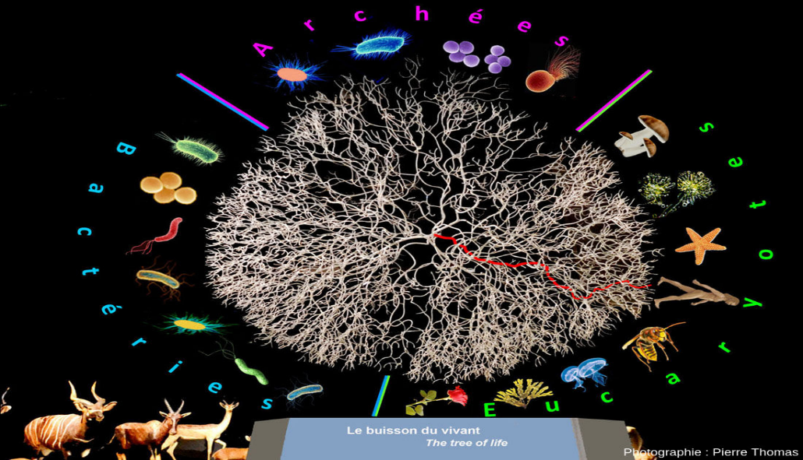

# Séquence : Evolution des êtres vivants

!!! note-prof
    si besoin d'infos

!!! question "Problématique"
    Qu'est-ce que l'évolution ?
    

## Séance 1 : Liens de parentés

!!! question "Problématique"
    Comment sont établis les liens de parentés entre les espèces actuelles et les espèces fossiles ?

[Activité Parentés entre les différents êtres vivants](../liensParente)

??? abstract "Bilan"
    La classification des êtres vivants et fondée sur des liens de parentés entre les êtres vivants. Les caractéristiques communes sont transmises de façon héréditaire par un ancêtre commun à tous ses descendants.

    Ils sont regroupés en fonction des caractères qu’ils partagent.
    Plus deux espèces partagent des caractéristiques communes donc d’ancêtres en commun, plus elles sont apparentées (proches).

    Les degrés de parenté sont représentés par un arbre de parenté.

    Tous les êtres vivants sont constitués de cellules et possèdent de l’ADN qui est une molécule universelle. Ces arguments indiquent une parenté et une origine commune à toutes les espèces.

    
    
    
    
    

## Séance 2 : La place de l'être humain dans l'évolution

!!! question "Problématique"
        Quelles sont les relations de parentés entre l’espèce humaine et les autres espèces ?

[Activité La lignée humaine](../evolHum)

??? abstract "Bilan"

    L’espèce humaine (Homo sapiens) est un vertébré (présence de vertèbres), un mammifère (présence de poils et de mamelles) et un primate (pouce opposable et ongles) classé dans le groupe des grands singes (coccyx). L’être humain résulte, comme les autres espèces, d’une série d’innovations évolutives à partir d’un ancêtre commun partagé avec les chimpanzés. Cet ancêtre commun vivait, il y a plus de 7 Ma.
    Le groupe des humains réunit l’Homo sapiens et tous les fossiles apparentés. L’évolution de ce groupe montre que les espèces fossiles ne se sont pas succédé de manière linéaire, mais que plusieurs espèces ont coexisté à certaines périodes (évolution buissonnante). Le plus vieux fossile d’Homo sapiens date de 200000 ans. 

    
    

    

    
## Séance 3 : Exercices

[Activité Exercices](../exercices)