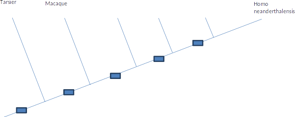
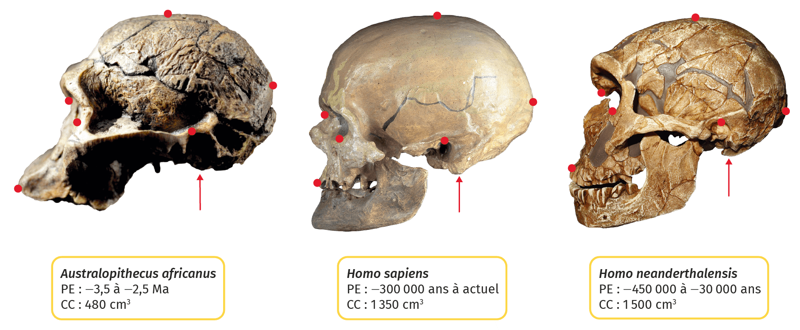
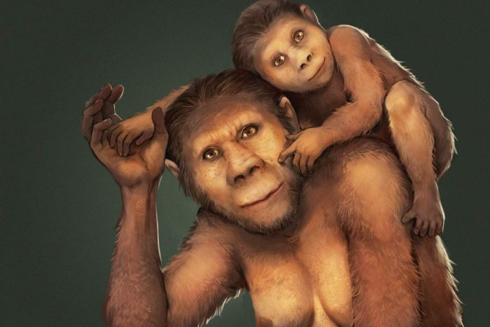
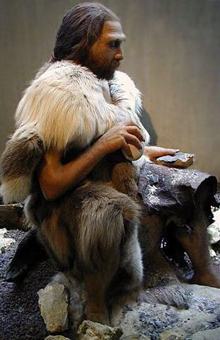
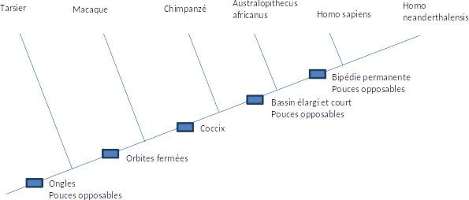

# Activité : La place de l’être humain

!!! note "Compétences"

    Trouver et utiliser des documents 

!!! warning "Consignes"

    1. Complétez l’arbre de parenté du document 3 à l’aide des informations du document 2, entourer le groupe des primates.
    2. Justifier la place de l’être humain dans le groupe des primates.
    3. À partir de la lecture de l’arbre du document 3, expliquer pourquoi on peut affirmer que l’être humain ne descend pas du chimpanzé, mais que le chimpanzé est notre plus proche parent actuel.
    4. Peut-on dire que l’australopithèque est l’ancêtre du genre Homo ou qu’Homo neanderthalensis est l’ancêtre d’Homo sapiens ? Justifier.
    
??? bug "Critères de réussite"
    - 

**Document 1 Le groupe des primates.**

Les primates sont injustement appelés « singes » dans l langage courant. 
Scientifiquement, ce groupe, inclus dans les mammifères, est caractérisé par des ongles et un pouce opposable aux mains, permettant la préhension (action de saisir un objet).

Les scientifiques pour former un groupe, dans un arbre de parenté, regroupe un ancêtre et tous ses descendants.

**Document 2 tableau des caractères de quelques primates.**

X : absent O : présent

| | Bassin élargi et court | Orbites fermées | Coccyx (= Absence de queue) | Bipédie permanente | Pouces opposables | Ongles |
|----------------------------|------------------------|-----------------|-----------------------------|--------------------|-------------------|--------|
| Tarsier | X | X | x | X | O | o |
| Macaque | X | O | O | X | O | O |
| Chimpanzé | X | O | O | X | O | O |
| Homo sapiens | O | O | O | O | O | O |
| Homo neanderthalensis | O | O | O | O | O | O |
| Australopithecus africanus | O | o | O | x | O | O |

**Document 3  Arbre de parenté des primates**

**Document 4  Période d’existence de quelques espèces de la lignée humaine.**

| Espèce    | Période d’existence  |
|----------------------------|---------------------------|
| Australopithecus africanus | -3,5 à -2,5 Ma  |
| Homo habilis | -2,6 à -1,65 Ma |
| Homo erectus | -1,9 Ma à -100000 ans |
| Homo neanderthalensis | -450000 à – 30000 ans |
| Homo sapiens | -300000 ans à aujourd’hui |

**Document 5  Quelques fossiles de crânes de la lignée humaine et représentation.**

??? note-prof "Correction :"

    

