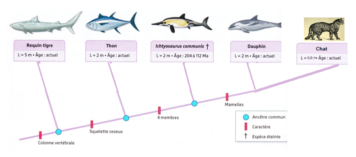
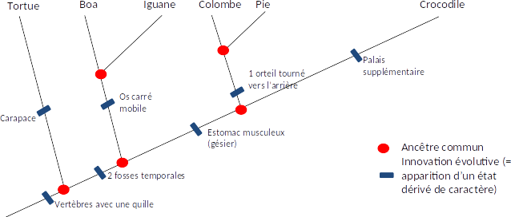

# Activité : Exercices

!!! note Compétences

    trouver et utiliser des informations 

    
??? bug Critères de réussite
    - 

## Exercice 1 : les arbres de parentés

Les mammifères sont un groupe dont les espèces possèdent des mamelles.

Les tétrapodes sont un groupe dont les espèces possèdent 4 membres.

!!! warning Consignes

    1. Citer au moins un caractère commun au thon et au dauphin.
    2. Citer un caractère présent chez le dauphin, mais absent chez l’Ichtyosaurus.
    3. Entourer en vert le groupe des mammifères et en bleu le groupe des tétrapodes.
    4. Citer un animal qui est le plus proche parent de l’Ichtyosaurus que du thon.
    5. Expliquer pourquoi on peut dire que le chat est plus proche du dauphin que l’Ichtyosaurus.

## Exercice 2 : La parenté des reptiles

!!! warning Consignes
    1. Sur le document 4, ajouter l’innovation évolutive : plumes.
    2. Quel est le caractère commun à la colombe et au crocodile.
    3. Sur le document 4, entourer le groupe des oiseaux.
    4. Sur le document 4, ajouter une branche pour placer le tyrannosaure.
    5. Compter le nombre d’ancêtres communs entre le crocodile et l’iguane et entre le crocodile et la colombe. De qui est le plus proche du crocodile ?
    6. Quel est le problème pour encadrer le groupe des reptiles ?

**Document 1 Les groupes dans les arbres de parentés.**

Les scientifiques pour former un groupe, dans un arbre de parenté, regroupe un ancêtre et tous ses descendants.

**Document 2 Les reptiles.**

Les reptiles sont considérés comme des vertébrés tétrapodes ayant la peau recouverte d’écailles et ne régulant la température de leur corps que par leur comportement, on considère comme des reptiles, l’alligator, le boa, l’iguane et la tortue, mais pas la colombe ou la pie.
Actuellement ce groupe n’existe pas dans la classification évolutive. En revanche, les oiseaux forment un groupe d’espèces caractérisées par la présence de plumes ainsi que d’un orteil tourné vers l’arrière.

**Document 3 Tableau de caractères.**

|                                | Tortue | Crocodile | Pie | Iguane | Tyrannosaure | Boa | Colombe |
|--------------------------------|--------|-----------|-----|--------|--------------|-----|---------|
| Vertèbres avec une quille      | \+     | \+        | \+  | \+     | \+           | \+  | \+      |
| Carapace                       | \+     | \-        | \-  | \-     | \-           | \-  | \-      |
| 2 fosses temporales            | \-     | \+        | \+  | \+     | \+           | \+  | \+      |
| Os carré mobile                | \-     | \-        | \-  | \+     | \-           | \+  | \-      |
| 1 orteil tourné vers l’arrière | \-     | \-        | \+  | \-     | \+           | \-  | \+      |
| Estomac musculeux (gésier)     | \-     | \+        | \+  | \-     | \+           | \-  | \+      |
| Plumes                         | \-     | \-        | \+  | \-     | \-           | \-  | \+      |
| Palais supplémentaire          | \-     | \+        | \-  | \-     | \-           | \-  | \-      |

**Document 4 Arbre de parenté de quelques espèces.**

??? note-prof "correction"
    exercice 2
    

