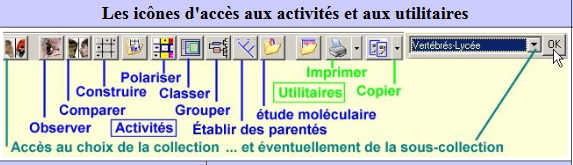

# Activité : Parentés entre les différents êtres vivants

!!! note "Compétences"

    - trouver et utiliser des informations 
 

!!! warning "Consignes"

    1. À partir des documents, montrer que tous les différents êtres vivants présentés ont un lien de parenté, vous justifierez votre réponse en écrivant l’arbre de parenté.
    2. Montrer ensuite que tous les êtres vivants ont un lien de parenté.
    
??? bug "Critères de réussite"
    - 

**Document 1 Construire un arbre de parenté avec Phylogène.**

1.  Ouvrir le logiciel Phylogène
2.  Choisir la collection « Vertébrés actuels et fossiles »
3.  Créer la matrice de caractères des espèces suivantes (Archéoptéryx, Caudipteryx, Chat, Composognathus, Crocodile, Ichtyostega, Megazostrodon, Pigeon) en utilisant les caractères (3 doigts sur le sol, ailes, fenêtre mandibulaire, mâchoire inférieure en un seul os, plumes, plus de 3 vertèbres cervicales et squelette osseux) « outil Construire »
4.  Remplir le tableau et utiliser l’outil « établir les liens de parenté »
5.  Cliquer sur l’icône « afficher les boites » et sélectionner les caractères qui nous intéressent.
6.  En cliquant sur chaque nœud (ancêtre commun), nommer les différents groupes selon leurs caractéristiques.

**Document 2 Un arbre de parenté.**

Pour tracer les relations de parentés, les scientifiques posent l’hypothèse que toutes les espèces partageant un caractère font partie ‘un même groupe et sont issus d’un ancêtre commun.

Un arbre de parenté est constitué de branches et de nœuds (points de jonction entre deux branches). Une espèce est placée au bout d’une branche. Un caractère est placé sur une branche. Un nœud représente de façon symbolique un ancêtre commun.

Les scientifiques pour former un groupe, dans un arbre de parenté, regroupe un ancêtre et tous ses descendants.

**Document 3 Cellules et ADN**

Tous les êtres vivants sont composés de cellules, certains n'en ont qu'une, les unicellulaires ; d'autres en ont plusieurs, les pluricellulaires. 

A l'intérieur de ces cellules, on retrouve des molécules d'ADN qui contiennent l'information génétique. 
Ces molécules sont semblables chez tous les êtres vivants.
Des expériences de transgenèse (transfert de l'ADN d'un être vivant à un autre) montre que les molécules d'ADN d'une espèce peuvent être utilisés par des cellules d'une autre espèce.

**Document 4 Définition**

Caractère exclusif : caractère propre à un groupe et uniquement à ce
groupe.
