# Séquence : La reproduction chez l'espèce humaine

!!! note-prof
    si besoin d'infos

!!! question "Problématique"
    Quels sont les éléments à prendre en compte pour répondre à un besoin ?

    
### Document d’appel :

## Séance 1 : Nom

!!! question "Problématique"
    Quelles sont les différences anatomiques qui se mettent en place au cours du développement d’un individu ?

[Activité nom activité](../lien vers l'activité)

??? abstract "Bilan"
    Lors du développement embryonnaire, les appareils reproducteurs internes et externes deviennent différents chez l’homme et chez la femme, ce sont les caractères sexuels primaires.

    À la puberté, d’autres différences apparaissent entre l’homme et la femme, ce sont les caractères sexuels secondaires (par exemple : développement des seins, développement du pénis…)

    L’appareil reproducteur interne de la femme est constitué des ovaires, des trompes, de l’utérus et du vagin. Et son appareil reproducteur externe, appelé vulve, est constitué de l’orifice du vagin, des petites lèvres, des grandes lèvres et du clitoris.

    L’appareil reproducteur interne de l’homme est constitué des testicules, du canal déférent et de l’urètre. Et son appareil reproducteur externe est constitué des bourses et du pénis.

Activité Les différences anatomiques entre un homme et une femme.

Consigne : Construire un tableau en indiquant pour l’homme et la femme : la période de puberté, les 2 caractères sexuels primaires, 2 caractères sexuels secondaires et le moment d’apparition des caractères sexuels primaires.

Compétence travaillée : Construire un tableau

**Document 1 Photographie des appareils reproducteurs externes de l’homme et de la femme à différents moments du développement embryonnaire.**

**Document 2 Des transformations liées à la puberté**

L’âge de la puberté est différent en fonction des individus. Dans la majorité des cas, elle commence :

-   entre 9 et 13 ans chez les filles
-   entre 10,5 et 14 ans chez les garçons

**Document 3 l’appareil reproducteur de la femme**

**Document 4 l’appareil reproducteur de l’homme (seules les légendes en gras font partie de l’appareil reproducteur)**

**Document 5 Les caractères sexuels**

On appelle caractère sexuel primaire, l’ensemble des différences anatomiques qui différencie un homme d’une femme pendant la grossesse et à la naissance.

On appelle caractère sexuel secondaire, l’ensemble des différences anatomiques qui différencie un homme d’une femme à partir de la puberté.

Tous ces caractères sont variables d’un individu à l’autre même du même sexe.

??? note-prof "Correction"

    <table>
    <tbody>
    <tr class="odd">
    <td></td>
    <td>Femme</td>
    <td>Homme</td>
    </tr>
    <tr class="even">
    <td>Période de puberté</td>
    <td>10,5 – 16,5 ans</td>
    <td>12 – 18 ans</td>
    </tr>
    <tr class="odd">
    <td>Caractères sexuels primaires</td>
    <td>Appareil reproducteur externe : 
    Vulve (petite lèvres, grandes lèvres, clitoris et vagin) 
    Appareil reproducteur interne : 
    Ovaires 
    Trompe 
    Utérus 
    vagin</td>
    <td>Appareil reproducteur externe : 
    Pénis 
    Bourse 
    Appareil reproducteur interne 
    Testicule 
    Épididyme 
    Canal déférent 
    Vésicule séminale 
    Prostate 
    Urètre</td>
    </tr>
    <tr class="even">
    <td>Caractères sexuels secondaires</td>
    <td>Seins 
    Développement des hanches 
    Poils pubiens et poils sous les bras 
    règles</td>
    <td>Développement musculature 
    Voix grave 
    Développement taille testicules 
    Développement taille pénis 
    Poils pubiens, sous les bras et sur le visage… 
    éjaculations</td>
    </tr>
    <tr class="odd">
    <td>Moment d’apparition des caractères sexuels primaires</td>
    <td>Après 13 semaines du développement embryonnaire</td>
    <td>Après 13 semaines du développement embryonnaire</td>
    </tr>
    </tbody>
    </table>

Séance 2 :

!!! question "Problématique"
    Comment expliquer les changements liés à la puberté ?

### Activité  L’origine de la puberté.

Consigne 1 : Ajouter une courbe représentant l’évolution de la quantité de testostérone en fonction de l’âge sur le graphique.

Consigne 2 : Décrire les deux courbes du graphique.

Consigne 3 : Répondre au problème en utilisant les documents

Compétences travaillées : Construire un graphique et décrire un graphique

**Document 1 ____________________________________________________________________**

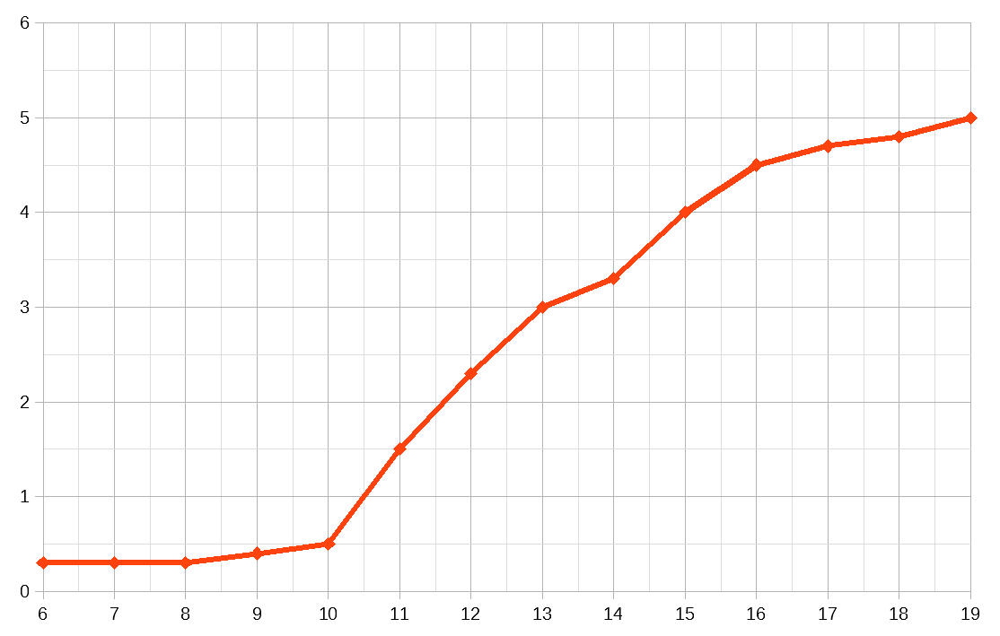

**Document 2 Tableau de la quantité d’hormones sexuelles en fonction de l’âge**

|                 | Quantité d’hormones chez l’homme         | Quantité d’hormones chez la femme      |
| Âge (en années) | Testostérone (en unités arbitraires, ua) | Œstrogènes (en unités arbitraires, ua) |
|-----------------|------------------------------------------|----------------------------------------|
| 6               | 0,2                                      | 0,3                                    |
| 9               | 0,2                                      | 0,4                                    |
| 12              | 0,5                                      | 2,3                                    |
| 14              | 1                                        | 3,3                                    |
| 16              | 3                                        | 4,5                                    |
| 18              | 4                                        | 4,8                                    |
| 19              | 4,5                                      | 5                                      |

**Document 3 Deux hormones sexuelles, la testostérone et l’œstrogène**

La testostérone est une hormone sexuelle fabriquée par l’homme

L’œstrogène est une hormone sexuelle fabriquée par la femme, c’est une hormone ovarienne

Définition d’hormone : substance chimique fabriquée par un organe et libéré dans le sang provoquant des modifications de certains organes (organes cibles de l’hormone).

Document 4 : La puberté.**

La puberté commence vers 10 ans chez la femme et vers 14 ans chez l’homme.

Chez certaines personnes la puberté ne se déclenche pas, des traitements existent. Par exemple, les femmes atteintes du syndrome de Turner, sont de petites tailles, stériles, leurs seins ne sont pas développés et elles n’ont pas leurs règles. Pour les traiter, on leur injecte des hormones ovariennes

**Document 5 Décrire une courbe d’un graphique.**

Commencer par résumer les informations concernant le graphique (le titre).

Pour décrire le graphique, il faut commencer par définir les différents tronçons qui permettent de visualiser les changements d’évolution de la courbe.

Décrire la courbe en utilisant les verbes suivants : augmenter, diminuer, stagner (ou rester stable). On ne parle pas du graphique ou de la courbe, mais de la variable qui est représentée.

Pour décrire le graphique, utiliser la structure de phrase suivante, sans oublier les unités :

De (valeur A sur l’axe horizontal) et (valeur B sur l’axe horizontal), (la variable) \[verbe\] de (valeur A sur l’axe vertical) à (valeur B sur l’axe vertical)

??? note-prof "Correction :"

    

    **Document 1 Graphique de la quantité d’hormones sexuelles en fonction de l’âge**

    Ce graphique représente la quantité d’hormones sexuelles en fonction de l’âge.

    Pour la quantité d’œstrogènes :

    De 6 à 19 ans, la quantité d’œstrogènes augmente de 0,3 à 5 ua.

    Pour la quantité de testostérone :

    De 6 à 9 ans, la quantité de testostérone reste stable à 0,2 ua.

    Puis de 9 à 19 ans, la quantité de testostérone augmente de 0,2 à 4,5 ua.

Bilan :

À la puberté, les taux d’hormones sexuelles (testostérone chez l’homme et œstrogène chez la femme) augmentent, ce qui est responsable des changements observés à la puberté.

Définition hormone : substance chimique fabriquée par un organe et libérée dans le sang provoquant des modifications de certains organes (organes cibles de l’hormone). Les hormones sont un moyen de communication dans notre corps.

 ### Comment sont produites les cellules reproductrices ?

### Activité  Les cellules reproductrices
 
Consigne 1 : À partir de l’observation de la lame et du document 1, explique où sont produits les spermatozoïdes.

Consigne 2 : À l’aide des informations du document 3, légende la photo du document 2.

Consigne 3 : Faire un tableau comparant les spermatozoïdes et les ovules du point de vue de la taille, du nombre, de la durée de vie et de la mobilité.

Aide :

Avoir retrouvé les différentes zones présente dans le document 1 sur la lame

Avoir identifié les spermatozoïdes.

Compétence travaillée : faire un dessin d’observation et construire un tableau

**Document 1 Photo légendée d’une coupe de testicules.**

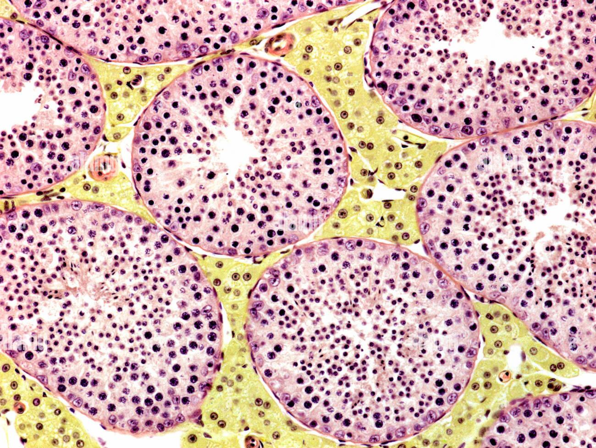

**Document 2  Photo de spermatozoïdes de taureau MO x600.**

**Document 3 Les spermatozoïdes.**

Les spermatozoïdes sont les cellules reproductrices de l’homme.

Il est composé de deux parties :

- La tête : qui mesure 5 µm
- Le flagelle qui mesure 60 µm

Lors d’une éjaculation, entre 200 et 300 millions de spermatozoïdes sont libérés. Ils ont une durée de 3 à 5 jours.

Ces spermatozoïdes peuvent atteindre la vitesse de 60 µm par seconde.

**Document 4 Les ovules.**

Les ovules sont les cellules reproductrices de la femme.

C’est une cellule ronde d’un diamètre de 120 µm.

Lors de l’ovulation, un seul ovule est libéré.

L’ovule ne peut pas se déplacer tout seul.

Ils ont une durée de 1 à 2 jours.

??? note-prof "Correction :"

    |          | Spermatozoïde                  | ovule             |
    |----------|--------------------------------|-------------------|
    | taille   | 65 µm, plus petit              | 120 µm, plus gros |
    | Nombre   | Plusieurs millions             | Un seul           |
    | Mobilité | Se déplace à 60 µm par seconde | immobile          |

Bilan :

Les gamètes** (=**cellules reproductrices) sont produites par les gonades.

Chez les hommes, les spermatozoïdes sont produits par les testicules, en continu, à partir de la puberté. Le sperme contient du liquide séminal et des spermatozoïdes.

Chez les femmes, les ovules sont émis de façon cyclique (1 par mois environ), à partir de la puberté jusqu’à la ménopause.

 ### Comment est contrôlé le fonctionnement de l’appareil reproducteur ?

### Activité  Le contrôle du fonctionnement de l’appareil reproducteur 

Consigne 1 : Déterminer les différents organes et hormones impliqués dans le fonctionnement de l’appareil reproducteur en indiquant leur effet.

Consigne 2 : Construire un schéma fonctionnel qui montre le contrôle du fonctionnement de l’appareil reproducteur.

**Document 1 Quelques troubles du fonctionnement de l’appareil reproducteur**

À l’hôpital, des patients sont suivis pour des troubles du fonctionnement de l’appareil reproducteur.

-   Cas n°1 : homme qui a eu une puberté tardive et qui a des caractères
    sexuels secondaires peu développés (faibles pilosité, testicules de
    petite taille). Sa maladie est due à un dysfonctionnement d’une zone
    du cerveau reliée à l’hypophyse.
-   Cas n°2 : homme souffrant de maux de tête et de troubles de
    l’érection. L’analyse de son sperme montre qu’il en produit peu et
    que ses spermatozoïdes sont peu fécondants. Une IRM de son cerveau
    révèle une tumeur bénigne à l’hypophyse.
-   Cas n°3 : femme atteinte d’une tumeur à l’hypophyse. Sa maladie a
    notamment provoqué l’arrêt de des ovulations et de ses règles, alors
    qu’elle n’est pas en période de ménopause.

**Document 2 L’hypophyse, une petite glande du cerveau qui sécrète des hormones.**

L’hypophyse est une petite glande située à la base du cerveau. Elle peut être visualisée grâce à une imagerie par résonance magnétique (IRM) du cerveau.

L’hypophyse est un organe producteur d’hormones (les hormones hypophysaires).

L’hypophyse libère les hormones qu’elle fabrique dans la circulation sanguine.

**Document 3 Rôle de l’hypophyse dans le déclenchement de la puberté.**

<table>
<tbody>
<tr class="odd">
<td>Expériences</td>
<td>Contenu du sang</td>
<td>Résultats</td>
</tr>
<tr class="even">
<td>
Souris mâles 
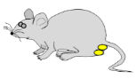

(témoins)
</td>
<td>Dioxygène, glucides, hormones cérébrales</td>
<td>Puberté normale et production de testostérone</td>
</tr>
<tr class="odd">
<td>
 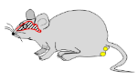 Souris mâles ayant subi une
hypophysectomie

Hypophysectomie : ablation de l’hypophyse
</td>
<td>Dioxygène, glucides</td>
<td>
Diminution de la taille des testicules et du nombre de
spermatozoïdes produits

arrêt de la production de testostérone
</td>
</tr>
<tr class="even">
<td>
Souris mâles ayant subi une hypophysectomie avec injection d’hormones produites par
l’hypophyse (LH et FSH)</td>
<td>Dioxygène, glucides, hormones cérébrales</td>
<td>
Augmentation de la taille des testicules et du nombre de
spermatozoïdes produits

Reprise de la production de testostérone
</td>
</tr>
</tbody>
</table>

**Document 4 Origine des caractères sexuels secondaires chez le coq.**

Contrairement au coq le chapon adulte n’a pas de crête.

| Expériences               | Résultats             |
|-------------------------------------------------------------------------------------------------|-----------------------|
|  Des testicules de coq sont greffés à un chapon (coq castré à la naissance) sous la peau en relation avec la circulation sanguine  | La crête se développe |
|  Une hormone sexuelle masculine extraite de testicule de coq est injecté dans le sang d’un chapon .                               |                       |

**Document 5 Activité hypophysaire sur le fonctionnement des ovaires et de l’utérus**

<table>
<tbody>
<tr class="odd">
<td>Souris témoins</td>
<td>Souris femelles ayant subi une hypophysectomie (ablation de
l’hypophyse)</td>
<td>Souris femelles ayant subi une hypophysectomieavec
injection d’hormones produites par l’hypophyse (LH et FSH)</td>
<td>Ovariectomie et hypophysectomieavec injection d’hormones
produites par l’hypophyse (LH et FSH)</td>
</tr>
<tr class="even">
<td>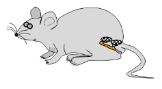</td>
<td></td>
<td></td>
<td></td>
</tr>
<tr class="odd">
<td>Activité ovarienne normale 
et fonctionnement cyclique 
normal de l’utérus 
</td>
<td>Pas d’activité ovarienne (ni 
ovulation, ni sécrétion 
hormonale) et pas d’activité 
cyclique de l’utérus</td>
<td>Reprise d’activité des ovaires 
(ovulation et sécrétion 
hormonale) et de l’activité 
cyclique de l’utérus</td>
<td>Pas d’activité ovarienne et 
pas d’activité cyclique de 
l’utérus</td>
</tr>
</tbody>
</table>

??? note-prof "Correction"

    Dans le document 1, on voit que des patients avec des troubles au niveau
    de l’hypophyse ont des problèmes dans le fonctionnement de leur appareil
    reproducteur, donc l’hypophyse doit contrôler l’appareil reproducteur

    Dans le document 2 : on voit que l’hypophyse une glande du cerveau

Bilan :

Chez les êtres humains, l’hypophyse (dans le cerveau) contrôle les testicules ou les ovaires grâce à des hormones hypophysaires (LH et FSH). En réponse, les gonades (ovaires ou testicules) produisent des hormones sexuelles (testostérone par les testicules et œstrogènes et progestérones par les ovaires). Ce sont hormones sexuelles qui permettent l’apparition et le maintien des caractères sexuels secondaires et la production de cellules reproductrices.

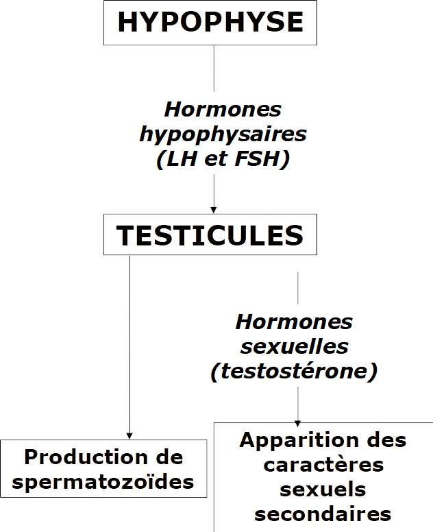

### Activité  

   ### Activité  Le contrôle hormonal du fonctionnement de l’appareil reproducteur de la femme

Consigne 1 : Analyser l’expérience du document 1 pour vérifier l’hypothèse que l’utérus permet l’apparition des caractères sexuels secondaires

Consigne 2 : Analyser les expériences du document 1 pour vérifier l’hypothèse que les ovaires permettent l’apparition des caractères sexuels secondaires.

Consigne 3 : En utilisant les documents 1, 2, 3, répondre au problème par un schéma fonctionnel.

Compétences travaillées : analyser une expérience et construire un schéma fonctionnel

**Document 1  expériences sur le fonctionnement de l’appareil reproducteur**

Dans cette expérience, le fonctionnement correct de l’appareil reproducteur peut être visualisé par l’apparition de caractères sexuelles secondaires lors de la puberté.

<table>
<tbody>
<tr class="odd">
<td>Lots</td>
<td>Lot n° 1</td>
<td>Lot n° 2</td>
<td>Lot n° 3</td>
</tr>
<tr class="even">
<td>Protocole</td>
<td>
Souris femelles

(témoins)
</td>
<td>
Souris femelles sans utérus
</td>
<td>
Souris femelles castrées

Castration : ablation des testicules ou des ovaires avant la puberté

</td>
</tr>
<tr class="odd">
<td></td>
<td>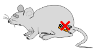</td>
<td></td>
<td></td>
</tr>
<tr class="even">
<td>Résultats</td>
<td></td>
<td></td>
<td></td>
</tr>
</tbody>
</table>

Document 2 : Des hormones ovariennes.

Les ovaires sécrètent des hormones sexuelles qui sont les œstrogènes et la progestérone.

Ces deux hormones permettent l’ovulation, c’est-à-dire la libération d’un ovule et l’apparition des caractères sexuels secondaires.

Document 3 : Le contrôle des ovaires.

Des expériences ont permis de conclure que l’hypophyse contrôle le fonctionnement des ovaires.

L’hypophyse libère des hormones, LH et FSH qui agissent sur les ovaires et contrôlent leur fonctionnement.

??? note-prof "Correction"

<table>
<tbody>
<tr class="odd">
<td>Hypothèse :</td>
<td>Les ovaires permettent l’apparition des caractères sexuels
secondaires.</td>
</tr>
<tr class="even">
<td>Protocole (comparer le test et le témoin, quel paramètre
change) :</td>
<td>Témoin : souris (lot 1) 
Test : Souris castrées (lot 2)</td>
</tr>
<tr class="odd">
<td>Résultats attendus 
 
</td>
<td>Les souris castrées (lot 2) ne devraient pas avoir de caractères
sexuels secondaires alors que les souris témoins (lot 1) devraient en
avoir</td>
</tr>
<tr class="even">
<td>Comparaison des résultats : </td>
<td>Les souris castrées (lot 2) n’ont pas de caractères sexuels
secondaires alors que les souris témoins (lot 1) en ont.</td>
</tr>
<tr class="odd">
<td>Interprétation :</td>
<td>L’hypothèse est validée, les ovaires permettent l’apparition des
caractères sexuels secondaires.</td>
</tr>
</tbody>
</table>

<table>
<tbody>
<tr class="odd">
<td>Hypothèse :</td>
<td>Les œstrogènes et la progestérone produites par les ovaires permet
l’apparition des caractères sexuels secondaires.</td>
</tr>
<tr class="even">
<td>Protocole (comparer le test et le témoin, quel paramètre
change) :</td>
<td>Témoin : souris (lot 1) 
Test : Souris castrées avec injection d’œstrogènes et de progestérone (lot 3)</td>
</tr>
<tr class="odd">
<td>Résultats attendus 
 
</td>
<td>Les souris castrées avec une injection d’œstrogènes et de progestérone (lot 3) devraient avoir une apparition des caractères sexuels secondaires comme les souris témoins (lot 1).</td>
</tr>
<tr class="even">
<td>Comparaison des résultats :</td>
<td>Les souris castrées avec une injection d’œstrogènes et de progestérone (lot 3) ont eu l’apparition des caractères sexuels secondaires comme les souris témoins (lot 1).</td>
</tr>
<tr class="odd">
<td>Interprétation :</td>
<td>L’hypothèse est validée, les œstrogènes et la progestérone produites par les ovaires permet l’apparition des caractères sexuels secondaires.</td>
</tr>
</tbody>
</table>

<table>
<tbody>
<tr class="odd">
<td>Hypothèse :</td>
<td>L’hypophyse contrôle le fonctionnement des ovaires.</td>
</tr>
<tr class="even">
<td>Protocole :</td>
<td>Témoin : souris (lot 1) 
Test : Souris sans hypophyse (lot 2)</td>
</tr>
<tr class="odd">
<td>Résultats attendus :</td>
<td>Les souris témoin, avec une hypophyse, devraient avoir un fonctionnement normal des ovaires, alors que les souris test, sans hypophyse, ne devraient pas avoir un fonctionnement normal des ovaires.</td>
</tr>
<tr class="even">
<td>Comparaison des résultats : </td>
<td>Les souris sans hypophyse (lot 2) n’ont pas d’activité normale des ovaires et ne produisent pas d’œstrogènes et de progestérone alors que les souris témoins (lot 1) ont une activité normale et en produisent.</td>
</tr>
<tr class="odd">
<td>Interprétation :</td>
<td>L’hypothèse est validée, l’hypophyse contrôle le fonctionnement des ovaires.</td>
</tr>
</tbody>
</table>

<table>
<tbody>
<tr class="odd">
<td>Hypothèse :</td>
<td>La LH et la FSH produites par l’hypophyse contrôlent le fonctionnement des ovaires.</td>
</tr>
<tr class="even">
<td>Protocole :</td>
<td>Témoin : souris (lot 1) 
Test : Souris sans hypophyse avec injection de LH et FSH (lot 3)</td>
</tr>
<tr class="odd">
<td>Résultats attendus :</td>
<td>Les souris témoin, avec une hypophyse, devraient avoir un fonctionnement normal des ovaires, comme les souris test, sans hypophyse et avec une injection de LH et FSH.</td>
</tr>
<tr class="even">
<td>Comparaison des résultats :</td>
<td>Les souris sans hypophyse avec une injection de LH et de FSH (lot 3) produisent de la progestérone et des œstrogènes et ont une activité normale des ovaires comme les souris témoins (lot 1).</td>
</tr>
<tr class="odd">
<td>Interprétation :</td>
<td>L’hypothèse est validée, la LH et la FSH contrôlent le fonctionnement des ovaires.</td>
</tr>
</tbody>
</table>

#### Le contrôle de l'apparition des caractères sexuels secondaires de la femme

Document 2 : expérience n° 2

<table>
<tbody>
<tr class="odd">
<td>Lots</td>
<td>Lot n° 1</td>
<td>Lot n° 2</td>
<td>Lot n° 3</td>
</tr>
<tr class="even">
<td>Protocole</td>
<td>
Souris femelles

(témoins)
</td>
<td>
Souris femelles castrées

Castration : ablation des testicules ou des ovaires avant la puberté

</td>
<td>Souris femelles castrées avec injection d’œstrogènes et de progestérone produite par les ovaires.</td>
</tr>
<tr class="odd">
<td></td>
<td></td>
<td></td>
<td></td>
</tr>
<tr class="even">
<td>Résultats</td>
<td></td>
<td></td>
<td></td>
</tr>
</tbody>
</table>

Document 2 : expérience n° 2

<table>
<tbody>
<tr class="odd">
<td>Lots</td>
<td>Lot n° 1</td>
<td>Lot n° 2</td>
<td>Lot n° 3</td>
</tr>
<tr class="even">
<td>Protocole</td>
<td>
Souris femelles

(témoins)
</td>
<td>
Souris femelles ayant subi une hypophysectomie<em> </em>

Hypophysectomie : ablation de l’hypophyse
</td>
<td>Souris femelles ayant subi une hypophysectomieavec
injection d’hormones produites par l’hypophyse (LH et FSH)</td>
</tr>
<tr class="odd">
<td></td>
<td></td>
<td></td>
<td></td>
</tr>
<tr class="even">
<td>Résultats</td>
<td></td>
<td></td>
<td></td>
</tr>
</tbody>
</table>

Ces expériences nous permettent de conclure que l’hypophyse contrôle le
fonctionnement des ovaires grâce à la production de LH et FSH.

 ### 

### Activité  **Le cycle de l’utérus**

Consigne 1 : Réaliser les 4 expériences du doc 1 et compléter le tableau du document 2. *1 point)

Consigne 2 : À partir des expériences 1 et 2, déduisez le rôle des ovaires dans le cycle de l’utérus. Justifier votre réponse à partir des résultats d’expériences. (1,5 points)

Consigne 3 : À partir des expériences 3 et 4, précisez la nature de la communication entre les ovaires et l’utérus. Justifier votre réponse à partir des résultats d’expériences. (1,5 points)

Consigne 4 : En utilisant le document 4 et vos résultats précédents, proposer une hypothèse permettent d’expliquer les variations d’épaisseur de la paroi de l’utérus au cours du cycle. (1 point)

**Document 1 Protocole expérimental.**

Lancez le logiciel « Cycles.exe ».

Expérience 1 :

Cliquez sur l’icône « Organes en place » (en haut à droite)  
Cliquez sur le bouton « Résultats » (en bas)

Visionnez le résultat au niveau de la couche superficielle de la paroi de l’utérus et notez vos observations dans le tableau (expérience 1

Expérience 2 :

Cliquez sur l’icône « Ablations » (en haut à droite)  
Retirez chaque ovaire et déposez-les dans la cuvette se trouvant à droite. Pour cela, au niveau de l’ovaire, cliquez sur le bouton gauche de la souris et tout en maintenant appuyé le bouton, déplacez l’ovaire dans la cuvette.  
Cliquez sur le bouton « Résultats » (en bas)

Visionnez le résultat au niveau de la couche superficielle de la paroi de l’utérus et notez vos observations dans le tableau (expérience 2

Expérience 3 :

Cliquez sur l’icône « Ablations/greffes » (en haut à droite)  
Retirez chaque ovaire et déposez les dans la cuvette verte du haut . (Au niveau de l’ovaire, cliquez sur le bouton gauche de la souris et tout en maintenant appuyé le bouton, déplacez l’ovaire dans la cuvette).  
Prenez les deux ovaires de la cuvette du bas et tout en maintenant appuyé le bouton gauche de la souris, déplacez-les au niveau de l’abdomen (au-dessus de l’utérus) pour pouvoir les greffer.  
Cliquez sur le bouton « Résultats » (en bas)

Visionnez le résultat au niveau de la couche superficielle de la paroi de l’utérus et notez vos observations dans le tableau (expérience 3)

Expérience 4 :

Cliquez sur l’icône « Ablations/Injections » (en haut à droite)  
Retirez chaque ovaire et déposez les dans la cuvette verte du haut . (Au niveau de l’ovaire, cliquez sur le bouton gauche de la souris et tout en maintenant appuyé le bouton, déplacez l’ovaire dans la cuvette).  
Prenez la seringue jaune et tout en maintenant appuyé le bouton gauche de la souris, déplacez-la au niveau d’une cuisse pour injecter les extraits ovariens.  
Cliquez sur le bouton « Résultats » (en bas)

Visionnez le résultat au niveau de la couche superficielle de la paroi de l’utérus et notez vos observations dans le tableau (expérience 4) 

**Document 2 Tableau des résultats des expériences**

<table>
<tbody>
<tr class="odd">
<td></td>
<td>Description de l’expérience</td>
<td>Résultats observés au niveau de la couche superficielle de la paroi
de l’utérus.</td>
</tr>
<tr class="even">
<td>Expérience 1 
(expérience témoin)</td>
<td>Guenon pubère témoin.</td>
<td></td>
</tr>
<tr class="odd">
<td>Expérience 2</td>
<td>Guenon ayant subi une ablation des ovaires</td>
<td></td>
</tr>
<tr class="even">
<td>Expérience 3</td>
<td>Guenon ayant subi une ablation des ovaires. 
Puis greffe d’ovaires reliés à l’organisme par des vaisseaux sanguins.
Les communications nerveuses ne sont pas rétablies.</td>
<td></td>
</tr>
<tr class="odd">
<td>Expérience 4</td>
<td>Guenon ayant subi une ablation des ovaires. Puis injection
d’extraits ovariens dans le sang (ces extraits ovariens contiennent deux
hormones sexuelles : œstrogènes et progestérone.)</td>
<td></td>
</tr>
</tbody>
</table>

**Document 3 La communication entre les organes.**

Nos organes communiquent entre-eux. Il existe deux types de communication.

- Communication nerveuse : La communication nerveuse se manifeste par des signaux électriques constituant des messages. Ces messages sont rapidement conduits dans un seul sens par des chaînes de neurones, les nerfs.

- Communication hormonale : Une hormone est une substance produite par des cellules. Elle est libérée en faible quantité dans le sang qui la véhicule. Elle se fixe sur des récepteurs de certains organes dits organes-cibles, dont elle modifie l’activité.

**Document 4 Le cycle utérin.**

Le début du cycle féminin est défini par le premier jour des règles et dure en moyenne 28 jours.

Les règles sont constituées de lambeaux de muqueuse utérine (=partie supérieure de la paroi de l’utérus qui se détache) et de sang. Les règles se manifestent par écoulement de sang de 5 à 25 ml sur une durée de 3 à 6 jours.

Au cours du cycle, un ovule sera libéré, c’est l’ovulation.

??? note-prof "Correction :"

    **Document 2 Tableau des résultats des expériences**

    <table>
    <tbody>
    <tr class="odd">
    <td></td>
    <td>Description de l’expérience</td>
    <td>Résultats observés au niveau de la couche superficielle de la paroi
    de l’utérus.</td>
    </tr>
    <tr class="even">
    <td>Expérience 1 
    (expérience témoin)</td>
    <td>Guenon pubère témoin.</td>
    <td>La paroi s’épaissit puis elle s’amincit enfin des morceaux se
    détachent.</td>
    </tr>
    <tr class="odd">
    <td>Expérience 2</td>
    <td>Guenon ayant subi une ablation des ovaires</td>
    <td>La paroi ne change pas et reste fine</td>
    </tr>
    <tr class="even">
    <td>Expérience 3</td>
    <td>Guenon ayant subi une ablation des ovaires. 
    Puis greffe d’ovaires sous la peau, reliés à l’organisme par des
    vaisseaux sanguins. Les communications nerveuses ne sont pas
    rétablies.</td>
    <td>La paroi s’épaissit puis elle s’amincit enfin des morceaux se
    détachent.</td>
    </tr>
    <tr class="odd">
    <td>Expérience 4</td>
    <td>
Guenon ayant subi une ablation des ovaires. 
    Puis injection d’extraits ovariens dans le sang (ces extraits
    ovariens

    
contiennent deux hormones sexuelles : œstrogènes et
    progestérone.)
</td>
    <td>La paroi s’épaissit, mais elle ne s’amincit pas.</td>
    </tr>
    </tbody>
    </table>

    Consigne 2 :

    On observe que lorsque les ovaires sont présents la paroi de l’utérus
    change d’épaisseur alors que lorsqu’ils sont absents, la paroi de
    l’utérus ne change pas d’épaisseur.

    On peut donc conclure que les ovaires contrôlent l’évolution de
    l’épaisseur de la paroi de l’utérus.

    Consigne 3 :

    On voit que lorsque les ovaires sont enlevés et greffés ailleurs, la
    paroi de l’utérus change d’épaisseur. On sait que lors d’une greffe les
    nerfs ne sont pas reliés. Donc la communication ne peut être nerveuse.
    On sait que les vaisseaux sanguins sont rétablis donc la communication
    peut-être hormonale. De plus on voit que lorsque l’on injecte des
    hormones ovariennes l’épaisseur de la paroi utérine augmente.

    Consigne 4 : Lorsque la quantité d’hormones sexuelles augmente, plus
    précisément de progestérone, l’épaisseur de la muqueuse utérine
    augmente. Lorsque la quantité d’hormones sexuelles diminue, l’épaisseur
    de la muqueuse utérine diminue.

Bilan :

Les règles se caractérisent par un écoulement de sang provenant de l’utérus.

De la puberté à la ménopause, lors de chaque cycle, la muqueuse utérine s’épaissit puis est éliminée.

Les règles sont dues à l’élimination de cette muqueuse.

L’épaisseur de l’utérus est contrôlée par la quantité d’hormones produites par les ovaires. Lorsque la quantité d’hormones diminue, la muqueuse utérine est éliminée et les règles apparaissent.

 ### Quelles conditions doivent être réunies pour qu’un bébé naisse ?

### Activité  La grossesse

Consigne 1 : À partir des documents 1 et 2, indiquer les jours du cycle où un rapport sexuel entraîne une plus grande probabilité de grossesse, en justifiant votre réponse.

Consigne 2 : Relever des arguments expliquant que tout rapport non protégé peut être à l’origine d’une fécondation.

Consigne 3 : Résumer, en quelques lignes, comment se forme une cellule-œuf et son devenir dans les neuf mois qui suivent en indiquant où se passent les différents événements.

**Document 1 Le cycle féminin théorique.**

Ce cycle dure en moyenne 28 jours.
D’une femme à une autre et d’un cycle à un autre, le jour de l’ovulation n’est pas forcément identique. Il peut varier pour de nombreuses raisons.

**Document 2 La durée de vie moyenne des cellules reproductrices dans l’appareil génital féminin.**

|                         | Ovule | Spermatozoïde |
|-------------------------|-------|---------------|
| Durée de vie (en jours) | 1     | 3 à 4         |

**Document 3 De la fécondation à l’implantation de l’embryon chez l’être humain.**

**Document 4 De la fécondation à l’embryon**

La fécondation est l’entrée d’un spermatozoïde dans l’ovule, cet
événement forme une cellule-œuf. Cette cellule va ensuite se diviser à
de nombreuses reprises ce qui forme l’embryon. Pendant les divisions,
l’embryon se déplace dans la trompe vers l’utérus.

**Document 5 La nidation**

Au bout de 6 jours, l’embryon est dans l’utérus, il va se fixer sur la muqueuse utérine qui est développée à ce moment. Les règles s’interrompent pendant 9 mois.

**Document 6 Le développement de l’embryon puis du fœtus.**

<table>
<tbody>
<tr class="odd">
<td>
1er mois de grossesse

Embryon
</td>
<td>
A 2 semaines : ébauche de la tête, du cœur, du cerveau et de la
colonne vertébrale

A 4 semaines ; premiers battements cardiaques, ébauche des poumons,
de l’intestin, des bras et des jambes
</td>
<td>0,5 cm</td>
</tr>
<tr class="even">
<td>
2e mois

Embryon
</td>
<td>
A 8 semaines : croissance du cerveau, ébauche des yeux, formation
du visage et du sexe
</td>
<td>3 cm – 5 g</td>
</tr>
<tr class="odd">
<td>
3e mois

Fœtus
</td>
<td>
A 12 semaines :

tous les organes sont en place, mais ne fonctionne pas encore, on
parle maintenant de fœtus et non plus d’embryon
</td>
<td>7 cm – 30 g</td>
</tr>
<tr class="even">
<td>
4e mois

Fœtus
</td>
<td>
Croissance du squelette

on peut identifier le sexe à l’échographie
</td>
<td>18 cm – 200 g</td>
</tr>
<tr class="odd">
<td>
5e mois

Fœtus
</td>
<td>Développement des sens (ouïe et goût)</td>
<td>28 cm – 400 g</td>
</tr>
<tr class="even">
<td>
6e mois

Fœtus
</td>
<td>Développement musculaire, durcissement des os, ouverture des
yeux</td>
<td>34 cm – 700 g</td>
</tr>
<tr class="odd">
<td>
7e mois

Fœtus
</td>
<td>Développement du système immunitaire, maturation du système
respiratoire</td>
<td>39 cm – 1 400 g</td>
</tr>
<tr class="even">
<td>
8e mois

Fœtus
</td>
<td>Le fœtus continue sa croissance et se retourne.</td>
<td>44 cm – 2 100 g</td>
</tr>
<tr class="odd">
<td>
9e mois

Fœtus
</td>
<td>
Les organes et les systèmes vitaux sont fonctionnels.

Des contractions de l’utérus permettront au bébé de sortir.
</td>
<td>50 cm – 3 200 g</td>
</tr>
</tbody>
</table>

Bonus

À chaque cycle, un ovule est libéré dans une des trompes, c’est l’ovulation. Cet ovule survit de 24 à 48 h.

Lors d’un rapport sexuel, des millions de spermatozoïdes sont déposés dans le vagin de la femme. Ces spermatozoïdes survivront 72 h environ.

Cependant, seule une centaine de spermatozoïdes arrivent à traverser le col de l’utérus (situé entre le vagin et la cavité de l’utérus). Ils remontent dans l’utérus et se dirigent vers les deux trompes.

Lorsque le rapport sexuel a lieu quelques jours avant ou après l’ovulation, un spermatozoïde peut s’unir avec l’ovule : c’est la fécondation.

 
Seul un spermatozoïde pourra pénétrer dans l’ovule  (= ovocyte) : c’est la fécondation. Les deux noyaux des gamètes (= cellules reproductrices : spermatozoïde et ovule) fusionnent pour former une nouvelle cellule : la cellule-œuf.

La cellule-œuf se divise ensuite en 2 cellules, puis 4 cellules et ainsi de suite, pour former un embryon de plusieurs cellules .

L’embryon se déplace vers l’utérus (migration) et se fixe dans l’endomètre (= muqueuse utérine), c’est l’implantation (= nidation).

Embryon à 7 semaines. Le cœur bat dès le 21e jour et les bras et les jambes se développent.

)Fœtus de 4 mois. L’embryon à 3 mois devient un fœtus. Tous les organes du futur individu sont présents.

Bilan :

Lorsque le rapport sexuel a lieu quelques jours avant ou après l’ovulation, un spermatozoïde peut s’unir avec l’ovule : c’est la  fécondation.

Cette union permet la formation de la *cellule-œuf*. Cette cellule-œuf se divise de nombreuses fois pour former un *embryon*.

L’embryon doit se fixer sur la muqueuse de l’utérus, c’est l’implantation (=nidation).

L’embryon continue alors de se développer. Après 3 mois, tous les organes du futur individu se forment, l’embryon devient alors un *fœtus*. Après 9 mois de grossesse, le bébé est prêt à naître.

 ### Comment le fœtus se nourrit-il ?

### Activité   La nutrition du fœtus 

Consigne : À partir des informations extraites des différents documents, construisez un schéma fonctionnel qui montre la nutrition d’un fœtus.

Compétence travaillée : Construire un schéma fonctionnel

**Document 1 Définition de la nutrition.**

Pour survivre ou grandir, les êtres vivants doivent produire de l’énergie et leur propre matière organique.

Pour cela, les animaux prélèvent dans leur environnement de la matière minérale (eau, sels minéraux et dioxygène) et de la matière organique (les nutriments).

La production d’énergie et de matière organique est l’origine de déchets (dioxyde de carbone et urée) qui sont éliminés dans l’environnement.

**Document 2 L’environnement du fœtus**

Le fœtus se développe dans une poche : la cavité amniotique, contenant un liquide protecteur : le liquide amniotique.

Le placenta est un organe fixé à la paroi de l’utérus. Cet organe assure une connexion par des vaisseaux sanguins (présents dans le cordon ombilical) entre la mère et le fœtus.

)

**Document 3 La composition du sang circulant dans le placenta**

Le sang de la mère circulant vers le fœtus est riche en dioxygène, nutriments, eau et sels minéraux, il peut contenir également des microbes et des substances toxiques (par exemple : nicotine).

Le sang sortant du fœtus et allant vers la mère contient les différents déchets (par exemple : dioxyde de carbone et de l’urée).

Bilan :

Le placenta est un organe fixé à la paroi de l’utérus. Grâce au placenta, le fœtus assure sa nutrition :

– il récupère du dioxygène et des nutriments provenant du sang de la mère ;

– et libère du dioxyde de carbone et certains déchets dans le sang de la mère.

Pour que la grossesse se déroule bien, il est indispensable que les échanges sanguins entre la mère et le fœtus, au niveau du placenta, se fassent correctement.

Certaines substances ou virus peuvent passer dans ces échanges et causer un développement anormal du fœtus.

Le fœtus est contenu dans une poche remplie de liquide amniotique. Pour le bon développement du fœtus, la quantité de ce liquide doit être suffisante.

Le cordon ombilical relie le fœtus au placenta.

### Comment permettre aux couples de maîtriser leur reproduction ?

### Activité  Une méthode de contraception, la pilule

Consigne : À partir des différents documents, expliquer l’effet contraceptif de la pilule.

Compétence travaillée : Mettre en relation des informations pour répondre à un problème 

**Document 1 Effet contraceptif**

On parle d’effet contraceptif, lorsqu’une technique est utilisée par un couple pour avoir une sexualité sans reproduction de manière temporaire.

**Document 2 le pic de LH**

Lors du cycle, la quantité de LH produite par l’hypophyse varie. Autour du milieu du cycle, la quantité de LH augmente brutalement, c’est le pic de LH. Ce pic de LH stimule fortement les ovaires, ce qui provoque l’ovulation.

**Document 3 Graphiques des taux d’hormones hypophysaires et sexuelles.**

Lors d’un cycle sans prise de pilules contraceptives et d’un cycle avec prise de pilules contraceptives

?? note-prof "Correction :"

    Le pic de LH permet l’ovulation.
    La prise de pilule empêche le pic de LH et donc l’ovulation.
    Sans ovulation, il peut y avoir rapport sexuel sans fécondation et donc sans grossesse.
    La pilule a donc un effet contraceptif.

Bilan :

La contraception désigne des méthodes utilisées pour éviter, de façon réversible, une grossesse et donc permettre une sexualité sans reproduction.

Il existe différentes méthodes de contraception. Elle peut être chimique (pilules…) ou mécanique (préservatifs…).

La contraception peut :

- Éviter l’ovulation. (Pilules)
- Éviter la rencontre des cellules reproductrices (pilules, préservatif)
- Éviter la nidation (pilules, stérilet…)

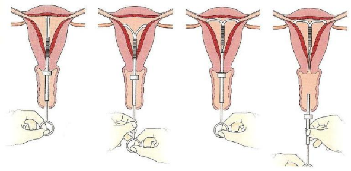

 ### Comment expliquer les problèmes d’infertilité des couples et comment la médecine peut-elle les aider à concevoir un enfant ? 

### Activité   L’aide médicalisée à la procréation (AMP)

Consignes : À partir des informations extraites des différents documents, construisez un tableau dans lequel vous indiquerez pour les différents couples A, B et C :

- la raison de l’infertilité du couple 
- la technique d’aide médicale à la procréation qui pourrait aider le couple à avoir un bébé. Choisir la plus adaptée. Justifier votre réponse dans une colonne ou ligne supplémentaire.

## TECHNIQUES DE RECHERCHE DES CAUSES DE L’INFERTILITÉ D’UN COUPLE

**Document 1 : la définition et l’analyse d’un spermocytogramme**

Spermocytogramme : dosage permettant de connaître le nombre de forme typique et atypique de spermatozoïde dans un sperme donné.
Lors de la réalisation d’un spermocytogramme, on considère que le sperme du conjoint a une qualité satisfaisante lorsque plus de 14 % des spermatozoïdes ont une forme typique.

{:style="width:100px; float:right"  } Forme typique : se dit d’un spermatozoïde de morphologie normale.
{:style="width:100px; float:right"  } Forme atypique : se dit d’un spermatozoïde de morphologie anormale. On considéra que les spermatozoïdes atypiques ne se déplacent pas.

**Document 2 : la définition et l’analyse d’une hystérographie**
Hystérographie : examen médical permettant de mettre en évidence des anomalies éventuelles de l’utérus et des trompes en injectant un liquide opaque dans le vagin lors d’une radiographie.
{:style="width:100px; float:right"  }
Lorsque le liquide opaque circule bien dans le vagin, l’utérus et les trompes, on considère que le résultat de l’hystérographie est normal. En revanche, si le liquide ne circule pas dans l’une des deux trompes, on en déduit que la trompe est bouchée (on parle d’obstruction des
trompes).

Obstruction des trompes : altération des trompes suite à une infection microbienne empêchant la rencontre des cellules reproductrices.

**Document 3 le dosage d’hormone**

L’ovulation est déclenchée par un pic de l’hormone LH. Si ce pic n’est
pas présent, il n’y a pas d’ovulation. On peut suivre la quantité
d’hormone LH quotidienne et vérifier les quantités de cette hormone.

## RECHERCHE DE LA CAUSE DE L’INFERTILITÉ POUR LE COUPLE A

**Document 4 Spermocytogramme réalisé pour le couple A**

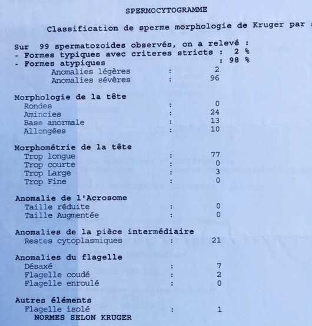

**Document 5 l’hystérographie réalisée pour le couple A**

**Document 6 : Dosage quotidien de LH de madame A.**

## RECHERCHE DE LA CAUSE DE L’INFERTILITÉ POUR LE COUPLE B

**Document 7 le spermocytogramme réalisé pour le couple B**

Le spermocytogramme réalisé pour le couple B a révélé 18 % de formes typiques et 82 % de formes atypiques.

**Document 8 l’hystérographie réalisée pour le couple B**

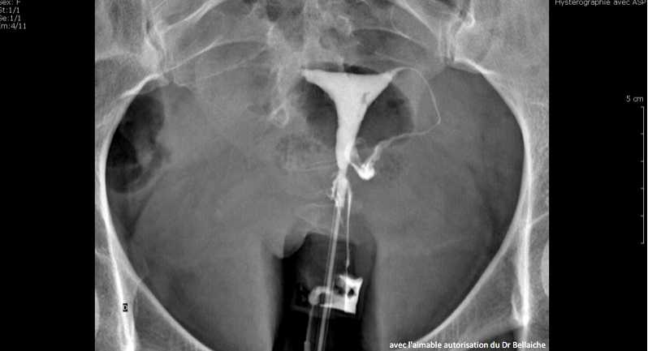

**Document 9 Dosage quotidien de LH de madame B.**

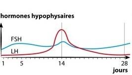

## RECHERCHE DE LA CAUSE DE L’INFERTILITÉ POUR LE COUPLE C

**Document 10 le spermocytogramme réalisé pour le couple C**

Le spermocytogramme réalisé pour le couple C a révélé 25 % de formes typiques et 75 % de formes atypiques.

**Document 11 l’hystérographie réalisée pour le couple C**

**Document 12 Dosage quotidien de LH de madame C.**

## DIFFÉRENTES TECHNIQUES D’AIDE MÉDICALISÉE À LA PROCRÉATION

**Document 13 la stimulation hormonale (SH) – Coût 500 €**

Liste des étapes de la stimulation ovarienne :

- Hyperstimulation ovarienne : une injection d’hormone permettant de stimuler les ovaires afin de déclencher une ovulation.

**Document 14 l’insémination artificielle (IA) – Coût 1 000 €**

Liste des étapes de l’insémination artificielle :

 **
 
- Hyperstimulation ovarienne : une injection d’hormone permet de stimuler les ovaires afin de déclencher une ovulation.
- Recueil et préparation du sperme :** le sperme du conjoint est récupéré
- Dépôt des spermatozoïdes : **les spermatozoïdes sont déposés dans l’utérus.

**Document 15 : la fécondation in vitro (FIV) – Coût 4 100 €**

Liste des étapes de la fécondation in vitro :

-   Prélèvement d’ovules dans l’ovaire hyperstimulé
-   Recueil et préparation du sperme.
-   Mise en contact des spermatozoïdes et d’un ovule.
-   Culture de l’embryon.
-   Transfert de l’embryon dans l’utérus.

**Document 16 : la fécondation in vitro avec micro-injection de spermatozoïde (FIV ICSI) – Coût 4300€**

Liste des étapes de la fécondation in vitro :

- Prélèvement d’ovules dans l’ovaire hyperstimulé.
- Recueil et préparation du sperme.
- Fécondation in vitro avec micro-injection de spermatozoïde.
- Culture de l’embryon.
- Transfert de l’embryon dans l’utérus.

??? note-prof "Correction"

    | Couples | Raisons infertilité| PMA| Justification|
    |---------|-----------------------------------|-----------------------|-----------------------------------------------------------------------------------|
    | A | Quantité de spermatozoïdes normaux trop faibles donc ils ne se déplacent pas | FIV ICSI | Cela permet d’injecter le spermatozoïde dans l’ovule sans qu’il ait à se déplacer |
    | B | Trompe bouchée, le liquide ne va pas jusqu’à la trompe | FIV | Cela permettra la rencontre des spermatozoïdes et de l’ovule hors du corps |
    | C | Faible de quantité d’hormone LH donc pas d’ovulation | Stimulation hormonale | Pour avoir assez de LH pour avoir une ovulation |

Bilan :

Lorsqu’un couple a des difficultés pour faire un enfant, on parle d’infertilité.

Les problèmes d’infertilité peuvent être d’origine masculine (quantité ou forme anormale de spermatozoïdes…) ou d’origine féminine (problème d’ovulation, obstruction des trompes…).

L’aide médicalisée à la procréation (AMP) ou procréation médicalement assistée (PMA) permet d’aider les couples infertiles par différentes techniques :

-   Stimulation hormonale
-   Insémination artificielle
-   Fécondation in vitro…

 ### Comment se protéger des IST ?

### Activité  Se protéger des IST

Consigne : À partir des documents, construire un tableau présentant pour chaque maladie, le type du microbe, le sexe des individus touchés, les symptômes, les moyens de protections.

Compétence travaillée : Construire un tableau

**Document 1 Les IST**

Les IST (Infections Sexuellement Transmissibles) sont des maladies provoquées par des micro-organismes pathogènes.

Les IST se transmettent lors de rapports sexuels et peuvent toucher les hommes ou les femmes.

Lorsqu’une personne est atteinte par une de ces maladies, elle peut la transmettre à son partenaire sexuel. Le micro-organisme sera alors présent dans le corps des deux individus.

Le préservatif est le seul moyen permettant de se protéger des IST.

Le dépistage est un test médical permettant de savoir si un individu est atteint d’une IST.

Le dépistage et l’usage de préservatif sont les pratiques permettant d’éviter la propagation des IST.

**Document 2 Des micro-organismes responsables d’IST**

. 
Le VIH est le virus responsable du SIDA.

Le Papillomavirus est un virus responsable de 99 % des cancers du col de l’utérus chez les femmes.  

 
Chlamydia trachomatis est la bactérie responsable de la chlamydiose

**Document 3 SIDA (6500 nouvelles personnes séropositives au virus par an)**

Le SIDA (syndrome de l’immunodéficience acquise) est un ensemble de symptômes lié à une destruction des cellules du système immunitaire (système naturel de défense de l’organisme). Les individus malades du SIDA peuvent être des hommes ou des femmes. Le SIDA conduit à la mort, car l’individu avec un système immunitaire très affaibli ne pourra se défendre contre les maladies (même des maladies bénignes). Il n’existe aucun traitement permettant aux individus infectés de guérir.

**Document 4 Cancer du col de l’utérus (3000 cas de cancer de l’utérus par an)**

Le cancer du col de l’utérus est le 2e cancer le plus fréquent chez les femmes. Il touche les femmes relativement jeunes. Le cancer du col de l’utérus est la 1re cause de mortalité par cancer chez la femme dans de nombreux pays du tiers monde contre 4 à 6 % des cancers féminins en Amérique du Nord et Europe. L’amélioration des traitements  médicaux anticancéreux a permis une diminution de la mortalité, notamment dans les pays riches.

Un vaccin existe. Il peut être administré par les médecins aux jeunes filles et permet de se protéger du cancer du col de l’utérus.

**Document 5 Chlamydiose (77 000 nouveaux cas par an en France)**

Cette infection est la plus courante des IST en Europe. Elle touche principalement les jeunes. Elle peut ne causer aucun symptôme visible dans la majorité des cas. Mais les complications peuvent être importantes chez les femmes.

Les symptômes chez les femmes sont :

- de la fièvre et des douleurs au bas-ventre.
- Si la maladie n’est pas traitée, des risques d’infertilité.

Chez les hommes, les symptômes sont :

- Des sensations de brûlure en urinant

Une prise d’antibiotiques permet de guérir si le traitement est pris suffisamment tôt.

??? note-prof "Correction de l’activité"

    <table>
    <tbody>
    <tr class="odd">
    <td></td>
    <td>Type de microbe</td>
    <td>Sexe des individus</td>
    <td>Symptômes</td>
    <td>Moyens de protection</td>
    </tr>
    <tr class="even">
    <td>SIDA</td>
    <td>Virus</td>
    <td>H et F</td>
    <td>Destruction des cellules immunitaires</td>
    <td>Préservatif et dépistage</td>
    </tr>
    <tr class="odd">
    <td>Cancer du col de l’utérus</td>
    <td>Virus</td>
    <td>F</td>
    <td>Mort</td>
    <td>Préservatif et dépistage et vaccin et traitements médicaux</td>
    </tr>
    <tr class="even">
    <td>Chlamydiose</td>
    <td>Bactérie</td>
    <td>H et F</td>
    <td>
Stérilité pour la femme

    
Hommes : Brûlures en urinant
</td>
    <td>Préservatif et dépistage et antibiotique</td>
    </tr>
    </tbody>
    </table>

Bilan :

Les IST (Infections Sexuellement Transmissibles) sont des maladies parfois graves provoquées par des micro-organismes pathogènes (virus, bactéries…)

Les IST se transmettent lors de rapports sexuels et peuvent toucher les hommes ou les femmes.

Le dépistage et l’usage de préservatif sont les pratiques permettant d’éviter la propagation des IST.

La sexualité fait partie du développement normal de tout être humain.
C’est une activité intime qui engage la responsabilité des partenaires.
Les premiers désirs sexuels apparaissent à la puberté. Ils sont dirigés vers un individu d’un autre sexe (hétérosexualité) et/ou du même sexe (homosexualité). La sexualité ne se résume pas à la pénétration mais englobe l’ensemble de la relation au corps de l’autre. Site d’information : [www.onsexprime.fr](http://www.onsexprime.fr/)

L’orientation sexuelle, qui est attirance affective et sexuelle envers une personne  de même sexe, de sexe opposé ou les deux, relève de l’intimité des personnes. Les discriminations contre les personnes, en raison de leur orientation sexuelle (par exemple homophobie) sont punies par la loi.

consentement cup of tea

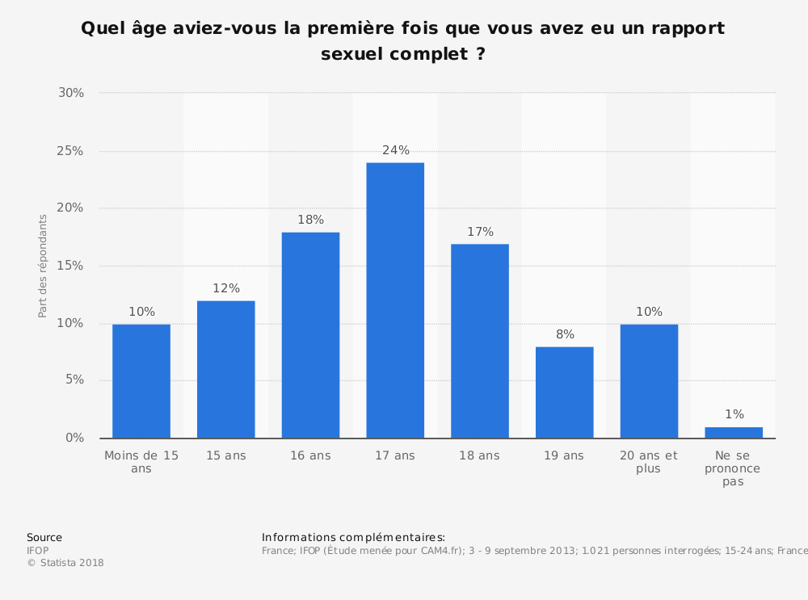

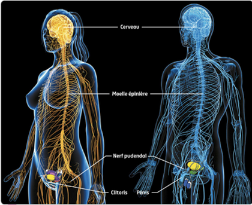

