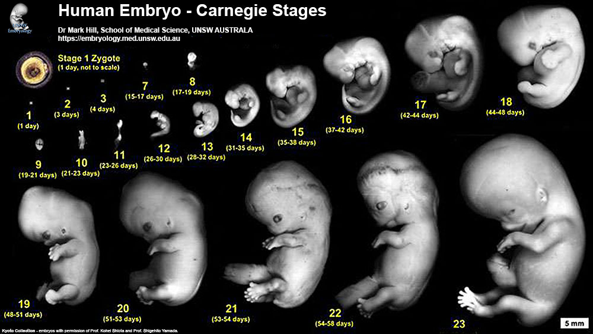
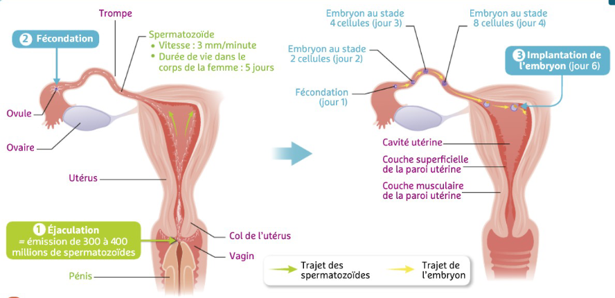
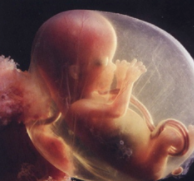
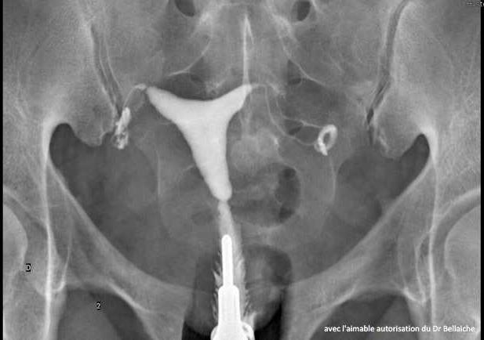
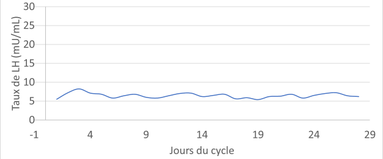
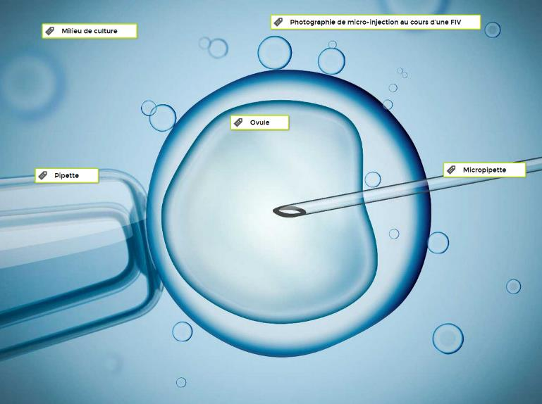

# Séquence : La reproduction chez l'espèce humaine

!!! note-prof
    si besoin d'infos

!!! question "Problématique"
    Quels sont les éléments à prendre en compte pour répondre à un besoin ?

    
### Document d’appel :

## Séance 1 : les différences anatomiques

!!! question "Problématique"
    Quelles sont les différences anatomiques qui se mettent en place au cours du développement d’un individu ?

[Activité Les différences anatomiques entre un homme et une femme](../diffFemmeHomme)

??? abstract "Bilan"
    Lors du développement embryonnaire, les appareils reproducteurs internes et externes deviennent différents chez l’homme et chez la femme, ce sont les caractères sexuels primaires.

    À la puberté, d’autres différences apparaissent entre l’homme et la femme, ce sont les caractères sexuels secondaires (par exemple : développement des seins, développement du pénis…)

    L’appareil reproducteur interne de la femme est constitué des ovaires, des trompes, de l’utérus et du vagin. Et son appareil reproducteur externe, appelé vulve, est constitué de l’orifice du vagin, des petites lèvres, des grandes lèvres et du clitoris.

    L’appareil reproducteur interne de l’homme est constitué des testicules, du canal déférent et de l’urètre. Et son appareil reproducteur externe est constitué des bourses et du pénis.

## Séance 2 : Les cellules reproductrices

!!! question "Problématique"
    Comment sont produites les cellules reproductrices ?

[Activité Les cellules reproductrices des femmes et des hommes](../diffCellRepro)

??? abstract "Bilan"

    Les gamètes** (=**cellules reproductrices) sont produites par les gonades.

    Chez les hommes, les spermatozoïdes sont produits par les testicules, en continu, à partir de la puberté. Le sperme contient du liquide séminal et des spermatozoïdes.

    Chez les femmes, les ovules sont émis de façon cyclique (1 par mois environ), à partir de la puberté jusqu’à la ménopause.

## Séance 3 : Le début de la puberté

!!! question "Problématique"
    Comment expliquer les changements liés à la puberté ?

[Activité La puberté](../puberte)

??? abstract "Bilan"

    

    

    À la puberté, les taux d’hormones sexuelles (testostérone chez l’homme et œstrogène chez la femme) augmentent, ce qui est responsable des changements observés à la puberté.

    Définition hormone : substance chimique fabriquée par un organe et libérée dans le sang provoquant des modifications de certains organes (organes cibles de l’hormone). Les hormones sont un moyen de communication dans notre corps.

    

## Séance 4 : Le contrôle des appareils reproducteurs

!!! question "Problématique"
    Comment est contrôlé le fonctionnement de l’appareil reproducteur ?

[Activité Le contrôle du fonctionnement de l’appareil reproducteur](../controlAppRepro)

??? abstract "Bilan"

    Chez les êtres humains, l’hypophyse (dans le cerveau) contrôle les testicules ou les ovaires grâce à des hormones hypophysaires (LH et FSH). En réponse, les gonades (ovaires ou testicules) produisent des hormones sexuelles (testostérone par les testicules et œstrogènes et progestérones par les ovaires). Ce sont hormones sexuelles qui permettent l’apparition et le maintien des caractères sexuels secondaires et la production de cellules reproductrices.

    

## Séance 5 : Le cycle de la femme

!!! question "Problématique"

[Activité Le cycle de l’utérus](../cycleUterus)

??? abstract "Bilan"

    Les règles se caractérisent par un écoulement de sang provenant de l’utérus.

    De la puberté à la ménopause, lors de chaque cycle, la muqueuse utérine s’épaissit puis est éliminée.

    Les règles sont dues à l’élimination de cette muqueuse.

    L’épaisseur de l’utérus est contrôlée par la quantité d’hormones produites par les ovaires. Lorsque la quantité d’hormones diminue, la muqueuse utérine est éliminée et les règles apparaissent.

    

 ### Quelles conditions doivent être réunies pour qu’un bébé naisse ?

### Activité  La grossesse

Consigne 1 : À partir des documents 1 et 2, indiquer les jours du cycle où un rapport sexuel entraîne une plus grande probabilité de grossesse, en justifiant votre réponse.

Consigne 2 : Relever des arguments expliquant que tout rapport non protégé peut être à l’origine d’une fécondation.

Consigne 3 : Résumer, en quelques lignes, comment se forme une cellule-œuf et son devenir dans les neuf mois qui suivent en indiquant où se passent les différents événements.

**Document 1 Le cycle féminin théorique.**

Ce cycle dure en moyenne 28 jours.
D’une femme à une autre et d’un cycle à un autre, le jour de l’ovulation n’est pas forcément identique. Il peut varier pour de nombreuses raisons.

**Document 2 La durée de vie moyenne des cellules reproductrices dans l’appareil génital féminin.**

|                         | Ovule | Spermatozoïde |
|-------------------------|-------|---------------|
| Durée de vie (en jours) | 1     | 3 à 4         |

**Document 3 De la fécondation à l’implantation de l’embryon chez l’être humain.**

**Document 4 De la fécondation à l’embryon**

La fécondation est l’entrée d’un spermatozoïde dans l’ovule, cet
événement forme une cellule-œuf. Cette cellule va ensuite se diviser à
de nombreuses reprises ce qui forme l’embryon. Pendant les divisions,
l’embryon se déplace dans la trompe vers l’utérus.

**Document 5 La nidation**

Au bout de 6 jours, l’embryon est dans l’utérus, il va se fixer sur la muqueuse utérine qui est développée à ce moment. Les règles s’interrompent pendant 9 mois.

**Document 6 Le développement de l’embryon puis du fœtus.**

<table>
<tbody>
<tr class="odd">
<td>
1er mois de grossesse

Embryon
</td>
<td>
A 2 semaines : ébauche de la tête, du cœur, du cerveau et de la
colonne vertébrale

A 4 semaines ; premiers battements cardiaques, ébauche des poumons,
de l’intestin, des bras et des jambes
</td>
<td>0,5 cm</td>
</tr>
<tr class="even">
<td>
2e mois

Embryon
</td>
<td>
A 8 semaines : croissance du cerveau, ébauche des yeux, formation
du visage et du sexe
</td>
<td>3 cm – 5 g</td>
</tr>
<tr class="odd">
<td>
3e mois

Fœtus
</td>
<td>
A 12 semaines :

tous les organes sont en place, mais ne fonctionne pas encore, on
parle maintenant de fœtus et non plus d’embryon
</td>
<td>7 cm – 30 g</td>
</tr>
<tr class="even">
<td>
4e mois

Fœtus
</td>
<td>
Croissance du squelette

on peut identifier le sexe à l’échographie
</td>
<td>18 cm – 200 g</td>
</tr>
<tr class="odd">
<td>
5e mois

Fœtus
</td>
<td>Développement des sens (ouïe et goût)</td>
<td>28 cm – 400 g</td>
</tr>
<tr class="even">
<td>
6e mois

Fœtus
</td>
<td>Développement musculaire, durcissement des os, ouverture des
yeux</td>
<td>34 cm – 700 g</td>
</tr>
<tr class="odd">
<td>
7e mois

Fœtus
</td>
<td>Développement du système immunitaire, maturation du système
respiratoire</td>
<td>39 cm – 1 400 g</td>
</tr>
<tr class="even">
<td>
8e mois

Fœtus
</td>
<td>Le fœtus continue sa croissance et se retourne.</td>
<td>44 cm – 2 100 g</td>
</tr>
<tr class="odd">
<td>
9e mois

Fœtus
</td>
<td>
Les organes et les systèmes vitaux sont fonctionnels.

Des contractions de l’utérus permettront au bébé de sortir.
</td>
<td>50 cm – 3 200 g</td>
</tr>
</tbody>
</table>

Bonus

À chaque cycle, un ovule est libéré dans une des trompes, c’est l’ovulation. Cet ovule survit de 24 à 48 h.

Lors d’un rapport sexuel, des millions de spermatozoïdes sont déposés dans le vagin de la femme. Ces spermatozoïdes survivront 72 h environ.

Cependant, seule une centaine de spermatozoïdes arrivent à traverser le col de l’utérus (situé entre le vagin et la cavité de l’utérus). Ils remontent dans l’utérus et se dirigent vers les deux trompes.

Lorsque le rapport sexuel a lieu quelques jours avant ou après l’ovulation, un spermatozoïde peut s’unir avec l’ovule : c’est la fécondation.

 
Seul un spermatozoïde pourra pénétrer dans l’ovule  (= ovocyte) : c’est la fécondation. Les deux noyaux des gamètes (= cellules reproductrices : spermatozoïde et ovule) fusionnent pour former une nouvelle cellule : la cellule-œuf.

La cellule-œuf se divise ensuite en 2 cellules, puis 4 cellules et ainsi de suite, pour former un embryon de plusieurs cellules .

L’embryon se déplace vers l’utérus (migration) et se fixe dans l’endomètre (= muqueuse utérine), c’est l’implantation (= nidation).

Embryon à 7 semaines. Le cœur bat dès le 21e jour et les bras et les jambes se développent.

)Fœtus de 4 mois. L’embryon à 3 mois devient un fœtus. Tous les organes du futur individu sont présents.

Bilan :

Lorsque le rapport sexuel a lieu quelques jours avant ou après l’ovulation, un spermatozoïde peut s’unir avec l’ovule : c’est la  fécondation.

Cette union permet la formation de la *cellule-œuf*. Cette cellule-œuf se divise de nombreuses fois pour former un *embryon*.

L’embryon doit se fixer sur la muqueuse de l’utérus, c’est l’implantation (=nidation).

L’embryon continue alors de se développer. Après 3 mois, tous les organes du futur individu se forment, l’embryon devient alors un *fœtus*. Après 9 mois de grossesse, le bébé est prêt à naître.

 ### Comment le fœtus se nourrit-il ?

### Activité   La nutrition du fœtus 

Consigne : À partir des informations extraites des différents documents, construisez un schéma fonctionnel qui montre la nutrition d’un fœtus.

Compétence travaillée : Construire un schéma fonctionnel

**Document 1 Définition de la nutrition.**

Pour survivre ou grandir, les êtres vivants doivent produire de l’énergie et leur propre matière organique.

Pour cela, les animaux prélèvent dans leur environnement de la matière minérale (eau, sels minéraux et dioxygène) et de la matière organique (les nutriments).

La production d’énergie et de matière organique est l’origine de déchets (dioxyde de carbone et urée) qui sont éliminés dans l’environnement.

**Document 2 L’environnement du fœtus**

Le fœtus se développe dans une poche : la cavité amniotique, contenant un liquide protecteur : le liquide amniotique.

Le placenta est un organe fixé à la paroi de l’utérus. Cet organe assure une connexion par des vaisseaux sanguins (présents dans le cordon ombilical) entre la mère et le fœtus.

)

**Document 3 La composition du sang circulant dans le placenta**

Le sang de la mère circulant vers le fœtus est riche en dioxygène, nutriments, eau et sels minéraux, il peut contenir également des microbes et des substances toxiques (par exemple : nicotine).

Le sang sortant du fœtus et allant vers la mère contient les différents déchets (par exemple : dioxyde de carbone et de l’urée).

Bilan :

Le placenta est un organe fixé à la paroi de l’utérus. Grâce au placenta, le fœtus assure sa nutrition :

– il récupère du dioxygène et des nutriments provenant du sang de la mère ;

– et libère du dioxyde de carbone et certains déchets dans le sang de la mère.

Pour que la grossesse se déroule bien, il est indispensable que les échanges sanguins entre la mère et le fœtus, au niveau du placenta, se fassent correctement.

Certaines substances ou virus peuvent passer dans ces échanges et causer un développement anormal du fœtus.

Le fœtus est contenu dans une poche remplie de liquide amniotique. Pour le bon développement du fœtus, la quantité de ce liquide doit être suffisante.

Le cordon ombilical relie le fœtus au placenta.

### Comment permettre aux couples de maîtriser leur reproduction ?

### Activité  Une méthode de contraception, la pilule

Consigne : À partir des différents documents, expliquer l’effet contraceptif de la pilule.

Compétence travaillée : Mettre en relation des informations pour répondre à un problème 

**Document 1 Effet contraceptif**

On parle d’effet contraceptif, lorsqu’une technique est utilisée par un couple pour avoir une sexualité sans reproduction de manière temporaire.

**Document 2 le pic de LH**

Lors du cycle, la quantité de LH produite par l’hypophyse varie. Autour du milieu du cycle, la quantité de LH augmente brutalement, c’est le pic de LH. Ce pic de LH stimule fortement les ovaires, ce qui provoque l’ovulation.

**Document 3 Graphiques des taux d’hormones hypophysaires et sexuelles.**

Lors d’un cycle sans prise de pilules contraceptives et d’un cycle avec prise de pilules contraceptives

?? note-prof "Correction :"

    Le pic de LH permet l’ovulation.
    La prise de pilule empêche le pic de LH et donc l’ovulation.
    Sans ovulation, il peut y avoir rapport sexuel sans fécondation et donc sans grossesse.
    La pilule a donc un effet contraceptif.

Bilan :

La contraception désigne des méthodes utilisées pour éviter, de façon réversible, une grossesse et donc permettre une sexualité sans reproduction.

Il existe différentes méthodes de contraception. Elle peut être chimique (pilules…) ou mécanique (préservatifs…).

La contraception peut :

- Éviter l’ovulation. (Pilules)
- Éviter la rencontre des cellules reproductrices (pilules, préservatif)
- Éviter la nidation (pilules, stérilet…)

 ### Comment expliquer les problèmes d’infertilité des couples et comment la médecine peut-elle les aider à concevoir un enfant ? 

### Activité   L’aide médicalisée à la procréation (AMP)

Consignes : À partir des informations extraites des différents documents, construisez un tableau dans lequel vous indiquerez pour les différents couples A, B et C :

- la raison de l’infertilité du couple 
- la technique d’aide médicale à la procréation qui pourrait aider le couple à avoir un bébé. Choisir la plus adaptée. Justifier votre réponse dans une colonne ou ligne supplémentaire.

## TECHNIQUES DE RECHERCHE DES CAUSES DE L’INFERTILITÉ D’UN COUPLE

**Document 1 : la définition et l’analyse d’un spermocytogramme**

Spermocytogramme : dosage permettant de connaître le nombre de forme typique et atypique de spermatozoïde dans un sperme donné.
Lors de la réalisation d’un spermocytogramme, on considère que le sperme du conjoint a une qualité satisfaisante lorsque plus de 14 % des spermatozoïdes ont une forme typique.

{:style="width:100px; float:right"  } Forme typique : se dit d’un spermatozoïde de morphologie normale.
{:style="width:100px; float:right"  } Forme atypique : se dit d’un spermatozoïde de morphologie anormale. On considéra que les spermatozoïdes atypiques ne se déplacent pas.

**Document 2 : la définition et l’analyse d’une hystérographie**
Hystérographie : examen médical permettant de mettre en évidence des anomalies éventuelles de l’utérus et des trompes en injectant un liquide opaque dans le vagin lors d’une radiographie.
{:style="width:100px; float:right"  }
Lorsque le liquide opaque circule bien dans le vagin, l’utérus et les trompes, on considère que le résultat de l’hystérographie est normal. En revanche, si le liquide ne circule pas dans l’une des deux trompes, on en déduit que la trompe est bouchée (on parle d’obstruction des
trompes).

Obstruction des trompes : altération des trompes suite à une infection microbienne empêchant la rencontre des cellules reproductrices.

**Document 3 le dosage d’hormone**

L’ovulation est déclenchée par un pic de l’hormone LH. Si ce pic n’est
pas présent, il n’y a pas d’ovulation. On peut suivre la quantité
d’hormone LH quotidienne et vérifier les quantités de cette hormone.

## RECHERCHE DE LA CAUSE DE L’INFERTILITÉ POUR LE COUPLE A

**Document 4 Spermocytogramme réalisé pour le couple A**

**Document 5 l’hystérographie réalisée pour le couple A**

**Document 6 : Dosage quotidien de LH de madame A.**

## RECHERCHE DE LA CAUSE DE L’INFERTILITÉ POUR LE COUPLE B

**Document 7 le spermocytogramme réalisé pour le couple B**

Le spermocytogramme réalisé pour le couple B a révélé 18 % de formes typiques et 82 % de formes atypiques.

**Document 8 l’hystérographie réalisée pour le couple B**

**Document 9 Dosage quotidien de LH de madame B.**

## RECHERCHE DE LA CAUSE DE L’INFERTILITÉ POUR LE COUPLE C

**Document 10 le spermocytogramme réalisé pour le couple C**

Le spermocytogramme réalisé pour le couple C a révélé 25 % de formes typiques et 75 % de formes atypiques.

**Document 11 l’hystérographie réalisée pour le couple C**

**Document 12 Dosage quotidien de LH de madame C.**

## DIFFÉRENTES TECHNIQUES D’AIDE MÉDICALISÉE À LA PROCRÉATION

**Document 13 la stimulation hormonale (SH) – Coût 500 €**

Liste des étapes de la stimulation ovarienne :

- Hyperstimulation ovarienne : une injection d’hormone permettant de stimuler les ovaires afin de déclencher une ovulation.

**Document 14 l’insémination artificielle (IA) – Coût 1 000 €**

Liste des étapes de l’insémination artificielle :

 **
 
- Hyperstimulation ovarienne : une injection d’hormone permet de stimuler les ovaires afin de déclencher une ovulation.
- Recueil et préparation du sperme :** le sperme du conjoint est récupéré
- Dépôt des spermatozoïdes : **les spermatozoïdes sont déposés dans l’utérus.

**Document 15 : la fécondation in vitro (FIV) – Coût 4 100 €**

Liste des étapes de la fécondation in vitro :

-   Prélèvement d’ovules dans l’ovaire hyperstimulé
-   Recueil et préparation du sperme.
-   Mise en contact des spermatozoïdes et d’un ovule.
-   Culture de l’embryon.
-   Transfert de l’embryon dans l’utérus.

**Document 16 : la fécondation in vitro avec micro-injection de spermatozoïde (FIV ICSI) – Coût 4300€**

Liste des étapes de la fécondation in vitro :

- Prélèvement d’ovules dans l’ovaire hyperstimulé.
- Recueil et préparation du sperme.
- Fécondation in vitro avec micro-injection de spermatozoïde.
- Culture de l’embryon.
- Transfert de l’embryon dans l’utérus.

??? note-prof "Correction"

    | Couples | Raisons infertilité| PMA| Justification|
    |---------|-----------------------------------|-----------------------|-----------------------------------------------------------------------------------|
    | A | Quantité de spermatozoïdes normaux trop faibles donc ils ne se déplacent pas | FIV ICSI | Cela permet d’injecter le spermatozoïde dans l’ovule sans qu’il ait à se déplacer |
    | B | Trompe bouchée, le liquide ne va pas jusqu’à la trompe | FIV | Cela permettra la rencontre des spermatozoïdes et de l’ovule hors du corps |
    | C | Faible de quantité d’hormone LH donc pas d’ovulation | Stimulation hormonale | Pour avoir assez de LH pour avoir une ovulation |

Bilan :

Lorsqu’un couple a des difficultés pour faire un enfant, on parle d’infertilité.

Les problèmes d’infertilité peuvent être d’origine masculine (quantité ou forme anormale de spermatozoïdes…) ou d’origine féminine (problème d’ovulation, obstruction des trompes…).

L’aide médicalisée à la procréation (AMP) ou procréation médicalement assistée (PMA) permet d’aider les couples infertiles par différentes techniques :

-   Stimulation hormonale
-   Insémination artificielle
-   Fécondation in vitro…

 ### Comment se protéger des IST ?

### Activité  Se protéger des IST

Consigne : À partir des documents, construire un tableau présentant pour chaque maladie, le type du microbe, le sexe des individus touchés, les symptômes, les moyens de protections.

Compétence travaillée : Construire un tableau

**Document 1 Les IST**

Les IST (Infections Sexuellement Transmissibles) sont des maladies provoquées par des micro-organismes pathogènes.

Les IST se transmettent lors de rapports sexuels et peuvent toucher les hommes ou les femmes.

Lorsqu’une personne est atteinte par une de ces maladies, elle peut la transmettre à son partenaire sexuel. Le micro-organisme sera alors présent dans le corps des deux individus.

Le préservatif est le seul moyen permettant de se protéger des IST.

Le dépistage est un test médical permettant de savoir si un individu est atteint d’une IST.

Le dépistage et l’usage de préservatif sont les pratiques permettant d’éviter la propagation des IST.

**Document 2 Des micro-organismes responsables d’IST**

. 
Le VIH est le virus responsable du SIDA.

Le Papillomavirus est un virus responsable de 99 % des cancers du col de l’utérus chez les femmes.  

 
Chlamydia trachomatis est la bactérie responsable de la chlamydiose

**Document 3 SIDA (6500 nouvelles personnes séropositives au virus par an)**

Le SIDA (syndrome de l’immunodéficience acquise) est un ensemble de symptômes lié à une destruction des cellules du système immunitaire (système naturel de défense de l’organisme). Les individus malades du SIDA peuvent être des hommes ou des femmes. Le SIDA conduit à la mort, car l’individu avec un système immunitaire très affaibli ne pourra se défendre contre les maladies (même des maladies bénignes). Il n’existe aucun traitement permettant aux individus infectés de guérir.

**Document 4 Cancer du col de l’utérus (3000 cas de cancer de l’utérus par an)**

Le cancer du col de l’utérus est le 2e cancer le plus fréquent chez les femmes. Il touche les femmes relativement jeunes. Le cancer du col de l’utérus est la 1re cause de mortalité par cancer chez la femme dans de nombreux pays du tiers monde contre 4 à 6 % des cancers féminins en Amérique du Nord et Europe. L’amélioration des traitements  médicaux anticancéreux a permis une diminution de la mortalité, notamment dans les pays riches.

Un vaccin existe. Il peut être administré par les médecins aux jeunes filles et permet de se protéger du cancer du col de l’utérus.

**Document 5 Chlamydiose (77 000 nouveaux cas par an en France)**

Cette infection est la plus courante des IST en Europe. Elle touche principalement les jeunes. Elle peut ne causer aucun symptôme visible dans la majorité des cas. Mais les complications peuvent être importantes chez les femmes.

Les symptômes chez les femmes sont :

- de la fièvre et des douleurs au bas-ventre.
- Si la maladie n’est pas traitée, des risques d’infertilité.

Chez les hommes, les symptômes sont :

- Des sensations de brûlure en urinant

Une prise d’antibiotiques permet de guérir si le traitement est pris suffisamment tôt.

??? note-prof "Correction de l’activité"

    <table>
    <tbody>
    <tr class="odd">
    <td></td>
    <td>Type de microbe</td>
    <td>Sexe des individus</td>
    <td>Symptômes</td>
    <td>Moyens de protection</td>
    </tr>
    <tr class="even">
    <td>SIDA</td>
    <td>Virus</td>
    <td>H et F</td>
    <td>Destruction des cellules immunitaires</td>
    <td>Préservatif et dépistage</td>
    </tr>
    <tr class="odd">
    <td>Cancer du col de l’utérus</td>
    <td>Virus</td>
    <td>F</td>
    <td>Mort</td>
    <td>Préservatif et dépistage et vaccin et traitements médicaux</td>
    </tr>
    <tr class="even">
    <td>Chlamydiose</td>
    <td>Bactérie</td>
    <td>H et F</td>
    <td>
Stérilité pour la femme

    
Hommes : Brûlures en urinant
</td>
    <td>Préservatif et dépistage et antibiotique</td>
    </tr>
    </tbody>
    </table>

Bilan :

Les IST (Infections Sexuellement Transmissibles) sont des maladies parfois graves provoquées par des micro-organismes pathogènes (virus, bactéries…)

Les IST se transmettent lors de rapports sexuels et peuvent toucher les hommes ou les femmes.

Le dépistage et l’usage de préservatif sont les pratiques permettant d’éviter la propagation des IST.

La sexualité fait partie du développement normal de tout être humain.
C’est une activité intime qui engage la responsabilité des partenaires.
Les premiers désirs sexuels apparaissent à la puberté. Ils sont dirigés vers un individu d’un autre sexe (hétérosexualité) et/ou du même sexe (homosexualité). La sexualité ne se résume pas à la pénétration mais englobe l’ensemble de la relation au corps de l’autre. Site d’information : [www.onsexprime.fr](http://www.onsexprime.fr/)

L’orientation sexuelle, qui est attirance affective et sexuelle envers une personne  de même sexe, de sexe opposé ou les deux, relève de l’intimité des personnes. Les discriminations contre les personnes, en raison de leur orientation sexuelle (par exemple homophobie) sont punies par la loi.

consentement cup of tea

