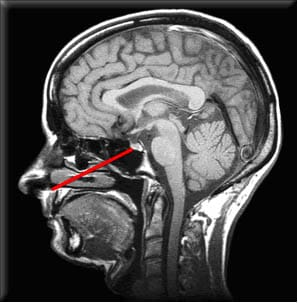

# Activité : Le contrôle du fonctionnement de l’appareil reproducteur

!!! note "Compétences"

    Interpréter 

!!! warning "Consignes"

    1. Déterminer les différents organes et hormones impliqués dans le fonctionnement de l’appareil reproducteur en indiquant leur effet.

    2. Construire un schéma fonctionnel qui montre le contrôle du fonctionnement de l’appareil reproducteur.
    
??? bug "Critères de réussite"
    - 

**Document 1 Quelques troubles du fonctionnement de l’appareil reproducteur**

À l’hôpital, des patients sont suivis pour des troubles du fonctionnement de l’appareil reproducteur.

-   Cas n°1 : homme qui a eu une puberté tardive et qui a des caractères
    sexuels secondaires peu développés (faibles pilosité, testicules de
    petite taille). Sa maladie est due à un dysfonctionnement d’une zone
    du cerveau reliée à l’hypophyse.
-   Cas n°2 : homme souffrant de maux de tête et de troubles de
    l’érection. L’analyse de son sperme montre qu’il en produit peu et
    que ses spermatozoïdes sont peu fécondants. Une IRM de son cerveau
    révèle une tumeur bénigne à l’hypophyse.
-   Cas n°3 : femme atteinte d’une tumeur à l’hypophyse. Sa maladie a
    notamment provoqué l’arrêt de des ovulations et de ses règles, alors
    qu’elle n’est pas en période de ménopause.

**Document 2 L’hypophyse, une petite glande du cerveau qui sécrète des hormones.**

{: style="width: 200px;"}

L’hypophyse est une petite glande située à la base du cerveau. Elle peut être visualisée grâce à une imagerie par résonance magnétique (IRM) du cerveau.

L’hypophyse est un organe producteur d’hormones (les hormones hypophysaires).

L’hypophyse libère les hormones qu’elle fabrique dans la circulation sanguine.

**Document 3 Rôle de l’hypophyse dans le déclenchement de la puberté.**

<table markdown>
<tbody markdown >
<tr >
<td>Expériences</td>
<td>Contenu du sang</td>
<td>Résultats</td>
</tr>
<tr markdown>
<td markdown>
</td>
<td>Dioxygène, glucides, hormones cérébrales</td>
<td>Puberté normale et production de testostérone</td>
</tr>
<tr markdown>
<td markdown >  
Hypophysectomie : ablation de l’hypophyse</td>
<td>Dioxygène, glucides</td>
<td>
Diminution de la taille des testicules et du nombre de
spermatozoïdes produits

arrêt de la production de testostérone
</td>
</tr>
<tr markdown>
<td markdown >
</td>
<td>Dioxygène, glucides, hormones cérébrales</td>
<td>
Augmentation de la taille des testicules et du nombre de
spermatozoïdes produits

Reprise de la production de testostérone
</td>
</tr>
</tbody>
</table>

**Document 4 Origine des caractères sexuels secondaires chez le coq.**

Contrairement au coq le chapon adulte n’a pas de crête.

| Expériences               | Résultats             |
|-------------------------------------------------------------------------------------------------|-----------------------|
|  Des testicules de coq sont greffés à un chapon (coq castré à la naissance) sous la peau en relation avec la circulation sanguine  | La crête se développe |
|  Une hormone sexuelle masculine extraite de testicule de coq est injecté dans le sang d’un chapon .                               |                       |

Quantité de testostérone injecté dans le sang (en UA)
0,45
1,2
2,5
5
Taille de la crête (en mm)
5
10
15
20

**Document 5 Activité hypophysaire sur le fonctionnement des ovaires et de l’utérus**

<table markdown >
<tbody markdown >
<tr markdown class="odd">
<td>Souris témoins</td>
<td>Souris femelles ayant subi une hypophysectomie (ablation de l’hypophyse)</td>
<td>Souris femelles ayant subi une hypophysectomie avec injection d’hormones produites par l’hypophyse (LH et FSH)</td>
<td>Ovariectomie et hypophysectomieavec injection d’hormones produites par l’hypophyse (LH et FSH)</td>
</tr>
<tr markdown class="even">
<td markdown></td>
<td markdown></td>
<td markdown></td>
<td markdown></td>
</tr>
<tr class="odd">
<td>Activité ovarienne normale et fonctionnement cyclique normal de l’utérus
</td>
<td>Pas d’activité ovarienne (ni ovulation, ni sécrétion hormonale) et pas d’activité cyclique de l’utérus</td>
<td>Reprise d’activité des ovaires (ovulation et sécrétion hormonale) et de l’activité
cyclique de l’utérus</td>
<td>Pas d’activité ovarienne et pas d’activité cyclique de l’utérus</td>
</tr>
</tbody>
</table>

??? note-prof "Correction"

    Dans le document 1, on voit que des patients avec des troubles au niveau
    de l’hypophyse ont des problèmes dans le fonctionnement de leur appareil
    reproducteur, donc l’hypophyse doit contrôler l’appareil reproducteur

    Dans le document 2 : on voit que l’hypophyse une glande du cerveau

