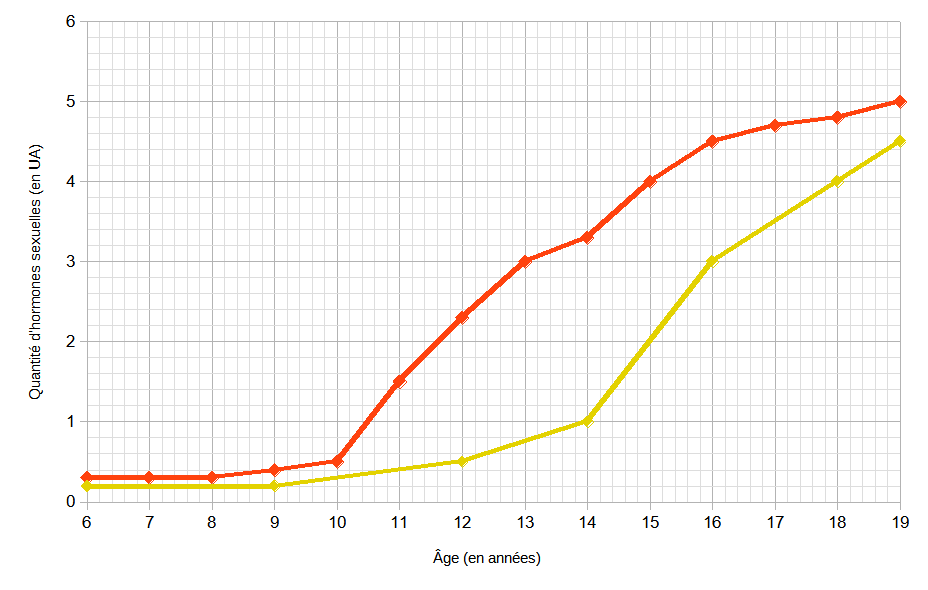

# Activité : L’origine de la puberté.

!!! note "Compétences"

    - Construire un graphique
    - décrire un graphique 

!!! warning "Consignes"

    1. Ajouter une courbe représentant l’évolution de la quantité de testostérone en fonction de l’âge sur le graphique.

    2. Décrire les deux courbes du graphique.

    3. Répondre au problème en utilisant les documents
    
??? bug "Critères de réussite"
    - 

**Document 1 ________________________________________________________________**

**Document 2 Tableau de la quantité d’hormones sexuelles en fonction de l’âge**

| Âge (en années) | Testostérone (en unités arbitraires, ua) | Œstrogènes (en unités arbitraires, ua) |
|-------------|------------------------------|-------------------|
| 6 | 0,2 | 0,3 |
| 8 | 0,2 | 0,3 |
| 9 | 0,2 | 0,4 |
| 12 | 0,5 | 2,3 |
| 14 | 1 | 3,3 |
| 16 | 3 | 4,5 |
| 18 | 4 | 4,8 |
| 19 | 4,5 | 5 |

**Document 3 Deux hormones sexuelles, la testostérone et l’œstrogène**

La testostérone est une hormone sexuelle fabriquée par l’homme

L’œstrogène est une hormone sexuelle fabriquée par la femme, c’est une hormone ovarienne

Définition d’hormone : substance chimique fabriquée par un organe et libéré dans le sang provoquant des modifications de certains organes (organes cibles de l’hormone).

**Document 4 La puberté.**

La puberté commence vers 10 ans chez la femme et vers 14 ans chez l’homme.

Chez certaines personnes la puberté ne se déclenche pas, des traitements existent. Par exemple, les femmes atteintes du syndrome de Turner, sont de petites tailles, stériles, leurs seins ne sont pas développés et elles n’ont pas leurs règles. Pour les traiter, on leur injecte des hormones ovariennes

??? note-prof "Correction :"

    

    **Document 1 Graphique de la quantité d’hormones sexuelles en fonction de l’âge**

    Ce graphique représente la quantité d’hormones sexuelles en fonction de l’âge.

    Pour la quantité d’œstrogènes :

    De 6 à 19 ans, la quantité d’œstrogènes augmente de 0,3 à 5 ua.

    Pour la quantité de testostérone :

    De 6 à 9 ans, la quantité de testostérone reste stable à 0,2 ua.

    Puis de 9 à 19 ans, la quantité de testostérone augmente de 0,2 à 4,5 ua.

