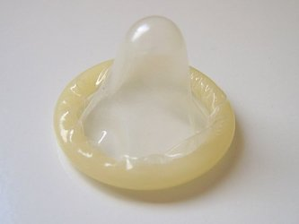

# Séquence : Sexualité et reproduction

!!! note-prof
    si besoin d'infos

    
### Document d’appel :

## Séance 1 : La grossesse

!!! question "Problématique"
    Quelles conditions doivent être réunies pour qu’un bébé naisse ?

[Activité La grossesse](../grossesse)

??? abstract "Détails"

    

    À chaque cycle, un ovule est libéré dans une des trompes, c’est l’ovulation. Cet ovule survit de 24 à 48 h.

    

    Lors d’un rapport sexuel, des millions de spermatozoïdes sont déposés dans le vagin de la femme. Ces spermatozoïdes survivront 72 h environ.

    Cependant, seule une centaine de spermatozoïdes arrivent à traverser le col de l’utérus (situé entre le vagin et la cavité de l’utérus). Ils remontent dans l’utérus et se dirigent vers les deux trompes.

    Lorsque le rapport sexuel a lieu quelques jours avant ou après l’ovulation, un spermatozoïde peut s’unir avec l’ovule : c’est la fécondation.

    

    
    Seul un spermatozoïde pourra pénétrer dans l’ovule  (= ovocyte) : c’est la fécondation. Les deux noyaux des gamètes (= cellules reproductrices : spermatozoïde et ovule) fusionnent pour former une nouvelle cellule : la cellule-œuf.

    La cellule-œuf se divise ensuite en 2 cellules, puis 4 cellules et ainsi de suite, pour former un embryon de plusieurs cellules .

    L’embryon se déplace vers l’utérus (migration) et se fixe dans l’endomètre (= muqueuse utérine), c’est l’implantation (= nidation).

    
    
    Le cœur bat dès le 21e jour et les bras et les jambes se développent.

    
    L’embryon à 3 mois devient un fœtus. Tous les organes du futur individu sont présents.

??? abstract "Bilan"
    Lorsque le rapport sexuel a lieu quelques jours avant ou après l’ovulation, un spermatozoïde peut s’unir avec l’ovule : c’est la  fécondation.

    Cette union permet la formation de la *cellule-œuf*. Cette cellule-œuf se divise de nombreuses fois pour former un *embryon*.

    L’embryon doit se fixer sur la muqueuse de l’utérus, c’est l’implantation (=nidation).

    L’embryon continue alors de se développer. Après 3 mois, tous les organes du futur individu se forment, l’embryon devient alors un *fœtus*. Après 9 mois de grossesse, le bébé est prêt à naître.

## Séance 2 : La nidation

!!! question "Problématique"
    Comment le fœtus se nourrit-il ?
    
[Activité La nutrition du fœtus](../nutriFoetus)

??? abstract "Bilan"
    Le placenta est un organe fixé à la paroi de l’utérus. Grâce au placenta, le fœtus assure sa nutrition :

    – il récupère du dioxygène et des nutriments provenant du sang de la mère ;

    – et libère du dioxyde de carbone et certains déchets dans le sang de la mère.

    Pour que la grossesse se déroule bien, il est indispensable que les échanges sanguins entre la mère et le fœtus, au niveau du placenta, se fassent correctement.

    Certaines substances ou virus peuvent passer dans ces échanges et causer un développement anormal du fœtus.

    Le fœtus est contenu dans une poche remplie de liquide amniotique. Pour le bon développement du fœtus, la quantité de ce liquide doit être suffisante.

    Le cordon ombilical relie le fœtus au placenta.

## Séance 3 : La contraception

!!! question "Problématique"
    Comment permettre aux couples de maîtriser leur reproduction ?

[Activité La pilule contraceptive](../piluleContra)

??? abstract "Bilan"

    La contraception désigne des méthodes utilisées pour éviter, de façon réversible, une grossesse et donc permettre une sexualité sans reproduction.

    Il existe différentes méthodes de contraception. Elle peut être chimique (pilules…) ou mécanique (préservatifs…).

    La contraception peut :

    - Éviter l’ovulation. (Pilules)
    - Éviter la rencontre des cellules reproductrices (pilules, préservatif)
    - Éviter la nidation (pilules, stérilet…)

    
    
    
    
    
    

## Séance 4 : Procréation médicalement assistée

!!! question "Problématique"
    Comment expliquer les problèmes d’infertilité des couples et comment la médecine peut-elle les aider à concevoir un enfant ? 

[Activité La Procréation Médicalement Assistée](../pma)

??? abstract "Bilan"
    Lorsqu’un couple a des difficultés pour faire un enfant, on parle d’infertilité.

    Les problèmes d’infertilité peuvent être d’origine masculine (quantité ou forme anormale de spermatozoïdes…) ou d’origine féminine (problème d’ovulation, obstruction des trompes…).

    L’aide médicalisée à la procréation (AMP) ou procréation médicalement assistée (PMA) permet d’aider les couples infertiles par différentes techniques :

    -   Stimulation hormonale
    -   Insémination artificielle
    -   Fécondation in vitro…

## Séance 5 : Les IST

!!! question "Problématique"
    Comment se protéger des IST ?

[Activité IST](../ist)

??? abstract "Bilan"

    Les IST (Infections Sexuellement Transmissibles) sont des maladies parfois graves provoquées par des micro-organismes pathogènes (virus, bactéries…)

    Les IST se transmettent lors de rapports sexuels et peuvent toucher les hommes ou les femmes.

    Le dépistage et l’usage de préservatif sont les pratiques permettant d’éviter la propagation des IST.

## Séance 6 : La sexualité

La sexualité fait partie du développement normal de tout être humain.
C’est une activité intime qui engage la responsabilité des partenaires.
Les premiers désirs sexuels apparaissent à la puberté. Ils sont dirigés vers un individu d’un autre sexe (hétérosexualité) et/ou du même sexe (homosexualité). La sexualité ne se résume pas à la pénétration mais englobe l’ensemble de la relation au corps de l’autre. Site d’information : [www.onsexprime.fr](http://www.onsexprime.fr/)

L’orientation sexuelle, qui est attirance affective et sexuelle envers une personne  de même sexe, de sexe opposé ou les deux, relève de l’intimité des personnes. Les discriminations contre les personnes, en raison de leur orientation sexuelle (par exemple homophobie) sont punies par la loi.

[consentement cup of tea](https://www.youtube.com/watch?v=yj5NcMew6qc)

