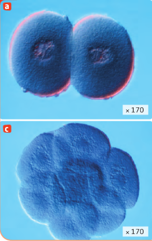

# Activité : La grossesse

!!! note Compétences

    Trouver et utiliser des informations 

!!! warning Consignes

    1. À partir des documents 1 et 2, indiquer les jours du cycle où un rapport sexuel entraîne une plus grande probabilité de grossesse, en justifiant votre réponse.
    2. Relever des arguments expliquant que tout rapport non protégé peut être à l’origine d’une fécondation.
    3.  Résumer, en quelques lignes, comment se forme une cellule-œuf et son devenir dans les neuf mois qui suivent en indiquant où se passent les différents événements.
    
??? bug Critères de réussite
    - 

**Document 1 Le cycle féminin théorique.**

Ce cycle dure en moyenne 28 jours.
D’une femme à une autre et d’un cycle à un autre, le jour de l’ovulation n’est pas forcément identique. Il peut varier pour de nombreuses raisons.

**Document 2 La durée de vie moyenne des cellules reproductrices dans l’appareil génital féminin.**

|                         | Ovule | Spermatozoïde |
|-------------------------|-------|---------------|
| Durée de vie (en jours) | 1     | 3 à 4         |

**Document 3 De la fécondation à l’implantation de l’embryon chez l’être humain.**

**Document 4 De la fécondation à l’embryon**

La fécondation est l’entrée d’un spermatozoïde dans l’ovule, cet
événement forme une cellule-œuf. Cette cellule va ensuite se diviser à
de nombreuses reprises ce qui forme l’embryon. Pendant les divisions,
l’embryon se déplace dans la trompe vers l’utérus.

**Document 5 La nidation**

Au bout de 6 jours, l’embryon est dans l’utérus, il va se fixer sur la muqueuse utérine qui est développée à ce moment. Les règles s’interrompent pendant 9 mois.

**Document 6 Le développement de l’embryon puis du fœtus.**

<table>
<tbody>
<tr class="odd">
<td>
1er mois de grossesse

Embryon
</td>
<td>
A 2 semaines : ébauche de la tête, du cœur, du cerveau et de la
colonne vertébrale

A 4 semaines ; premiers battements cardiaques, ébauche des poumons,
de l’intestin, des bras et des jambes
</td>
<td>0,5 cm</td>
</tr>
<tr class="even">
<td>
2e mois

Embryon
</td>
<td>
A 8 semaines : croissance du cerveau, ébauche des yeux, formation
du visage et du sexe
</td>
<td>3 cm – 5 g</td>
</tr>
<tr class="odd">
<td>
3e mois

Fœtus
</td>
<td>
A 12 semaines :

tous les organes sont en place, mais ne fonctionne pas encore, on
parle maintenant de fœtus et non plus d’embryon
</td>
<td>7 cm – 30 g</td>
</tr>
<tr class="even">
<td>
4e mois

Fœtus
</td>
<td>
Croissance du squelette

on peut identifier le sexe à l’échographie
</td>
<td>18 cm – 200 g</td>
</tr>
<tr class="odd">
<td>
5e mois

Fœtus
</td>
<td>Développement des sens (ouïe et goût)</td>
<td>28 cm – 400 g</td>
</tr>
<tr class="even">
<td>
6e mois

Fœtus
</td>
<td>Développement musculaire, durcissement des os, ouverture des
yeux</td>
<td>34 cm – 700 g</td>
</tr>
<tr class="odd">
<td>
7e mois

Fœtus
</td>
<td>Développement du système immunitaire, maturation du système
respiratoire</td>
<td>39 cm – 1 400 g</td>
</tr>
<tr class="even">
<td>
8e mois

Fœtus
</td>
<td>Le fœtus continue sa croissance et se retourne.</td>
<td>44 cm – 2 100 g</td>
</tr>
<tr class="odd">
<td>
9e mois

Fœtus
</td>
<td>
Les organes et les systèmes vitaux sont fonctionnels.

Des contractions de l’utérus permettront au bébé de sortir.
</td>
<td>50 cm – 3 200 g</td>
</tr>
</tbody>
</table>

