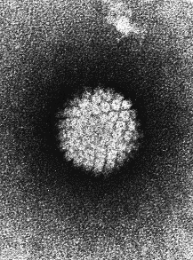

# Activité : IST

!!! note Compétences

    Construire un tableau 

!!! warning Consignes

    À partir des documents, construire un tableau présentant pour chaque maladie, le type du microbe, le sexe des individus touchés, les symptômes, les moyens de protections.
    
??? bug Critères de réussite
    - 

**Document 1 Les IST**

Les IST (Infections Sexuellement Transmissibles) sont des maladies provoquées par des micro-organismes pathogènes.

Les IST se transmettent lors de rapports sexuels et peuvent toucher les hommes ou les femmes.

Lorsqu’une personne est atteinte par une de ces maladies, elle peut la transmettre à son partenaire sexuel. Le micro-organisme sera alors présent dans le corps des deux individus.

Le préservatif est le seul moyen permettant de se protéger des IST.

Le dépistage est un test médical permettant de savoir si un individu est atteint d’une IST.

Le dépistage et l’usage de préservatif sont les pratiques permettant d’éviter la propagation des IST.

**Document 2 Des micro-organismes responsables d’IST**

. 
Le VIH est le virus responsable du SIDA.

Le Papillomavirus est un virus responsable de 99 % des cancers du col de l’utérus chez les femmes, il est aussi responsable de cancer du pénis et de l'anus chez l'homme. Un vaccin existe contre le HPV. Le préservatif n'est pas complétement efficace contre ce virus, car il ne recouvre pas entièrement les parties génitales.
  

 
Chlamydia trachomatis est la bactérie responsable de la chlamydiose

**Document 3 SIDA (6500 nouvelles personnes séropositives au virus par an)**

Le SIDA (syndrome de l’immunodéficience acquise) est un ensemble de symptômes lié à une destruction des cellules du système immunitaire (système naturel de défense de l’organisme). Les individus malades du SIDA peuvent être des hommes ou des femmes. Le SIDA conduit à la mort, car l’individu avec un système immunitaire très affaibli ne pourra se défendre contre les maladies (même des maladies bénignes). Il n’existe aucun traitement permettant aux individus infectés de guérir.

**Document 4 Cancer du col de l’utérus (3000 cas de cancer de l’utérus par an)**

Le cancer du col de l’utérus est le 2e cancer le plus fréquent chez les femmes. Il touche les femmes relativement jeunes. Le cancer du col de l’utérus est la 1re cause de mortalité par cancer chez la femme dans de nombreux pays du tiers monde contre 4 à 6 % des cancers féminins en Amérique du Nord et Europe. L’amélioration des traitements médicaux anticancéreux a permis une diminution de la mortalité, notamment dans les pays riches.

**Document 5 Chlamydiose (77 000 nouveaux cas par an en France)**

Cette infection est la plus courante des IST en Europe. Elle touche principalement les jeunes. Elle peut ne causer aucun symptôme visible dans la majorité des cas. Mais les complications peuvent être importantes chez les femmes.

Les symptômes chez les femmes sont :

- De la fièvre et des douleurs au bas-ventre.
- Si la maladie n’est pas traitée, des risques d’infertilité.

Chez les hommes, les symptômes sont :

- Des sensations de brûlure en urinant

Une prise d’antibiotiques permet de guérir si le traitement est pris suffisamment tôt.

??? note-prof "Correction de l’activité"

    <table>
    <tbody>
    <tr class="odd">
    <td></td>
    <td>Type de microbe</td>
    <td>Sexe des individus</td>
    <td>Symptômes</td>
    <td>Moyens de protection</td>
    </tr>
    <tr class="even">
    <td>SIDA</td>
    <td>Virus</td>
    <td>H et F</td>
    <td>Destruction des cellules immunitaires</td>
    <td>Préservatif et dépistage</td>
    </tr>
    <tr class="odd">
    <td>Cancer du col de l’utérus</td>
    <td>Virus</td>
    <td>F</td>
    <td>Mort</td>
    <td>Préservatif et dépistage et vaccin et traitements médicaux</td>
    </tr>
    <tr class="even">
    <td>Chlamydiose</td>
    <td>Bactérie</td>
    <td>H et F</td>
    <td>
Stérilité pour la femme

    
Hommes : Brûlures en urinant
</td>
    <td>Préservatif et dépistage et antibiotique</td>
    </tr>
    </tbody>
    </table>