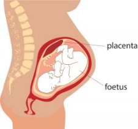
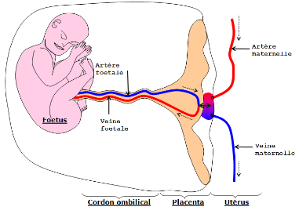

# Activité : La nutrition du fœtus 

!!! note "Compétences"

    Construire un schéma fonctionnel 

!!! warning "Consignes"

   À partir des informations extraites des différents documents, construisez un schéma fonctionnel qui montre la nutrition d’un fœtus.
    
??? bug "Critères de réussite"
    - 

**Document 1 Définition de la nutrition.**

Pour survivre ou grandir, les êtres vivants doivent produire de l’énergie et leur propre matière organique.

Pour cela, les animaux prélèvent dans leur environnement de la matière minérale (eau, sels minéraux et dioxygène) et de la matière organique (les nutriments).

La production d’énergie et de matière organique est l’origine de déchets (dioxyde de carbone et urée) qui sont éliminés dans l’environnement.

**Document 2 L’environnement du fœtus**

Le fœtus se développe dans une poche : la cavité amniotique, contenant un liquide protecteur : le liquide amniotique.

Le placenta est un organe fixé à la paroi de l’utérus. Cet organe assure une connexion par des vaisseaux sanguins (présents dans le cordon ombilical) entre la mère et le fœtus.

**Document 3 La composition du sang circulant dans le placenta**

Le sang de la mère circulant vers le fœtus est riche en dioxygène, nutriments, eau et sels minéraux, il peut contenir également des microbes et des substances toxiques (par exemple : nicotine).

Le sang sortant du fœtus et allant vers la mère contient les différents déchets (par exemple : dioxyde de carbone et de l’urée).