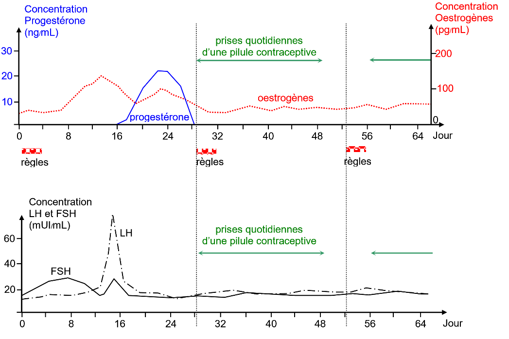

# Activité : Une méthode de contraception, la pilule

!!! note "Compétences"

    Mettre en relation des informations pour répondre à un problème  

!!! warning "Consignes"

    À partir des différents documents, expliquer l’effet contraceptif de la pilule.
    
??? bug "Critères de réussite"
    - 

**Document 1 Effet contraceptif**

On parle d’effet contraceptif, lorsqu’une technique est utilisée par un couple pour avoir une sexualité sans reproduction de manière temporaire.

**Document 2 le pic de LH**

Lors du cycle, la quantité de LH produite par l’hypophyse varie. Autour du milieu du cycle, la quantité de LH augmente brutalement, c’est le pic de LH. Ce pic de LH stimule fortement les ovaires, ce qui provoque l’ovulation.

**Document 3 Graphiques des taux d’hormones hypophysaires et sexuelles.**

Lors d’un cycle sans prise de pilules contraceptives et d’un cycle avec prise de pilules contraceptives

??? note-prof "Correction :"

    Le pic de LH permet l’ovulation.
    La prise de pilule empêche le pic de LH et donc l’ovulation.
    Sans ovulation, il peut y avoir rapport sexuel sans fécondation et donc sans grossesse.
    La pilule a donc un effet contraceptif.
