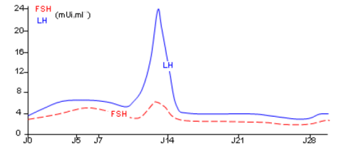
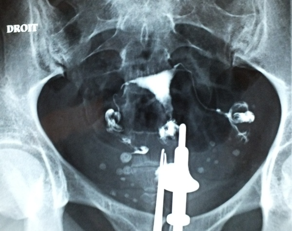

# Activité : Importance du tri des déchets

!!! note "Compétences"

    Interpréter 

!!! warning "Consignes"

    1. 
    
??? bug "Critères de réussite"
    - 

### Activité   L’aide médicalisée à la procréation (AMP)

Consignes : À partir des informations extraites des différents documents, construisez un tableau dans lequel vous indiquerez pour les différents couples A, B et C :

- la raison de l’infertilité du couple 
- la technique d’aide médicale à la procréation qui pourrait aider le couple à avoir un bébé. Choisir la plus adaptée. Justifier votre réponse dans une colonne ou ligne supplémentaire.

## TECHNIQUES DE RECHERCHE DES CAUSES DE L’INFERTILITÉ D’UN COUPLE

**Document 1 : la définition et l’analyse d’un spermocytogramme**

Spermocytogramme : dosage permettant de connaître le nombre de forme typique et atypique de spermatozoïde dans un sperme donné.
Lors de la réalisation d’un spermocytogramme, on considère que le sperme du conjoint a une qualité satisfaisante lorsque plus de 14 % des spermatozoïdes ont une forme typique.

{:style="width:100px; float:right"  } Forme typique : se dit d’un spermatozoïde de morphologie normale.
{:style="width:100px; float:right"  } Forme atypique : se dit d’un spermatozoïde de morphologie anormale. On considéra que les spermatozoïdes atypiques ne se déplacent pas.

**Document 2 : la définition et l’analyse d’une hystérographie**
Hystérographie : examen médical permettant de mettre en évidence des anomalies éventuelles de l’utérus et des trompes en injectant un liquide opaque dans le vagin lors d’une radiographie.
{:style="width:100px; float:right"  }
Lorsque le liquide opaque circule bien dans le vagin, l’utérus et les trompes, on considère que le résultat de l’hystérographie est normal. En revanche, si le liquide ne circule pas dans l’une des deux trompes, on en déduit que la trompe est bouchée (on parle d’obstruction des
trompes).

Obstruction des trompes : altération des trompes suite à une infection microbienne empêchant la rencontre des cellules reproductrices.

**Document 3 le dosage d’hormone**

L’ovulation est déclenchée par un pic de l’hormone LH. Si ce pic n’est
pas présent, il n’y a pas d’ovulation. On peut suivre la quantité
d’hormone LH quotidienne et vérifier les quantités de cette hormone.

## RECHERCHE DE LA CAUSE DE L’INFERTILITÉ POUR LE COUPLE A

**Document 4 Spermocytogramme réalisé pour le couple A**

**Document 5 l’hystérographie réalisée pour le couple A**

**Document 6 : Dosage quotidien de LH de madame A.**

## RECHERCHE DE LA CAUSE DE L’INFERTILITÉ POUR LE COUPLE B

**Document 7 le spermocytogramme réalisé pour le couple B**

Le spermocytogramme réalisé pour le couple B a révélé 18 % de formes typiques et 82 % de formes atypiques.

**Document 8 l’hystérographie réalisée pour le couple B**

**Document 9 Dosage quotidien de LH de madame B.**

## RECHERCHE DE LA CAUSE DE L’INFERTILITÉ POUR LE COUPLE C

**Document 10 le spermocytogramme réalisé pour le couple C**

Le spermocytogramme réalisé pour le couple C a révélé 25 % de formes typiques et 75 % de formes atypiques.

**Document 11 l’hystérographie réalisée pour le couple C**

**Document 12 Dosage quotidien de LH de madame C.**

## DIFFÉRENTES TECHNIQUES D’AIDE MÉDICALISÉE À LA PROCRÉATION

**Document 13 la stimulation hormonale (SH) – Coût 500 €**

Liste des étapes de la stimulation ovarienne :

- Hyperstimulation ovarienne : une injection d’hormone permettant de stimuler les ovaires afin de déclencher une ovulation.

**Document 14 l’insémination artificielle (IA) – Coût 1 000 €**

Liste des étapes de l’insémination artificielle :

 **
 
- Hyperstimulation ovarienne : une injection d’hormone permet de stimuler les ovaires afin de déclencher une ovulation.
- Recueil et préparation du sperme :** le sperme du conjoint est récupéré
- Dépôt des spermatozoïdes : **les spermatozoïdes sont déposés dans l’utérus.

**Document 15 : la fécondation in vitro (FIV) – Coût 4 100 €**

Liste des étapes de la fécondation in vitro :

-   Prélèvement d’ovules dans l’ovaire hyperstimulé
-   Recueil et préparation du sperme.
-   Mise en contact des spermatozoïdes et d’un ovule.
-   Culture de l’embryon.
-   Transfert de l’embryon dans l’utérus.

**Document 16 : la fécondation in vitro avec micro-injection de spermatozoïde (FIV ICSI) – Coût 4300€**

Liste des étapes de la fécondation in vitro :

- Prélèvement d’ovules dans l’ovaire hyperstimulé.
- Recueil et préparation du sperme.
- Fécondation in vitro avec micro-injection de spermatozoïde.
- Culture de l’embryon.
- Transfert de l’embryon dans l’utérus.

??? note-prof "Correction"

    | Couples | Raisons infertilité| PMA| Justification|
    |---------|-----------------------------------|-----------------------|-----------------------------------------------------------------------------------|
    | A | Quantité de spermatozoïdes normaux trop faibles donc ils ne se déplacent pas | FIV ICSI | Cela permet d’injecter le spermatozoïde dans l’ovule sans qu’il ait à se déplacer |
    | B | Trompe bouchée, le liquide ne va pas jusqu’à la trompe | FIV | Cela permettra la rencontre des spermatozoïdes et de l’ovule hors du corps |
    | C | Faible de quantité d’hormone LH donc pas d’ovulation | Stimulation hormonale | Pour avoir assez de LH pour avoir une ovulation |

