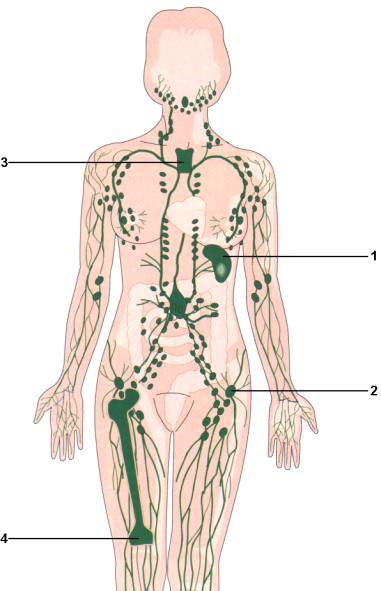

# Séquence : Les défenses immunitaires du corps humain

!!! note-prof
    si besoin d'infos

!!! question "Problématique"

    Comment notre corps se défend-il contre les micro-organismes ?

    

## Séance 1 : Les acteurs du système immunitaire

!!! question "Problématique"

    Quels sont les acteurs de la défense de l’organisme ?

??? question "Où se trouvent nos défenses ?"

    Les acteurs du système immunitaire doivent pouvoir voyager dans tout le corps, ils doivent donc être dans le sang.

[Activité Acteurs de la défense](../acteursSystImmu)

??? abstract "Bilan"

    <a markdown id="bilan1">

    === "Bilan à trous"
        Les ......................... ou globules blancs, sont des cellules sanguines intervenant dans la réponse de l’organisme face aux infections, la réponse immunitaire. Ils font partie du système immunitaire.

        Il existe deux types de leucocytes :

        -   ............................
        -   ............................

        Le système immunitaire est l’ensemble des acteurs intervenant pour lutter contre les éléments étrangers.

        La contamination est l’entrée de micro-organisme dans le corps.

    === "Bilan"
        Les leucocytes ou globules blancs, sont des cellules sanguines intervenant dans la réponse de l’organisme face aux infections, la réponse immunitaire. Ils font partie du système immunitaire.

        Il existe deux types de leucocytes :

        -   Lymphocyte
        -   Phagocyte

        Le système immunitaire est l’ensemble des acteurs intervenant pour lutter contre les éléments étrangers.

        La contamination est l’entrée de micro-organisme dans le corps.

    </a>

    
## Séance 2 : Réaction à la contamination

!!! question "Problématique"

    Comment notre corps réagit-il à une contammination ?

??? abstract "Notes supplémentaires"

    {: style="width:300px;"}

[Activité La réaction inflammatoire](../inflammation)

??? abstract "Notes supplémentaires"

    
    
    
    Une fois entrés dans l’organisme, les micro-organismes vont donc se multiplier, c’est l’infection.
    
    Les bactéries vont se multiplier. Elles vont ensuite envahir notre corps et/ou produire des toxines qui exerceront un effet pathogène.
    
    Les virus ont besoin de nos cellules pour se multiplier. Ils vont entrer à l’intérieur de la cellule, se multiplier et la cellule sera détruite à la sortie des nouveaux virus. Plus les virus se multiplient et plus, il y aura de cellules détruites.

??? abstract "Bilan"
    <a markdown id="bilan2">

    === "Bilan à trous"

        Après une contamination, certains leucocytes (=globules blancs), cellules sanguines du système immunitaire vont détecter les éléments extérieurs (virus ou bactéries) et une ........................ va se produire très rapidement (gonflement, rougeur, chaleur et douleur).

        Les ...................... qui sont leucocytes vont sortir des vaisseaux sanguins.

        Ces phagocytes vont absorber et .................... les éléments étrangers pour les ....................... C’est la phagocytose.

        C’est une réaction rapide et non spécifique (réaction contre n’importe quel élément étranger).

        Après la contamination, les microbes vont se multiplier dans l'organisme, c'est l'..........................

    === "Bilan"
    
        Après une contamination, certains leucocytes (=globules blancs), cellules sanguines du système immunitaire vont détecter les éléments extérieurs (virus ou bactéries) et une réaction inflammatoire va se produire très rapidement (gonflement, rougeur, chaleur et douleur).

        Les phagocytes qui sont leucocytes vont sortir des vaisseaux sanguins.

        Ces phagocytes vont absorber et digérer les éléments étrangers pour les détruire. C’est la phagocytose.

        C’est une réaction rapide et non spécifique (réaction contre n’importe quel élément étranger).

        Après la contamination, les microbes vont se multiplier dans l'organisme, c'est l'infection.

    </a>
    
## Séance 3 : Réaction de notre corps à une infection prolongée.

!!! question "Problématique"

    Comment notre corps réagit si l’infection continue ?

[Activité Réaction de notre corps à une infection prolongée](../infectionContinue)

??? abstract "Bilan"
    <a markdown id="bilan3">

    === "Bilan à trous"
        
        Les micro-organismes portent à leur surface des molécules, les ................, qui provoquent l’activation du système immunitaire.

        Après détection d’un micro-organisme étranger, les lymphocytes vont être ............... et se ...................

        Les lymphocytes T tueurs ............................  spécifiquement les cellules infectées par les virus portant l’antigène reconnu.

        Ce sont des réactions immunitaires ..................... et .........................     

    === "Bilan"
    
        Les micro-organismes portent à leur surface des molécules, les antigènes, qui provoquent l’activation du système immunitaire.

        Après détection d’un micro-organisme étranger, les lymphocytes vont être activés et se multiplier.

        Les lymphocytes T tueurs reconnaissent et détruisent  spécifiquement les cellules infectées par les virus portant l’antigène reconnu.

        Ce sont des réactions immunitaires lentes et spécifiques.

    </a>

??? abstract "Infos"
    
    
    

    
    

## Séance 4 Exercice

[Activité Exercice](../exoActeursInfections)
