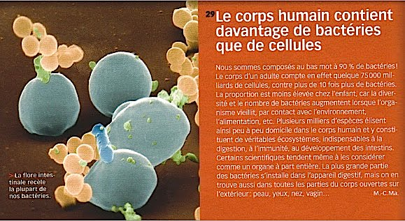
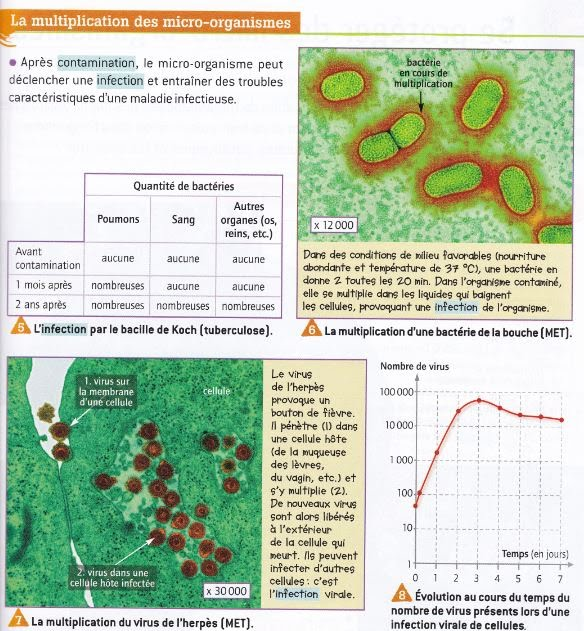
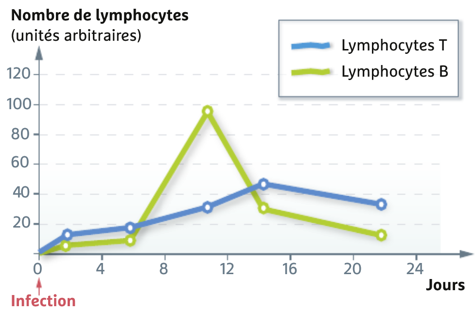

# Séquence : Les défenses immunitaires du corps humain

!!! note-prof
    si besoin d'infos

Le téléphone portable, plus sale que la cuvette des w.c.

Le combiné contiendrait cinq cents fois plus de bactéries qu’un siège de toilette. Et vous, lavez-vous votre téléphone portable ?

Par Laura Thouny, L’express, publié le 16/07/2010

!!! question "Problématique"
    Comment notre corps se défend-t-il contre les micro-organismes ?

    

## Séance 1 : Les acteurs du système immunitaire

!!! question "Problématique"
    Quels sont les acteurs de la défense de l’organisme ?

??? question "Les acteurs du système immunitaire doivent pouvoir voyager dans tout le corps"
    Les acteurs du système immunitaire doivent pouvoir voyager dans tout le corps ils doivent donc être dans le sang.

[Activité Acteurs de la défense](../acteursSystImmu)

??? abstract "Bilan"
    Les leucocytes, ou globules blancs, sont des cellules sanguines intervenant dans la réponse de l’organisme face aux infections, la réponse immunitaire. Ils font partie du système immunitaire.

    Il existe deux types de leucocytes :

    -   Lymphocyte
    -   Phagocyte

    Le système immunitaire est l’ensemble des acteurs intervenant pour lutter contre les éléments étrangers.

    La contamination est l’entrée de micro-organisme dans le corps.

## Séance 2 : Réaction à l'infection

!!! question "Problématique"
    Comment notre corps réagit-il face à une infection ?

Une fois entrés dans l’organisme, les micro-organismes vont donc se multiplier, c’est l’infection.

Les bactéries vont se multiplier. Elles vont ensuite envahir notre corps et/ou produire des toxines qui exerceront un effet pathogène.

Les virus ont besoin de nos cellules pour se multiplier. Ils vont entrer à l’intérieur de la cellule, se multiplier et la cellule sera détruite à la sortie des nouveaux virus. Plus les virus se multiplient et plus il y aura de cellules détruites.

[Activité La réaction inflammatoire](../inflammation)

??? abstract "Bilan"
    Après une contamination, certains leucocytes (=globules blancs), cellules sanguines du système immunitaire vont détecter les éléments extérieurs (virus ou bactéries) et une réaction inflammatoire va se produire très rapidement (gonflement, rougeur, chaleur et douleur).

    Les phagocytes qui sont leucocytes vont sortir des vaisseaux sanguins.

    Ces phagocytes vont absorber et digérer les éléments étrangers pour les détruire. C’est la phagocytose.

    C’est une réaction rapide et non spécifique (réaction contre n’importe quel élément étranger).

### **Comment notre corps réagit si l’infection continue ?**

#### Réaction de notre corps à une infection prolongée.

Consigne 1 : expliquer par un schéma fonctionnel, comment le système
immunitaire est **réagit** lors **de la détection d’un
micro-organisme**. (Documents 1, 2 et 3)

Consigne 2 : Expliquer comment les lymphocytes T tueurs
**permettent**-ils lutter contre les infections. (Document 4)

**Consigne 3 : Quelle particularité des lymphocytes T tueurs est mise en
évidence dans les documents 5 et 6 ?**

Document 1 : Contact entre une cellule sentinelle et un lymphocyte dans
un ganglion lymphatique.

Après avoir détecté un virus ou
une bactérie grâce à leurs antigènes (éléments propres à chaque type de
micro-organismes, présents à la surface des micro-organismes reconnus
par le système immunitaire), certaines cellules sentinelles (cellules
dendritiques) quittent le lieu de l’infection et migrent jusqu’aux
ganglions les plus proches (ganglions du cou dans le cas d’un rhume). Le
contact avec la cellule sentinelle provoque une activation du
lymphocyte.

Document 2 : Les trois types de lymphocytes.

-   Lymphocytes T activateurs :
    activés par les cellules sentinelles, ils activent à leur tour les
    lymphocytes B et les lymphocytes T tueurs.

-   Lymphocytes B : lorsqu’ils sont activés, ils produisent des
    anticorps.

-   Lymphocytes T : lorsqu’ils sont activés, ils se fixent aux cellules
    infectées par les virus.

***Document ****3 : Evolution du
nombre de lymphocytes T et B dans un ganglion suite à une infection.***

***Docu****ment 4 : Action d’un lymphocyte T tueur sur une cellule
infectée.***

Lors d’une infection par un virus, les lymphocytes tueurs reconnaissent
les cellules infectées par le virus en cause et seulement lui.

Document 5 : Reconnaissance de
virus par les lymphocytes T.

Les cellules infectées par un virus possèdent à leur surface des
antigènes du virus.

Document 6 : Antigène de
micro-organisme et récepteur de lymphocyte.

Tout micro-organisme possède à sa
surface des éléments qui lui sont propres (les antigènes). Les
lymphocytes possèdent naturellement à leur surface des récepteurs qui
s’adaptent à la structure de tout type d’antigènes, ce qui leur permet
de reconnaître ou non l’antigène (mécanisme clé – serrure). À chaque
antigène correspond un récepteur d’un lymphocyte (un lymphocyte ne
reconnaît qu’un seul type d’ antigène) : c’est une réaction spécifique.

Correction de l’activité 29 : Réaction de
notre corps à une infection prolongée.

Consigne 1 : expliquer par un schéma fonctionnel, comment le système
immunitaire est **réagit** lors **de la détection d’un
micro-organisme**. (Documents 1, 2 et 3)

Consigne 2 : Expliquer comment les lymphocytes T **permettent**-ils
lutter contre les infections. (Document 4)

Les lymphocytes T tueurs vont se fixer à une cellule qui a été infectée
par un virus et la détruire

Consigne 3 : Quelle particularité des lymphocytes T est mise en évidence
dans les documents 5 et 6 ?

Dans le document 5, on voit que les lymphocytes T tueurs de l’expérience
a sont des lymphocytes qui ont détruit des cellules infectées par le
virus de la chorioméningite.

On voit que ces lymphocytes sont capables de détruire d’autres cellules
infectées par le même virus (expériences b), mais elles ne détruisent
pas les cellules infectées par d’autres virus (expérience c).

Dans le document 6, on apprend que les lymphocytes ont des récepteurs
qui reconnaissent les antigènes.

On peut conclure qu’un lymphocyte T ne détruit que les cellules qui ont
les antigènes d’un virus particulier, il peut pas détruire les cellules
ayant d’autres antigènes. Les lymphocytes sont spécifiques.

Bilan :

Les micro-organismes portent à leur surface des molécules, les
antigènes, qui provoquent l’activation du système immunitaire.

Après détection d’un micro-organisme **étranger**, les lymphocytes vont
être activés et se multiplier.

**Les** lymphocytes T tueurs reconnaissent et détruisent spécifiquement
les cellules infectées par les virus portant l’antigène reconnu.

Ce sont des réactions immunitaires lentes et spécifiques.

Exercice : L’étude d’un frottis sanguin.

Jules, qui se sent très fatigué, se rend chez son médecin pour connaître
l’origine de cette fatigue. Le médecin lui prescrit une analyse de sang.
Les photographies des deux frottis sont représentatives de l’ensemble
des cellules présentes dans les sangs étudiés.

Consigne : À partir des photographies de frottis sanguins, déterminez si
Jules est victime d’une infection. Justifiez votre réponse.

Document 1 : Photo d’un frottis
sanguin légendés (MO x400)

Le colorant colore le noyau.

1 = **hématie** (globule rouge)

2-3 = **phagocyte**

4 = **lymphocyte**

Document 2 : Comparaison du sang de Jules avec celui d’une personne non
malade

***Document 3 : ****Tableau présentant les résultats d’une analyse
sanguine de deux sujets***

|                            |                           |       |     |
|----------------------------|---------------------------|-------|-----|
| Cellules sanguines         | Sujet en bonne santé      | Jules |     |
| Hématies (millions/mm3)    | 4,7                       | 4,7   |     |
| Leucocytes (milliers/mm3)  | 9,5                       | 18    |     |
| dont                       | Phagocytes (milliers/mm3) | 6     | 10  |
| Lymphocytes (milliers/mm3) | 3,5                       | 8     |     |
