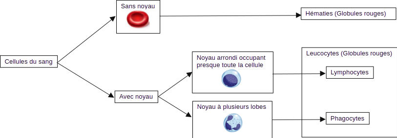
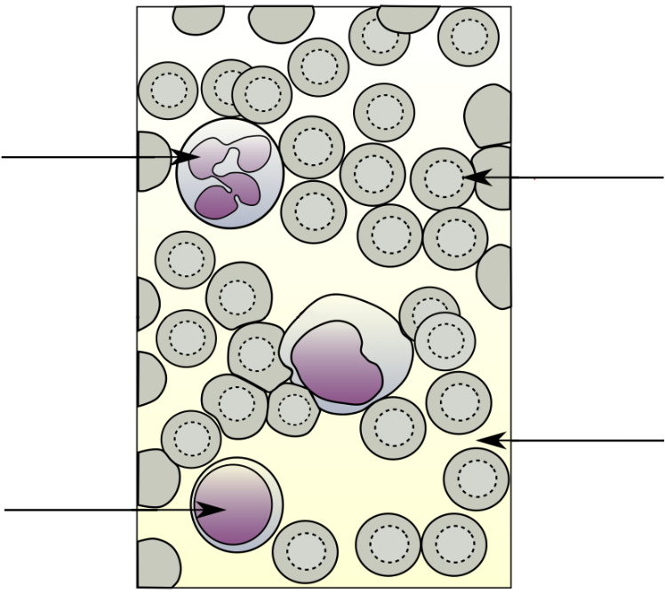

# Activité : Acteurs de la défense 

!!! note "Compétences"

    - Argumenter 
    - Utiliser des outils d'observation

!!! warning "Consignes"

    1. À partir des documents, proposer une hypothèse répondant au problème. Rédiger une réponse argumentée à partir des informations disponibles dans les documents.

    2. Faire une observation microscopique du frottis sanguin
   
    3. Compléter le dessin à des informations du document 1.

    4. Indiquer la différence observable grâce à la coloration entre les leucocytes et les hématies. 

    
??? bug "Critères de réussite"
    - 

**Document 1 Le sang**

Le sang est constitué d’un liquide appelé plasma et de plusieurs types de cellules (Hématies et leucocytes). Pour différencier les cellules du sang, il faut observer leurs noyaux. Pour cela, on peut mettre un colorant qui colore les noyaux en violet.

**Document 2 Clé de détermination des cellules sanguines**

**Document 3 ___________________________________**

**Document 4 Analyse sanguine.**

On a fait des prises de sang à des personnes saines et des personnes malades pour doser leurs cellules sanguines.
<table>
<thead>
  <tr>
    <th colspan="2">Cellules sanguines</th>
    <th>Sujet en bonne santé</th>
    <th>Sujet atteint d’une angine bactérienne</th>
  </tr>
</thead>
<tbody>
  <tr>
    <td colspan="2">Hématies (millions de cellules/mm3)</td>
    <td>4,7</td>
    <td>4,7</td>
  </tr>
  <tr>
    <td colspan="2">Leucocytes   (cellules/mm3)      </td>
    <td>4000 à 13000          </td>
    <td>18000        </td>
  </tr>
  <tr>
    <td rowspan="2">Dont</td>
    <td>Phagocytes</td>
    <td>2000 à 8000</td>
    <td>10000</td>
  </tr>
  <tr>
    <td>Lymphocytes</td>
    <td>2000 à 5000</td>
    <td>8000</td>
  </tr>
</tbody>
</table>