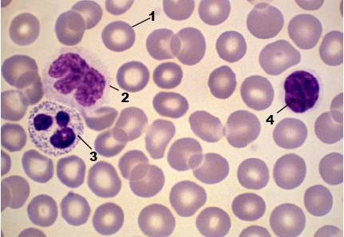

# Activité : Exercice : L’étude d’un frottis sanguin.

!!! note "Compétences"

    Interpréter 

!!! warning "Consignes"

    À partir des photographies de frottis sanguins, déterminez si Jules est victime d’une infection. Justifiez votre réponse.

    
??? bug "Critères de réussite"

Jules, qui se sent très fatigué, se rend chez son médecin pour connaître l’origine de cette fatigue. Le médecin lui prescrit une analyse de sang.
Les photographies des deux frottis sont représentatives de l’ensemble des cellules présentes dans les sangs étudiés.

**Document 1 Photo d’un frottis sanguin légendés (MO x400)**

1 = **hématie** (globule rouge)

2-3 = **phagocyte** (leucocyte = globule blanc)

4 = **lymphocyte** (leucocyte = globule blanc)

**Document 2 Comparaison du sang de Jules avec celui d’une personne non malade**

**Document 3 Tableau présentant les résultats d’une analyse sanguine de deux sujets**

<table>
<thead>
  <tr>
    <th colspan="2">Cellules sanguines</th>
    <th>Sujet en bonne santé</th>
    <th>Jules</th>
  </tr>
</thead>
<tbody>
  <tr>
    <td colspan="2">Hématies (millions/mm3)</td>
    <td>4,7</td>
    <td>4,7</td>
  </tr>
  <tr>
    <td colspan="2">Leucocytes   (milliers/mm3)      </td>
    <td>9,5          </td>
    <td>19        </td>
  </tr>
  <tr>
    <td rowspan="2">Dont</td>
    <td>Phagocytes</td>
    <td>6</td>
    <td>12</td>
  </tr>
  <tr>
    <td>Lymphocytes</td>
    <td>3,5</td>
    <td>7</td>
  </tr>
</tbody>
</table>
