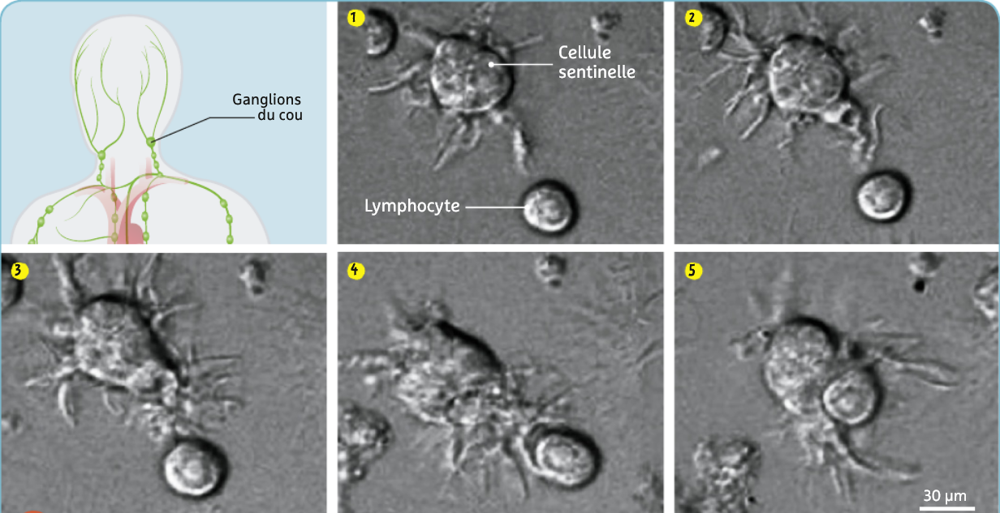
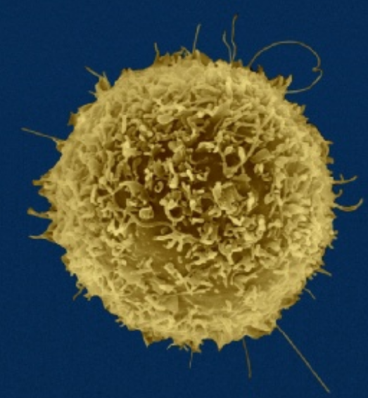
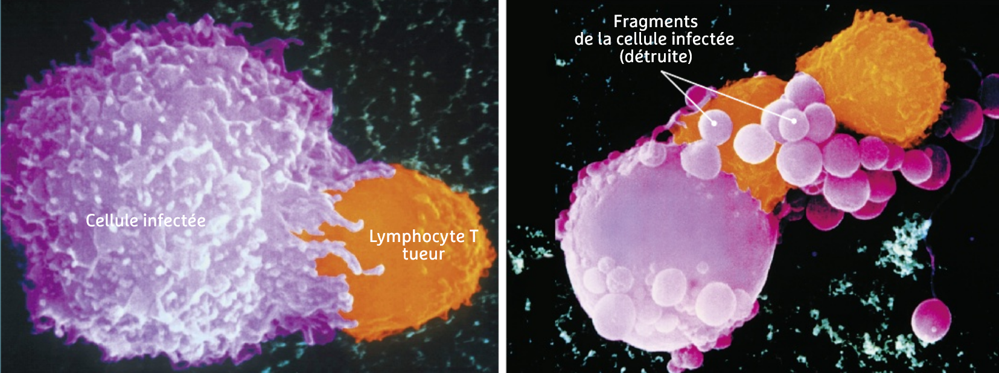
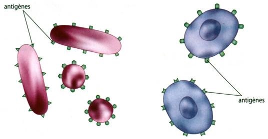
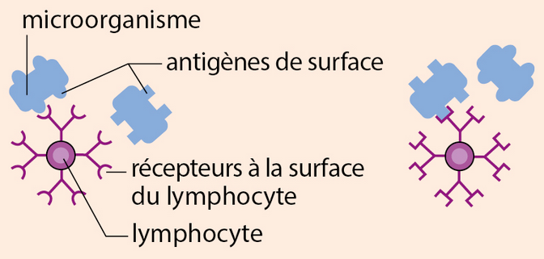

# Activité : Importance du tri des déchets

!!! note "Compétences"

    - réaliser un schéma fonctionnel
    - trouver et exploiter des informations 

!!! warning "Consignes"

    1. expliquer par un schéma fonctionnel, comment le système immunitaire est réagit lors de la détection d’un micro-organisme. (Documents 1, 2 et 3)

    2. Expliquer comment les lymphocytes T tueurs permettent-ils lutter contre les infections. (Document 4)
    
    3. Quelle particularité des lymphocytes T tueurs est mise en évidence dans les documents 5 et 6 ?
    
??? bug "Critères de réussite"
    - 

**Document 1 : Contact entre une cellule sentinelle et un lymphocyte dans un ganglion lymphatique.**

Après avoir détecté un virus ou une bactérie grâce à leurs antigènes (éléments propres à chaque type de micro-organismes, présents à la surface des micro-organismes reconnus par le système immunitaire), certaines cellules sentinelles (cellules dendritiques) quittent le lieu de l’infection et migrent jusqu’aux ganglions les plus proches (ganglions du cou dans le cas d’un rhume). Le contact avec la cellule sentinelle provoque une activation du lymphocyte.

**Document 2 Les trois types de lymphocytes.**

Lymphocytes T activateurs : activés par les cellules sentinelles, ils activent à leur tour les lymphocytes B et les lymphocytes T tueurs.

Lymphocytes B : lorsqu’ils sont activés, ils produisent des anticorps.

-   Lymphocytes T : lorsqu’ils sont activés, ils se fixent aux cellules infectées par les virus.

**Document 3 Evolution du nombre de lymphocytes T et B dans un ganglion suite à une infection.**

**Document 4 Action d’un lymphocyte T tueur sur une cellule infectée.**

Lors d’une infection par un virus, les lymphocytes tueurs reconnaissent les cellules infectées par le virus en cause et seulement lui.

**Document 5 Reconnaissance de virus par les lymphocytes T.**

Les cellules infectées par un virus possèdent à leur surface des antigènes du virus.

**Document 6 Antigène de micro-organisme et récepteur de lymphocyte.**

Tout micro-organisme possède à sa surface des éléments qui lui sont propres (les antigènes). Les lymphocytes possèdent naturellement à leur surface des récepteurs qui s’adaptent à la structure de tout type d’antigènes, ce qui leur permet de reconnaître ou non l’antigène (mécanisme clé – serrure). À chaque antigène correspond un récepteur d’un lymphocyte (un lymphocyte ne reconnaît qu’un seul type d’ antigène) : c’est une réaction spécifique.

??? note-prof "Correction"

    de l’activité 29 : Réaction de
    notre corps à une infection prolongée.

    Consigne 1 : expliquer par un schéma fonctionnel, comment le système
    immunitaire est **réagit** lors **de la détection d’un
    micro-organisme**. (Documents 1, 2 et 3)

    Consigne 2 : Expliquer comment les lymphocytes T **permettent**-ils
    lutter contre les infections. (Document 4)

    Les lymphocytes T tueurs vont se fixer à une cellule qui a été infectée
    par un virus et la détruire

    Consigne 3 : Quelle particularité des lymphocytes T est mise en évidence
    dans les documents 5 et 6 ?

    Dans le document 5, on voit que les lymphocytes T tueurs de l’expérience
    a sont des lymphocytes qui ont détruit des cellules infectées par le
    virus de la chorioméningite.

    On voit que ces lymphocytes sont capables de détruire d’autres cellules
    infectées par le même virus (expériences b), mais elles ne détruisent
    pas les cellules infectées par d’autres virus (expérience c).

    Dans le document 6, on apprend que les lymphocytes ont des récepteurs
    qui reconnaissent les antigènes.

    On peut conclure qu’un lymphocyte T ne détruit que les cellules qui ont
    les antigènes d’un virus particulier, il peut pas détruire les cellules
    ayant d’autres antigènes. Les lymphocytes sont spécifiques.