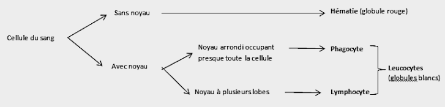
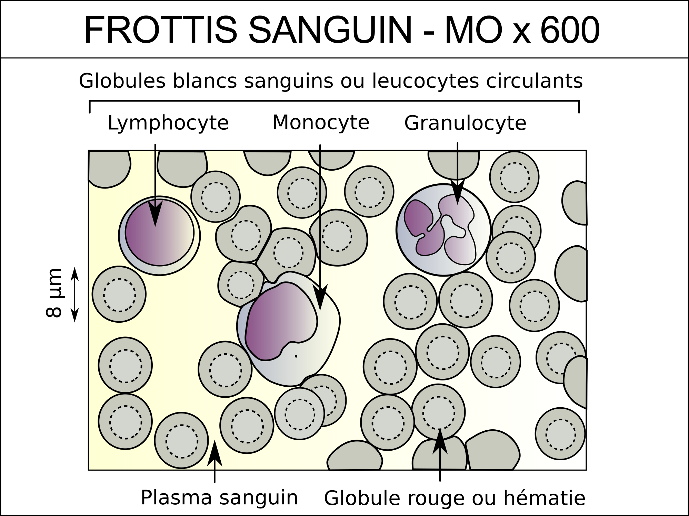
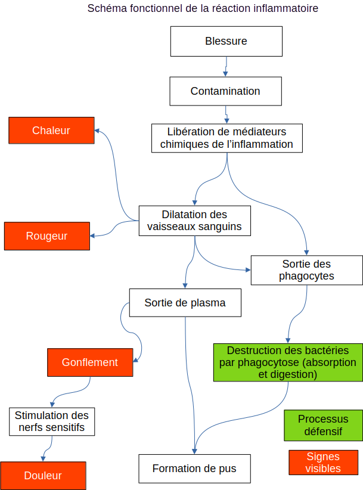

# Activité : La réaction inflammatoire

!!! note "Compétences"

    - Trouver et extraire des informations.
    - Faire un schéma fonctionnel.

!!! warning "Consignes"

    

    À partir des documents, expliquer sous la forme d'un schéma fonctionnel, les réactions du corps au niveau d'une blessure. Votre réponse devra mettre en évidence l'apparition des signes de la réaction inflammatoire et le processus de défense du corps.

    
    

??? bug "Critères de réussite"
    - Indiquer ce qu'entraîne une contamination
    - Avoir indiqué le rôle des médiateurs chimiques
    - Avoir expliqué le lien entre rougeur et vaisseau sanguin
    - Avoir expliqué le lien entre chaleur et vaisseau sanguin
    - Avoir expliqué l'impact de la dilation sur le plasma et les phagocytes
    - Avoir expliqué le lien entre gonflement et accumulation de liquide
    - Avoir expliqué le lien entre gonflement et douleur
    - Avoir expliqué le but de la digestion par les phagocytes

**Document 1 La réaction inflammatoire**

<iframe class="noprint"  width="560" height="315" src="https://www.youtube-nocookie.com/embed/qLDjVPQIguo?si=t1bMXipk9L9h5P7H" title="YouTube video player" frameborder="0" allow="accelerometer; autoplay; clipboard-write; encrypted-media; gyroscope; picture-in-picture; web-share" referrerpolicy="strict-origin-when-cross-origin" allowfullscreen></iframe>

La réaction inflammatoire s’accompagne d’un gonflement, d’une rougeur et d’une augmentation de la température de la zone. Il peut aussi y avoir une douleur. Il s'agit de la première défense mise en place par notre corps en cas de contamination.
Quelques heures après une blessure, du pus peut se former au niveau de la zone infectée.

**Document 2 Une blessure**

La peau est une des barrières empêchant les bactéries d'enter dans le corps.

Dans la peau, on retrouve des vaisseaux et des nerfs sensitifs qui stimulés provoquent de la douleur.
Une pression peut stimuler ces nerfs.

Lors d'une blessure, la peau est endommagée et donc des bactéries peuvent entrer, c'est la contamination.
Lorsque c'est le cas, des médiateurs chimiques de l'inflammation sont libérés autour de la zone blessée.

{: style="width: 400px; "}

{: style="width: 400px; "}

**Document 3 Le rôle des médiateurs chimiques de l'inflammation**

Les médiateurs chimiques de l'inflammation sont des molécules libérées par des cellules immunitaires de notre corps.

- Ces molécules vont entraîner une dilatation des vaisseaux sanguins, c'est-à-dire que les vaisseaux sanguins vont grossir au niveau de la contamination.

- Les molécules libérées vont aussi attirer des phagocytes. Les leucocytes présents dans le sang peuvent traverser la paroi des vaisseaux sanguins lorsque ces vaisseaux sont dilatés, accompagnés d’un peu de plasma sanguin (=partie liquide du sang).

**Document 4 Le diamètre des vaisseaux**

{: style="width: 400px; "}

Le diamètre des vaisseaux sanguins détermine le débit sanguin et donc la quantité de sang qui circule à cet endroit.
En se dilatant, la paroi des vaisseaux sanguins devient plus perméable et des éléments du sang peuvent sortir et s'accumuler dans le derme (couche intermédiaire de la peau)
La couleur de la peau dépend en partie de la quantité de sang qui passent dans les vaisseaux sanguins. De plus le sang est chaud, entre 35,7 et 37,3 °C, plus il y a de sang circulant à un endroit, plus cette zone va chauffer.

**Document 5 : La phagocytose**

<iframe class="noprint" width="560" height="315" src="https://www.youtube-nocookie.com/embed/_5ZymOPk1Jk?si=o-UgoV47iDe_W3Jo" title="YouTube video player" frameborder="0" allow="accelerometer; autoplay; clipboard-write; encrypted-media; gyroscope; picture-in-picture; web-share" referrerpolicy="strict-origin-when-cross-origin" allowfullscreen></iframe>

La phagocytose est une méthode de défense assurée par certains leucocytes appelés phagocytes.

**Document 6 Photo d'une goutte de pus observée au microscope**

Quelques heures après une blessure, du pus peut se former au niveau de la zone infectée. Le pus contient des bactéries, des débris bactériens et des phagocytes baignant dans du plasma.

??? bug "vidéo"
    <iframe title="Video Documents Reaction Inflammatoire" width="560" height="315" src="https://tube-sciences-technologies.apps.education.fr/videos/embed/9VcatumGWV1DUkHpQoA2dK?loop=1" style="border: 0px;" allow="fullscreen" sandbox="allow-same-origin allow-scripts allow-popups allow-forms"></iframe>

??? bug "aide"

    

??? note-prof "correction"

    Consigne 1 : Expliquer à quoi sont due le gonflement et la rougeur de la réaction inflammatoire au niveau d’une
    blessure.

    Lors de l’infection des molécules vont faire gonfler les vaisseaux sanguins au niveau de la blessure, il y aura donc plus de sang, cela va entraîner une rougeur. Le gonflement du vaisseau sanguin et la sortie de plasma vont faire gonfler la zone infectée.

    Les phagocytes vont absorber puis détruire les bactéries qui causent
    l’infection.

    
