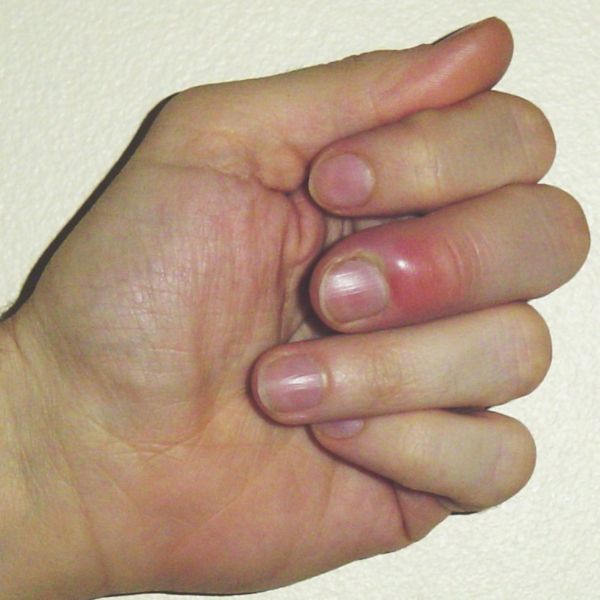

# Activité : La réaction inflammatoire

!!! note Compétences

    - Trouver et extraire des informations
    - Utiliser l'outil mathématique 

!!! warning Consignes

    1. Expliquer à quoi sont dûs le gonflement et la rougeur de la réaction inflammatoire au niveau d’une blessure.

    2. Expliquer comment notre corps lutte contre les micro-organismes au début de l’infection.

    3. Calculer et comparer les tailles d’un phagocyte et d’une bactérie.
    
??? bug Critères de réussite
    - 

**Document 1 : La réaction inflammatoire**

{: style="width:300px;"}

{: style="width:300px;"}

Quelques heures après une blessure, une réaction inflammatoire apparaît, accompagnée ou non de la formation de pus au niveau de la zone infectée.

Cette réaction s’accompagne d’un gonflement, d’une rougeur et d’une augmentation de la température de la zone. Il peut aussi y avoir une douleur. La couleur de la peau dépend de la quantité de sang qui passent dans les vaisseaux sanguins.

**Document 2 Schématisation de la réaction inflammatoire.**

**Document 3 Vaisseau sanguin d’un tissu infecté.**

Lors de l’infection, des molécules sont libérées, cela va entraîner une dilatation des vaisseaux sanguins (un gonflement) et attirés des leucocytes (= globules blancs). Les leucocytes présents dans le sang vont traverser la paroi des vaisseaux sanguins, accompagnés d’un peu de plasma sanguin (=partie liquide du sang). Tous ces phénomènes vont entraîner une rougeur, un gonflement et de la chaleur au niveau de la zone infectée.

**Document 4 Photo d’un phagocyte et de bactéries**

**Document 5 : La phagocytose**

La phagocytose est une méthode de défense assurée par certains leucocytes appelés phagocytes.

Si les phagocytes parviennent à digérer les bactéries, la plaie guérit. Mais il arrive que les bactéries détruisent les phagocytes. Les cadavres des phagocytes et les débris des bactéries s’accumulent dans le plasma au niveau de la plaie, cela forme le pus. L’accumulation de pus va faire gonfler la plaie et la douleur sera plus importante.

??? note-prof "correction"

    Consigne 1 : Expliquer à quoi sont due le
    gonflement et la rougeur de la réaction inflammatoire au niveau d’une
    blessure.

    Lors de l’infection des molécules vont faire
    gonfler les vaisseaux sanguins au niveau de la blessure, il y aura donc
    plus de sang, cela va entraîner une rougeur. Le gonflement du vaisseau
    sanguin et la sortie de plasma vont faire gonfler la zone infectée.

    Consigne 2 : Expliquer comment notre corps
    lutte contre l’infection.

    Dans notre sang, des leucocytes, les
    phagocytes, sont présents. Ces phagocytes vont sortir du sang au niveau
    de la blessure et absorber puis détruire les bactéries qui causent
    l’infection.

    Consigne 3 : Calculer et comparer les
    tailles d’un phagocyte et d’une bactérie.

    Le calcul de la taille correspond à :

    échelle \* taille de l’objet sur la photo /
    taille de l’échelle sur la photo

    La bactérie mesure 10\*0,2/0,5 = 4 µm

    Le phagocyte mesure 10\*3,5/0,5 = 70 µm

    La bactérie est donc presque dix fois plus
    petite que le phagocyte.