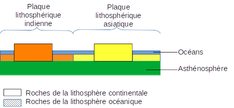
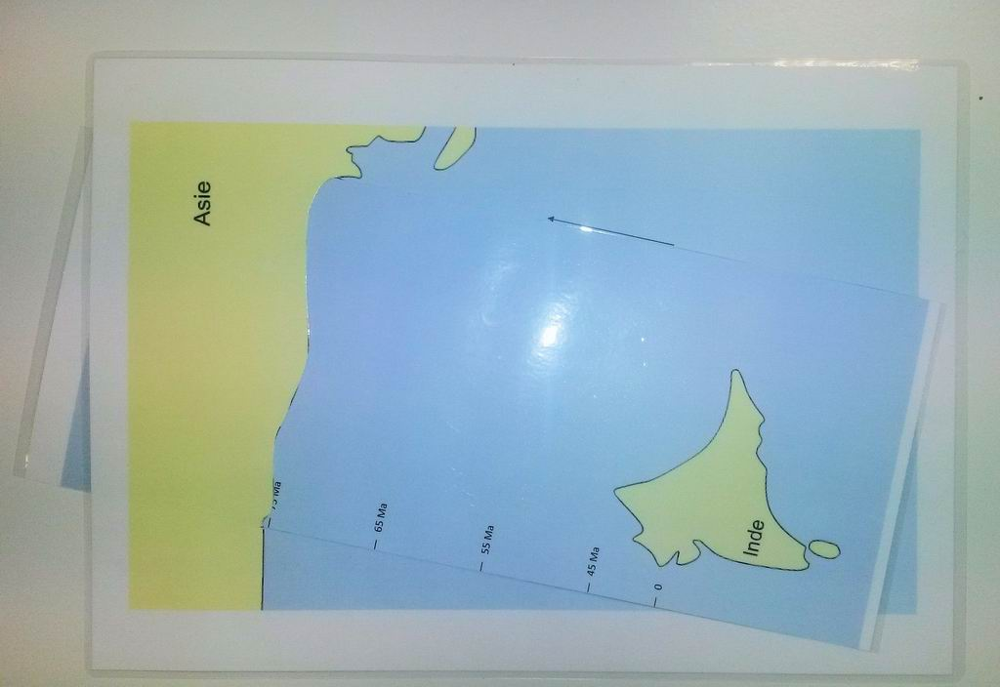
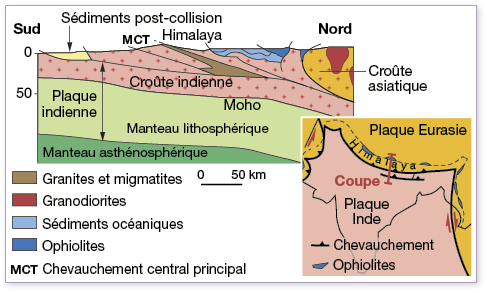

# Activité : Les conséquences de la convergence, la collision.

!!! note "Compétences"

    Manipuler, expérimenter et Trouver et exploiter des informations 

!!! warning "Consignes"

    1. À l’aide des informations des documents 1 et 2, compléter le tableau du document 3.
    2. Faire la manipulation du document 2
    3. En utilisant les informations des documents, expliquer ce qui se passe au niveau de cette zone.
    4. Quel indice devrait être trouvé dans la chaîne de l’Himalaya si le modèle est correct.
    
??? bug "Critères de réussite"
    - 

**Document 1 Schéma des plaques asiatique et indienne, il y a 75 Ma**

**Document 2 Modélisation d’une collision**

Protocole :

1. Insérer la feuille avec l’Inde dans la fente de la feuille avec l’Asie et aligner cette feuille sur la flèche
2. Avancer la feuille jusqu’à la date de 75 Ma.
3. Déposer les feuilles dans la cuvette en plastique.

4.  Déposer du sable sur le continent Indien et le continent asiatique (laisser une marge de 1 mm).

5.  Tasser légèrement avec une boite de pétri

6.  Saupoudrer de farine entre l’Inde et l’Asie

7.  Tirer progressivement la feuille de l’inde jusqu’à 45 Ma

8.  Continuer de Tirer jusqu’à 0 Ma

**Document 3 Comparaison du modèle et de la réalité**

<table>
<colgroup>
<col style="width: 300px">
</colgroup>
    <tr>
        <th >Réalité</th>
        <th>Modèle</th>
    </tr>
    <tr>
        <td ></td>
        <td>Feuille avec l’Asie</td>
    </tr>
    <tr>
        <td ></td>
        <td>Feuille avec l’Inde</td>
    </tr>
    <tr>
        <td></td>
        <td>Farine</td>
    </tr>
    <tr>
        <td ></td>
        <td>Sable</td>
    </tr>
</table>

??? note-prof "ressources"
    [https://www.pedagogie.ac-nantes.fr/html/peda/svt/collision_subd/Le_ph%C3 %A9nom%C3 %A8ne_de_collision\_-\_SVT_NANTES.html](https://www.pedagogie.ac-nantes.fr/html/peda/svt/collision_subd/Le_phénomène_de_collision_-_SVT_NANTES.html)

    
