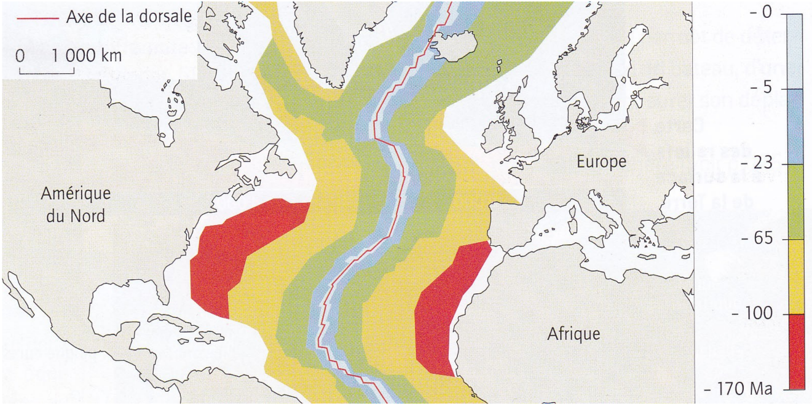
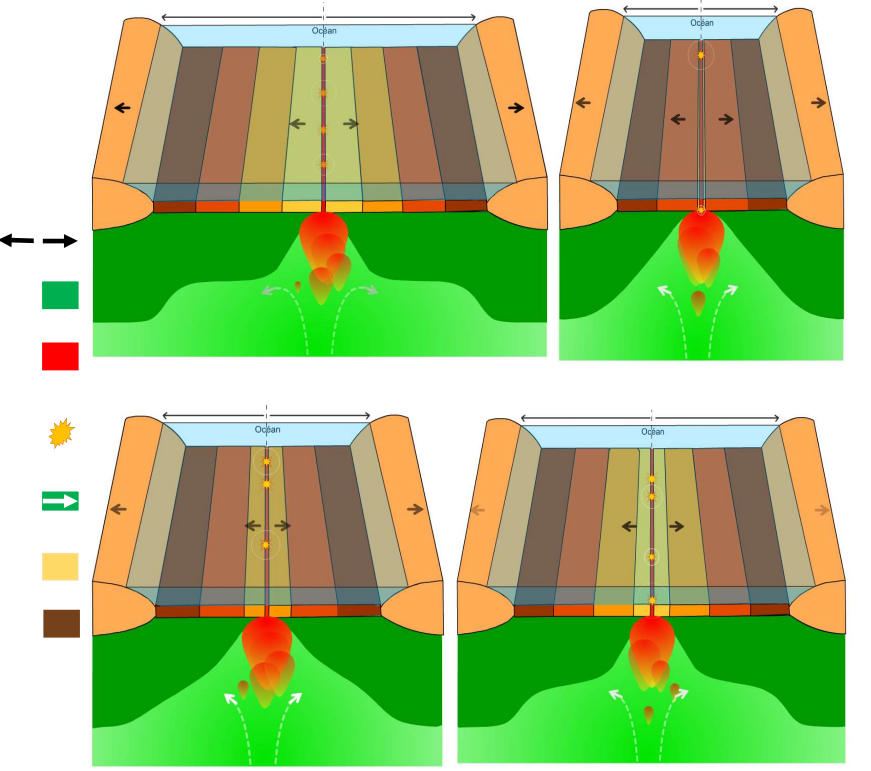

# Activité : Les conséquences de la divergence

!!! note "Compétences"

    Trouver et exploiter des informations 

!!! warning "Consignes"

    1. Décrire comment sont réparties les roches des fonds océaniques en fonction de leur âge.
    2. Découper et rmettre dans l'ordre les schémas du document 4.
    3. Légender et donner un titre à l’aide des mots en gras.
    4. À l’aide documents, expliquer cette répartition.
    5. Calculer la vitesse d'ouverture de l'océan altlantique
    
??? bug "Critères de réussite"
    - Avoir décrit l'âge de la lithosphère océanique en partant du continent américain vers la dorsale
    - Avoir décrit l'âge de la lithosphère océanique en partant du continent africain vers la dorsale.
    - 

**Document 1 : âge des fonds océaniques (océan Atlantique)**

Des forages permettent de connaitre l'âge des plus **anciens basaltes** et des plus **jeunes basaltes**

**Document 2 : Le volcanisme des dorsales**
alt

américain

Une grande part de l’activité volcanique terrestre provient des dorsales. C’est un volcanisme effusif. Les volcans des dorsales émettent une lave fluide à une température comprise entre 1 000 °C et 1 200 °C. En se refroidissant, la **lave** forme des grosses boules de roche, du basalte, qui s’empilent les unes sur les autres. Ces roches sont appelées des pillow-lavas (lave en coussins). Ce magma, en refroidissant, est à l’origine de la partie superficielle de la lithosphère océanique.

**Document 3 Le fonctionnement d’une dorsale océanique**

Les mouvements de **divergence** entraînent une **remontée de roches mantelliques (roches du manteau) chaudes** dans l'**asthénosphère**. L'accumulation de chaleur provoque la **fusion de roches de la lithosphère** et une remontée de magma à l’axe de la **dorsale océanique**.

**Document 4 ...................................**

https://planet-terre.ens-lyon.fr/ressource/tectonique-plaques-1970-2011.xml